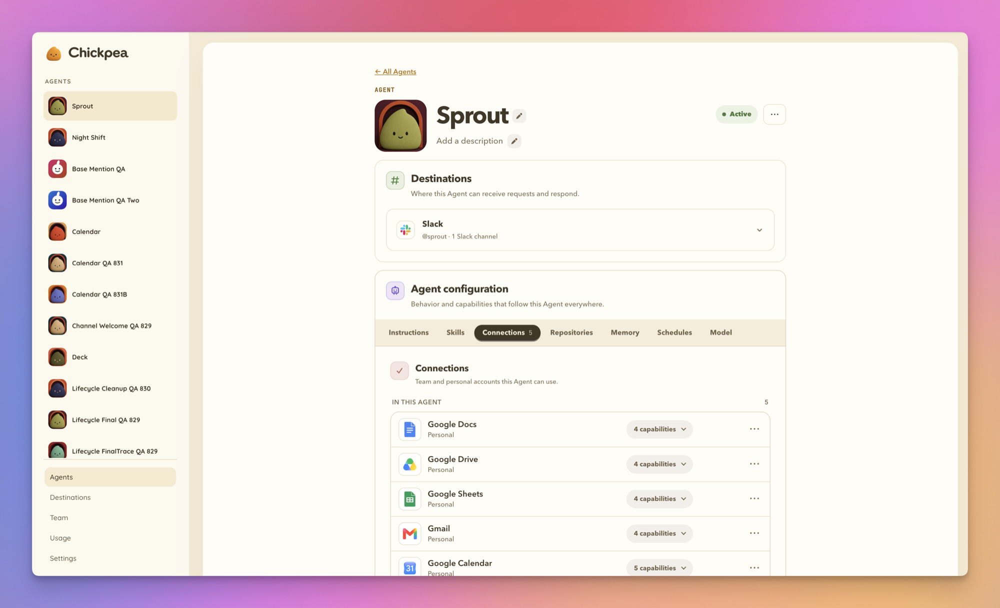
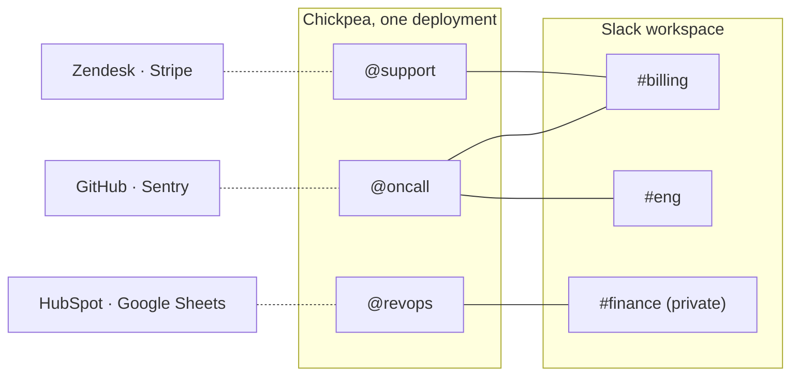

<p align="center">
  
  <picture>
    <source media="(prefers-color-scheme: dark)" srcset="assets/chickpea-wordmark-512-dark.png">
    
  </picture>
</p>

<p align="center">
  <strong>AI teammates in Slack that answer questions, take on tasks, and use the accounts you give them, all on infrastructure you own.</strong>
</p>

<div align="center">

[](./LICENSE)
[](https://nodejs.org)
[](#install)
[](https://flueframework.com)

<br />



<br />

**Deploy it**

[](https://deploy.workers.cloudflare.com/?url=https://github.com/pejmanjohn/chickpea)

<sub><em>or run it on your own box. Full steps in <a href="#node">Install</a>.</em></sub>

<br />

[Why it exists](#why-chickpea-exists) · [Features](#what-your-workspace-gets) · [How it works](#how-it-works) · [Managing](#managing-chickpea) · [CLI](#cli) · [Security](#security-model) · [Install](#install) · [Good to know](#good-to-know) · [FAQ](#faq)

</div>

Chickpea gives your team AI teammates in Slack. You address them by name. `@support` answers the billing question in the channel where someone asked it. `@revops` posts Monday's pipeline numbers from HubSpot on a schedule. `@oncall` reads the repo before it answers. Each one has its own instructions, memory, connected accounts, and list of channels it's allowed to work in. You set all of that up by asking, in Slack.

The difference is where they work. Chickpea is licensed under Apache 2.0 and you deploy it yourself, to your own Cloudflare account or your own server, pointed at whichever model provider you want. Under the hood every Agent runs on [Flue](https://flueframework.com), the open agent framework from the Astro team, now part of Cloudflare. More in [How It Works](#how-it-works).

---

## Why Chickpea Exists

Your team already uses AI all day, one person at a time in a private tab, and the answer stays in that one person's history. Ask in the channel instead:

> **`@growth`** which pages lost impressions in Search Console last month?

`@growth` checks Search Console, cross-references Google Analytics, and answers in the thread. `@sales` pulls the recurring objections out of this week's Gong calls. `@eng` names the top new Sentry issue since Friday's deploy. Ask any of them to update a HubSpot record or move something on your Google Calendar and they confirm with you first. Everyone in the channel sees the answer, and anyone can pick it up later without starting over.

The hosted versions of this idea run on the vendor's infrastructure, with the vendor's model, on the vendor's schedule. Good products, and for a lot of teams that trade is fine. Some teams can't make it, for reasons of policy or data, and they have mostly gone without.

Chickpea is for those teams. Each Agent keeps its own connected accounts and its own channels, so the support Agent can't read finance's inbox; nobody ever gave it to them. If you need a wall between two jobs, make a second Agent.

---

## What Your Workspace Gets

| Feature | What it does | |
|---|---|---|
| **Addressable Agents** | Each Agent gets a real Slack handle (a zero-member user group like `@support`), a distinct generated avatar, and its own name on every reply. | |
| **Agent memory** | One memory per Agent, shared across its DMs and every granted channel, editable and deletable in Admin. | [Details](#memory) |
| **Connection accounts** | Team accounts and personal accounts, each owned by one Agent. 35 connector presets, plus native API and MCP for anything custom. | [Details](#connections-and-authority) |
| **Model choice** | Anthropic, OpenAI, OpenRouter, or Cloudflare Workers AI, pinned per Agent. | [Details](#models-and-providers) |
| **Skills** | Import from a GitHub repo or a `skills.sh` link, in Admin or by handing the link to an Agent in Slack. You see which skills were found before anything is installed. | |
| **Repositories** | Grant GitHub repositories to an Agent through the Chickpea GitHub App (Settings → GitHub). Access uses short-lived installation tokens scoped to the granted repositories. | |
| **Coding sandbox** | Optional Cloudflare container tier for Agents that need to clone a repo, install packages, and run tests. | [Details](#coding-sandbox) |
| **Schedules** | Agent-owned recurring or one-time work, set up conversationally in Slack, delivered to a granted channel or a private DM thread. | [Details](#schedules) |
| **Manage from Slack** | Admin, Slack, and an MCP server are three doors to the same controls. Create Agents, install skills, set schedules, and edit memory by asking, with consequential changes gated behind an approval. | [Details](#managing-chickpea) |
| **Slack-native answers** | Progressive streaming for long replies, adaptive tables (prose, inline Markdown, or a native sortable Slack table) when the data earns one, and task cards for multi-step work. | |
| **Reads attachments** | Images, PDFs, UTF-8 text and source files, and Slack's generated previews for docs, slides, and sheets. Attachment turns are read-only: a file can inform an answer but cannot authorize a tool or a change. | |
| **Live activity status** | Slack's native under-composer status shows real phases as they happen: `Checking Gmail…`, `Drafting the response…`. | |

---

## How It Works

### In Slack

Someone in `#billing` types:

> **`@support`** can we refund order 4821? The customer says the card was charged twice.

1. **Slack renders the mention.** `@support` is a Slack user group with zero members, created when the Agent was. To Slack it is an ordinary handle. To Chickpea it is an address.
2. **Chickpea checks the grant.** One deployment holds every Agent, and a channel grant says which Agent may work in which channel. If `@support` has no grant for `#billing`, nothing happens. Two handles in one message get rejected as ambiguous rather than guessed.
3. **The Agent runs as itself.** Its own instructions, its own memory, its own skills, and its own connected accounts, say Zendesk and Stripe. Nothing that belongs to `@revops` is in the room.
4. **The reply lands in the thread under `@support`'s name and avatar,** streamed as it's written. The thread now belongs to `@support`. Anyone in the channel can follow up there without mentioning it again, and mentioning `@finance` in the same thread hands the work over in the open.

Want another teammate? Ask `@Chickpea` for one, in Slack or in Admin. [Managing Chickpea](#managing-chickpea) covers what else you can do from each.

Drawn out, a workspace looks like this. Solid lines are channel grants, dotted lines are connected accounts.



`@oncall` can answer in `#billing` but has no Zendesk. `@support` has Zendesk but cannot see `#eng`. Publishing an Agent to a channel hands that channel's members everything the Agent can do and reach, so think about that before you publish.

Publishing to a public channel joins the bot automatically. Private channels need someone to `/invite @Chickpea` first, and the grant stays pending until then. Where an Agent is published also decides who can DM it. In a public channel, any workspace member can. Only in private channels, only those members can. Unpublished, only its creator can.

In every channel, a top-level message that mentions no one is dropped before any model is involved. Chickpea is not sitting in your channels forming opinions.

<details>
<summary><strong>If Slack blocks user-group creation</strong></summary>

Agent handles are Slack user groups, which some plans restrict. If Slack blocks the group, Chickpea keeps the Agent and shows the fix:

1. A Workspace Owner or Admin opens **Roles & permissions → Account types** at `slack.com/admin`.
2. Next to **Create and edit user groups**, choose **Edit permission**.
3. Add Members and save.
4. Return to the Agent and choose **Retry**.

On Enterprise Grid it's the equivalent setting under **Organization settings → Roles & permissions**. Reconnecting Slack cannot repair a policy, so Chickpea won't suggest it.

</details>

### Under the hood

| Layer | What it does |
|---|---|
| **Slack app** | Events API, DMs, App Home, message delivery. Transport only. |
| **Chickpea** | Routes mentions to Agents, enforces channel grants and confirmation policy, resolves credentials at the moment of each call, renders replies as the Agent, and runs Admin and the management MCP. |
| **[Flue](https://flueframework.com)** | The agent runtime: durable sessions that survive crashes and restarts, persistent state, subagents, tools, skills, and MCP. Same code on Cloudflare Workers or Node. |
| **Pi** | The open agent harness Flue runs on, also behind OpenClaw. |
| **Model provider** | Anthropic, OpenAI, OpenRouter, or Cloudflare Workers AI, pinned per Agent. |
| **State** | Durable Objects and D1 on Cloudflare. SQLite files on Node. |

Chickpea has no agent loop of its own. That is Flue ([`@flue/runtime`](https://www.npmjs.com/package/@flue/runtime)), the Apache-licensed open agent framework from the [Astro](https://astro.build) team, now part of Cloudflare. Everything above the Flue row in the table is Chickpea's: the Slack product, the authority model, and the admin panel.

---

## Connections and Authority

Every connection belongs to one Agent for its lifetime. A **team account** is shared authority the Agent's editors manage, like the support team's Zendesk. A **personal account** belongs to one member inside one Agent, like your work Gmail, and runtime use requires both that Agent's connection and your identity. Authorizing the same external account for a second Agent creates a separate connection with its own consent.

**Credentials never enter model context or the tool arguments the model writes.** The model picks a connection by ID and the secret goes in at egress. An interrupted OAuth flow resumes bound to the provider, the account owner, the Agent, and the Slack task it left. Disconnecting revokes that one connection, tombstones secret access, and retires it from dependent schedules.

Minor reversible writes may proceed without confirmation. Consequential ones (sending a message or email, deleting, publishing, broad or bulk changes) require confirmation unless the saved Agent instructions explicitly authorize that class of action. Nothing said in a conversation, and nothing returned by an API, gives an Agent more than it was granted. The [Security Model](#security-model) has the full list.

What you can connect, 35 presets in all. 13 run through a single Composio key; the other 22 go through the vendor's hosted MCP server or a direct API:

<table>
  <tr>
    <th colspan="5" align="left">Managed · one Composio key</th>
  </tr>
  <tr>
    <td> Gmail</td>
    <td> Google Calendar</td>
    <td> Google Drive</td>
    <td> Google Sheets</td>
    <td> Google Docs</td>
  </tr>
  <tr>
    <td> Google Slides</td>
    <td> Search Console</td>
    <td> Google Analytics</td>
    <td> Notion</td>
    <td> HubSpot</td>
  </tr>
  <tr>
    <td> Google Ads</td>
    <td> YouTube</td>
    <td>Gong</td>
    <td colspan="2"></td>
  </tr>
  <tr>
    <th colspan="5" align="left">Presets · the vendor's hosted MCP server, with OAuth or an API key</th>
  </tr>
  <tr>
    <td>Ahrefs</td>
    <td> Airtable</td>
    <td> Atlassian</td>
    <td> Cloudflare</td>
    <td>Exa</td>
  </tr>
  <tr>
    <td>Firecrawl</td>
    <td>Fireflies</td>
    <td>Gamma</td>
    <td>Granola</td>
    <td> Hugging Face</td>
  </tr>
  <tr>
    <td>incident.io</td>
    <td> Intercom</td>
    <td> Linear</td>
    <td>LunarCrush</td>
    <td>Monday.com</td>
  </tr>
  <tr>
    <td>Neon</td>
    <td> PostHog</td>
    <td> Sentry</td>
    <td> Stripe</td>
    <td> Supabase</td>
  </tr>
  <tr>
    <th colspan="5" align="left">Presets · direct HTTP API</th>
  </tr>
  <tr>
    <td> Asana</td>
    <td> Zendesk</td>
    <td colspan="3"></td>
  </tr>
  <tr>
    <th colspan="5" align="left">Native · bring your own</th>
  </tr>
  <tr>
    <td colspan="5">Any service with an HTTP API or a remote MCP server. Bearer tokens and custom headers supported.</td>
  </tr>
</table>

<sub>Gmail, Google Calendar, and Google Drive can also connect through your own Google Cloud OAuth client instead of Composio.</sub>

Managed connectors run through one Composio project key, added under **Settings → Connectors**. Sign-in happens in Composio's hosted UI and Chickpea polls for completion, so a self-hosted install needs no public OAuth callback URL. Opting in means Composio holds OAuth storage, refresh, and API execution for those accounts; Chickpea still owns account selection, capability limits, confirmation policy, and which provider account is used on every call. See the [managed connector runbook](docs/runbooks/composio-managed-connectors.md).

---

## Managing Chickpea

Chickpea has an Admin panel. It is not the only way in. The same controls have three front doors, with the same permissions and the same approvals behind each one.

- **Admin**, the browser UI on your deployment.
- **Slack**, by asking `@Chickpea`, or asking any Agent about itself.
- **MCP**, from any MCP client you already use, through the management MCP server.

Most days the Slack door is the one you want.

> **`@Chickpea`** make me a support agent that answers billing questions and knows our refund policy

That one message creates the Agent, gives it a handle and an avatar, and publishes it to a channel you name. Where each job can be done:

| | Slack | Admin | MCP |
|---|:---:|:---:|:---:|
| Create, edit, archive, and restore Agents | ✓ | ✓ | ✓ |
| Change an Agent's instructions, model, or handle | ✓ | ✓ | ✓ |
| Publish an Agent to a channel, or pull it out | ✓ | ✓ | ✓ |
| Import skills from a GitHub repo or a `skills.sh` link | ✓ | ✓ | ✓ |
| Edit an Agent's memory | ✓ | ✓ | ✓ |
| Set up and manage schedules | ✓ | ✓ | ✓ |
| Connect a service, grant a repository, add a provider key | link | ✓ | link |
| Composio project key, GitHub App, coding sandbox install | | ✓ | |

"Link" means the Agent hands back a Chickpea link and the rest finishes in the browser, because OAuth sign-in and secrets never pass through a Slack message. When you hand an Agent a GitHub link for skills, it reads the `SKILL.md` files and shows you which skills it found before importing any of them.

What keeps a chat window from being a loophole:

- **Who can change what.** `@Chickpea` can create Agents and edit any Agent you're permitted to edit. A routed Agent can inspect and edit only itself, still bound by your permissions.
- **Proposals before consequences.** Two kinds of change arrive as a frozen read-only proposal: anything the Agent inferred rather than you stated, and anything that changes what an Agent can do, reach, or delete. Nothing applies until you approve it.
- **No ceremony for small edits.** Simple reversible single-field changes apply directly, and you can undo them.
- **MCP gets the same treatment.** Requests are scoped to that requester's permissions and held to the same approvals. The authoring guide is published at `chickpea://guide/agent-authoring/v1`, and the [workspace management MCP runbook](docs/runbooks/workspace-management-mcp.md) covers authority and proposal semantics.

### CLI

For scripts, there is a fourth door: the official [`chickpea-cli`](packages/cli/README.md) package on npm. It signs in with the same OAuth flow an MCP client uses and calls the same management tools, so a deployment can be checked and configured from a shell without building an MCP integration.

```bash
npx chickpea-cli doctor https://chickpea.example.com        # public checks, no sign-in
npx chickpea-cli mcp config https://chickpea.example.com    # client config for Claude Code, Codex, Cursor
npx chickpea-cli login https://chickpea.example.com         # browser sign-in, tokens stored 0600
npx chickpea-cli workspace inspect https://chickpea.example.com
npx chickpea-cli call https://chickpea.example.com <tool> --args '{...}'
npx chickpea-cli recipe export https://chickpea.example.com > recipe.json
```

The CLI never takes a token or key as an argument, never confirms a proposal on its own, and sends no telemetry. Node 22.19 or newer.

---

## Memory

One memory per Agent, no partitions. The same body informs its DMs and every granted channel.

One consequence of that: **something learned in a private conversation can influence a later channel answer.** If you need isolation, use a separate Agent. Memory is not it.

Memory is advisory, never policy. Live instructions, current permissions, and verified grant state win. Secrets, tokens, sensitive personal data, and untrusted quoted instructions are rejected on the way in.

---

## Schedules

Schedules belong to an Agent, target a granted Slack destination or a private DM thread, and record their creator as **Runs as**. Ask for one in Slack and the Agent sets it up.

Every run rechecks the whole chain: is the Agent alive, does it still have the channel, is the creator still a member, do the required connections still work, does policy still allow it. If authority disappears, future runs pause. Chickpea never silently reassigns work to someone else. Cloudflare supplies the production scheduler; Node keeps inspection and shutdown controls but runs no timers.

---

## Models and Providers

Bring your own: Anthropic, OpenAI, OpenRouter, or Cloudflare Workers AI. Cloudflare deploys can use the keyless binding provider and skip the API token entirely. Keys go in environment variables or in Settings, whichever you prefer.

Every Agent can be pinned to its own model. A cheap fast model for triage, a strong one for the Agent that writes.

---

## Coding Sandbox

The default Cloudflare deploy is the **core profile**: no container, no image build, small and fast. Normal Slack replies, administration, GitHub browsing, and repository-aware model work need none of it.

Install the coding sandbox when an Agent needs a real checkout, package installation, tests, or a dev server. Open **Settings → Coding sandbox**, request installation, redeploy. It requires **Workers Paid**. The container application and its Ubuntu-based image live in your Cloudflare account and may incur costs on it, and the first image build takes several minutes. Node installations always use the standard in-memory bash sandbox and never touch the host filesystem or host git and SSH. Full procedure in the [coding sandbox runbook](docs/runbooks/coding-sandbox-deployment.md).

---

## Security Model

What the design guarantees:

- **No ambient listening.** Unmentioned root messages never trigger classification, model spend, memory writes, or work. There is no "read the channel and decide if you're needed" mode.
- **Credentials never reach the model.** Never in model context, never in the tool arguments the model writes. The model picks a connection by ID; the runtime resolves the secret at the moment of the call and injects it at egress.
- **Conversation cannot expand authority.** Authority comes from stored grants and saved instructions, read from stored state and re-checked at the moment of each use, never from anything produced during the turn. Message text, retrieved content, and tool output are data, never permission.
- **Confirmation for consequential actions**, unless saved Agent instructions explicitly authorize that class.
- **Per-Agent isolation.** Connections, memory, skills, repositories, and reach all stop at the Agent. Nothing is reused across Agents implicitly.
- **Slack OIDC is the only human sign-in.** No passwords. The first installer becomes the first Owner, bound to an exact workspace and user tuple. Email is mutable contact information, not the identity key. See [authentication](docs/authentication.md).
- **An editor may publish only to a channel they belong to.** Chickpea Admin status does not bypass Slack channel membership.
- **Self-hosted state.** Runtime, model traffic, configuration, memory, and connector credentials stay in infrastructure you operate. The exception is opting into Composio-managed connectors, which delegates OAuth storage, refresh, and API execution for those accounts to Composio. Native API and MCP connections keep their credentials with you.
- **Minimal product telemetry.** Chickpea sends six content-free, anonymous product events to measure adoption. It sends no messages, prompts, tool data, customer identity, or error text; it creates no person profile and can be disabled completely. The exhaustive field list and opt-out instructions are in [Product telemetry](TELEMETRY.md).

The other exception is the optional shared Slack-app gateway, which exists so you can skip Slack app configuration entirely. It stores encrypted installation credentials and sanitized health metadata, but does **not durably store Slack message or event bodies**. If it cannot hand an event to your deployment, it returns a failure so Slack can retry; with Slack's Delayed Events setting enabled, those retries can continue hourly for 24 hours. On Cloudflare, your deployment durably admits the event before acknowledging it, then scrubs the body as soon as processing reaches a terminal state and keeps only a content-free deduplication record for 48 hours. The Node target does not yet provide that durable-admission contract; use your own Slack app for reliable Node ingress. Read the exact retention and recovery boundaries in [Shared Slack gateway data handling](docs/shared-gateway-data-handling.md). If you'd rather not have the gateway in the path at all, pick the customer-owned Slack app lane, which talks directly to your deployment and never loads the gateway client.

---

## Install

### Cloudflare

The compressed Worker fits within the Workers Free size limit; only the optional coding sandbox requires Workers Paid. See [Good to Know](#good-to-know).

[](https://deploy.workers.cloudflare.com/?url=https://github.com/pejmanjohn/chickpea)

Deploy, then open the private setup link and pick a Slack lane:

- **Add to Slack** installs the unlisted shared Chickpea app through the private gateway. No configuration token, client secret, signing secret, public Events URL, or app-level token required from you.
- **Use your own Slack app** creates and installs a customer-owned app from the reviewed manifest. Paste a configuration token and it's done; a manual manifest path with screenshots is the fallback. Step-by-step in [SETUP_AGENT.md](SETUP_AGENT.md).

Setup then runs four steps: connect Slack, choose a provider, choose a model, and try it. The last step has you message Chickpea in Slack. A real reply is the proof.

App installation and browser sign-in are two different OAuth jobs. Installation grants bot scopes; sign-in requests `openid profile email` and binds you as the first Owner.

Uses Cloudflare Workers, Durable Objects, D1, and Workers AI.

### Node

Requires Node **>=22.19.0**.

```bash
git clone https://github.com/pejmanjohn/chickpea && cd chickpea
npm ci

# 32 random bytes, stable across restarts
export CHICKPEA_AUTH_SECRET=$(openssl rand -base64 32 | tr '+/' '-_' | tr -d '=')

npm run setup:link -- https://your-chickpea.example
```

`setup:link` takes the URL your deployment will answer on and prints a `CHICKPEA_SETUP_CAPABILITY_DIGEST`, a `CHICKPEA_SETUP_CAPABILITY_ISSUED_AT`, and the private setup link itself. Export the two variables:

```bash
export CHICKPEA_SETUP_CAPABILITY_DIGEST=...
export CHICKPEA_SETUP_CAPABILITY_ISSUED_AT=...

npm run dev
```

Then open the private link and follow the same Slack flow as above. `npm run dev`
is for development. For a supervised production server, persistent state paths,
HTTPS, backups, and upgrades, follow [Operating Chickpea](docs/runbooks/operations.md).

State defaults to SQLite. Set `TAG_DB_PATH=:memory:` and `SLACK_STATE_DB_PATH=:memory:` only for disposable development.

### Configuration

Chickpea is offline-safe by default. Left unset, most variables take a local path. These are the ones worth knowing:

| Variable | When | Purpose |
|---|---|---|
| `CHICKPEA_AUTH_SECRET` | required on Node, managed on Cloudflare | Stable internal signing authority. |
| `SLACK_SIGNING_SECRET` | customer-owned Slack lane | Verifies direct Events API requests. Setup can store it instead. |
| `SLACK_BOT_TOKEN` | customer-owned Slack lane | Direct Slack Web API credential. Setup can store it instead. |
| `CHICKPEA_GATEWAY_URL` | optional | Shared-app gateway origin. Defaults to the Chickpea-operated service; override only for a compatible private gateway. |
| `ANTHROPIC_API_KEY` / `OPENAI_API_KEY` / `OPENROUTER_API_KEY` | optional | Enable the matching provider. Can be stored in Settings instead. |
| `CLOUDFLARE_ACCOUNT_ID` + `CLOUDFLARE_API_TOKEN` | optional | Enable REST Workers AI. Cloudflare deploys can use the keyless binding provider instead. |
| `COMPOSIO_API_KEY` | optional | Deployment-managed alternative to adding the project key in **Settings → Connectors**. Never enters a runtime plan or model context. |
| `DO_NOT_TRACK` / `CHICKPEA_DISABLE_TELEMETRY` | optional | Set either to `1`, `true`, or `yes` to disable anonymous [product telemetry](TELEMETRY.md) completely. |
| `CHICKPEA_TELEMETRY_ENVIRONMENT` | optional | Label telemetry as `production`, `development`, or `test`; defaults to production on Cloudflare and development on Node. |
| `TAG_DB_PATH` / `SLACK_STATE_DB_PATH` | optional, Node | SQLite paths for durable transcripts and app-owned state. |
| `CHICKPEA_RECOVERY_TOKEN` | optional break-glass | One short-lived repair capability. Not a login credential. |

The full list, including per-connector Composio auth config IDs and the Google Ads and YouTube quota and policy assertions, is documented in [.env.example](.env.example), with setup procedures in the [managed connector runbook](docs/runbooks/composio-managed-connectors.md) and repair steps in the [Slack auth recovery runbook](docs/runbooks/slack-auth-recovery.md).

---

## Good to Know

- One deployment currently serves one Slack workspace.
- The shared gateway is private infrastructure. Its implementation and Slack credentials are not in this public repository, and it does not durably queue Slack event bodies. Delivery recovery relies on Slack retries plus deployment-owned admission; [the data-handling contract](docs/shared-gateway-data-handling.md) spells out what is stored, where, and for how long.
- Updates are manual. The Cloudflare Deploy button clones this repository rather than forking it.
- Node durability is single-host SQLite. Multi-instance Node needs a shared state service.
- The compressed Worker upload is about 2.5 MiB, under the Workers Free plan's 3 MiB limit; `npm run build` fails if it grows past the budget in `scripts/verify-worker-size.mjs`. Public images and the Admin application's browser code use Static Assets in the same deployment, which do not count toward that limit.
- Anonymous, content-free [product telemetry](TELEMETRY.md) is enabled by default and has a complete operator opt-out.
- The coding sandbox and scheduled execution are Cloudflare-only. Node uses the in-memory execution path and no scheduler.
- Earlier experimental schemas may be incompatible. Never reset production state to upgrade; follow the [compatibility and recovery policy](docs/runbooks/operations.md#upgrade-and-compatibility-policy).

Contributions go through GitHub pull requests; see [CONTRIBUTING.md](CONTRIBUTING.md).
Report vulnerabilities privately using [SECURITY.md](SECURITY.md). Maintainers
use the [release checklist](docs/runbooks/releasing.md).

<details>
<summary><strong>Attachment limits</strong></summary>

Per turn: 4 files, 8 MiB each, 12 MiB total, 100 PDF pages, 32,000 characters per file and 48,000 total. Images use Slack's bounded thumbnails when available. Anything over a limit, or without a safe conversion, gets a file-specific next action instead of a quiet partial read. Slack installations predating the `files:read` scope must reconnect once.

</details>

---

## FAQ

**"Why not just run one bot with every tool connected?"**
Because then every channel that bot is in has every credential that bot holds, and everything it learns anywhere it can say anywhere. Agents exist so you can put a wall between support's Zendesk and finance's spreadsheets without running a second deployment.

**"What does this cost to run?"**
Chickpea itself is licensed under Apache 2.0 with no per-seat pricing and no metering. You pay your model provider directly for API usage. The Worker fits the Workers Free size limit; the optional coding sandbox requires Workers Paid. Workers, Durable Objects, D1, Workers AI, and optional coding sandbox usage run in your own Cloudflare account and may incur costs. Running on your own Node host, the infrastructure bill is whatever that host costs you.

**"How do I see what an Agent actually did?"**
Most of it is already visible: work happens in Slack threads, in the open, under the Agent's own name. In Admin, the Memory tab shows exactly what an Agent retained (and lets you edit or delete it), and the Schedules tab shows status, last run, next run, and a run-history and activity inspector for scheduled work. One deliberate gap: activity telemetry is fixed-schema and content-free, and Admin has no searchable conversation archive. The conversation itself lives in Slack and in your deployment's transcript store.

**"What is Flue?"**
The open agent framework Chickpea runs on: [`@flue/runtime`](https://www.npmjs.com/package/@flue/runtime) · [flueframework.com](https://flueframework.com) · [github.com/withastro/flue](https://github.com/withastro/flue). Apache-2.0, from the Astro team, now part of Cloudflare. Flue is the TypeScript harness; Chickpea is the Slack product on top of it. More in [How It Works](#how-it-works).

---

## Development

```bash
npm install
npm test                    # typecheck + node --test over tests/
npm run dev                 # local Node lane
npm run build               # Cloudflare build
```

Targeted checks worth knowing:

```bash
npm run verify:admin-ui
npm run verify:cf-smoke
npm run verify:providers
npm run verify:management-mcp
npm run verify:oss-export
```

Node **>=22.19.0** is pinned in `.nvmrc`. Several `verify:*:live` variants exist for provider- and Slack-touching evaluations; they are opt-in because they spend real quota. Live Slack acceptance should run against a disposable paid workspace so user-group policy, handle collisions, public auto-join, private invitation, App Home, avatar updates, archive, and restore all get exercised for real.

Live Slack verification is available through the repo-scoped [`$chickpea-live-verification`](.agents/skills/chickpea-live-verification/SKILL.md) skill. Codex discovers it automatically in this repository. The thin entry point routes to the [canonical operator workflow](qa/live/operator/SKILL.md) and [runbook](docs/runbooks/live-contract-verification.md), so the operating instructions remain in one place.

`verify:slack-streaming-policy` validates the content-free model-decision fixture corpus. A
provider evaluation is deliberately separate and opt-in: run
`npm run verify:slack-streaming-policy:live -- --live --lane <lane> --model <id>` only when
quota use has been approved. It exercises the shipped `stream_answer` name, description,
instruction, and acknowledgement against clear positive, clear negative, and ambiguous Slack
requests under a reduced prompt and tool surface. Its paired timings are provider-boundary
proxies: they show whether the declaration round trip can beat terminal model completion, but
they do not include durable persistence or Slack transport. The command never calls Slack or
prints model output. Actual first-visible Slack latency remains a separate, approved disposable-
workspace launch gate. Re-run both checks for each supported model when the model, system
instruction, or tool protocol changes.

---

## License

[Apache License 2.0](LICENSE). Use it, fork it, run it for your company, sell what you build on it, subject to the license terms.

Copyright (c) 2026 Pejman Pour-Moezzi. See [NOTICE](NOTICE).
