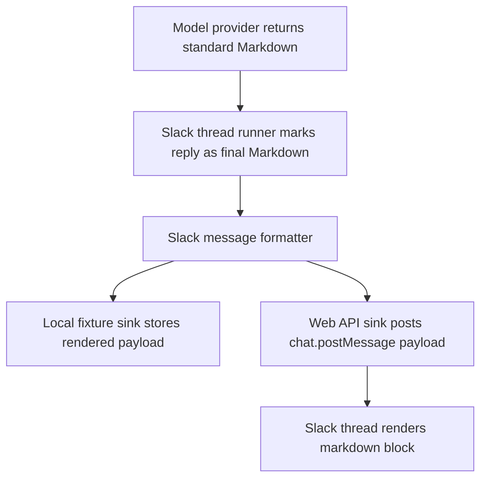

# Slack Agent Markdown Contract - Plan

## Goal Capsule

| Field | Value |
|---|---|
| Objective | Make every Slack agent reply in this project render model-authored Markdown correctly in Slack. |
| Authority | Slack Developer Docs for message formatting, `chat.postMessage`, Block Kit `markdown` blocks, and text objects. |
| Execution profile | Small adapter-level implementation with fixture tests before live Slack retest. |
| Stop condition | Final agent replies post standard Markdown through Slack `markdown` blocks, while progress/error replies stay simple and safe. |

---

## Product Contract

### Summary

Slack Flue agents should author normal Markdown and trust the Slack adapter to render it correctly. The screenshot showed `**bold**` leaking into a live thread because final replies were posted as top-level `text`, which Slack parses as classic `mrkdwn`, not standard Markdown.

### Problem Frame

LLMs commonly emit standard Markdown. Slack has older `mrkdwn` text objects and a newer Block Kit `markdown` block for standard Markdown. The product needs one adapter-level contract so future agents do not each rediscover Slack formatting rules.

### Requirements

**Reply rendering**

- R1. Final agent replies preserve standard Markdown constructs including bold, italic, headings, links, lists, blockquotes, inline code, fenced code, and tables by sending them through Slack `markdown` blocks.
- R2. Progress and provider-error replies remain plain, short Slack messages that do not accidentally parse user/model content as mentions or links.
- R3. Local fixture replies capture the same rendered payload shape as real Slack posts so formatting can be tested without credentials.

**Provider guidance**

- R4. Model prompts tell agents to produce concise standard Markdown for final Slack replies, not Slack-specific `mrkdwn`.
- R5. The adapter owns Slack API formatting limits and fallback text rather than forcing each provider implementation to know Slack details.

**Verification**

- R6. Tests cover final reply payloads, progress payloads, major Markdown constructs, payload length guardrails, and the signed Slack Events route.

### Scope Boundaries

- This plan does not add rich interactive Block Kit layouts, buttons, streaming Slack updates, uploads, or a general Markdown-to-`mrkdwn` converter.
- This plan does not modify Skillet.

---

## Planning Contract

### Key Technical Decisions

- KTD1. Use Slack `markdown` blocks for final agent output. Slack documents this block as standard markdown-formatted text with a 12,000 character cumulative payload limit, which matches LLM output better than translating Markdown into classic `mrkdwn`.
- KTD2. Keep top-level `text` as an accessibility and notification fallback. `chat.postMessage` uses top-level `text` as the visible body only without blocks; with blocks, it is fallback text, so the adapter should generate a plain fallback automatically.
- KTD3. Add a shared formatter before the Web API boundary. Both `SlackWebApiReplySink` and `LocalSlackReplySink` should call the same renderer so tests verify the real payload shape.
- KTD4. Prefer provider prompt guidance plus adapter enforcement over per-model formatting hacks. The provider can ask for standard Markdown, and the Slack adapter decides how to deliver it.

### High-Level Technical Design

### Sources & Research

- Slack message formatting guide: `https://docs.slack.dev/messaging/formatting-message-text/`
- Slack `chat.postMessage` method: `https://docs.slack.dev/reference/methods/chat.postMessage/`
- Slack Markdown block reference: `https://docs.slack.dev/reference/block-kit/blocks/markdown-block/`
- Slack text object reference: `https://docs.slack.dev/reference/block-kit/composition-objects/text-object/`

---

## Implementation Units

### U1. Shared Slack Message Formatter

- **Goal:** Add a formatter that renders reply text as plain text, classic `mrkdwn`, or standard Markdown block payloads.
- **Requirements:** R1, R2, R3, R5, R6.
- **Dependencies:** None.
- **Files:** `src/slack/message-format.ts`, `src/slack/replies.ts`, `tests/slack-formatting.test.ts`.
- **Approach:** Define a small typed payload model for the subset of `chat.postMessage` this prototype uses. Final Markdown replies become `blocks: [{ type: "markdown", text }]` plus a plain fallback `text`. Plain progress/error replies set `mrkdwn: false` and escape Slack control characters.
- **Patterns to follow:** Existing `src/slack/replies.ts` and the current lightweight type style.
- **Test scenarios:** Major Markdown input preserves standard Markdown inside a `markdown` block. Plain progress input has no blocks and disables Slack markup parsing. Long Markdown input is capped to Slack's 12,000 character markdown-block limit. Fallback text strips Markdown markers and escapes Slack control characters.
- **Verification:** Unit tests prove the rendered payload shape without Slack credentials.

### U2. Wire Formatter Into Slack Sinks and Runtime

- **Goal:** Ensure real Slack posts and local fixture posts use the same rendered payload contract.
- **Requirements:** R1, R2, R3, R6.
- **Dependencies:** U1.
- **Files:** `src/slack/web-api-replies.ts`, `src/runtime/slack-thread-runner.ts`, `tests/slack-events-route.test.ts`, `tests/slack-thread-runner.test.ts`.
- **Approach:** Extend reply inputs with a `format` field. Mark provider success replies as `markdown`, and mark progress/error/duplicate fallback replies as `plain_text`. The Web API sink posts the rendered payload; the local sink records it for fixture assertions.
- **Patterns to follow:** Existing `SlackReplySink` interface and signed route tests.
- **Test scenarios:** Signed app mention posts progress as plain text and final reply as a markdown block. Runtime fixture records final reply format and rendered payload. Duplicate retries still do not post again.
- **Verification:** Existing Slack route and thread-runner tests still pass with new payload assertions.

### U3. Provider Guidance and Playbook

- **Goal:** Tell model providers to write concise standard Markdown and document the supported Slack formatting path.
- **Requirements:** R4, R5.
- **Dependencies:** U1, U2.
- **Files:** `src/providers/workers-ai-rest.ts`, `docs/play-slack.md`.
- **Approach:** Update the provider system prompt from "plain text" to "concise standard Markdown for Slack markdown blocks." Document that final replies use Markdown blocks and that tests verify the major Markdown constructs locally.
- **Patterns to follow:** Existing `docs/play-slack.md` environment/run guidance.
- **Test scenarios:** Provider prompt construction is indirectly covered by existing Workers AI request-shape tests and live Slack fixture smoke.
- **Verification:** Typecheck and tests pass; live Slack mention can be retested manually with a formatting-heavy prompt.

---

## Verification Contract

| Gate | Proves |
|---|---|
| `npm test` | Typecheck plus route, runtime, provider, and formatting unit tests. |
| Local Slack fixture with Markdown-heavy provider output | No Slack credentials required; confirms rendered payload shape. |
| Live Paperplane Labs Slack mention | Confirms Slack renders final Markdown in a real thread. |

---

## Definition of Done

- Final agent success replies are sent as Slack `markdown` blocks with fallback text.
- Progress, duplicate fallback, and provider-error replies remain plain text.
- Local fixtures expose rendered payloads for tests.
- Tests cover major Markdown constructs and payload limits.
- `docs/play-slack.md` explains the Markdown behavior and manual Slack smoke prompt.
