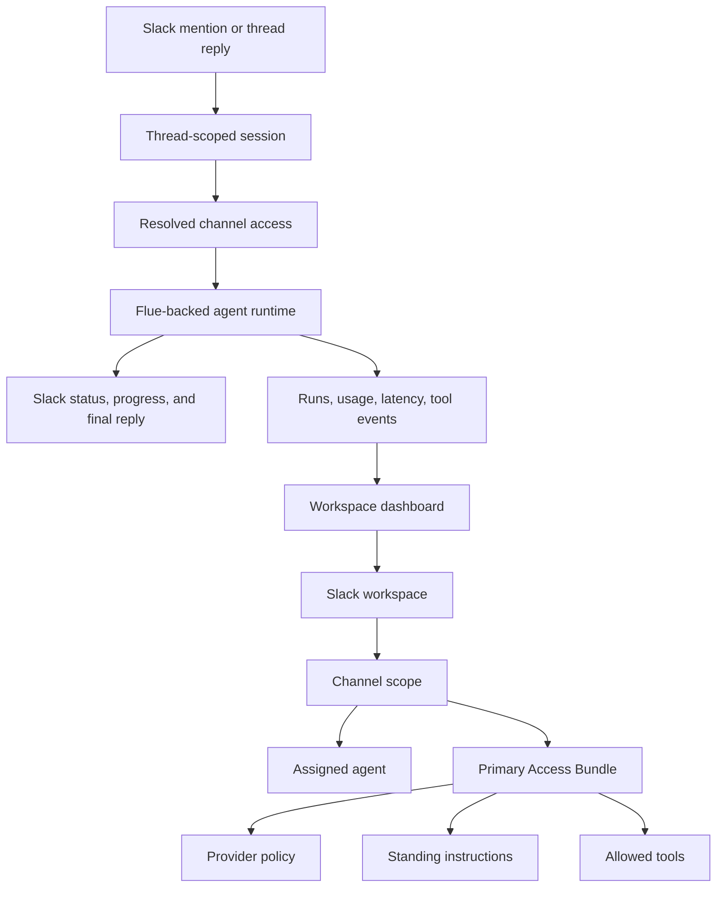

# Open-Source Claude Tag Workspace - Plan

## Goal Capsule

| Field | Value |
|---|---|
| Objective | Define the V1 product contract for an open-source Claude Tag-style Slack workspace product built on Flue, with strong Slack behavior, a Claude Tag-like workspace dashboard, reusable minimal Access Bundles, and model-provider choice. |
| Product authority | User dialogue, current Slack Flue prototype evidence, current Claude Tag docs, and current Flue Slack docs. |
| Primary aha | In the first 10 minutes, a team can mention the agent in Slack, see polished thread behavior, then open a dashboard that explains the channel assignment, agent, provider, instructions, tools, and Access Bundle that drove the reply. |
| Open blockers | None. |

---

## Product Contract

### Summary

V1 is an open-source Claude Tag-style workspace control plane for technical teams that want Slack-native agents without Anthropic or model-provider lock-in.
It should feel like a true alternative because Slack usage and admin configuration share one mental model: a channel is assigned an agent, that agent runs with a provider and a reusable Access Bundle, and the dashboard shows the resolved access used by each thread.

### Problem Frame

Claude Tag makes agents part of team behavior: work is assigned in Slack, progress is visible in the thread, and admins govern what the agent can reach from each workspace or channel.
That shape is valuable, but it can also make the model provider, tool model, session model, and admin architecture hard to unwind later.

This project should serve teams that like the Claude Tag workflow but want to own the runtime, providers, deployment, and customization surface.
The current repository already proves a small Slack mention loop, channel assignment, provider switching, safe tool policy, Slack Markdown formatting, and a Flue agent module; the next product shape should turn that into a coherent workspace product instead of a one-off Slack bot.

### Key Decisions

- **Claude Tag-like, not a clone.** Match the workflow and admin mental model, but do not copy Anthropic branding, UI details, or product constraints.
- **Slack experience is the wedge.** The Slack thread must feel polished before the admin surface can be persuasive.
- **The dashboard is the setup destination.** Empty-state guidance may walk an owner through setup, but the durable home is a workspace dashboard, not a standalone wizard.
- **Access Bundles are real in V1.** A minimal Access Bundle is a named reusable runtime policy input, not a UI label.
- **No inheritance in V1.** A bundle can be reused across many channels, but default/workspace/channel stacking and overlap precedence wait until the simpler model is proven.
- **Provider choice is a product promise.** The starter path must make Claude and non-Claude lanes conceptually equal, even when local credentials are missing and one lane is stubbed.
- **Owner-operated open source first.** The first product is deployable and customizable by the team that runs it; a hosted SaaS control plane is not the V1 shape.
- **Admin access is local-only in V1.** The dashboard assumes a single technical admin running it locally or behind their own access controls.
- **Local-first with Cloudflare deploy path.** V1 must be playable locally first and include a Cloudflare deployment path from day one.
- **Product config is file-based.** Agents, bundles, provider policy, tools, and channel assignments live in editable config files; V1 does not introduce a local product database.
- **Use Flue for observability.** The dashboard should read or link to Flue observability for runs and activity instead of rebuilding a parallel run-history store.
- **Manual Slack setup in V1.** V1 ships with guided manual Slack app credentials, while OAuth install is deferred as the next admin-experience milestone.
- **Position without a final name.** Public positioning can say "open-source Claude Tag alternative" for planning, but the eventual name must not include Slack and should leave room for other team surfaces.

### Product Model

The channel scope resolves the active agent and one primary Access Bundle.
The same bundle can be attached to many channels, and the dashboard shows those usages.
The runtime enforces the resolved bundle and agent policy for each thread session.

### Actors

- A1. **Workspace owner/admin:** Sets up Slack, configures providers, creates agents and bundles, assigns them to channels, and reviews resolved access.
- A2. **Channel user:** Mentions the agent in Slack, follows progress in a thread, and asks what the agent can access from that channel.
- A3. **Agent maintainer:** Customizes the starter agent, provider choices, instructions, tools, and deployment config.
- A4. **Slack agent runtime:** Receives verified Slack events, resolves channel policy, runs the Flue-backed agent, posts progress and final replies, and records telemetry.

### Requirements

**Slack experience**

- R1. A configured Slack channel mention starts or continues a thread-scoped session.
- R2. The first visible Slack response appears quickly enough that the user knows the agent accepted work.
- R3. Slack progress uses safe task or status updates, not raw model reasoning or chain-of-thought.
- R4. Final replies render standard Markdown correctly in Slack, including headings, lists, links, quotes, inline code, fenced code, and tables where Slack supports them.
- R5. The Slack reply path gives users a clear way to open or inspect the session/configuration context when the admin surface exists.
- R6. The same Slack fixture can run through a Claude lane and at least one non-Claude lane, with missing credentials represented as explicit local stubs rather than hidden failures.

**Workspace dashboard**

- R7. The dashboard shows connected Slack workspaces and configured channel scopes.
- R8. A channel view shows the assigned agent, primary Access Bundle, provider, standing instructions, allowed tools, and recent runs.
- R9. A resolved-access panel shows what the agent will actually receive for that channel before a new thread starts.
- R10. First-run empty states guide a technical owner from no configuration to one working Slack test without implying a hosted SaaS dependency.
- R11. The dashboard supports config ownership by making seeded or exported configuration inspectable by the team running the deployment.
- R12. V1 admin access is local-only single-admin and does not include built-in multi-user auth.
- R13. Agents, Access Bundles, provider policy, allowed tools, and channel assignments are file-based product configuration in V1.
- R14. V1 does not add a local product database for admin configuration or run history.

**Access Bundles and runtime policy**

- R15. An Access Bundle is a named reusable policy object that can be attached to multiple channel scopes.
- R16. A V1 Access Bundle contains provider policy, standing instructions, allowed tools, and a short description.
- R17. A channel scope has one primary Access Bundle in V1, avoiding multi-bundle merge and precedence rules.
- R18. Runtime execution uses the resolved agent and bundle as enforced policy, not only as dashboard display.
- R19. Tools are unavailable unless the resolved policy explicitly allows them, and denied tool attempts fail closed.
- R20. Secrets, raw Slack tokens, and provider keys never enter model-visible prompts, thread transcripts, fixtures, or user-visible logs.

**Customization and deployment**

- R21. The starter agent is useful out of the box for Slack workspace questions and can be customized by changing instructions, allowed tools, and provider policy.
- R22. The product documents required environment variables and provides local fixture adapters when Slack or model credentials are absent.
- R23. Teams can deploy and run the product under their own control, with Flue as the agent foundation rather than Skillet or Anthropic-hosted infrastructure.
- R24. The first implementation is local-first while preserving a documented Cloudflare deployment path from day one.
- R25. V1 uses manual Slack app credentials and environment variables for installation.
- R26. Slack OAuth installation is deferred but called out as the next admin-experience milestone.
- R27. Planning may use "open-source Claude Tag alternative" as public positioning until a final product name is chosen.
- R28. The eventual product name should not include Slack and should suggest tagging, summoning, or assigning an owned agent into team context.

**Observability and confidence**

- R29. The dashboard uses Flue observability, or pointers into it, for run/activity traces, provider latency, usage, tool activity, model turns, and terminal errors.
- R30. App-owned durable state is limited to Slack or platform correctness needs such as event dedupe and thread/session routing.
- R31. The product includes tests or fixtures for channel assignment, bundle reuse, duplicate Slack event handling, allowed and denied tools, provider selection, Slack formatting, and thread continuation.
- R32. The first release includes a decision record that states whether to continue with Flue, continue with caveats, or pivot.

### Key Flows

- F1. **First run setup**
  - **Actors:** A1, A3.
  - **Steps:** The owner configures Slack and provider credentials or selects local stubs, sees one seeded agent and one seeded Access Bundle, assigns them to a channel, and sends a test mention.
  - **Outcome:** Slack replies in-thread, and the dashboard shows the run plus the resolved channel access that was used.

- F2. **Slack task execution**
  - **Actors:** A2, A4.
  - **Steps:** A user mentions the agent in a configured channel, the runtime resolves the channel's agent and bundle, posts visible progress, runs only allowed tools, calls the selected provider, and posts a formatted final reply.
  - **Outcome:** The Slack thread contains the request, progress, and answer, while telemetry appears in the dashboard.

- F3. **Bundle reuse across channels**
  - **Actors:** A1, A3.
  - **Steps:** An admin creates or edits a minimal Access Bundle and attaches it to more than one channel scope.
  - **Outcome:** Each channel resolves to the same bundle policy, and the bundle view shows every place where it is used.

- F4. **Provider substitution**
  - **Actors:** A1, A3, A4.
  - **Steps:** An admin changes the provider policy for an agent or bundle, runs the same Slack fixture, and compares the run metadata.
  - **Outcome:** The product proves provider abstraction without changing the Slack workflow.

### Acceptance Examples

- AE1. **First-run smoke covers R1, R2, R4, R7, R8, R29.** Given a configured local or live Slack channel, when a user mentions the starter agent, then the thread receives progress and a formatted final reply, and the dashboard records or links to the run with provider and latency metadata.
- AE2. **Access explanation covers R8, R9, R15, R16.** Given a channel assigned to an agent and a primary Access Bundle, when an admin opens the channel view, then the dashboard shows the assigned agent, bundle, provider, instructions, tools, and where the bundle is reused.
- AE3. **Denied tool covers R18, R19, R20.** Given a tool not allowed by the resolved bundle, when a request would benefit from that tool, then the runtime denies it before execution and records a redacted policy event.
- AE4. **Provider switch covers R6, R21, R29.** Given the same Slack fixture and channel assignment, when the provider policy changes from Claude to a non-Claude provider or deterministic stub, then the Slack behavior remains consistent and telemetry names the selected provider.
- AE5. **Owner deployment covers R23, R24.** Given a fresh checkout, when a technical owner follows the local first-run path, then the same product contract has a documented Cloudflare deployment route without changing the product model.
- AE6. **File-owned config covers R11, R13, R14.** Given a team wants to review or customize the product, when it changes agents, bundles, providers, tools, or assignments, then those changes happen through editable files rather than a local product database.
- AE7. **Manual Slack setup covers R22, R25, R26.** Given a technical owner has no OAuth install flow, when they follow the V1 setup guide, then they can create the Slack app, set credentials, validate the route, and understand OAuth install is deferred.
- AE8. **Naming posture covers R27, R28.** Given planning needs public language before a final name exists, when docs or UI copy describe the product, then they use generic Claude Tag alternative positioning without putting Slack in the working name.

### Success Criteria

- A technical evaluator can play with the Slack agent in 10 minutes using either live credentials or local fixture adapters.
- The admin dashboard makes the Slack behavior explainable: this channel used this agent, this provider, this bundle, these instructions, and these tools.
- One Access Bundle is visibly reused across at least two channels without inheritance or precedence semantics.
- Agents, bundles, provider policy, tools, and assignments are inspectable as file-based configuration.
- Final Slack replies preserve model-authored Markdown through the adapter contract.
- The product demonstrates a non-Claude lane without weakening the Slack experience.
- Planning can proceed without a final product name because the naming constraint is explicit.
- No test, fixture, transcript, or log exposes secrets.

### Scope Boundaries

#### Deferred for later

- Default Slack access, workspace inheritance, channel inheritance, multi-bundle stacking, and overlap precedence.
- Credentials, repositories, domains, plugin catalogs, custom MCP credential flows, OAuth app marketplaces, and external connector management.
- Guest policy, Slack Connect policy, direct-message policy, memory, routines, proactive jobs, usage billing, spend limits, and audit-log depth beyond run telemetry.
- Hosted SaaS administration, organization billing, multi-tenant deployment, and marketplace distribution.
- Rich interactive Block Kit administration from Slack itself.

#### Outside this product's identity

- Anthropic-only or Claude-only execution.
- A passive Slack monitoring bot that reads channels without explicit invocation.
- A generic bot builder where Slack is just another notification output.
- Raw model chain-of-thought display as "thinking traces."
- Skillet integration or copied Skillet architecture.

### Dependencies / Assumptions

- Flue remains a clean foundation for thread-scoped Slack agents while the application owns workspace install state, channel assignment, policy, secrets, and telemetry.
- Flue observability is sufficient for V1 run/activity traces, so the product does not need to own a separate run-history database.
- Slack's richer assistant status and streaming APIs are available to the app configuration used for live Slack playtests.
- Early adopters are technical enough to run an open-source deployment and provide provider credentials.
- Claude Tag is in public beta, so parity targets should be checked against current docs before each implementation milestone.
- V1 can use local-only dashboard access if the deployment guide tells teams to put any remote dashboard behind their own controls.
- Minimal runtime storage may still be needed for event dedupe or thread/session routing, but it is not a product configuration database.
- Manual Slack app setup is acceptable for V1 because the target user is technical and the product is owner-operated open source.
- The product may start in Slack but should not be named as if Slack is the only future team surface.

### Outstanding Questions

- Which existing repo modules should be kept, replaced, or wrapped when moving from the playable slice to the workspace product?
- How much of the richer Slack Assistant status and streaming behavior from the parallel Slack UX plan should land in the first product release?
- Which Flue observability surface or export should the dashboard read for recent activity?

### Sources / Research

- `docs/START_HERE.md`
- `docs/source/claude-tag/2026-06-26-claude-tag-research.md`
- `docs/play-slack.md`
- `docs/decisions/2026-06-29-slack-flue-vertical-slice-decision.md`
- `docs/plans/2026-06-29-002-feat-slack-agent-markdown-plan.md`
- [Claude Tag overview](https://claude.com/docs/claude-tag/overview)
- [Claude Tag per-channel access](https://claude.com/docs/claude-tag/admins/attach-to-scope)
- [Flue Slack docs](https://flueframework.com/docs/ecosystem/channels/slack/)
- [Flue observability docs](https://flueframework.com/docs/guide/observability/)
