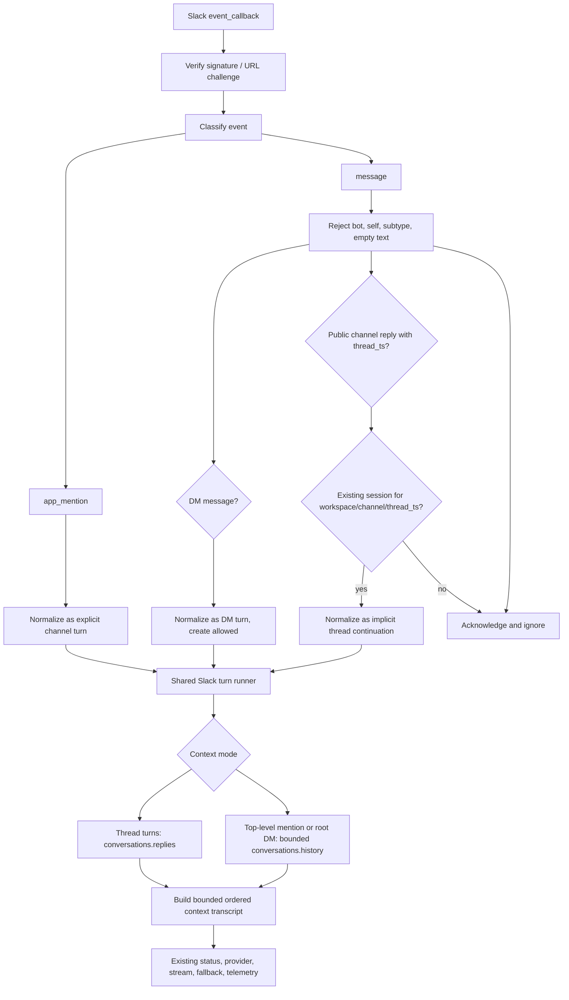

# Slack Thread And DM Response Parity

## Goal Capsule

| Field | Value |
| --- | --- |
| Objective | Match the Claude Tag default response behavior we want now: DMs always respond, and channel threads the bot has already joined can continue without another mention. |
| Authority hierarchy | User scope decisions in this thread, then official Claude Tag docs, then official Slack Events/Web API docs, then current repo behavior. |
| Execution profile | Code implementation in the current Slack Flue worktree, with unit tests, build/typecheck, docs updates, and live Slack verification after app config is updated. |
| Stop conditions | Stop before enabling top-level ambient channel replies, quieting controls, standing routines, or guest/Slack Connect refusal logic. Stop before changing Slack app scopes/events without explicit operator confirmation in the live setup step. |
| Tail ownership | Implementation owns the route, normalization, runner, tests, docs, Slack app configuration checklist, and live smoke results. |

## Product Contract

### Summary

Today the Slack bot responds only to `app_mention`, including inside an existing thread. Claude Tag's default that matters for this slice is different in two places: direct messages address Claude without a mention, and once Claude is participating in a thread, later thread replies can steer the same session without another mention. This plan adds those two defaults while keeping top-level channel ambient replies out of scope.

### Requirements

| ID | Requirement | Verification |
| --- | --- | --- |
| R1 | Preserve `app_mention` as the channel start path. A mention in a channel or thread may create or continue the thread-scoped session exactly as today. | Existing mention route tests stay green; live channel mention still streams a reply into the Slack thread. |
| R2 | Support mention-free continuation for Slack channel thread replies only when the bot has already joined the thread through an existing process-local session. | Signed `message.channels` fixture with `thread_ts` matching an existing session produces one new turn on the same session; a fixture with unknown `thread_ts` is acknowledged and ignored. |
| R3 | Support direct-message user messages without a mention. A user DM can create a conversation-scoped session and subsequent unthreaded or threaded DM replies continue that session. | Signed `message.im` fixture creates a session and returns a final reply; a second unthreaded DM fixture in the same conversation increments the same session. |
| R4 | Keep top-level non-mention channel messages ignored. This explicitly defers Claude Tag's top-level ambient channel behavior. | Signed top-level `message.channels` fixture without `thread_ts` returns an ignored status and creates no provider call or Slack reply. |
| R5 | Filter non-user message events before running the agent: bot/self messages, edited/deleted subtype messages, and messages lacking user text must not trigger a turn. | Negative route tests for `bot_id`, `subtype`, missing `user`, and empty text produce no provider calls. |
| R6 | Preserve Slack event dedupe across all trigger paths. | Duplicate `event_id` tests cover `app_mention`, `message.channels`, and `message.im`; only the first event posts. |
| R7 | Preserve the existing assistant status, streaming, fallback, final formatting, provider selection, safe-tool policy, telemetry, and session turn behavior. | Existing presentation and runner tests stay green; new message paths assert the same status and final-delivery sequence. |
| R8 | Document required Slack app configuration and live verification steps. | `docs/play-slack.md` names added scopes/events and includes channel-thread, DM, ambient-negative, and loop-negative smokes. |
| R9 | Hydrate the current Slack thread before the provider turn when the event supplies a thread root or DM thread root. Root DM/App Home turns hydrate bounded direct-conversation history instead. For first-time mentions into an existing Slack thread, match Claude Tag's documented window: root plus up to 50 human-authored messages from the start of the thread, filtering other bot replies. | Fake Slack Web API tests assert `conversations.replies` is called with the event channel and root `thread_ts` for thread turns, root DMs call bounded `conversations.history`, and the provider receives ordered bounded context, not only the current message. |
| R10 | For explicit top-level channel mentions, hydrate bounded recent channel history before the provider turn. Product policy: same channel only, before the mention, use a natural-language time window when the prompt clearly gives one, otherwise default to the previous 24 hours for vague prompts such as "what do you think?". Cap the transcript to 50 human-authored messages in V1. Claude Tag documents channel-history access and catch-up prompts, but not an exact default lookback for vague prompts; this policy is ours. | Fake Slack Web API tests assert `conversations.history` is called only for explicit top-level mentions, uses `latest=<mention ts>`, computes `oldest` from the prompt window or the 24-hour default, uses `limit=50`, filters bot/system messages, and provider input includes ordered recent channel messages plus the triggering mention. |
| R11 | Keep broad channel history out of implicit or mention-free channel prompt context. | Tests assert `conversations.history` is not called for mention-free channel-thread continuations or ignored top-level non-mentions; docs distinguish explicit top-level mention context from ambient channel monitoring. |

### Scope Boundaries

In scope:

- Generic Slack `message` event support for public channel threads and DMs.
- `message.channels` plus `channels:history` for mention-free replies in public channel threads where the bot has an existing session.
- `message.im` plus `im:history` for no-mention DMs.
- `message.app_home` for writable App Home messages, treated as the same DM-equivalent response path.
- `conversations.replies` thread hydration for explicit mentions, admitted channel-thread replies, and threaded DM/App Home replies so the provider can see the current Slack thread, not just the triggering message.
- `conversations.history` bounded recent-channel hydration for explicit top-level channel mentions so `@bot what do you think?` can refer to earlier channel messages without enabling ambient replies. V1 uses a natural-language time window when the prompt clearly includes one; otherwise it defaults to the previous 24 hours, capped to 50 human-authored same-channel messages. Root DM/App Home turns use the same method only for bounded direct-conversation history.
- Local fixtures, tests, and docs for the new event shapes and admission rules.

Deferred:

- Top-level ambient channel replies.
- Durable database-backed sessions and dedupe. This slice uses the current process-local `ThreadSessionStore`; after a restart, a plain channel thread reply may be ignored until a fresh mention recreates the session.
- Quieting controls and admin configuration.
- Guest, shared-channel, and Slack Connect refusal/safety cases.
- Standing work/routines.
- Private-channel and MPIM defaults (`message.groups`, `message.mpim`, `groups:history`, `mpim:history`) unless we later decide to broaden the Slack app surface.
- Broad full-channel history or search by default. Slack's `conversations.history` and Real-time Search APIs can expose more channel context with the right scopes, token type, membership, and rate limits, but this slice only uses a fixed bounded recent channel window for explicit top-level mentions.

## Context And Research

### Current Repo Behavior

- [src/slack/events-app.ts](src/slack/events-app.ts) verifies Slack signatures, handles URL verification, acknowledges assistant thread lifecycle events, and only invokes the runner for `app_mention`.
- [src/slack/types.ts](src/slack/types.ts) models `app_mention` and assistant lifecycle events, but not generic Slack `message` events.
- [src/slack/turn-normalization.ts](src/slack/turn-normalization.ts) normalizes Slack events into runnable or ignored turns, and [src/slack/thread-key.ts](src/slack/thread-key.ts) keys sessions as `workspaceId:channelId:threadTs`.
- [src/runtime/slack-thread-runner.ts](src/runtime/slack-thread-runner.ts) owns assignment resolution, session creation, dedupe, progress/status, provider calls, safe tools, final delivery, and telemetry for `handleSlackAppMention`.
- [src/runtime/session-store.ts](src/runtime/session-store.ts) is process-local and supports `getOrCreate` and `incrementTurn`, but has no read-only existing-session lookup for mention-free thread admission.
- [docs/play-slack.md](docs/play-slack.md) currently documents only `app_mentions:read`, `chat:write`, `assistant:write`, and event subscriptions for `app_mention`, `assistant_thread_started`, and `assistant_thread_context_changed`.

### External Behavior And Slack Surface

- Claude Tag's response-default docs say DMs are addressed to Claude by default, and existing thread participation allows follow-up replies without another mention. They also describe top-level ambient channel replies, quieting controls, refusal cases, and standing work, which this plan explicitly defers.
- Slack's `app_mention` event is the current channel start trigger and remains the conservative way to join a channel thread.
- Slack's generic `message` event is delivered through subtype-specific subscriptions. The relevant public-channel and DM subscriptions are `message.channels` and `message.im`.
- Slack message payloads include `channel`, `user`, `text`, `ts`, and, for threaded replies, `thread_ts`. The plan uses `thread_ts` as the admission signal for channel continuation and treats missing `thread_ts` in public channels as top-level ambient, which stays ignored.
- Slack says a raw app can only view messages sent to it; reading other messages requires explicit scopes. With the relevant `*:history` scope, `conversations.history` can read conversation history for conversations the app or bot is a member of, and `conversations.replies` can retrieve a cursor-paginated thread given `channel` and root `ts`.
- Slack's docs do not describe `conversations.history` as only post-join history; they define access by current conversation membership, scopes, token type, retention, and rate limits. Claude Tag user docs say Claude reads channel history when first invited, offer prompts such as catching up on the channel since a date, and note that reading a channel's full history directly requires Claude to be a member of it.
- Claude Tag documents one exact conversation window: mentioning Claude partway into an existing thread gives it up to 50 messages from the start of the thread, including the root and oldest replies, while filtering other bots' replies. The docs warn that in long threads, recent messages before the mention can fall outside that window.
- Claude Tag docs do not state a fixed default channel-history lookback for vague top-level mentions such as `@Claude what do you think?`. They show bounded prompts like "since Monday," "this week," and "last week"; when the prompt gives no time/window, any finite lookback we choose is an implementation policy, not a documented Claude Tag default.
- This plan's V1 top-level mention policy is prompt-aware for clear time windows and conservative when vague. If the prompt says "since Monday", "today", "yesterday", "this week", "last week", or "last N hours/days", compute the channel-history window from that phrase relative to the mention timestamp. If no clear window is present, use the previous 24 hours. In all cases, cap the transcript to 50 human-authored same-channel messages in V1.
- Slack Events API delivery requires fast HTTP 2xx acknowledgement and retries failed deliveries. The existing dedupe ledger must cover the new message paths because new subscriptions increase retry surface.
- Existing `assistant.threads.setStatus`, `chat.startStream`, `chat.stopStream`, and `chat.postMessage` behavior remains the reply surface; the feature changes which inbound events are admitted, not how Slack replies are delivered.

### Source Links

- Claude Tag: [When Claude responds](https://claude.com/docs/claude-tag/users/when-claude-responds)
- Claude Tag: [How Claude Tag works](https://claude.com/docs/claude-tag/concepts/how-it-works)
- Slack: [`app_mention` event](https://docs.slack.dev/reference/events/app_mention)
- Slack: [`message` event](https://docs.slack.dev/reference/events/message)
- Slack: [Events API](https://docs.slack.dev/apis/events-api/)
- Slack: [Retrieving messages](https://docs.slack.dev/messaging/retrieving-messages/)
- Slack: [`conversations.history`](https://docs.slack.dev/reference/methods/conversations.history)
- Slack: [`conversations.replies`](https://docs.slack.dev/reference/methods/conversations.replies)
- Slack: [`assistant.threads.setStatus`](https://docs.slack.dev/reference/methods/assistant.threads.setStatus)
- Slack: [`chat.startStream`](https://docs.slack.dev/reference/methods/chat.startStream)
- Slack: [`chat.stopStream`](https://docs.slack.dev/reference/methods/chat.stopStream)

## Key Technical Decisions

| ID | Decision | Rationale |
| --- | --- | --- |
| KTD1 | Keep `app_mention` as the only channel event allowed to create a public-channel session. | This preserves the current explicit opt-in behavior and prevents accidental top-level ambient responses while still allowing Claude Tag-style thread continuation after the bot has joined. |
| KTD2 | Add a shared normalized Slack turn type and move mention-specific runner assumptions behind normalization. | Duplicating the runner for message events would risk divergence in dedupe, provider selection, status sequencing, safe tools, and telemetry. A shared turn keeps the behavioral contract centralized. |
| KTD3 | Add read-only session lookup before admitting plain channel thread replies. | Mention-free thread continuation needs to know whether the bot is already participating. `getOrCreate` is too permissive because it would create sessions for arbitrary channel threads. |
| KTD4 | Allow DM `message.im` events to create sessions without a mention. | In a DM, each user message is addressed to the app by default, which matches the Claude Tag default and avoids requiring an impossible or awkward mention syntax. |
| KTD5 | Filter bot/self/subtyped message events at the route/classifier boundary. | Slack message subscriptions will include messages produced by apps and system-like message variants. Filtering before the runner prevents reply loops and protects provider cost. |
| KTD6 | Fetch active-thread history with `conversations.replies` for thread turns, fetch prompt-aware bounded recent channel history with `conversations.history` only for explicit top-level channel mentions, and fetch bounded direct-conversation history for root DM/App Home turns. | Claude Tag documents exact thread context but not an exact vague-channel lookback. Channel history should remain tied to an explicit mention; when the prompt provides a clear time window, honor it within V1 bounds, and when it is vague, use the previous 24 hours capped to 50 human-authored messages. Root DMs need conversation history because normal Slack DMs are often unthreaded. |
| KTD7 | Support public-channel thread replies and DMs first; leave private groups and MPIMs deferred. | The current live playtest surface is a public channel plus DM. Private groups and MPIMs require additional scopes/events and should be a deliberate admin-surface decision. |
| KTD8 | Treat Slack thread history as ephemeral per-turn context. | Fetch the thread just in time, pass a bounded ordered transcript to the provider, and do not persist raw Slack messages beyond existing telemetry/degradation metadata. |

## High-Level Technical Design

This sketch is illustrative, not implementation code.

## Implementation Units

### U1 - Model Slack Message Events And Normalize Turns

Files:

- [src/slack/types.ts](src/slack/types.ts)
- [src/slack/thread-key.ts](src/slack/thread-key.ts)
- [src/slack/turn-normalization.ts](src/slack/turn-normalization.ts)
- [fixtures/slack/](fixtures/slack)
- [tests/slack-events-route.test.ts](tests/slack-events-route.test.ts)

Add Slack `message` event types for the fields this app consumes: `type`, `channel`, `user`, `text`, `ts`, optional `thread_ts`, optional `channel_type`, optional `subtype`, optional `bot_id`, and optional `event_ts`. Introduce a normalized Slack turn type that can represent `explicit_mention`, `implicit_thread_reply`, and `dm_message`.

Approach notes:

- Keep the existing `SlackAppMentionEvent` fixture path working.
- Normalize the root thread timestamp as `thread_ts ?? ts`, but only allow missing `thread_ts` when the turn is an explicit mention or DM.
- Strip only routing metadata at this layer; do not mutate user text beyond the current mention handling behavior.

Test scenarios:

- `app_mention` fixture normalizes to `explicit_mention` with the same thread key as today.
- `message.channels` fixture with `thread_ts` normalizes to `implicit_thread_reply`.
- `message.im` fixture normalizes to `dm_message`.
- Top-level `message.channels` fixture without `thread_ts` is classifiable as ignored, not runnable.

### U2 - Add Admission Rules For Shared Slack Runner

Files:

- [src/runtime/slack-thread-runner.ts](src/runtime/slack-thread-runner.ts)
- [src/runtime/session-store.ts](src/runtime/session-store.ts)
- [tests/slack-thread-runner.test.ts](tests/slack-thread-runner.test.ts)

Refactor `handleSlackAppMention` behind a shared `handleSlackTurn` path while keeping `handleSlackAppMention` as a compatibility wrapper for existing tests and call sites. Add a read-only `getExisting` or `hasThread` method to `ThreadSessionStore` so implicit channel thread replies can be admitted only when the session already exists.

Approach notes:

- `explicit_mention`: may call `getOrCreate`.
- `dm_message`: may call `getOrCreate`.
- `implicit_thread_reply`: must find an existing session before provider work; otherwise return an ignored/acknowledged result.
- The existing session check is process-local in this slice. Do not add database persistence here; document that durable joined-thread memory remains deferred.
- Preserve dedupe before provider calls and preserve event-result caching for duplicate event IDs.
- Preserve all status, safe-tool, provider, delivery, and telemetry behavior downstream of the normalized turn.

Test scenarios:

- Mention starts a new channel session exactly as today.
- Plain channel thread reply with an existing session increments the same session and posts one final reply.
- Plain channel thread reply with no existing session returns ignored and does not call the provider or post to Slack.
- Duplicate implicit thread and DM events do not double-post.
- Delivery-failure retry behavior remains unchanged for the new message paths.

### U3 - Wire Generic Message Events Through The Events Route

Files:

- [src/slack/events-app.ts](src/slack/events-app.ts)
- [tests/slack-events-route.test.ts](tests/slack-events-route.test.ts)

Route Slack `message` events through the classifier and shared runner. Continue acknowledging `assistant_thread_started` and `assistant_thread_context_changed` without side effects.

Approach notes:

- Keep Slack signature and URL verification behavior unchanged.
- Return a 200 acknowledgement for ignored message events; do not surface ignored cases as route failures.
- Filter `subtype`, `bot_id`, missing `user`, missing text, and app/self messages before runner work.
- Maintain Slack's fast-ack expectation by acknowledging configured live Slack events before context hydration, provider generation, and final delivery work. Keep synchronous route mode available for deterministic fixture assertions.

Test scenarios:

- Signed `message.channels` thread reply reaches the runner and sends the expected Slack API sequence.
- Signed top-level `message.channels` event returns ignored with zero Slack API calls.
- Signed `message.im` event reaches the runner and sends a final reply.
- Bot/subtype message fixtures return ignored with zero Slack API calls.
- Existing invalid-signature, URL challenge, assistant lifecycle, and duplicate retry tests stay green.

### U4 - Support Direct Messages With Existing Assignment Semantics

Files:

- [src/config/resolver.ts](src/config/resolver.ts)
- [src/config/seed.ts](src/config/seed.ts)
- [src/runtime/slack-thread-runner.ts](src/runtime/slack-thread-runner.ts)
- [tests/slack-thread-runner.test.ts](tests/slack-thread-runner.test.ts)

Use the existing workspace/channel assignment resolver for DM channel IDs. The current wildcard assignment can handle local and playtest DMs; admin-time DM-specific assignment controls remain out of scope.

Approach notes:

- A DM session key should still use the existing `workspaceId:channelId:<session-thread>` key shape, but the session-thread segment should be a stable conversation marker rather than each root message timestamp.
- If a workspace has no exact DM assignment, wildcard behavior remains the fallback.
- Do not add user-specific routing or per-DM admin settings in this slice.

Test scenarios:

- DM fixture in `T_DEMO` resolves through wildcard assignment and uses `agent_exec_research`.
- DM root message creates a conversation-scoped `T_DEMO:D...:dm` session.
- DM unthreaded follow-ups and threaded replies continue that session.
- DM with no matching assignment returns the existing assignment error path, not a silent fallback beyond configured wildcard semantics.

### U6 - Hydrate Slack Context For Runnable Turns

Files:

- [src/runtime/slack-thread-runner.ts](src/runtime/slack-thread-runner.ts)
- [src/providers/types.ts](src/providers/types.ts)
- [src/providers/deterministic.ts](src/providers/deterministic.ts)
- [src/slack/web-api-replies.ts](src/slack/web-api-replies.ts)
- New `src/slack/thread-context.ts` or equivalent small module for fetch-backed Slack thread reads.
- [tests/slack-thread-runner.test.ts](tests/slack-thread-runner.test.ts)
- [tests/slack-events-route.test.ts](tests/slack-events-route.test.ts)

Add a Slack context client that can call `conversations.replies` with the event `channel` and root thread timestamp, `conversations.history` for explicit top-level channel mentions, and bounded direct-conversation history for root DM/App Home turns. The runner should pass an ordered bounded transcript into the provider turn.

Approach notes:

- Use the same fetch-injection pattern as `SlackWebApiReplySink` so tests can inspect outgoing Slack Web API calls without adding a new SDK dependency.
- Treat `event.thread_ts ?? event.ts` as the root for `conversations.replies` when the runnable turn is in a thread or DM thread.
- For first-time mentions into an existing channel thread, apply Claude Tag's documented thread window: root plus up to 50 messages from the start of the thread, filtering other bot replies.
- For explicit top-level channel mentions where `event.thread_ts` is absent, call `conversations.history` with `latest` set to the mention `ts`, `oldest` computed from a clear prompt window or 24 hours before the mention when vague, and `limit=50`. Filter to human-authored user messages, then append or mark the triggering mention in the transcript.
- V1 natural-language window parsing should be narrow and deterministic: support `today`, `yesterday`, `this week`, `last week`, `since <weekday>`, and `last N hours/days`. If the prompt asks for a broader or ambiguous range, fall back to the 24-hour default and let the model say the retrieved context is recent/bounded.
- Fetch cursor pages until Slack reports no next cursor or a documented safety bound is reached. If the safety bound is reached, include the most relevant bounded transcript and record a degradation marker instead of pretending the provider saw the full thread.
- Preserve message order from oldest to newest and include at least `user`, `text`, `ts`, and whether the row is the triggering message.
- Do not call broad channel `conversations.history` for mention-free channel-thread continuations or ignored top-level non-mentions. The app may be able to read more channel history with the right scope and membership, but broad ambient history should not enter the provider path.
- On Slack thread-read failure (`missing_scope`, `not_in_channel`, rate limit, network error), continue with the triggering message and record a degradation. A context-read failure should not stop a final answer unless final delivery itself fails.
- Do not persist raw thread messages outside the per-turn provider request path.

Test scenarios:

- Explicit channel mention in a thread calls `conversations.replies` with `channel` and root `thread_ts`, then provider input includes previous thread messages and the triggering mention.
- First-time mention into an existing long thread includes only root plus the oldest replies up to the documented 50-message window, filters other bot replies, and records truncation when later pre-mention replies are omitted.
- Mention-free channel continuation calls `conversations.replies` for the same root before provider generation.
- DM root turns call bounded `conversations.history` on the DM channel; DM thread replies call `conversations.replies` with the DM channel and root timestamp.
- Explicit top-level channel mention with no clear time phrase calls `conversations.history` with `latest=<mention ts>`, `oldest=<mention ts - 24h>`, and `limit=50`; filters bot/system messages; and passes ordered recent human channel messages plus the triggering mention to the provider.
- Explicit top-level channel mention with a clear time phrase such as "since Monday" or "last 2 days" computes `oldest` from that phrase, keeps `latest=<mention ts>` and `limit=50`, and records the chosen window in provider context metadata.
- Multi-page Slack thread fixtures are concatenated in order until `response_metadata.next_cursor` is empty.
- A very long thread fixture triggers the safety bound and records a truncation/degradation while still producing a final reply.
- A Slack context failure falls back to current-message-only context and records the specific degradation.
- Mention-free channel-thread replies and ignored top-level non-mentions never call `conversations.history`.

### U5 - Update Docs And Live Slack Verification

Files:

- [docs/play-slack.md](docs/play-slack.md)
- [docs/START_HERE.md](docs/START_HERE.md)
- Optional follow-up decision note under [docs/decisions/](docs/decisions)

Update setup docs to describe the new response defaults, required Slack scopes/events, and smoke tests. Keep the existing instruction to pause before changing Slack app config or reinstalling.

Slack app configuration to document:

| Capability | Slack docs | App config | Live verification |
| --- | --- | --- | --- |
| Explicit channel starts | [`app_mention`](https://docs.slack.dev/reference/events/app_mention) | Existing event `app_mention`; existing scope `app_mentions:read`. | Mention the bot in the playtest channel; expect status updates and one final thread reply. |
| Mention-free public thread continuation | [`message` event](https://docs.slack.dev/reference/events/message) | Add event `message.channels`; add scope `channels:history`; reinstall app. | Reply in a bot-created or bot-joined thread without mentioning the bot; expect one reply in the same thread. |
| No-mention DMs | [`message` event](https://docs.slack.dev/reference/events/message) | Add event `message.im`; add scope `im:history`; reinstall app. | Send the bot a DM without mention syntax; expect one reply in that DM. |
| App Home messages | [`message.app_home` event](https://docs.slack.dev/reference/events/message.app_home), [App manifest](https://docs.slack.dev/reference/app-manifest/#features) | Add event `message.app_home`; enable writable App Home messages with `features.app_home.messages_tab_enabled: true` and `features.app_home.messages_tab_read_only_enabled: false`; reinstall or reload Slack if needed. | Send the bot an App Home message without mention syntax; expect one reply in that conversation. |
| Active-thread visibility | [`conversations.replies`](https://docs.slack.dev/reference/methods/conversations.replies), [Retrieving messages](https://docs.slack.dev/messaging/retrieving-messages/) | Uses the same relevant history scopes; no new event subscription. | Tag the bot into a thread with earlier messages; ask it to summarize or refer to those earlier thread messages; expect it to use them. |
| Explicit top-level mention channel visibility | [`conversations.history`](https://docs.slack.dev/reference/methods/conversations.history), [Retrieving messages](https://docs.slack.dev/messaging/retrieving-messages/) | Uses `channels:history`; no ambient response behavior; vague prompts default to previous 24 hours, capped to 50 human same-channel messages. Clear time-window prompts compute `oldest` from the phrase. | Post several messages in a channel, then top-level mention the bot with "what do you think?"; expect the answer to use the previous 24 hours of bounded channel context. |
| Full-channel ambient history visibility | [`conversations.history`](https://docs.slack.dev/reference/methods/conversations.history), [Retrieving messages](https://docs.slack.dev/messaging/retrieving-messages/) | Do not add default full-channel prompt behavior outside explicit mentions. | Docs state that channel history may be readable with scope/membership, but mention-free thread replies and ignored top-level non-mentions should not call `conversations.history`. |
| Fast acknowledgement and retry safety | [Events API](https://docs.slack.dev/apis/events-api/) | Local server uses async dispatch after signature verification; synchronous dispatch remains a test harness mode. | Trigger signed fixtures locally and confirm async mode returns `accepted` before downstream Slack API calls finish; duplicate synchronous fixtures still do not repost. |
| Assistant status and streaming replies | [`assistant.threads.setStatus`](https://docs.slack.dev/reference/methods/assistant.threads.setStatus), [`chat.startStream`](https://docs.slack.dev/reference/methods/chat.startStream), [`chat.stopStream`](https://docs.slack.dev/reference/methods/chat.stopStream) | Existing `assistant:write` and `chat:write`. | Confirm new DM/thread paths still set status where possible and stream or fallback-post final replies. |
| Top-level ambient negative | [`message` event](https://docs.slack.dev/reference/events/message) | Same `message.channels` subscription. | Post a top-level non-mention message in the playtest channel; expect no bot reply. |
| Loop negative | [`message` event](https://docs.slack.dev/reference/events/message) | Same `message.channels`, `message.im`, and `message.app_home` subscriptions. | Confirm the bot's own final reply does not trigger another provider turn. |

Test scenarios:

- Docs list all required scopes/events and say which ones are existing versus new.
- Docs include the exact negative smoke for top-level ambient channel messages.
- Docs distinguish what Slack can deliver as future message events from what the app can read through Web API history methods.
- Docs state that this slice fetches active thread context for thread turns, bounded direct-conversation history for root DM/App Home turns, and bounded recent channel context for explicit top-level mentions, not ambient full-channel history by default.
- Docs include a rollback note: remove `message.channels`/`message.im`/`message.app_home` subscriptions or revoke new scopes if live events over-trigger.

## Verification Contract

| Gate | Command or Surface | Expected result |
| --- | --- | --- |
| Unit and typecheck | `npm test` | TypeScript and all `node --test --import tsx tests/*.test.ts` tests pass. |
| Worker bundle | `npm run flue:build` | Slack Flue worker builds after route/type changes. |
| Local signed event fixtures | `tests/slack-events-route.test.ts` and `tests/slack-thread-runner.test.ts` | Signed mention, thread-message, DM-message, top-level ignored, bot/subtype ignored, and duplicate-event cases are covered. |
| Context fixtures | `tests/slack-events-route.test.ts` and `tests/slack-thread-runner.test.ts` with fake Slack Web API responses | `conversations.replies` is called for runnable thread turns; `conversations.history` is called for explicit top-level channel mentions and root DM/App Home turns with `latest=<mention ts>`, prompt-derived or 24-hour `oldest`, and `limit=50`; provider input includes ordered bounded context; context failures degrade to current-message-only. |
| Slack app config | Slack app admin UI | Existing scopes/events remain; new scopes `channels:history` and `im:history`; new bot events `message.channels`, `message.im`, and `message.app_home`; App Home messages are writable; app is reinstalled after operator confirmation. |
| Live channel start | Playtest Slack channel | Mention still produces status updates and one final reply in the Slack thread. |
| Live thread continuation | Same Slack thread, same running process | Reply without mentioning the bot; bot produces one reply in the same thread and no duplicate reply. Restart-durable continuation is not claimed. |
| Live thread visibility | Existing Slack thread with earlier messages before the tag | Tag the bot into the thread and ask about earlier thread content; bot's answer reflects prior thread messages, not only the triggering mention. |
| Live top-level mention visibility | Playtest Slack channel with earlier recent messages | Top-level mention the bot with a context-dependent question; bot's answer reflects bounded recent channel messages. |
| Live DM | Bot DM | User sends a DM without mention; bot replies once. |
| Live top-level negative | Playtest Slack channel | User posts a top-level non-mention message; bot stays silent. |
| Live loop negative | Thread or DM where bot just replied | Bot's own message event does not trigger a second provider call or reply. |

## System-Wide Impact

- Slack event ingress broadens from one runnable event type to three runnable event paths: `app_mention`, admitted `message.channels`, and admitted `message.im`.
- Slack app configuration changes are required before live verification. The code can ship behind absent subscriptions, but the new behavior is not live until Slack events and scopes are enabled.
- Session store semantics become more explicit: create is allowed for mentions and DMs, while channel continuation requires existing session state.
- Thread context becomes a Slack Web API dependency before provider generation; failures must degrade rather than block final delivery.
- Provider calls and safe-tool behavior should not change; the risk is accidental admission of unwanted messages, not model behavior.
- Event volume can increase after `message.channels` is enabled. Filtering and dedupe must happen before expensive work.
- Docs and live rollback instructions matter because a misconfigured `message.channels` subscription can create noisy event volume even if code ignores most events.

## Risks And Mitigations

| Risk | Mitigation |
| --- | --- |
| Top-level ambient messages accidentally trigger provider calls. | Treat missing `thread_ts` on public `message.channels` as ignored; test the negative fixture and live top-level negative. |
| Bot replies trigger an infinite loop. | Filter `bot_id`, app/self messages, and message subtypes before runner execution; test loop-like fixtures and live bot reply behavior. |
| Unknown channel thread replies create sessions. | Add read-only session lookup and require existing session for implicit channel replies. |
| Claude Tag's durable thread memory is overclaimed. | State that this slice uses process-local sessions; keep database-backed session/dedupe persistence as follow-up work. |
| Bot still lacks the actual thread context after being tagged. | Fetch active-thread messages with `conversations.replies` before provider generation and verify with an earlier-message live smoke. |
| Thread context fetch adds latency or fails due to Slack rate limits/scopes. | Acknowledge Slack events before long-running work in live local-server mode, bound pagination, record degradation, and fall back to the triggering message instead of failing the turn. |
| Full-channel history is accidentally sent to the model outside explicit mentions. | Call bounded channel `conversations.history` only for explicit top-level mentions, with deterministic prompt-derived or 24-hour default windows and a 50-message human-message cap; add negative tests for mention-free channel-thread replies and ignored top-level non-mentions. |
| Slack app scope broadening surprises operators. | Docs keep the current pause-before-config-change rule and label new scopes/events clearly. |
| DM assignment is unclear. | Use current assignment resolver and wildcard fallback for this slice; defer admin routing controls. |
| Private-channel or MPIM expectations leak in. | Explicitly defer `message.groups` and `message.mpim` until those scopes/events are deliberately added. |
| External docs drift. | Link official Slack and Claude docs in the plan and docs; live verification remains the source of truth before calling parity complete. |

## Open Questions

- None blocking for this scoped implementation.
- Deferred admin work should decide whether DMs need explicit per-workspace/per-agent assignment controls instead of relying on wildcard fallback.
- Deferred safety work should decide whether guest/shared-channel/Slack Connect context needs pre-run refusal or routing behavior before private/shared surfaces are enabled.

## Definition Of Done

- `app_mention` behavior remains compatible with existing tests and live channel starts.
- Mention-free channel thread replies run only for existing process-local bot-joined sessions.
- DM user messages run without mention syntax and can create sessions.
- Runnable thread turns fetch active Slack thread context with `conversations.replies` and pass a bounded ordered transcript to the provider. Root DM/App Home turns fetch bounded direct-conversation history.
- Explicit top-level channel mentions fetch bounded recent channel history with `conversations.history`: same channel, before the mention, clear prompt-derived window or previous 24 hours when vague, max 50 human-authored messages. Mention-free channel-thread replies and ignored top-level non-mentions do not.
- Top-level non-mention channel messages, bot/self messages, subtype messages, and unknown channel threads are acknowledged but ignored.
- Dedupe applies across mention, implicit thread, and DM events.
- `npm test` and `npm run flue:build` pass.
- `docs/play-slack.md` documents new scopes, event subscriptions, app reinstall step, live smokes, and rollback.
- Live Slack verification captures channel mention, thread continuation without mention, DM without mention, top-level ambient negative, and loop negative.
