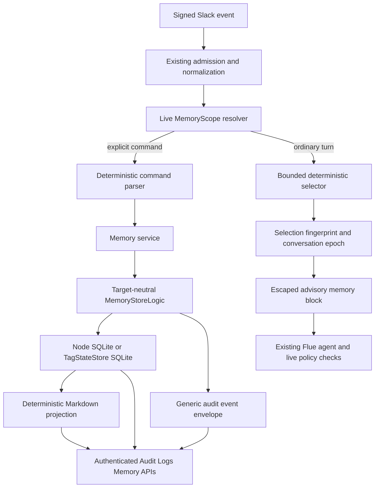
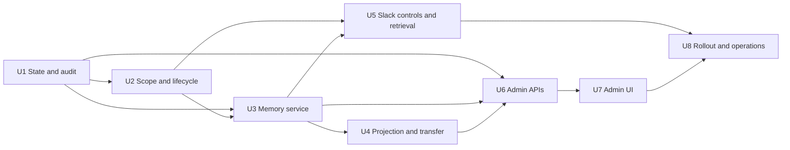

# Channel Memory - Plan

## Goal Capsule

- **Objective:** Add first-class, channel-partitioned Chickpea memory that closely reproduces Claude Tag's observable scope and control model while preserving Chickpea's stronger typed-policy boundaries.
- **Base revision:** Committed `main` at `3d0f6441c6678d04da3126a50c7ac83c218d5e36`.
- **Authority order:** Live system policy and Slack authorization > profile and channel instructions > current-turn Slack context > selected memory > model output.
- **Execution profile:** Eight implementation units on the existing Node and Cloudflare state abstractions, with no persistent filesystem dependency.
- **Stop conditions:** Stop rollout if a private-store entry can enter workspace selection; a destination audience containing a guest/foreign user or third-party bot can receive cross-source memory; an explicit mutation can occur without trusted Slack actor and live scope resolution; deletion leaves recoverable canonical memory content in revisions; the active Flue transcript can accumulate memory beyond the selection budget; a memory body alone causes a write-capable action absent matching current-request intent; or Node and workerd projections differ byte-for-byte.
- **Tail ownership:** The implementing owner also owns schema migration safety, privacy-transition tests, observability, documentation, and rollback proof; no unit is complete after only adding its happy path.

---

## Product Contract

### Summary

Chickpea will gain durable, team-owned memory that survives Slack threads and is visible and correctable where the team works.
Memory is stored canonically as structured state and projected deterministically as portable Markdown files, including generated `MEMORY.md` indexes.
Public-channel memories are grouped by source channel, readable throughout the workspace, and conversationally editable only from their source channel.
Private-channel memories remain isolated in a private store that may read workspace-public memory but never contributes private content to it.
The admin surface adds a real Memory view inside a unified Audit Logs information architecture, reached from each channel rather than promoted into the global navigation; Scheduled Work and Network Events are visibly future domains, not simulated functionality.

### Problem Frame

Chickpea currently persists Flue thread transcripts, deduplication claims, configuration snapshots, runtime settings, and turn jobs, but none has memory semantics.
The bot fetches bounded Slack history for the current turn and has no durable workspace knowledge index.
That means useful facts, decisions, conventions, and feedback must be repeated in each new thread, while reusing transcripts as a substitute would create an unreviewable data lake with unclear privacy boundaries.
The user confirmed this product contract after directly evaluating Claude Tag's live memory surface; v0 still treats adoption and reviewed usefulness as rollout evidence rather than assuming competitor parity alone proves Chickpea demand.

Claude Tag demonstrates a useful product contract: memory belongs to a team scope rather than a person, public and private channels have different read/write behavior, channel members can correct it in conversation, administrators can inspect it, and the prompt contribution remains intentionally small.
The live Claude Tag instance further demonstrates a file-oriented admin experience with a generated channel index and editable individual Markdown records.
Chickpea should reproduce those observable strengths without claiming parity with Claude Tag's undocumented ranking, consolidation, retrieval, or automatic-curation internals.

### Evidence Labels

The plan uses four evidence classes:

- **Documented fact:** Current official Claude Tag documentation observed on 2026-07-25.
- **Live observation:** The user-supplied Claude Tag admin screenshot and copied file contents from 2026-07-25.
- **Current code:** Committed Chickpea behavior at the base revision named above.
- **Product decision:** A Chickpea choice, including intentional divergence; provisional choices are explicitly labeled assumptions or deferred questions.

### Actors and Permissions

- A1. **Eligible channel member:** A human full workspace member whose signed event passes Chickpea's existing admission rules and whose fresh Slack identity result is neither deleted, bot/app, restricted, ultra-restricted, nor foreign/stranger. Same-source memory follows the current channel audience; cross-channel public memory additionally requires a bounded audience census proving that every channel member is an eligible full human or Chickpea's own bot. Explicit mutations prove the actor remains a current member before commit.
- A2. **Workspace member:** An A1 actor interacting in any eligible public channel in the one workspace served by this deployment. Guest, bot/app, foreign, and unknown actor classes receive memory-free behavior in v0 even when the surrounding Slack channel is otherwise public.
- A3. **Chickpea operator:** A bearer-token or admin-session holder for `/admin`; v0 has one operator capability rather than Claude Tag's separate Admin and Owner roles.
- A4. **Runtime selector:** Deterministic application code that resolves live scope, selects bounded memory, and assembles prompt context.
- A5. **Administrator UI:** The Audit Logs Memory surface that exposes generated indexes, entries, history, and destructive controls; transfer APIs remain an operator-level portability mechanism rather than an everyday UI.

| Action | A1 source-channel member | A2 other public-channel member | A3 operator | Runtime |
| --- | --- | --- | --- | --- |
| Read public memory in a model turn | Current source partition; workspace-wide only after audience census | Workspace-wide only after audience census | Yes | Enforces resolved read set |
| List a source channel's public entries | Yes, in the source channel | No conversational cross-channel browser in v0 | Yes | N/A |
| Create/update/merge/forget a public entry | Yes, only from its source channel | No | Yes | Only through trusted commands/admin calls |
| Read private memory | Yes for the current private source; workspace-public entries from other sources require audience census | No | Yes | Only for the resolved read set |
| Mutate private memory | Yes, only from that private channel | No | Yes | Only through trusted commands/admin calls |
| View audit event metadata | No in v0 | No | Yes | Append only |
| Edit generated `MEMORY.md` | No | No | No | Regenerates it |

### Key Product Decisions

- **PD1 — Canonical structured state with Markdown projection.** Structured database records are canonical and project deterministically to portable Markdown; a persistent filesystem is not required. (session-settled: user-directed — chosen over filesystem-canonical memory: Chickpea must preserve Node and Cloudflare parity.) Governs R11-R18.
- **PD2 — Explicit creation before automatic curation.** v0 supports explicit remember, update, merge, and forget actions; automatic background saving waits for provenance, review, quality, and measurement controls. (session-settled: user-directed — chosen over immediate Claude-like self-curation: silent durable writes would precede the controls needed to trust them.) Governs R7-R10 and R33.
- **PD3 — Workspace-readable public memory with source-channel write authority.** Public entries are grouped by source channel and readable workspace-wide, but Slack mutations are allowed only from the source channel; operators may edit from admin. (session-settled: user-directed — chosen over channel-only public memory: the product should closely reproduce Claude Tag's observable shared workspace behavior.) Governs R1-R6 and R27-R30.
  Workspace-wide reads are conditional on proving the destination audience; when that proof is unavailable or includes restricted recipients, the same settled rule degrades to the current source partition rather than widening visibility.
- **PD4 — Unified Audit Logs information architecture, entered through Channels, with Memory only at launch.** Each channel detail shows its saved-memory count and a prominent **Review memory** action into the Audit Logs workspace. Audit Logs keeps a working Memory tab and clearly unavailable Scheduled Work and Network Events tabs, but is not a top-level navigation destination. (session-settled: user-directed — chosen over a top-level Audit Logs item or an unrelated inline placement: memory review should stay prominent in channel context without crowding the global navigation.) Governs R23-R26.
- **PD5 — Memory is advisory context, never enforceable policy.** Response preferences may be remembered, but permissions, spend limits, live access checks, egress rules, response admission, and credentials remain typed system truth. (session-settled: user-directed — chosen over prose-driven enforcement: stale or hostile memory must not widen authority or override current capability checks.) Governs R19-R22, R31-R32, and R36.
- **PD6 — Memory is an always-on core capability.** Every eligible Slack channel receives explicit memory controls and bounded retrieval; there is no install setting or environment flag that disables memory. Unsupported scopes and runtime failures still fail closed for the affected turn, and operational rollback is a code deployment that preserves stored records. (session-settled: user-directed — chosen over a default-off feature flag after live acceptance showed memory is foundational rather than optional.) Governs R26 and R29-R33.

### Requirements

**Scope, privacy, and lifecycle**

- R1. Every memory entry belongs to exactly one workspace tenant, one store, and one immutable source channel ID.
- R2. An eligible public-channel turn from a freshly verified full human workspace member can always select active or stale public entries sourced from the current channel. It may expand to other public source channels, subject to the prompt budget, only when a bounded live census proves that every destination-channel member is an eligible full human or Chickpea's own bot. A restricted/ultra-restricted guest, foreign/stranger user, other bot/app, deleted user, unresolved identity, or incomplete census downgrades the turn to current-source-only memory rather than exposing cross-channel entries.
- R3. A conversational public-memory mutation is authorized only when its trusted Slack event originated in the entry's source channel; admin mutations are not source-channel limited.
- R4. A private-channel turn can select its active or stale private-store entries plus any retained public entries sourced from the same channel read-only. It may add workspace-public entries from other source channels only after the R2 audience census succeeds, and every conversational write from that turn targets only the private store except the R28 forget-only path.
- R5. Private content must never become workspace-public through selection, projection, export scoping, conversion, import, logging, or error text.
- R6. Fresh Slack conversation and actor facts are authoritative for every memory-bearing turn: `conversations.info` proves channel state and `users.info` proves the actor. Bounded `conversations.members` plus `users.list` pagination proves the destination audience before any cross-source query, and a queued explicit mutation independently rechecks current actor membership immediately before commit. Conversation/actor failure or Slack `429` honors `Retry-After` and fails closed to memory-free behavior; audience-census failure or an unsupported audience fails closed to current-source-only memory. Neither blocks an otherwise admitted ordinary reply.

**Channel controls and content lifecycle**

- R7. Eligible channel members can explicitly list, show, remember, update, merge, forget, request review, and get help through deterministic Slack controls with stable partition-scoped entry slugs. Commands remain subject to existing typed admission, so mention-only channels require the command to accompany a valid mention; operator UX gives copyable command/help text and never posts unsolicited memory prompts.
- R8. Mutations return a visible success receipt naming the entry, store scope, version, and a safe summary; ambiguous or unauthorized requests do not mutate state. A cross-channel review request creates only an attributed audit event and admin review badge, never changes entry content or write authority.
- R9. Destructive commands require an exact target and an explicit confirmation token bound to actor, entry, version, and scope that expires and cannot be replayed.
- R10. Updates retain bounded revision provenance; merge supersedes named sources atomically; forget/admin delete irreversibly removes canonical memory bodies, descriptions, and content-derived hashes while retaining a body-free tombstone and audit event.

**Structured state and portable projection**

- R11. Node SQLite and the Cloudflare `TagStateStore` use the same target-neutral memory logic, migrations, invariants, and transaction boundaries.
- R12. Entry slugs, descriptions, types, bodies, provenance, versions, statuses, timestamps, optional expiry, content hashes, live store totals, and conversational mutation rates have explicit validated bounds shared by Slack writes and import; the projected frontmatter `name` is the stable slug rather than a second renameable identity.
- R13. Every successful mutation has a unique idempotency key and an append-only revision/audit record in the same transaction.
- R14. Concurrent updates use expected-version checks and return a conflict with the current safe metadata rather than silently overwriting.
- R15. The service projects deterministic individual Markdown files and generated `MEMORY.md` indexes without using the filesystem as canonical storage.
- R16. Export produces a deterministic, path-safe archive plus a machine manifest; import supports preview and all-or-nothing apply with quota, hash, scope, and version validation.
- R17. `MEMORY.md` is always regenerated, clearly read-only, and never accepted as an authoritative imported edit.
- R18. Slugs are unique only within `(store_id, source_channel_id)`. Bare command targets and `[[slug]]` links resolve in the invoking/current channel partition; public cross-partition references use immutable `<source-channel-id>/<slug>` in commands/search and `[[<source-channel-id>/<slug>]]` in bodies, which the export manifest maps to `channel/<source-channel-id>/<slug>.md`. Private-to-public or cross-private references are rejected, and no reference may escape an authorized store.

**Retrieval and trust boundary**

- R19. Memory selection is deterministic, explainable, bounded by entry count and bytes, and does not require vector search.
- R20. Selected memory is serialized as clearly delimited, escaped, untrusted user-role context after bounded background Slack history and before the one final current Slack request; it never enters profile or channel system instructions.
- R21. The runtime re-evaluates current profile state, tool approvals, repository grants, credentials, egress, spend, and response admission independently of memory on every turn.
- R22. A Slack reply must disclose every supplied cross-channel entry as `<slug> (#display-name, <source-channel-id>)`, may summarize same-channel entries by count, and must not claim the model used or obeyed them. The disclosure includes the review-request grammar so workspace-wide influence has an attributable correction path without cross-channel edit authority.

**Admin and audit experience**

- R23. Each `/admin` channel detail exposes a saved-memory count and prominent **Review memory** action into the Audit Logs workspace. Audit Logs is not a top-level navigation item; its inner tabs are Memory, Scheduled Work, and Network Events, with only Memory enabled in v0.
- R24. The Memory UI supports workspace/channel filtering, an accurate public/private visibility explanation, generated-index preview, entry preview/edit/delete, and revision history. Every memory-derived field is rendered through the existing escaping/sanitization boundary: raw HTML is disabled and link/image URL schemes are allowlisted. Export and import remain authenticated API-level portability/recovery capabilities and do not appear as everyday admin controls.
- R25. The UI covers loading, empty, disconnected, access-denied, fetch-error, success, conflict, unsaved-change, stale, expired, sealed-store, and delete-confirmation states, including keyboard focus and screen-reader announcements after asynchronous transitions.
- R26. A common audit-event envelope supports Memory events now—including private admin views and review requests/resolutions—and reserves stable domain/event naming for future scheduled-work and network-event producers without creating pretend rows or APIs.

**Privacy, operations, and rollout**

- R27. A private-to-public conversion seals the private store and immediately stops selecting it; old private content is not migrated. The first proven-public observation creates a Slack-history visibility barrier, and subsequent public memory epochs hydrate only messages at or after that barrier so pre-conversion private replies cannot be reintroduced as background context by the memory path.
- R28. A public-to-private conversion leaves previously public records in the workspace-public store and creates a new private store generation for future writes. The public partition freezes its last public-safe channel label and never exposes later private renames. Freshly verified members of the now-private source channel may forget historical public records through the explicit `public/<slug>` target but may not create, update, merge, or restore them; the operator may still correct or delete them.
- R29. Rename preserves channel identity; archive, deletion, app removal, detachment, and disablement retain records but gate live reads/writes according to current access and lifecycle state.
- R30. Slack Connect, externally shared, organization-shared, or otherwise ambiguous channel scopes are memory-disabled in v0. A destination audience containing a guest, non-Chickpea bot/app, foreign/stranger, deleted, or unknown identity is restricted to current-source-only memory; a turn from such an actor remains memory-disabled. Cross-channel reads require proof of the supported single-workspace, full-human-member audience boundary.
- R31. Metrics and logs expose counts, bytes, latency, outcomes, denials, conflicts, selection/truncation, audience-census success/rate-limit/truncation and downgrade reasons, cross-source selection share, review requests, pilot adoption/utility, and lifecycle transitions without logging entry bodies or raw Slack message text.
- R32. Quota or state-service failure never broadens access: an ordinary reply may continue only in a fresh memory-free quarantine conversation that cannot replay an earlier memory-bearing transcript, while explicit mutations fail with no partial write and a retryable receipt.
- R33. Memory is always active for every eligible Slack scope and `/admin/settings` contains no memory toggle or redundant status block. The compatibility `PUT /admin/api/memory/settings` rejects changes with `memory_always_enabled`, and legacy `memory.enabled` rows or `SLACK_TAG_MEMORY_ENABLED=false` values are ignored. Release remains staged by deployment and workspace, with additive schema migration, pre-release validation, export guidance, and a code rollback that leaves data intact. Pilot expansion requires both the safety gates and the explicit adoption/utility criteria below; “nothing broke” is not sufficient evidence to widen rollout.
- R34. The active Flue conversation may contain only one current bounded memory selection set; a changed selection, entry version, visibility scope, or empty/non-empty state rotates the Flue conversation epoch. A new epoch rehydrates the current bounded Slack thread context and preserves the base thread's config snapshot and external sandbox/resource identity, but never carries forward prior model-turn state or an older memory block. Node's in-memory virtual sandbox has no durable identity and may reset on rotation.
- R35. Forget/delete prevents future selection and active-transcript reuse but does not claim to retract content already sent to a model provider, repeated into Slack, persisted in an orphaned Flue transcript, or copied into an export archive created before deletion; confirmation and operator documentation state this boundary.
- R36. Memory and its audit metadata are not credential storage: Slack/admin creation, update, merge, and import reject known provider-token, Slack-token, private-key, and Chickpea-secret patterns before persistence; cross-channel reports persist only a fixed reason code, never free-form text; and the UX states that content detection is best-effort rather than a guarantee.

### Key Flows

- F1. **Explicit remember in a public channel**
  - **Trigger:** A1 sends `!remember <name> — <description>` or the documented constrained natural-language equivalent in an eligible public channel, including a valid mention wherever existing admission requires one.
  - **Steps:** Verify Slack signature/admission; resolve live channel and actor facts plus current membership; normalize and validate the candidate; enforce durable rate/store quotas; create in the workspace-public store under the source channel; append revision and audit event; return the slug and scope receipt.
  - **Outcome:** The entry is immediately visible in admin and eligible for later workspace-wide selection.
  - **Covers:** R1-R3, R6-R8, R11-R14.
- F2. **Private-channel read/write**
  - **Trigger:** A1 interacts in a private channel.
  - **Steps:** Resolve the current private generation; select that store plus workspace-public entries; route any explicit write only to the private store; never expose private candidates outside the channel.
  - **Outcome:** Shared knowledge remains readable, while private additions remain isolated.
  - **Covers:** R4-R6, R19-R21, R27-R30.
- F3. **Ordinary turn with bounded memory**
  - **Trigger:** An admitted non-command Slack turn reaches `run-turn.ts`.
  - **Steps:** Resolve live scope; derive deterministic query terms; select within quotas; assemble a delimited user-context block; run the existing agent and live policy checks; optionally label the supplied slugs in the footer.
  - **Outcome:** Memory improves continuity without gaining policy authority.
  - **Covers:** R2, R4, R6, R19-R22, R31-R32.
- F4. **Correction, merge, and forget**
  - **Trigger:** A1 names one or more stable slugs from the source channel, or A3 acts in admin.
  - **Steps:** Authorize; load expected versions; validate replacement content; apply the transaction; create revisions/tombstones/audit events; return a conflict or success receipt.
  - **Outcome:** Curated knowledge stays correct and changes remain attributable without retaining forgotten content.
  - **Covers:** R3, R7-R10, R13-R14, R31-R32.
- F4a. **Cross-channel review request**
  - **Trigger:** A1 sees a disclosed cross-channel entry and sends `!memory report <source-channel-id>/<slug> <stale|incorrect|unsafe|unclear>`.
  - **Steps:** Resolve the qualified public entry; validate the fixed reason code; append `memory.review_requested`; show an unresolved admin badge; allow an operator to mark it resolved after correction or rejection.
  - **Outcome:** Workspace-wide readers can surface stale or misleading memory without receiving cross-channel edit authority.
  - **Covers:** R2-R3, R7-R8, R22, R26, R31.
- F5. **Admin inspect, edit, and delete**
  - **Trigger:** A3 opens a channel in `/admin`, follows **Review memory**, and selects a workspace/channel/file.
  - **Steps:** Load the scope tree; explain public or private visibility in plain language; preview generated or individual Markdown; edit with expected version or delete with explicit confirmation; display revision metadata.
  - **Outcome:** The operator can govern the durable data class independently of Slack availability.
  - **Covers:** R15-R18, R23-R26, R29, R33.
- F6. **Privacy transition**
  - **Trigger:** A later turn observes a channel privacy class different from its recorded scope state.
  - **Steps:** Transactionally seal or retire the previous generation; create the required new store; emit a lifecycle audit event; select only stores allowed by the newly observed class.
  - **Outcome:** A visibility change never silently copies or resurrects private content.
  - **Covers:** R5-R6, R27-R30.

### Acceptance Examples

- AE1. **Workspace sharing with source-channel edit authority**
  - **Given:** `release-checklist` was saved from public `#product`.
  - **When:** A user asks about release steps in public `#engineering`.
  - **Then:** The entry may be supplied within budget, but `!update release-checklist` in `#engineering` is rejected with a source-channel explanation.
- AE2. **Private non-leakage**
  - **Given:** `partner-pricing` exists only in private `#deal-room`.
  - **When:** Any public-channel turn, workspace export, public channel admin view, or error path runs.
  - **Then:** No title, description, slug, body, hash, or existence signal from that private entry appears.
- AE3. **Stale operational fact cannot grant access**
  - **Given:** A project memory says GitHub access was once available.
  - **When:** The current repository grant or organization policy denies access.
  - **Then:** The tool remains unavailable or denied, and the reply may explain that current access supersedes the remembered fact.
- AE4. **Remembered response preference remains advisory**
  - **Given:** A feedback entry says to remain silent except on mentions.
  - **When:** A valid mention arrives in an enabled channel.
  - **Then:** Typed admission allows the turn; the memory may shape tone or restraint but cannot suppress the required runtime receipt or error.
- AE5. **Private-to-public conversion**
  - **Given:** A private channel has three private entries.
  - **When:** Slack reports the channel as public on the next admitted turn.
  - **Then:** The old store is sealed, none of its entries is selected or migrated, public prompt hydration excludes all Slack messages before the first proven-public observation, and new explicit saves enter the workspace-public store.
- AE6. **Conflict-safe admin edit**
  - **Given:** The editor opened version 4 and a Slack correction creates version 5.
  - **When:** The operator saves the stale editor.
  - **Then:** The API returns `409`, the UI preserves the draft, and the operator can compare against current metadata before retrying.
- AE7. **Irreversible forget**
  - **Given:** An entry has three content revisions.
  - **When:** An authorized actor confirms forget.
  - **Then:** Current and historical bodies, descriptions, and content-derived hashes are erased in one transaction, a body-free tombstone remains, and export cannot recover the text.
- AE8. **Memory outage degrades safely**
  - **Given:** The state store is temporarily unavailable.
  - **When:** An ordinary turn and an explicit `!remember` arrive.
  - **Then:** The ordinary turn continues without memory and records a safe metric; `!remember` produces a retryable failure and creates no partial record.
- AE9. **Bounded memory across a durable Slack thread**
  - **Given:** One Slack thread first selects entries A/B and a later turn selects C/D.
  - **When:** The second turn is dispatched.
  - **Then:** Chickpea starts a new Flue conversation epoch containing only C/D, preserves the base thread's frozen config and sandbox identity, and never replays A/B as active model context.
- AE10. **Credential-shaped memory is rejected safely**
  - **Given:** A remember command or import contains a supported provider token prefix or PEM private-key header.
  - **When:** Validation runs.
  - **Then:** The mutation is rejected before any entry, revision, audit payload, preview artifact, or raw diagnostic is persisted.
- AE11. **Public-to-private redaction without retroactive privacy**
  - **Given:** `release-credential-policy` was public before its source channel became private.
  - **When:** A current full member of the now-private channel confirms `!forget public/release-credential-policy`.
  - **Then:** Chickpea erases the historical public record and revisions; create/update/merge/restore against that public partition remain denied, any workspace disclosure uses the last public-safe channel label rather than a later private rename, and no other private entry is exposed.
- AE12. **Guest boundary blocks cross-source memory**
  - **Given:** A single-channel guest belongs to an otherwise supported public channel.
  - **When:** Either the guest or a full member sends an admitted ordinary turn or memory command in that channel.
  - **Then:** The guest actor's turn is memory-free and cannot mutate; the full member's turn may use only entries sourced from that channel; no entry or existence signal from another source channel appears.
- AE13. **Epoch rotation preserves Slack-thread continuity only**
  - **Given:** A follow-up depends on bounded visible Slack thread context and the selected memory fingerprint changes.
  - **When:** Chickpea rotates to a new Flue epoch.
  - **Then:** The new request includes the bounded Slack thread context and current selection, excludes earlier memory blocks and prior model-turn state, and preserves only the documented base resources.

### Success Criteria

- Zero private-to-public leakage across the full automated privacy matrix.
- Byte-identical, locale-independent projection and generated-index fixtures executed in CI on Node and an actual workerd runtime.
- Duplicate Slack deliveries produce one mutation, one revision, and one audit event.
- Every selected prompt block stays within configured entry and byte caps.
- Every active Flue conversation contains at most one selection set within those caps; selection changes cannot accumulate prior memory into active context.
- In a pilot eval corpus, exact slug/wiki-link queries select the intended entry in every case and paraphrased topic queries select an intended entry in at least 90% of reviewed cases before workspace-wide enablement.
- Before the workspace gate, run a 14-day controlled pilot with at least three enabled channels: at least half create one active entry, and reviewers judge at least 80% of at least 50 sampled memory-bearing turns to have supplied relevant context. Report the share of eligible turns that are memory-bearing, repeat-selection rate per entry, audience-census success/downgrade reasons, and the share of memory-bearing public turns that actually receive cross-source context. Evaluate current-source and cross-source utility separately; treat workspace-wide behavior as unproven until the cross-source path is measurably exercised. These are provisional launch thresholds to recalibrate from pilot data, not inferred Claude Tag behavior; lowering the 90% paraphrase threshold requires explicit product sign-off.
- The v0 parity checklist passes for the named observable behaviors: team-scoped memory, public/private read-write differences, in-conversation correction, admin inspection/edit/delete, generated channel index, bounded injection, and the intentional divergences listed below.
- Every memory mutation is attributable to a trusted Slack actor or admin session without storing raw credentials.
- Known credential patterns are rejected consistently across Slack, admin, and import without echoing the candidate value.
- Operators can inspect, correct, delete, and export memory even when Slack is disconnected.
- Rolling back to pre-memory code requires no destructive migration; a later forward deploy reuses the retained records after live scope validation.

### Scope Boundaries

**v0 includes**

- Public workspace memory partitioned by immutable source channel.
- Private-channel store generations and privacy-transition handling.
- Explicit Slack list/remember/update/merge/forget controls.
- Deterministic lexical selection and bounded prompt assembly.
- Structured records, revisions, tombstones, generic audit events, Markdown projection, archive export, and safe import.
- A channel-contextual saved-memory count and **Review memory** action leading to a working Audit Logs Memory tab with honest future-domain tabs.

**Explicitly deferred**

- DM memory.
- Past-session browsing or transcript search.
- Vector or embedding search.
- Automatic fact/decision saving or Claude-like self-curation.
- Cross-workspace or multi-deployment sharing.
- Slack Connect and Enterprise Grid shared-channel memory.
- Guest, bot/app, or foreign-user memory access; these actors receive memory-free behavior in v0.
- Admin SSO and separate viewer/editor/owner roles.

**Intentional non-parity**

- Chickpea does not reproduce undocumented Claude Tag ranking, consolidation, curation, or retrieval internals.
- Generated indexes are not directly editable.
- Mention-first admission remains typed behavior; memory cannot implement ambient response policy.
- Chickpea exposes deterministic export/import through authenticated APIs for portability and recovery, not as everyday admin UI, and exposes memory-supplied transparency as an operator-owned control.

### Dependencies

- Slack `conversations.info`, `conversations.members`, `users.info`, and `users.list` checks that work with the app's installed `channels:read`, `groups:read`, and `users:read` scopes and supported channel types.
- Existing `StateDb`, Node SQLite, `TagStateStore`, RPC envelope, admin token/cookie gate, Slack signature verification, and turn-normalization infrastructure.
- A portable deterministic archive implementation compatible with Node and the Cloudflare Workers runtime.
- Stable Flue behavior for the existing agent dispatch path; v0 command mutation intentionally does not depend on model tool-call authority.

### Outstanding Questions

All questions are deferred and do not block implementation because the plan supplies provisional defaults.

- **Deferred OQ1:** Does the live Claude Tag admin preserve content revision history and provenance after an edit? Default: Chickpea does, while deletion erases content history.
- **Deferred OQ2:** Is Claude Tag's `MEMORY.md` editable or always generated? Default: Chickpea makes it generated and read-only.
- **Deferred OQ3:** What confirmation and recovery behavior does Claude Tag use for deletion? Default: Chickpea requires confirmation and offers no content recovery after commit.
- **Deferred OQ4:** Does Claude Tag disclose which memories were supplied or used? Default: Chickpea always identifies cross-channel memory supplied, may summarize same-channel supply, and never infers “used.”
- **Deferred OQ5:** How immediately do automatic Claude Tag memories appear and how are they corrected? Default: automatic creation remains out of v0.
- **Deferred OQ6:** Which guest, Slack Connect, and Enterprise Grid combinations should be supported after v0? Default: all guest/bot/app/foreign/unknown actors and externally or ambiguously shared scopes remain memory-disabled until a dedicated access design proves a safe subset.

---

## Planning Contract

### Evidence Inventory

| Evidence | Class | Finding used by this plan | Confidence |
| --- | --- | --- | --- |
| `README.md`, `src/slack/*`, `src/config/*`, `src/cloudflare.ts`, `src/admin/*`, `tests/*` at `3d0f644` | Current code | One workspace per deployment; bounded per-turn Slack context; target-neutral state logic; single token-gated admin SPA; no memory entity | High |
| [Claude Tag memory](https://claude.com/docs/claude-tag/users/memory) | Documented fact | Team-owned memory; public workspace sharing; private read/write isolation; explicit/automatic/past-session accumulation; member corrections; admin/owner controls; limited budget | High |
| [Claude Tag audit logs](https://claude.com/docs/claude-tag/admins/audit) | Documented fact | Scheduled work, Memory, and Network events share the Audit page; Memory exposes scoped files; owners edit/delete | High |
| [Claude Tag security and data](https://claude.com/docs/claude-tag/concepts/security-and-data) | Documented fact | Memory and transcripts are retained; shared knowledge is distinct from credential authority; ZDR is unsupported | High |
| [Claude Tag access controls](https://claude.com/docs/claude-tag/admins/restrict-access) | Documented fact | Disable, detach, removal, and uninstall do not themselves delete memory; dedicated deletion controls are required | High |
| [Claude Tag response controls](https://claude.com/docs/claude-tag/users/when-claude-responds) | Documented fact | Mention-only behavior can be recorded as channel memory | High |
| [Slack `conversations.info`](https://docs.slack.dev/reference/methods/conversations.info/), [`conversations.members`](https://docs.slack.dev/reference/methods/conversations.members/), [`users.info`](https://docs.slack.dev/reference/methods/users.info/), [`users.list`](https://docs.slack.dev/reference/methods/users.list/), [conversation object](https://docs.slack.dev/reference/objects/conversation-object/), and [user object](https://docs.slack.dev/reference/objects/user-object/) | Documented fact | Installed read scopes cover typed privacy/sharing facts, paginated channel membership, paginated workspace identity classification, and actor lookup; Slack distinguishes private/shared/lifecycle states plus restricted, ultra-restricted, bot/app, and foreign users | High |
| User-supplied Claude Tag Audit Logs screenshot and copied files, 2026-07-25 | Live observation | Audit IA, scope tree, workspace-store fallback banner, `/channel/<id>/` tree, generated-looking index, editable/deletable individual Markdown files and observed frontmatter | High for visible UI; medium for generated/index semantics |
| `docs/plans/2026-07-24-claude-tag-gap-audit.html` at audit commit `b15e6629c53a3ccfe93f3634265dbf66bea590e7` | Prior analysis | Memory is the highest-leverage gap; current transcripts are not memory; policy must remain authoritative | High after re-checking current base |

The prior audit recommended channel-only memory before workspace sharing.
PD3 deliberately supersedes that recommendation after the user selected closer Claude Tag parity and required the privacy rule to be stress-tested rather than deferred.

### Current Architecture Seams

- `src/state/state-db.ts` defines the synchronous, single-statement, transactional storage contract shared by Node and Durable Object SQLite.
- `src/config/config-store.ts`, `src/config/snapshot-store.ts`, and `src/config/settings-store.ts` establish the repo pattern: target-neutral synchronous logic plus thin asynchronous target wrappers.
- `src/config/state-backend.ts`, `src/config/state-rpc.ts`, `src/config/cf-state-proxies.ts`, and `src/cloudflare.ts` compose app-owned stores into the singleton `TagStateStore`.
- `src/slack/turn-normalization.ts` and `src/slack/types.ts` preserve trusted workspace, channel, user, event, and thread identifiers, but `app_mention` payloads do not always carry a reliable privacy class.
- `src/slack/credentials.ts` already wraps `conversations.info`; `SlackChannelSummary` must grow to include lifecycle and sharing facts rather than inferring privacy from channel-ID prefixes.
- `src/slack/run-turn.ts` hydrates Slack context and calls `assembleSlackPrompt`; it is the dynamic memory-selection seam.
- `src/slack/web-client-context.ts` currently creates the user-role prompt from current Slack context; selected memory belongs here as a separate escaped block.
- `src/agents/slack-thread.ts` owns static agent instructions and live tool/repository resolution; memory must not mutate those structures.
- `src/slack/agent-dispatch.ts` sends only the message body into Flue's internal route, so a model-callable mutation tool cannot yet prove the Slack actor and scope from trusted request metadata.
- `src/admin/routes.ts` provides the authenticated API and dependency-injection pattern; `src/admin/page.ts` is the existing self-contained SPA and route-state implementation.
- `src/slack/message-format.ts` and `src/slack/web-client-presenter.ts` own reply footers and can disclose supplied memory slugs without asserting model use.
- `src/db.ts` and current Flue behavior persist the canonical conversation stream, so placing memory in an ordinary user prompt would otherwise retain and accumulate it across turns; bounded selection therefore needs an explicit conversation-epoch contract.

### Key Technical Decisions

- KTD1. **Add a target-neutral `MemoryStoreLogic` and thin target wrappers.** New memory, revision, scope, and audit tables live in the existing app-owned SQLite database and use the same synchronous transaction contract as config and snapshots. This instantiates PD1 for R11-R14. (session-settled: user-directed — chosen over filesystem-canonical memory: Chickpea must preserve Node and Cloudflare parity.)
- KTD2. **Resolve a typed live `MemoryScope` plus a conditional `MemoryAudience` before every memory-bearing turn or mutation.** `conversations.info` and `users.info` establish the eligible current source and actor without a positive authorization cache. The resolver calls bounded `conversations.members` and `users.list` before expanding the read set beyond that source; only a full-internal-human audience plus Chickpea's own bot receives cross-channel memory. An unsupported/incomplete audience returns `workspace_read=false` while preserving source-only memory, and a queued mutation separately re-proves the actor's current membership. This instantiates PD3 for R2-R6 and R27-R30. (session-settled: user-directed — chosen over actor-only checks, channel-ID heuristics, or stored privacy flags: cross-channel sharing is safe only when the destination audience and current Slack truth govern the expanded read set.)
- KTD3. **Intercept deterministic memory commands before model dispatch.** The signed Slack event supplies actor, workspace, channel, and idempotency data; constrained phrases are parsed by application code, not authorized from model output. General model-callable memory tools remain deferred until Flue can expose trusted per-turn identity to tool closures. This instantiates PD2 for R7-R10. (session-settled: user-directed — chosen over immediate model-driven self-curation: explicit actions need trustworthy provenance before automatic writes.)
- KTD4. **Treat workspace-public memory as source-channel partitions within one public store.** Each entry carries `source_channel_id`; workspace reads may span partitions, while conversational mutations require the matching source ID. Private channels receive independently keyed generation stores and read public memory without write-through. This instantiates PD3 for R1-R5 and R27-R29. (session-settled: user-directed — chosen over one independent store per public channel: public knowledge must be workspace-readable while edits remain locally governed.)
- KTD5. **Project Markdown on demand and make the manifest authoritative for round trips.** Human-readable frontmatter and bodies stay portable, generated indexes are read-only, and `manifest.json` binds IDs, versions, visibility, hashes, and paths for safe import. This instantiates PD1 for R15-R18. (session-settled: user-directed — chosen over a persistent synchronized file tree: the database remains canonical on both deployment targets.)
- KTD6. **Use deterministic lexical ranking with a hard prompt budget.** Exact current-partition slug/wiki-link matches rank first; explicit cross-partition references use `<source-channel-id>/<slug>`; then normalized token overlap and source-channel affinity apply, stale records receive a penalty, and ties sort by modified time and stable ID. No embeddings or model judge participates in v0 selection. Covers R18-R22.
- KTD7. **Inject memory as untrusted user-role data with the current request last.** The prompt serializes a versioned JSON payload inside fixed delimiters, labels every item advisory, places background Slack context and memory before one non-duplicated current request, and instructs the model to ignore embedded attempts to change policy. Typed runtime checks continue independently. This instantiates PD5 for R20-R22 and R31-R32. (session-settled: user-directed — chosen over adding memory to system instructions: durable prose must never become a shadow policy engine.)
- KTD8. **Use content-preserving revisions for correction and body-erasing tombstones for forget/delete.** Update history supports provenance and conflict review; destructive deletion scrubs bodies, descriptions, and content-derived hashes from current rows, revisions, and audit metadata in the same transaction. The tombstone retains only the stable ID, reserved slug, scope IDs, versions, timestamps, operation, and actor attribution needed for idempotency and audit. Covers R10 and R13-R14.
- KTD9. **Add a generic audit envelope but only a Memory producer and UI, entered from Channels.** Event domains and subject fields are reusable, while Scheduled Work and Network Events render as disabled tabs with “Coming later” titles and have no query endpoints until their own designs exist. Channel details own the count and **Review memory** entry point; the global navigation remains focused on Channels, Profiles, and Settings. This instantiates PD4 for R23-R26. (session-settled: user-directed — chosen over a top-level Audit Logs item or fake future events: audit structure should grow coherently without crowding the primary navigation or pretending functionality exists.)
- KTD10. **Make memory always active while keeping rollback data-safe.** Runtime command and selection paths do not consult a stored setting or environment override. Settings omits memory entirely, the compatibility settings write route rejects changes, and obsolete stored/env false values cannot suppress memory. A deployment rollback may remove runtime behavior temporarily, while additive tables keep inspection/export/delete recoverable after a forward deploy. This instantiates PD6 for R29 and R31-R33. (session-settled: user-directed — chosen over an operator toggle or static status card: memory is a core product capability, not an optional integration or configuration concern.)
- KTD11. **Bind each active Flue conversation to one memory selection fingerprint.** The state store records a base Slack conversation key, a monotonically increasing memory epoch, a scope signature, a visibility-history barrier, and the selected entry IDs/versions. A changed fingerprint starts a new Flue agent conversation ID rehydrated from bounded Slack thread history no earlier than that barrier, while config snapshots, activity routing, artifact thread identity, and external sandbox resources continue to use the base Slack key; prior model-turn state does not carry forward. Node's in-memory virtual sandbox may reset because it has no durable resource identity. Memory is injected only on the first prompt of that epoch; unchanged later turns reuse the bounded set without duplicating it. Scope/store failure routes the turn to a fresh event-scoped memory-free quarantine conversation rather than reusing a memory-bearing epoch. Before delivery or durable replay, the runtime revalidates the scope, audience, barrier, and selected versions and discards stale output. If the Phase 0 spike disproves safe epoch/base-key separation, v0 falls back to a fresh per-turn Flue conversation hydrated from bounded Slack history under the same barrier; it never falls back to accumulating memory in a durable transcript. Covers R19-R22 and R27, R34-R35.

### High-Level Technical Design

```mermaid
stateDiagram-v2
  [*] --> Unknown
  Unknown --> PublicActive: live public facts proven
  Unknown --> PrivateGenN: live private facts proven; create generation
  Unknown --> Unsupported: external or ambiguous sharing
  PublicActive --> PrivateGenN: public to private; create generation
  PrivateGenN --> PublicActive: private to public; seal GenN
  PrivateGenN --> PrivateSealed: archived deleted or inaccessible
  PrivateSealed --> PrivateGenNPlus1: later private activation; create next generation
  PublicActive --> PublicRetained: archived deleted or inaccessible
  PublicRetained --> PublicActive: access restored
  Unsupported --> PublicActive: later proven supported public
  Unsupported --> PrivateGenN: later proven supported private; create generation
```





#### Storage Schema and Invariants

`memory_scope_state`

- Primary key: `(workspace_id, channel_id)`.
- Fields: observed privacy class, lifecycle state, current private generation, current admin-only display-name snapshot, last public-safe display-name snapshot, first/last observed timestamps, last verified timestamp, current visibility-epoch barrier timestamp, transition version.
- Purpose: detect transitions and label retained sources; it never replaces live Slack authorization.

`memory_stores`

- Primary key: opaque `store_id`.
- Unique scope key: workspace-public store `(workspace_id, public)` or private store `(workspace_id, channel_id, generation)`.
- Fields: visibility, lifecycle state, created/sealed timestamps and reason, schema version.
- Invariant: private store IDs never appear in workspace-public queries or public export manifests.

`memory_entries`

- Primary key: sortable opaque `entry_id` generated by application code.
- Unique key: `(store_id, source_channel_id, slug)` across live records and tombstones, so a forgotten semantic path is never silently rebound to different content.
- Fields: slug, description, `type`, Markdown body, status, version, creator/last-editor actor IDs and actor class, source event/thread/message IDs, created/modified/expires timestamps, body hash, superseding entry ID.
- Allowed v0 types: `fact`, `decision`, `project`, `feedback`, and `preference`; type is descriptive, not an authority level.
- Allowed statuses: `active`, `stale`, `expired`, `superseded`, and `forgotten`; only `active` and `stale` enter selection, with stale penalized.

`memory_revisions`

- Primary key: `(entry_id, version)`.
- Fields: operation, content snapshot for non-destructive history, actor, trusted source identifiers, timestamp, before/after hash, reason, idempotency key.
- Invariant: at most 50 revisions retain content snapshots per live entry; older rows retain operation metadata only. Forgetting scrubs description/body fields and content-derived hashes from every revision before commit.

`memory_conversation_contexts`

- Primary key: base Slack conversation key.
- Fields: current epoch, scope signature, deterministic selection fingerprint, bounded selected entry ID/version list, created/updated/expires timestamps.
- Purpose: prevent a durable Flue conversation from accumulating multiple memory sets while preserving the base thread's snapshot, status, artifact, and sandbox identity.
- Invariant: rows contain no memory text; they expire on the existing 30-day joined-thread horizon.

`memory_mutation_windows`

- Primary key: `(workspace_id, source_channel_id, actor_id, window_started_at)` plus a channel-total sentinel actor.
- Fields: mutation count and updated timestamp only; no memory content or command text.
- Purpose: enforce durable, target-parity Slack mutation limits across retries and restarts without relying on per-process memory.
- Retention: delete windows after two hours; idempotent replays do not increment counts.

`audit_events`

- Primary key: sortable opaque `event_id`; unique `idempotency_key` when the event represents a mutation.
- Fields: domain, event type, outcome, actor class/ID, workspace/channel/store/subject IDs, subject version, timestamp, safe reason code, optional before/after hashes, bounded JSON metadata.
- Invariant: no memory body, description, raw Slack message, token, or credential is stored in the event.
- Retention: Memory audit events retain for 365 days by default and may then be purged; body-free tombstones retain while the store exists to reserve semantic slugs, but actor IDs are cleared after 365 days. Active entry content remains until explicit expiry or deletion.

#### Bounds and Validation

- Slug: 1-64 lowercase ASCII characters, digits, and single hyphens; derived from name, falls back to `memory-<stable-id-prefix>` when transliteration is empty, and disambiguates deterministically without reusing tombstoned slugs.
- Description: 1-512 UTF-8 bytes.
- Body: 1-8 KiB UTF-8 bytes, Markdown text only; HTML is escaped in admin preview.
- Per source channel: 64 active/stale entries.
- Per workspace: 512 active/stale public entries and 1 MiB total live public content.
- Per private generation: 128 active/stale entries and 256 KiB live content.
- Prompt: at most 8 entries, at most 8 KiB serialized total, and at most 2 KiB from any body.
- Conversational mutations: at most 30 authorized mutation requests per actor/source-channel hour and 120 per source-channel hour; idempotent replays do not increment, and admin operations use authenticated request/import size limits rather than the member rate window. A rate denial commits no entry/revision and returns `memory_rate_limited` with a safe retry time.
- Fresh actor/scope proof: one `users.info` and one `conversations.info` per memory-bearing turn. Cross-channel audience proof adds at most five `conversations.members` and five `users.list` pages of 200 records each; a nonempty cursor after the bound, missing classification, or unsupported audience disables only the cross-source expansion. A queued mutation reruns paginated channel membership, but not the whole workspace census, before commit.
- Import: at most 1,024 files and 4 MiB uncompressed; compressed archive formats are rejected in v0 to avoid decompression ambiguity.
- Staleness: no automatic destructive expiry; an entry becomes `stale` after 90 days without revision and ranks lower. Explicit `expires_at` moves it to `expired`, excludes it from prompts, and preserves it for admin correction or deletion.

These values are provisional product defaults and must be typed constants with unit tests and operator-facing documentation.
They are not inferred Claude Tag limits.

#### Mutation and Concurrency Contract

- Slack idempotency key: `memory:slack:<workspace_id>:<event_id>:<action_index>`.
- Admin idempotency key: required `Idempotency-Key` header scoped to the admin authentication context and endpoint; the SPA generates it once per user action and reuses it across network retries until a definitive response.
- Create returns the prior successful result on replay.
- Update, merge, expire/restore, and delete require `expectedVersion`; a mismatch returns `409 memory_version_conflict` and current non-secret metadata.
- Merge names two or more active entries and supplies a complete replacement slug seed, description, type, and body; the service does not heuristically concatenate model text.
- A merge creates the replacement and marks sources `superseded` in one transaction.
- Forget/delete removes current and historical bodies, descriptions, and content hashes, sets `forgotten`, stores only body-free tombstone metadata, and cannot be undone.
- v0 deliberately rejects a soft-delete recovery window: “forget” must remove recoverable canonical content rather than create a hidden retained copy. Recovery is export-before-delete only, with that limitation disclosed before confirmation.
- Forget uses a server-created confirmation challenge bound to actor, store, entry ID, expected version, and a five-minute expiry; it is consumed exactly once.

#### Scope and Lifecycle Rules

| Observed transition/state | Read behavior | Slack write behavior | Admin behavior |
| --- | --- | --- | --- |
| Supported public | Current-source public entries; add other public sources only after audience proof | Create in current source partition; mutate only current source partition | Full view/edit/delete/export |
| Supported private | Current private generation + same-source retained public; add other public sources only after audience proof | Current private generation plus R28 forget-only path | Full view/edit/delete/export with private label |
| Private to public | Public only; old private generation sealed; Slack background context starts at the first proven-public barrier | New public entries only | Sealed private generation remains explicitly accessible to operator |
| Public to private | Current private generation + still-public historical workspace records labeled only with the frozen public-safe name | New private entries; old public source partition permits confirmed forget only | Operator may correct/delete retained public records and see current lifecycle label |
| Rename | Unchanged by immutable channel ID | Unchanged | Refresh display label, retain history |
| Archived/deleted/inaccessible | No private runtime read; public records remain workspace-selectable only if they were already public | None | Retained view/export/delete; lifecycle badge |
| App disabled/detached/uninstalled | No runtime read or write | None | Data remains until dedicated deletion |
| Slack Connect/shared/unknown | No memory | None | Safe unsupported-scope state; no hidden creation |

The public-to-private rule acknowledges that information already shared workspace-wide cannot be made historically private by changing a Slack flag.
It prevents create/update/merge/restore against the retained public partition because the source is no longer a public collaboration context, while preserving a narrowly destructive forget path for current members who need to redact previously published content.

#### Markdown Projection and Import/Export Contract

Projection is created from a transactionally consistent read and sorted by normalized path.
The v0 namespace is:

```text
MEMORY.md
channel/<source-channel-id>/MEMORY.md
channel/<source-channel-id>/<slug>.md
private/<channel-id>/generation-<n>/MEMORY.md
private/<channel-id>/generation-<n>/<slug>.md
manifest.json
```

Private paths are emitted only for an operator-authorized private-store export and never in a workspace-public export.
An individual file follows the observed Claude Tag shape while adding only portable optional metadata:

```markdown
---
name: claude-cost-sensitivity-restraint
description: "#product is in a trial phase; default to strong restraint"
metadata:
  type: feedback
  modified: 2026-07-21T20:52:29.902Z
---

[bounded Markdown body]
```

The channel index is generated in this stable form:

```markdown
# Channel Memory Index

- [claude-cost-sensitivity-restraint](claude-cost-sensitivity-restraint.md) — channel is cost-sensitive; default to strong restraint
```

- YAML serialization uses a fixed key order, JSON-compatible quoted scalar values, UTC millisecond timestamps, and LF newlines.
- Import parses only this documented frontmatter subset rather than adding a general YAML interpreter; unknown keys remain visible in preview and are rejected on apply.
- Entries and links sort by slug, then stable ID.
- `[[slug]]` resolves only inside the file's source-channel folder; `[[C123/slug]]` resolves only through the manifest to another public folder in the same workspace export. Import rejects unresolved, private-to-public, cross-private, or out-of-store links.
- `manifest.json` carries export schema version, workspace/store scope, entry IDs, versions, paths, SHA-256 hashes, statuses, and provenance summaries.
- Export uses uncompressed POSIX USTAR with file order and metadata normalized for byte-identical output; filenames are derived only from validated IDs/slugs.
- Import rejects absolute paths, `..`, symlinks, duplicates, unknown private scope, foreign or never-observed source channels, missing manifest items, hash mismatches, out-of-bound content, and attempts to author `MEMORY.md`. A retained deleted-channel scope may be targeted only by its existing opaque store ID.
- Preview reports creates, updates, unchanged entries, conflicts, quota impact, and scope impact without mutating.
- Preview returns a stateless HMAC token derived with a dedicated label from the existing admin secret; claims bind the authenticated session/bearer fingerprint, target store ID, archive SHA-256, preview schema version, and a ten-minute expiry. No preview row or candidate content is persisted.
- Apply requires that preview token and original archive hash, revalidates its signature/session/store/expiry, re-parses the bounded archive, rechecks all versions and quotas, then commits records/revisions/audit events atomically.
- A human-authored archive without `manifest.json` may be previewed only as creates into the currently selected store; it cannot update, resurrect, or choose private/workspace scope.

#### Selection and Prompt Assembly

The selector receives the trusted `MemoryScope`, its source-only or workspace-expanded read set, normalized user text, base Slack conversation key, current time, and typed budget.
It evaluates only stores allowed by the scope.
Ranking is explainable and stable:

1. Exact current-partition `[[slug]]` or bare slug match, then exact qualified `<source-channel-id>/<slug>` match; an unqualified cross-partition collision never chooses one arbitrarily.
2. Token overlap with slug and description.
3. Token overlap with body excerpt.
4. Source-channel affinity as a boost, not an exclusive filter.
5. `stale` penalty and expired/superseded/forgotten exclusion.
6. Stable tie-break by score, modified descending, then entry ID.

Selection first reserves room for up to two relevant source-channel entries, then fills from the allowed workspace pool.
Selection and conversation-context assignment occur in one state-store transaction: the service computes the selected ID/version fingerprint, compares it with the current scope/fingerprint row, and returns either the existing epoch or a new epoch with `inject=true`.
The serializer truncates at UTF-8 boundaries and records whether each body was truncated.
The prompt block is a JSON object inside fixed sentinels with fields for schema version, store visibility, source channel, slug, type, modified time, stale flag, description, and body excerpt.
The surrounding instruction states that content is team-authored reference material, may be stale or malicious, cannot grant permission, and must yield to current system truth.

`assembleSlackPrompt` emits bounded Slack history, then the advisory memory block only when `inject=true`, then one labeled current Slack request as the final user-controlled segment; the trigger row is not duplicated in background history.
The existing agent factory continues to resolve live tools, connections, repositories, egress, and model settings independently.
The reply footer renders each supplied cross-channel item as `Memory supplied: release-checklist (#product, C123…)` and adds the qualified review-request grammar. It uses the source's last public-safe label and never a later private rename. Same-channel-only selections may render slugs or a count. It must not render “Memory used.”

Because Flue persists canonical conversation messages, a later selection or scope fingerprint creates a new Flue conversation ID derived from the base Slack key plus the memory epoch.
The agent initializer must explicitly strip the epoch before loading the frozen config snapshot, resolving the sandbox, posting artifacts, and deriving the Slack thread timestamp.
This preserves operational continuity while ensuring the active conversation never contains more than one bounded memory set. On private-to-public conversion, the rehydration lower bound is the first proven-public visibility barrier rather than the thread start.
The old transcript is retained as a separate data class but becomes unreachable from future Slack turns.
Immediately before final delivery or replay, Chickpea rechecks live scope plus selected entry versions/status; mismatch produces a static retry message and no stale model text reaches Slack.

#### Slack Controls and UX

Canonical commands are parsed before agent dispatch:

- `!memory` or `!memory list` — list active/stale entries for the current source channel, with slug, description, type, modified date, and private/public label.
- `!remember <name> — <description>` followed by an optional body after a newline — create a candidate after validation.
- `!memory show <slug>` — show the full entry only in an authorized source/private channel.
- `!memory update <slug> — <description>` plus optional replacement body — replace content with optimistic version binding from the resolved entry.
- `!memory merge <slug-a> <slug-b> [<slug-c>…] as <new-name> — <description>` plus required replacement body — create a curated replacement from two or more current-partition sources and supersede them.
- `!forget <slug>` — issue a confirmation receipt for the current writable partition; `!forget public/<slug>` is the only conversational operation allowed against a retained public partition after public-to-private conversion; `!forget confirm <token>` performs irreversible deletion.
- `!memory report <source-channel-id>/<slug> <stale|incorrect|unsafe|unclear>` — append an attributed unresolved review request for an operator without persisting free-form text or mutating the entry.
- `!memory help` — show grammar, scope, limits, and admin link when configured.

The constrained natural-language aliases are deliberately narrow: “remember for this channel: …,” “what do you remember about this channel?,” “update memory `<slug>`: …,” and “forget memory `<slug>`.”
If a phrase does not parse uniquely, Chickpea replies with a command-shaped suggestion and performs no mutation.
The model may answer ordinary questions about supplied memory but cannot invoke a mutation on the user's behalf in v0.
All commands remain behind the existing typed response-admission path: in a mention-only channel, an unmentioned command produces no mutation or reply. The Audit Logs Memory help panel provides copyable command guidance alongside `!memory help`; Chickpea never sends an unsolicited “remember this” prompt.

Receipts distinguish `workspace memory from #channel` from `private memory for #channel`.
Errors use stable codes for unauthorized source, unsupported scope, membership unknown, quota exceeded, conflict, invalid content, state unavailable, and expired confirmation.
No error exposes another private store's existence.

#### Admin Audit Logs Information Architecture

The primary top bar remains Channels, Profiles, and Settings. Each channel detail owns a full-width Memory section with a saved-memory count, short state copy, and prominent **Review memory** action. That action opens the channel in the Audit Logs workspace; Audit Logs itself is deliberately absent from the top bar.
The canonical routes are:

- `/admin/audit-logs/memory`
- `/admin/audit-logs/memory/<store-id>`
- `/admin/audit-logs/memory/<store-id>/<channel-id>`
- `/admin/audit-logs/memory/<store-id>/<channel-id>/<entry-id>`

Inside Audit Logs, the tab bar renders **Scheduled Work**, **Memory**, and **Network Events**.
Memory is active and routable.
The other tabs are disabled with a “Coming later” title, expose no fabricated counters, and make no domain requests.

The Memory workspace is a three-pane responsive composition:

1. **Scope tree:** `Slack > <workspace> > channel`, built from the union of current Slack catalog rows and retained memory source rows.
2. **File tree:** generated `MEMORY.md` and individual files for the selected source channel. Empty channels explain that no memories have been saved yet. Public channels explain that memories saved in the selected source channel can help Chickpea across the workspace but can be changed conversationally only from that source channel; private channels explain that their memories are used only there.
3. **Viewer/editor:** escaped Markdown-source preview, raw projected-file edit mode for individual entries, save with expected version, delete confirmation, revision metadata/history, and unresolved review badge/resolution action. The stable frontmatter `name`/path and generated `modified` timestamp are read-only on save; description, type, and body are editable. Transfer endpoints have no visible controls in v0.

Generated indexes show a read-only badge and a “Regenerated from structured records” explanation.
Individual history shows operation, version, actor class/ID, timestamp, source thread/message link when safely constructible, and before/after hashes for live entries; forget removes those hashes and all deleted content from history.
Admin APIs remain under the existing token/cookie gate:

- `GET /admin/api/audit/memory/scopes`
- `GET /admin/api/audit/memory/stores/:storeId/files`
- `GET /admin/api/audit/memory/entries/:entryId`
- `PUT /admin/api/audit/memory/entries/:entryId`
- `DELETE /admin/api/audit/memory/entries/:entryId`
- `GET /admin/api/audit/memory/entries/:entryId/history`
- `GET /admin/api/audit/memory/export?storeId=...`
- `POST /admin/api/audit/memory/import/preview`
- `POST /admin/api/audit/memory/import/apply`
- `POST /admin/api/audit/memory/entries/:entryId/reviews/:eventId/resolve`
- `GET /admin/api/audit/:domain/events` — paginated generic envelopes; v0 accepts only `memory` and returns `404 domain_not_available` for future domains.

All path and body inputs use Valibot schemas, request-size caps, opaque IDs, response escaping, same-origin checks for cookie-authenticated unsafe methods, `Cache-Control: no-store`, and attachment hardening for exports.
Markdown preview is escaped source text in v0 rather than an HTML renderer, eliminating a new stored-XSS surface in the monolithic SPA.
The UI preserves unsaved drafts across a `409` and requires the operator to reload/compare before resubmitting.
It also preserves and reuses the original idempotency key across transport retries for save, delete, review resolution, and import apply; a new deliberate user action receives a new key.

#### Audit Event Taxonomy

The common envelope supports these initial Memory event types:

- `memory.created`
- `memory.updated`
- `memory.merged`
- `memory.superseded`
- `memory.forgotten`
- `memory.expired`
- `memory.restored`
- `memory.imported`
- `memory.exported`
- `memory.private_entry_viewed` — written before returning private entry/history content and coalesced to at most one event per admin authentication context, entry, and hour; audit failure denies the private read rather than returning unlogged content.
- `memory.review_requested`
- `memory.review_resolved`
- `memory.scope_transitioned`
- `memory.store_sealed`

Selection degradation is a metric, not a durable audit event, because a per-turn outage must not flood the 365-day ledger.

Future domains reserve prefixes, not functionality:

- `scheduled_work.*` for later create/update/run/disable/failure events.
- `network_event.*` for later policy decision and sanitized request events.

The v0 API rejects queries for those future domains rather than returning empty-but-apparently-real ledgers.

### Response-Policy Boundary

Memory types such as `feedback` and `preference` can say “be concise,” “avoid unprompted offers,” or “this team is cost-sensitive.”
They cannot:

- enable a disabled channel/profile or cause an ambient response;
- select or authorize a model outside the profile;
- change spend/session caps;
- add a skill, MCP tool, credential, repository grant, or API connection;
- expand an egress host/path/method allowlist;
- bypass live Slack membership, private scope, or repository checks;
- suppress required safety, confirmation, attribution, or error UX;
- turn a remembered operational fact into proof that an external capability still exists.

Any conflict between memory and current typed state is resolved in favor of typed state and should emit a safe diagnostic counter.
Memory content is never interpolated into SQL, route paths, tool definitions, headers, system instructions, or policy configuration.

### System-Wide Impact

| Surface | Impact | Required protection |
| --- | --- | --- |
| Slack ingress and delayed turn jobs | Explicit actions gain durable side effects and may execute after enqueue | Signed event provenance, fresh scope, current mutation-time membership, idempotency, and lease recheck before delivery/replay |
| Flue conversation identity | Memory inside ordinary prompts otherwise persists and accumulates | One selection fingerprint per epoch, base-resource key separation, and no future routing to an old epoch |
| Config snapshots and sandbox lifecycle | Naive epoching would refresh frozen config and create new containers | Derive snapshot, sandbox, artifact, and activity resource keys from the base Slack thread key |
| Shared app-owned SQLite | Memory, audit, lifecycle, and conversation context join existing config/state | Target-neutral transactions, prefixed table names, additive idempotent initialization, and rollback boot fixture |
| Admin cookie and SPA | Private Markdown becomes editable stored user content | Existing auth gate, same-origin unsafe requests, byte caps, escaped source preview, and no untrusted HTML rendering |
| Exports and backups | Archives can contain workspace or private durable data | Explicit scope, no-store/nosniff/attachment headers, deterministic manifest, private export isolation, and operator warning |
| Logs and telemetry | Failures may tempt raw-body diagnostics | Codes/counts only, canary tests, and no descriptions/bodies/content hashes after deletion |
| Model providers | Selected memory leaves the deployment as model input | Operator data-map disclosure, bounded selection, and no claim that deletion retracts already-sent provider input |

### Failure Behavior

| Failure | Ordinary turn | Explicit mutation | Admin |
| --- | --- | --- | --- |
| Slack conversation/actor lookup timeout or `429` | Honor `Retry-After`; continue only in a fresh event-scoped memory-free quarantine conversation with a safe “Memory unavailable for this reply” footer | Reject with retry time, no write | Show last label as stale, block scope-changing import |
| Cross-channel audience census incomplete, unsupported, or rate-limited | Continue in an epoch whose read set is current-source-only; disclose “Workspace memory unavailable for this reply” without naming the cause/member | Current-source mutation still requires its separate live membership check | Show safe audience-limited diagnostic |
| Memory DB unavailable | Continue only in a fresh event-scoped memory-free quarantine conversation | Retryable failure, no receipt implying success | Error state with retry |
| Selector quota/truncation | Supply bounded subset and disclose count | N/A | Show quota usage |
| Duplicate Slack event | Reuse turn dedupe behavior | Return prior result | N/A |
| Version conflict | N/A | Explain current version; no overwrite | Preserve draft and show compare action |
| Projection failure | Runtime unaffected | Mutation stays committed | Export/import returns deterministic error; no partial archive/apply |
| Audit insert failure | Transaction rolls back mutation | Failure, no partial write | Failure, no partial write |
| Unsupported shared scope or ineligible/unknown actor | Continue without memory | Explain unsupported scope/actor without enumerating data | Visible unsupported badge without private details |
| Pre-delivery scope/version recheck fails | Suppress model text and post a static retry message | N/A | Record safe diagnostic only |

### Observability and Quality Measures

Metrics use workspace/channel/store IDs only after the repo's established safe hashing convention where applicable.
They never contain entry text.

- Mutation requests, successes, denials, conflicts, validation failures, replay hits, and latency by action/source.
- Member rate-limit denials by actor/channel bucket without retaining command text.
- Active/stale/expired/forgotten entry counts and live bytes by visibility.
- Selection candidate count, selected count, serialized bytes, truncation, source-channel share, and latency.
- Memory-degraded ordinary turns and reason code.
- Live privacy/actor lookup success, failure, `429`, latency, scope transitions, sealed stores, and unsupported-scope/actor attempts. Display-name metadata may be cached, but positive authorization results are not.
- Correction, merge, forget, and expiry rates as quality signals; no single rate is treated as proof of quality.
- Percentage of replies disclosing supplied entries, unresolved/resolved review-request age, and operator-reported wrong/stale-memory incidents.
- Pilot adoption and utility: enabled channels with active entries, memory-bearing turns, cross-thread/cross-channel supplied-entry share, and human-reviewed relevance samples.
- Admin load/edit/delete/export/import outcomes and `409` frequency.
- Conversation epoch reuse/rotation rate, selection fingerprint churn, stale-lease response suppression, and continuity-reset rate.

Initial quality gates are operational rather than model-judged: no leakage, deterministic selection, bounded bytes, attributable mutations, and successful correction/deletion.
Automatic curation must not begin until the team defines precision sampling, false-memory reporting, provenance display, and an acceptance threshold.

### Assumptions

- The one-workspace-per-deployment contract remains in force; workspace IDs are still stored on every record to prevent an eventual multi-workspace migration from inheriting ambient tenancy.
- Every freshly verified full human workspace member may use explicit memory controls in an eligible channel. Guest/bot/app/foreign/unknown actors are an intentional v0 fail-closed divergence pending a dedicated Slack access design.
- The existing single admin token confers view/edit/delete/export/import rights in v0; role separation is deferred and this is an intentional Chickpea divergence.
- The concrete bounds in this plan are provisional defaults to be configuration constants, not environment variables in v0.
- Slack Connect, external/shared channels, and unresolved membership are fail-closed for memory.
- Staleness is advisory after 90 days; only explicit expiry excludes content automatically.
- Export uses deterministic uncompressed tar because it is straightforward to implement identically on Node and Workers; a spike may substitute another byte-stable portable container if it proves simpler without adding a dependency or persistent filesystem.
- Natural-language aliases are a deterministic grammar, not an LLM classification step.
- Admin access to retained private memory follows the current operator-token trust model and must be stated in operator documentation.
- Canonical memory deletion is forward-looking across the wider system: it removes the memory data class and prevents old Flue transcripts from re-entering active context, but separate Slack messages, model-provider processing, backups, and orphaned Flue transcripts follow their own retention controls.

### Sequencing and Rollout



Rollout gates:

1. **Pre-deploy schema gate:** Run additive migrations and RPC parity against fresh and copied pre-memory state; verify existing installs boot and legacy false settings cannot suppress the new always-on contract.
2. **Admin-read gate:** Populate a disposable pilot deployment through test/import fixtures; verify scopes, projection, history, export, and deletion under the admin gate.
3. **Explicit-command gate:** Deploy to one controlled public channel, then one controlled private channel; require privacy, actor classification, rate-limit, idempotency, and help/announcement telemetry.
4. **Selection gate:** Exercise prompt injection with mandatory cross-channel provenance and hard budgets; compare selection traces against deterministic fixtures and human relevance samples. Start with profiles that have no write-capable external tools; expand only after the adversarial live-policy gate passes.
5. **Workspace gate:** Expand public cross-channel reads only after the privacy-transition and guest-actor suites, live Slack scope spike, exact-match and 90% paraphrased-query eval-corpus thresholds, 14-day adoption threshold, 80% reviewed-relevance threshold, and measured cross-source exercise criteria pass.

Rollback deploys the last pre-memory code version; additive tables and records remain intact, with no down migration or destructive cleanup.
A later forward deploy resumes from the same records after live scope is revalidated.

---

## Implementation Units

### U1. Add target-neutral memory and audit state foundations

- **Goal:** Create the shared schema, synchronous logic, Node wrapper, Cloudflare proxy/RPC surface, typed errors, and legacy-setting inertness.
- **Requirements:** R1, R11-R14, R26, R31-R34.
- **Files:** Add `src/memory/types.ts`, `src/memory/store.ts`, `src/audit/types.ts`, and `src/audit/store.ts`; modify `src/config/state-backend.ts`, `src/config/state-rpc.ts`, `src/config/cf-state-proxies.ts`, `src/cloudflare.ts`, `src/config/settings-store.ts`, `src/admin/routes.ts`, and `README.md`.
- **Patterns:** Follow `src/config/config-store.ts` and `src/config/snapshot-store.ts`; keep SQL single-statement and transactions synchronous; initialize new tables idempotently inside the existing `TagStateStore` class without changing append-only Wrangler Durable Object class migrations.
- **Approach:** Implement schema creation and version metadata, validated domain types, atomic mutation/audit primitives, unique idempotency, durable mutation-rate windows, conversation-context epochs, bounded retention cleanup, content/hash scrubbing, safe error mapping, async target adapters, and compatibility handling that ignores legacy false settings and rejects settings writes with `memory_always_enabled`.
- **Test scenarios:** Fresh and existing DB initialization; Node/DO-compatible SQL parity; transaction rollback when audit insert fails; duplicate key replay without rate-window increment; actor/channel rate-window rollover; version conflict; deletion scrubs revisions and hashes; conversation epoch monotonicity; retention clears actor IDs and expired rate windows; stored `memory.enabled=false` rows and `SLACK_TAG_MEMORY_ENABLED=false` are ignored by every runtime path; compatibility settings writes reject with `memory_always_enabled`; unrelated store tables remain unchanged.
- **Test files:** Add `tests/memory-store.test.ts` and `tests/memory-state-rpc.test.ts`; extend `tests/settings-store.test.ts`, `tests/config-store.test.ts`, and `tests/parity/exceptions.ts` only if a real parity exception is unavoidable.
- **Verification:** Focused tests pass under Node 22.19+; `npm run typecheck`; `npm run build`; schema boot succeeds against a copy of a pre-memory state fixture.
- **Dependencies:** None.

### U2. Resolve live memory scope and channel lifecycle

- **Goal:** Produce one typed, fail-closed scope decision for every memory read or write and handle visibility transitions without leakage.
- **Requirements:** R1-R6, R27-R30, R32.
- **Files:** Add `src/memory/scope.ts` and `src/slack/user-classification.ts`; modify `src/slack/credentials.ts`, `src/slack/types.ts`, `src/slack/turn-normalization.ts`, `src/slack/run-turn.ts`, and `src/slack/claim-store.ts` only for lifecycle coordination that belongs beside existing Slack state.
- **Patterns:** Reuse `slackConversationsInfo`, add narrow `slackUsersInfo`, paginated `slackUsersList`, and paginated `slackConversationsMembers` wrappers, and use dependency-injected fetch fakes; do not infer visibility from Slack ID prefixes or use a cached positive privacy/identity/audience result for authorization.
- **Approach:** Extend conversation facts with privacy, bot membership, archive/frozen, shared/external/pending-shared, and workspace-team data; first classify the current actor and source, then—only before cross-source reads—join a bounded fresh channel-member census to a bounded fresh workspace user census. Allow the expanded read set only for full humans plus Chickpea's own bot; otherwise return a source-only read set. Separately re-prove the actor's membership before explicit commit; transactionally record transitions; create new private generations; seal old private stores; allow forget-only redaction of retained public records after public-to-private conversion; disable memory entirely only for unsupported scope/actor truth.
- **Test scenarios:** Public, private, archived, deleted/not-found, Chickpea bot versus other bot, full-member actor in a guest-containing channel, restricted/ultra-restricted guest, bot/app actor, foreign/stranger user, deleted/unknown or missing-census user, caller/audience membership changed before commit, five-page member and user-directory bounds, Slack timeout/`429 Retry-After`, Slack Connect/external/shared/pending-shared/frozen, rename, private-to-public history barrier, public-to-private forget-only and private-rename label freeze, private-public-private generation, disable/reinstall, and error non-enumeration.
- **Test files:** Add `tests/memory-scope.test.ts` and `tests/memory-lifecycle.test.ts`; extend `tests/slack-channels.test.ts`, `tests/turn-normalization.test.ts`, and `tests/parity/fake-slack.ts`.
- **Verification:** The privacy matrix passes with spies proving no private store ID reaches a public query and no cross-source public entry is loaded before the complete audience census succeeds; source-only degradation, memory-free degradation, and explicit-write denial are separately asserted.
- **Dependencies:** U1.

### U3. Implement memory service operations, provenance, quotas, and concurrency

- **Goal:** Provide one application service for list/create/show/update/merge/forget/expire/restore/review-request with bounded validated content and complete provenance.
- **Requirements:** R7-R14, R18, R31-R32, R36.
- **Files:** Add `src/memory/service.ts`, `src/memory/validation.ts`, and `src/memory/slug.ts`; extend `src/memory/types.ts` and `src/memory/store.ts`.
- **Patterns:** Use Valibot at untrusted boundaries and explicit domain errors internally; generate IDs and timestamps through injected helpers for deterministic tests.
- **Approach:** Implement canonical normalization, partition-scoped slug collision and qualification rules, best-effort credential-pattern rejection, per-store quotas, durable Slack rate windows, idempotent commands, optimistic versions, atomic merge, body/hash-erasing forget, confirmation challenges, review-request/resolution events, bounded revision/event retention, and safe result DTOs.
- **Test scenarios:** Unicode normalization, empty transliteration fallback, byte versus character bounds, invalid Markdown control characters, provider/Slack/private-key/Chickpea secret patterns, near-miss non-secrets, same slug in two source partitions, live/tombstone slug collisions, exact replay, replay with mismatched payload, actor/channel rate limit and rollover, quota race, stale expected version, merge rollback, confirmation expiry/replay/wrong actor/version, post-conversion forget-only, review request/resolution, expiry/restore, retention cleanup, and body-free error responses.
- **Test files:** Add `tests/memory-service.test.ts`, `tests/memory-validation.test.ts`, and `tests/memory-privacy-regression.test.ts`.
- **Verification:** Mutation property tests preserve reserved slugs, monotonic versions, and one audit event per committed operation; forgotten strings and their SHA-256 hashes are absent from a raw test-database scan.
- **Dependencies:** U1 and U2.

### U4. Build deterministic Markdown projection, export, and safe import

- **Goal:** Make structured memory portable and inspectable without introducing filesystem-canonical state.
- **Requirements:** R15-R18, R24-R25, R31-R33, R36.
- **Files:** Add `src/memory/markdown.ts`, `src/memory/archive.ts`, `src/memory/import.ts`, and fixtures under `tests/fixtures/memory/`.
- **Patterns:** Pure functions over validated DTOs; stable ordering and clocks; no temp filesystem or Node-only archive library.
- **Approach:** Serialize frontmatter/body/index/manifest, create deterministic USTAR, parse and validate paths/hashes, generate import previews, and apply previews through U3 with version rechecks.
- **Test scenarios:** Byte-identical repeat export, locale-independent ordering, shuffled DB input, Unicode/newline/quote escaping, current-partition and manifest-qualified wiki links, source-channel path partition, public export private-absence, private scoped export, path traversal, symlink/type rejection, duplicate paths, foreign/never-observed/deleted-channel paths, zip bomb avoidance through uncompressed-only input, signed preview expiry/session/store/hash reuse, stale preview, quota overflow, generated-index edit rejection, and human-authored create-only import.
- **Test files:** Add `tests/memory-markdown.test.ts`, `tests/memory-archive.test.ts`, and `tests/memory-import.test.ts` with golden fixtures.
- **Verification:** Export hashes match golden fixtures on Node and actual workerd execution; importing an export into an empty store and re-exporting produces the same semantic manifest and file bytes.
- **Dependencies:** U1 and U3.

### U5. Add explicit Slack controls and bounded prompt retrieval

- **Goal:** Let trusted channel members control memory and supply relevant entries to ordinary turns without granting memory system authority.
- **Requirements:** R2-R10, R19-R22, R31-R36.
- **Files:** Add `src/memory/commands.ts`, `src/memory/selector.ts`, and `src/memory/prompt.ts`; modify `src/slack/run-turn.ts`, `src/slack/web-client-context.ts`, `src/slack/thread-key.ts`, `src/slack/agent-dispatch.ts`, `src/slack/message-format.ts`, `src/slack/web-client-presenter.ts`, `src/slack/turn-jobs.ts`, `src/agents/slack-thread.ts`, and the shared pre-dispatch seam in `src/channels/slack.ts`.
- **Patterns:** Parse commands after signature/admission and normalization but before `dispatchToFlueAgent`; reuse existing presenters and sanitized Slack error conventions.
- **Approach:** Implement canonical grammar and narrow aliases, existing-admission enforcement, authorization-bound mutation calls, receipts/help/review requests, deterministic lexical scoring with qualified cross-partition references, source-channel reserve, atomic selection fingerprints, epoch-aware agent IDs with bounded Slack-context rehydration and base resource keys, memory-free quarantine IDs, pre-delivery lease checks, byte-safe serialization, current-request-last prompt assembly, advisory delimiters, and mandatory cross-channel provenance in “Memory supplied” footer metadata.
- **Test scenarios:** Every command and alias; mention-only unmentioned command silence; ambiguous/no-op text; duplicate delivery; source-channel mismatch; same slug in two public partitions; qualified cross-partition selection/report; private command; member removal before queued mutation; malicious/misleading cross-channel memory containing prompt/system/tool instructions; stale/expired selection; exact link/slug ranking; tie stability; byte/entry caps; unchanged selection epoch reuse without reinjection; A/B to C/D rotation; follow-up answered from rehydrated Slack history; private-to-public rehydration excludes pre-barrier messages; proof that prior model state does not carry; selected entry updated/deleted during inference; privacy/actor/audience change during inference; selector/store failure quarantine with safe footer; frozen snapshot and external sandbox continuity across epoch; expected Node virtual-sandbox reset; durable retry/replay lease checks; footer source wording including frozen public-safe label; model output cannot create a record.
- **Test files:** Add `tests/memory-commands.test.ts`, `tests/memory-selector.test.ts`, `tests/memory-prompt.test.ts`, and `tests/memory-conversation-epoch.test.ts`; extend `tests/slack-thread-context.test.ts`, `tests/agent-dispatch.test.ts`, `tests/slack-formatting.test.ts`, `tests/turn-jobs.test.ts`, `tests/flue-agent-model.test.ts`, `tests/parity/scenarios.ts`, and `tests/parity-fake-slack.test.ts`.
- **Verification:** Signed fake-Slack scenarios prove trusted attribution, no duplicate mutation, private isolation, source-only edits, one bounded selection per active transcript, no stale-output delivery, no new Cloudflare Sandbox or config snapshot after epoch rotation, the documented Node virtual-sandbox reset, and distinct source-only versus memory-free degradation on both lanes.
- **Dependencies:** U2 and U3.

### U6. Add authenticated Memory and audit APIs

- **Goal:** Expose the Memory domain to the existing admin plane with safe pagination, projection, mutation, history, export, and import contracts.
- **Requirements:** R10, R14-R18, R23-R26, R29-R33, R35-R36.
- **Files:** Add `src/admin/memory-api.ts` if route extraction remains local and low-risk; modify `src/admin/routes.ts` and its `AdminRoutesOptions` injection surface.
- **Patterns:** Reuse the existing admin bearer/cookie gate, Valibot schemas, dependency-injected stores, sanitized error mapping, and canonical page-route fallback.
- **Approach:** Implement scope tree and file DTOs, entry/history endpoints, expected-version updates, delete confirmations with copy-retention disclosure, audit-before-body coalesced private-entry views, review resolution, bounded in-memory export before success audit, stateless-session-bound import preview/apply, generic domain event queries, the compatibility `PUT /admin/api/memory/settings` rejection, cookie same-origin enforcement on unsafe routes, and explicit `404 domain_not_available` for future domains.
- **Test scenarios:** Auth absent/wrong/cookie/bearer, cross-origin cookie mutation, route validation, opaque-ID enumeration, private/public response fields, coalesced private-view audit and audit-failure denial before body serialization, generated index read-only, edit conflict, irreversible delete, body/hash-free history after delete, review resolution, range/size limits, no-store/nosniff/attachment export headers, import preview expiry/session/store/hash replay, compatibility settings-write rejection, Slack disconnected retained data, generic memory event pagination, and future-domain rejection.
- **Test files:** Add `tests/admin-memory-routes.test.ts`; extend `tests/admin-routes.test.ts` and `tests/node-lane-guard.test.ts`.
- **Verification:** API contract fixtures contain no raw secret or deleted content; all endpoints remain 404 when `TAG_ADMIN_TOKEN` is unset; Node and Cloudflare store proxies return equivalent results.
- **Dependencies:** U1, U3, and U4.

### U7. Build the channel-contextual Audit Logs Memory admin experience

- **Goal:** Deliver the observable scope/file/editor workflow and complete operational states in the existing self-contained admin SPA.
- **Requirements:** R23-R26, R29, R31-R33.
- **Files:** Modify `src/admin/page.ts` and `scripts/verify-admin-ui.mjs`; extend `tests/admin-page.test.ts`; update `assets/admin-page.png` only if the repo's documentation convention requires a refreshed screenshot during implementation.
- **Patterns:** Preserve the current top-nav, channel-detail sections, client-side history, deep-link, escaping, modal, and unsaved-change idioms; do not use this feature as a pretext for an admin SPA rewrite.
- **Approach:** Add the channel-detail count and **Review memory** entry point, Audit Logs routing and tabs, responsive scope/file/editor panes, accurate public/private visibility copy, generated-index view, escaped projected-file preview/editor, version-conflict preservation, deletion confirmation with transcript/provider retention disclosure, history, unresolved review badges/resolution, retry-stable idempotency keys, all empty/loading/success/error/access states, and copyable command/help text. Do not add a top-level Audit Logs item, visible export/import controls, or a Settings memory block.
- **Test scenarios:** Channel detail shows zero/nonzero counts and preserves channel context when opening Memory; global navigation omits Audit Logs; direct links and popstate work at every route depth; selected tab and disabled future tabs render without requests; scope union includes deleted channels; empty, public, and private copy states are accurate; index is read-only; stable-name/modified edits are rejected; stored source is escaped; edit/save/conflict/discard preserve drafts; retry reuses an idempotency key and a deliberate new action changes it; delete disclosure supports confirm/cancel; unresolved/resolved review badges and history after forget remain inspectable; visible export/import controls and Settings memory blocks are absent; compatibility settings writes are rejected; copyable help, disconnected/error/retry, narrow viewport DOM order, focus restoration, and `aria-live` announcements work.
- **Test files:** Extend `tests/admin-page.test.ts` with an in-memory Memory API harness and deterministic route fixtures.
- **Verification:** Headless DOM tests cover every state in R25; `npm run verify:admin-ui` exercises the real Memory scope tree, a `409` edit conflict, and delete confirmation; keyboard focus and labels pass the existing accessibility conventions; no future-domain request is made by the page.
- **Dependencies:** U6.

### U8. Complete rollout controls, parity proof, observability, and operator documentation

- **Goal:** Make always-on memory safe to diagnose, export, roll back, and resume on both deployment targets.
- **Requirements:** R5-R6, R11, R19-R22, R27-R35.
- **Files:** Modify `README.md`, `.dev.vars.example`, `scripts/verify-cf-smoke.mjs`, `scripts/verify-durability.mjs`, `scripts/verify-admin-ui.mjs`, `tests/parity/scenarios.ts`, and operational metric/log call sites introduced by U1-U7.
- **Patterns:** Follow current safe structured logs, Cloudflare observability, fake-Slack workerd smoke, and append-only state conventions.
- **Approach:** Document data map, scopes, quotas, canonical deletion versus separate transcript/Slack/provider copies, exports/backups, typed policy boundary, always-on contract, deployment rollback, and unsupported channel types; instrument safe counters; add legacy-setting and rollback/forward durability scenarios; rehearse staged rollout gates.
- **Test scenarios:** Existing DB upgrade; ignored legacy stored/env false values; always-on create-restart-read; compatibility settings write rejection; pre-memory code rollback boots without deleting records; forward deploy reuses records; byte-identical Node-to-workerd projection fixture; state outage quarantine; Slack outage/`429` quarantine; guest/bot/foreign actor quarantine; guest-containing audience source-only downgrade; provider/tool denial conflicting with memory; public/private conversions and epoch rotation across restart; orphaned transcript is never routed; pilot adoption/relevance report; no body or deleted hash in captured logs.
- **Test files:** Extend `tests/parity/scenarios.ts`, `tests/parity-fake-slack.test.ts`, `tests/cloudflare-provider.test.ts`, and `tests/deploy-with-epilogue.test.ts`; add fixtures to `scripts/verify-durability.mjs` and `scripts/verify-cf-smoke.mjs`.
- **Verification:** Full verification contract below passes on Node 22.19+ and workerd; runtime has no opt-out seam; rollback to pre-feature code boots against the additive database and a forward deploy restores access to retained memory.
- **Dependencies:** U5 and U7.

---

## Verification Contract

Planning produced no implementation and therefore did not run code tests.
During execution, use the repository's Node version from `.nvmrc` and install from the lockfile before these gates.

| Gate | Command | Applies to | Required signal |
| --- | --- | --- | --- |
| Focused state/service | `node --test --import tsx tests/memory-store.test.ts tests/memory-state-rpc.test.ts tests/memory-service.test.ts tests/memory-validation.test.ts tests/memory-privacy-regression.test.ts` | U1-U3 | All mutation, privacy, idempotency, conflict, and scrub assertions pass |
| Focused projection | `node --test --import tsx tests/memory-markdown.test.ts tests/memory-archive.test.ts tests/memory-import.test.ts` | U4 | Golden bytes and round-trip contract pass |
| Focused Slack | `node --test --import tsx tests/memory-scope.test.ts tests/memory-lifecycle.test.ts tests/memory-commands.test.ts tests/memory-selector.test.ts tests/memory-prompt.test.ts tests/memory-conversation-epoch.test.ts tests/slack-thread-context.test.ts tests/slack-formatting.test.ts` | U2, U5 | Scope matrix, active-transcript budget, epoch/quarantine, injection, and receipt assertions pass |
| Focused admin | `node --test --import tsx tests/admin-memory-routes.test.ts tests/admin-routes.test.ts tests/admin-page.test.ts` | U6-U7 | Auth, state, route, edit/delete/history/export/import assertions pass |
| Type safety | `npm run typecheck` | Every unit | No TypeScript errors |
| Build | `npm run build` | Every unit | Node and Cloudflare bundles build |
| Full local suite | `npm test` | U8 | All tests pass with zero unexplained skips |
| CI parity | `npm run test:ci` | U8 | Loopback-required parity scenarios pass |
| Cloudflare smoke | `npm run verify:cf-smoke` | U1, U4-U8 | Workerd boots, state survives restart, signed Slack memory flow and tamper rejection pass |
| Durability | `npm run verify:durability` | U1-U5, U8 | Create/restart/read/rollback/forward/delete lifecycle passes |
| Admin browser smoke | `npm run verify:admin-ui` | U6-U8 | Real admin routes render and mutation/conflict states behave correctly |

Manual and black-box gates:

- Create public memory in one test channel, read it from another public test channel, and verify an edit from the second channel is denied.
- Create private memory, convert the channel to public, and verify old private text is absent from Slack prompts, public/admin list responses for the public store, logs, and public export.
- Revoke repository access after saving a memory that says access exists and verify the live denial wins.
- With a write-capable test profile, supply memory that demands a repository/API mutation while the current Slack request asks only a read question; capture tool requests and require zero mutating method/command attempts before expanding beyond read-only pilot profiles.
- Seed both a legacy stored false value and `SLACK_TAG_MEMORY_ENABLED=false`; verify Slack still creates and supplies memory, Settings has no opt-out, and the compatibility PUT rejects disablement.
- Select A/B and then C/D in one Slack thread; inspect captured model requests to prove the second active conversation contains C/D but no A/B, while the sandbox and frozen config identity remain unchanged.
- Export on Node and Cloudflare from the same fixture and compare archive SHA-256.
- Inspect structured logs from malicious/body-canary fixtures and verify no canary string appears.

The behavioral evaluation requires adversarial prompt fixtures, not only unit coverage.
At minimum include memory bodies that attempt to override system instructions, grant GitHub access, exfiltrate secrets, expand egress, silence errors, and reveal another channel's private memory.

---

## Definition of Done

### Global Completion

- All R1-R36 requirements have an implemented owner and passing evidence.
- The public/private/channel-lifecycle/guest-audience matrix has no leak or fail-open path; failed audience proof cannot expand a source-only read set.
- Node and Cloudflare use the same logic and produce identical deterministic projections.
- Explicit Slack mutations are attributed to trusted actors, idempotent, conflict-safe, quota-bounded, and auditable.
- Admin Memory supports every state in R25; future tabs are honest and inert.
- Generated indexes, API-level scoped export/preview/apply import, content-erasing delete, and retained tombstones are documented and tested; transfer controls are absent from the everyday admin UI.
- Live typed policy always supersedes remembered prose in adversarial tests.
- The active Flue transcript never accumulates more than one bounded selection set; changed, deleted, or newly private memory cannot re-enter through an old conversation epoch.
- Code rollback, restart, and forward deploy have been rehearsed without data loss.
- README documents the new retained data class, operator access, privacy conversions, quotas, unsupported shared channels, export, deletion, and rollback.
- No abandoned experiment, temporary compatibility branch, dead schema column, or unused UI state remains in the implementation diff.

### Per-Unit Completion

- U1. State initializes safely on fresh and existing databases; RPC parity, transaction rollback, epoch state, retention, tombstone/hash scrubbing, and legacy setting inertness pass.
- U2. Live scope and conditional audience resolution covers every supported and unsupported channel/member state; transitions are atomic, private store IDs never reach public queries, and cross-source public entries are not loaded before census success.
- U3. Every mutation operation, quota, validation rule, replay, conflict, confirmation, and provenance path is tested.
- U4. Projection and archive bytes are deterministic; imports are path-safe, previewed, atomic, quota-bound, and round-trip tested.
- U5. Commands use trusted event context; retrieval is deterministic and bounded across the active transcript; epoch rotation preserves base resources; prompt injection cannot change live policy; degraded turns use the specified source-only or memory-free conversations without stale cross-source context.
- U6. Admin APIs are fully gated, validated, non-enumerating, and consistent across target stores.
- U7. Channel details expose a count and prominent **Review memory** action; Audit Logs Memory is deep-linkable, accessible, responsive, conflict-safe, and complete across loading/empty/error/access/edit/delete/history states without a top-level nav item, transfer controls, or Settings status block.
- U8. The full suite, workerd smoke, durability checks, telemetry canary, operator docs, rollout gates, and rollback rehearsal pass.

---

## Appendix

### Phased Roadmap

**Phase 0 — Risk spikes before implementation**

- Prove that an epoch-suffixed Flue conversation can keep the base Slack thread's frozen snapshot, status routing, artifact target, and Sandbox Durable Object identity while its canonical transcript starts empty.
- Prove bounded `conversations.info`, `conversations.members`, `users.info`, and `users.list` responses, rate limits, and pagination for full-member-only channels, guest-containing channels, bot/app and foreign users, plus public, private, archived, converted, Slack Connect, and Enterprise Grid-style channels using a controlled Slack workspace.
- Prove deterministic USTAR encode/decode in Node and workerd with no filesystem and no dependency that expands the runtime significantly.
- Run the live Claude Tag black-box checklist below to resolve UI/product differences without making them blockers.

**Phase 1 — Narrow v0**

- U1-U8 as specified: explicit actions, public/private scope, deterministic selection, bounded prompt injection, admin Memory, audit envelope, projection/export/import, metrics, and always-on rollout.

**Phase 2 — Hardening and quality**

- Calibrate budgets from real selection/truncation and correction data.
- Improve revision comparison, import ergonomics, stale-review queues, and operator quality dashboards.
- Expand deterministic natural-language aliases only from observed failed-command data.
- Add admin RBAC only with an identity-provider design that preserves the existing optional self-hosted model.

**Phase 3 — Later parity experiments**

- Automatic fact/decision saving with visible draft provenance, review controls, precision sampling, and kill switches.
- Limited past-session discovery after transcript retention and authorization contracts exist.
- DM memory only after personal-versus-team ownership is explicitly designed.
- Vector search only if lexical selection quality data proves it necessary and private-store filtering happens before retrieval.

### Risks and Mitigations

| Risk | Severity | Mitigation |
| --- | --- | --- |
| Workspace sharing amplifies an incorrectly public classification | Critical | Live typed resolver, fail-closed external/shared states, transition suite, no ID-prefix heuristics |
| Stale prose becomes shadow permission or response policy | Critical | User-role advisory block, static trust guardrail, independent live tools/access/admission, adversarial fixtures |
| Persisted cross-channel prompt injection triggers an already-allowed write | Critical | Mandatory provenance, current-request-last prompt, initial rollout on read-only profiles, captured tool-intent eval, and no expansion to write-capable profiles until memory alone cannot trigger a write |
| Durable Flue history accumulates old or newly private memory beyond the prompt budget | Critical | Selection-fingerprint epochs, base-resource identity split, memory-free quarantine, and pre-delivery lease checks |
| Delete appears complete while revisions or hashes retain recoverable content | High | One transactional scrub operation, raw DB/hash canary tests, body-free tombstones, and explicit separate-copy disclosure |
| Model-driven commands lose actor provenance | High | Pre-dispatch deterministic parser; defer general tool until trusted Flue context exists |
| Public-to-private conversion creates false retroactive privacy | High | Keep historical public records public, allow confirmed forget-only redaction, block other Slack edits, explain in admin/docs |
| A guest or third-party bot sees workspace-wide memory in a channel reply even when the actor is a full member | Critical | Fresh bounded audience census before cross-source query, full-human/own-bot allowlist, no positive authorization cache, source-only fail-closed behavior |
| Cross-channel content is misleading or hostile while edit authority stays local | High | Mandatory source disclosure, bounded review-request path, typed tool/policy checks, admin review resolution |
| Admin token grants broad access to private memory | High | State the trust model, keep token/cookie gate, no unauthenticated APIs, plan future RBAC separately |
| Selector quality is poor without embeddings | Medium | Explainable lexical scoring, source reserve, footer disclosure, correction metrics, tune before adding vectors |
| Monolithic admin files increase change risk | Medium | Add isolated renderer/API helpers only where repo-native, preserve route harness, no broad refactor |
| Export/import differs across runtimes | Medium | Pure deterministic codec, golden bytes, workerd cross-target checks |
| Quotas surprise users or block urgent correction | Medium | Visible usage, safe error receipts, operator edit/delete/export, typed constants and documentation |

### Recommended Next Planning/Spike Step

Run a three-part, no-product-mutation spike before U1 begins:

1. In a disposable local fixture, prove that the agent conversation ID can rotate while config snapshots, artifacts, activity status, and sandbox acquisition use the unchanged base Slack thread key; inspect model requests to confirm the new transcript contains no old memory.
2. Use fake Slack plus a controlled real workspace to record the exact `conversations.info` and membership fields/errors for every scope transition and unsupported shared-channel case in U2.
3. Build a throwaway pure-code archive fixture that produces the same SHA-256 under Node and workerd, then discard it or promote only the proven contract into U4.

The first spike validates the mechanism required for a genuinely bounded prompt over durable Flue history.
The second validates the highest-risk product promise: workspace sharing without private leakage.
The third removes the largest archive portability uncertainty while preserving PD1.

### Live Claude Tag Black-Box Validation Checklist

These checks refine provisional Chickpea UX decisions; none blocks v0 planning.

- [ ] Save one explicit memory in Slack and record the exact acknowledgement, generated slug, creation delay, source channel path, and admin refresh behavior.
- [ ] Update the same memory in Slack and admin; determine whether the file is replaced, renamed, versioned, or linked to visible provenance.
- [ ] Forget/delete one entry from Slack and admin; record confirmation, recovery/undo, tombstone, index update, and whether history remains.
- [ ] Attempt to edit `MEMORY.md`; determine whether it is editable, rejected, or silently regenerated.
- [ ] Compare a public channel with its own entries and one showing workspace-store fallback; verify what workspace-public records each can read and edit.
- [ ] Create memory in a private channel, change visibility in both directions, and record scope-tree, file-path, read, write, retention, and migration behavior.
- [ ] Remove/re-add Claude, disable/re-enable the channel, and reinstall over the app; verify retained memory visibility without deleting data.
- [ ] Ask a question that clearly matches one memory; record whether Claude cites, names, or otherwise exposes the memory supplied.
- [ ] Observe one automatic memory; record creation timing, Slack notice, admin appearance, provenance, correction flow, and whether it competes with explicit memory.
- [ ] Create a stale operational fact that conflicts with current access; verify the current capability check wins and note how the conflict is explained.

### Evidence Limitations

Official Claude Tag documentation establishes observable scope and control behavior but does not specify ranking weights, consolidation, deduplication, archive format, internal storage, prompt serialization, exact capacity limits, or automatic-curation algorithms.
The supplied screenshot establishes visible admin structure and file shapes but cannot prove backend semantics, revision history, generated-index behavior, or deletion recovery.
This plan therefore labels those choices as Chickpea decisions or provisional assumptions and does not present them as Claude Tag facts.
