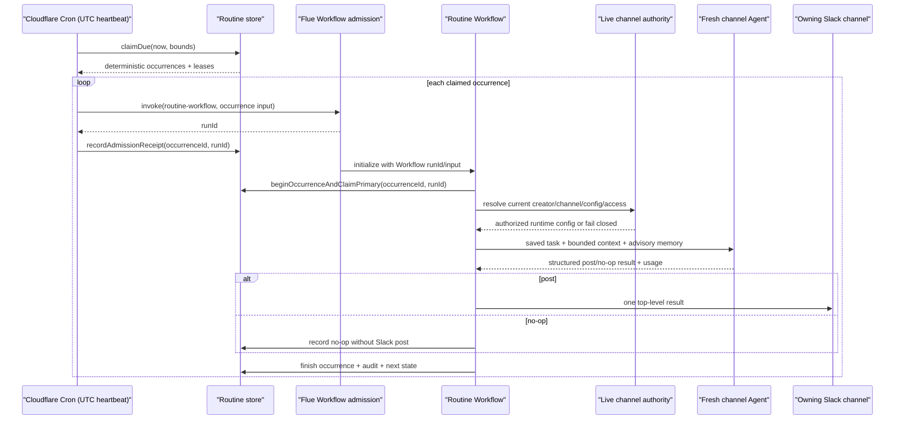
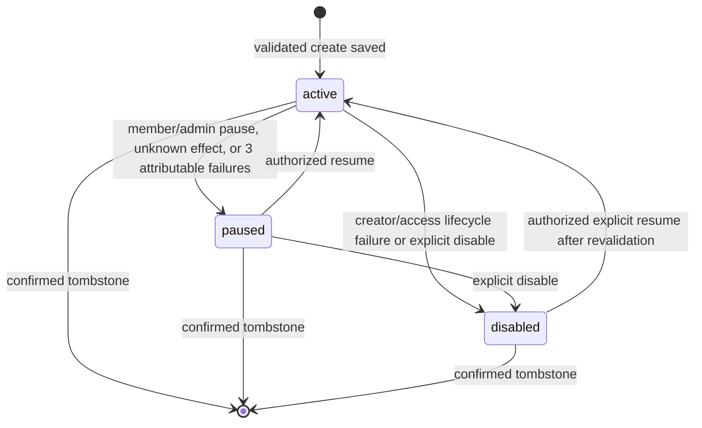
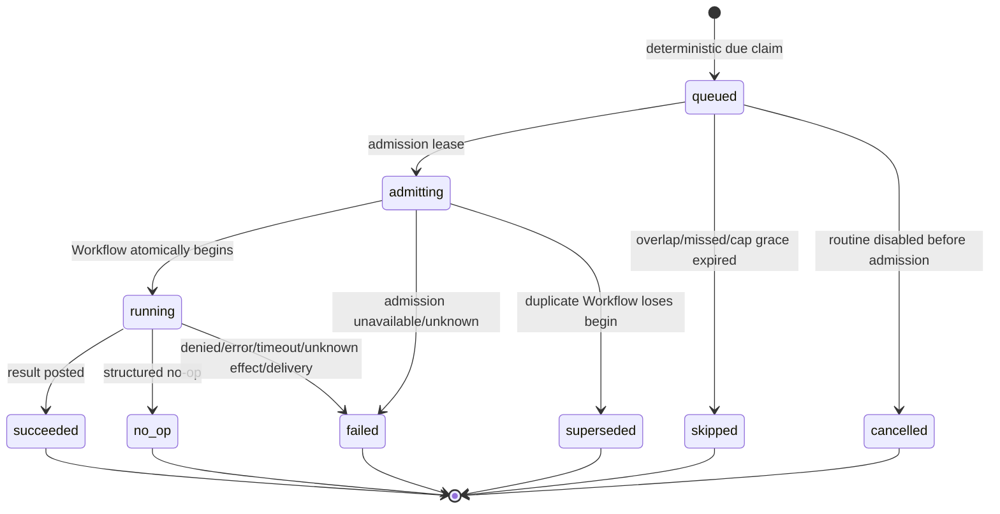
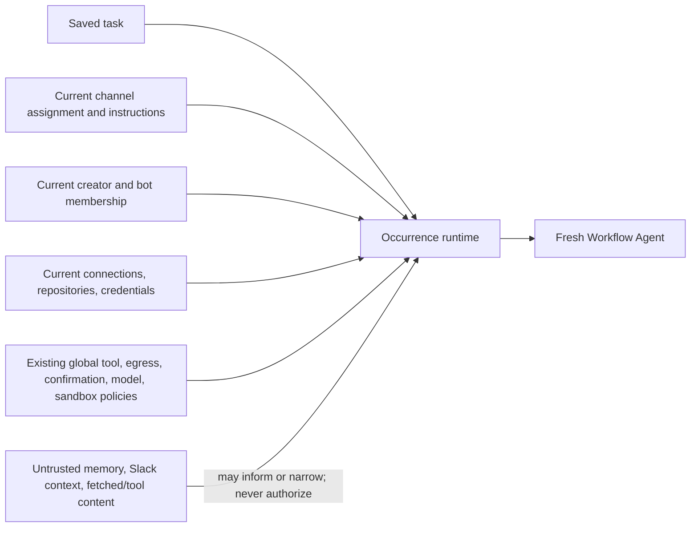

# Routines and Proactive Triggers

## Goal Capsule

Give a Chickpea channel the ability to create, inspect, edit, pause, resume, disable, and delete arbitrary recurring natural-language work. Each occurrence that passes missed/overlap/capacity admission must enter the normal Flue execution path as one winning fresh, inspectable Workflow run, use the channel's live authority at execution time, and leave an understandable channel and admin audit trail.

The first release is deliberately Cloudflare-only. It supports scheduled read and write work from launch; a daily digest is an acceptance scenario, not a product boundary. Channel watches, pull-request subscriptions, inbound event triggers, and continuing Agent sessions are future trigger/execution adapters.

This is a planning artifact. It does not authorize implementation, deployment, external mutation, or live Slack testing.

## Product Contract

### Summary

Chickpea currently acts only after a Slack event. It has no product-owned standing-work definition, dynamic scheduler, occurrence ledger, routine controls, or Scheduled Work admin experience. Flue can execute and observe a bounded Workflow run, but intentionally leaves scheduling to the deployment environment.

V1 adds persisted channel-scoped routines and a fixed Cloudflare heartbeat that claims due occurrences and calls a discovered Flue Workflow with `invoke(...)`. The saved task is a standing explicit request from the channel. At every occurrence, Chickpea revalidates the creator's channel membership and resolves the channel's current profile, model, instructions, skills, repositories, connections, credentials, and existing safety policies. A routine has no separate tool or permission allowlist.

### Problem Frame

The current Slack turn path is durable after event acknowledgement on Cloudflare, but it remains reactive:

- `src/channels/slack.ts` normalizes, claims, and enqueues a Slack turn.
- `TagStateStore.alarm()` in `src/cloudflare.ts` drains durable `turn_jobs` and runs `src/slack/run-turn.ts`.
- `src/agents/slack-thread.ts` resolves the channel snapshot, intersects current repository access, resolves credentials, creates tools, and runs the channel Agent.
- The state database has no routine definitions or per-occurrence product ledger.
- `AuditDomain` already reserves `scheduled_work`, but its admin route returns `404` and the page renders Scheduled Work as disabled.
- `wrangler.jsonc` has no Cron Trigger, and the repository calls neither Flue `invoke(...)` nor `dispatch(...)`.

Users therefore cannot ask Chickpea to repeat work without an external actor tagging it again. Operators also cannot answer basic unattended-work questions: what is scheduled, who created it, what authority it used, what ran, whether it posted, what it cost, why it stopped, or whether a failure might have followed an external write.

### Evidence Labels

- **repo-observed**: verified in committed baseline `2350dfc39a90531c9a1b10217a75a34275614d69` on 2026-07-27.
- **official-doc**: verified in a first-party product or framework document on 2026-07-27.
- **reference-observed**: documented current Claude Tag behavior, used as product-reference evidence rather than a claim about its hidden implementation.
- **inference**: a design conclusion drawn from the evidence; not asserted as undocumented Claude Tag or Flue internals.
- **session-settled**: explicitly decided with the product owner during this planning session.
- **implementation-spike**: a narrow runtime fact that must be proven before implementation proceeds beyond its dependent unit.

### Actors and Permissions

| Actor | V1 rights | Authorization source |
| --- | --- | --- |
| Current eligible channel member | Create, list, inspect, edit, clone, pause, resume, disable, run now, and request deletion of routines in that channel | Live Slack channel and user truth, using the existing eligibility rules |
| Routine creator | Authorization anchor for each occurrence; does not own exclusive control rights | Live creator status and channel membership |
| Chickpea runtime | Execute the saved task with the channel's current authority and post results to the owning channel | Current channel assignment plus current credentials/connections/repositories |
| Admin operator | List and filter all routines/runs; pause, resume, disable, or delete with confirmation | Existing `TAG_ADMIN_TOKEN` boundary |
| Non-member | No routine metadata or control access, including through a mentioned private channel | Fail-closed Slack scope resolution |

Editing does not transfer the authorization anchor, and a later editor does not become an additional lifecycle anchor; editor attribution remains in the revision/audit record. To transfer responsibility, a member clones the routine in one message, which creates a new routine anchored to themselves, then disables the old one. If the creator is deactivated or is no longer an eligible member of the owning channel, Chickpea disables the routine before any model or tool work. This is intentionally stricter and more implementable than emulating a separate undocumented Claude-organization lifecycle.

### Key Product Decisions

1. **Arbitrary scheduled read and write work is the V1 product.** `session-settled: user-directed`; rejected alternative: a read-only first product tier. A digest is the first acceptance case because it is easy to verify, while write-capable examples must also pass before launch.
2. **A routine has full live channel authority.** `session-settled: user-directed`; rejected alternative: a per-routine tool/connection/side-effect permission layer. If the saved task could be performed by a tagged request in the channel, it may be performed on schedule. Existing platform policy, confirmation requirements, credential scopes, egress rules, and resource limits remain authoritative.
3. **Authority is resolved at run time, not frozen at creation.** `session-settled: user-directed`; rejected alternative: creation-time connection and credential snapshots. Adding or removing channel capabilities changes what active routines can do. Creation and edit receipts must state this plainly.
4. **V1 is Cloudflare-only.** `session-settled: user-approved`; rejected alternative: delaying launch for a durable Node scheduler. Node rejects creation/edit/resume/run-now with deterministic unavailable messaging while retaining safety-reducing controls. The domain and scheduler boundary remain target-neutral so a durable Node adapter can be added later.
5. **Only schedules ship in V1.** `session-settled: user-approved`; rejected alternative: coupling watches and event subscriptions to the first delivery. Watches, pull-request subscriptions, webhooks, and other inbound triggers are explicit non-goals, while `trigger_kind` and adapter interfaces leave a future seam.
6. **Every executing occurrence uses a fresh Flue Workflow run.** Use `invoke(...)`, not `dispatch(...)`. Continuing Agent state is deferred because executing occurrences are bounded jobs and need an independently inspectable winning run ID and Workflow history; skipped/cancelled occurrences remain product-ledger-only.
7. **A fixed Cloudflare heartbeat claims dynamic schedules.** A `* * * * *` Cron Trigger calls a persisted due-claim service; it does not contain user schedules. Per-routine Durable Object alarms and external schedulers remain replaceable adapters, not V1 dependencies.
8. **No blind retry after execution begins.** Arbitrary write tools cannot provide generic exactly-once semantics. Admission is reconciled before reinvocation. An interrupted run with no evidence of an uncertain external effect becomes terminal `failed/workflow_interrupted`; a run with an uncertain external effect becomes `failed/unknown_external_outcome`, pauses the routine immediately, and needs human inspection.
9. **No-op is a first-class successful outcome.** The occurrence remains visible in run history but produces no Slack post.
10. **Routine management is conversational with deterministic persistence and controls.** One clear natural-language creation/edit request is schema-validated and persisted in the same turn, then Slack displays the normalized schedule, time zone, next three occurrences, task, and live-authority disclosure. Ambiguous requests remain ordinary conversation. Exact `!routines` controls remain available without model interpretation, and only irreversible deletion requires a second confirmation.

### Product Requirements

#### Routine definition and schedule

- **R1** Persist a channel-scoped routine with stable ID, creator, workspace/channel, name, description, task, trigger kind, normalized schedule, IANA time zone, output behavior, authority mode, state, version, creation/update actors and timestamps, next/last occurrence, and failure streak.
- **R2** Accept a natural-language schedule request, extract a draft with a structured model result, then validate and normalize it deterministically. The parser must never write routine state.
- **R3** Store both the user's schedule expression and canonical recurrence. Always display the explicit IANA time zone and next three instants in the creation/edit receipt.
- **R4** Support recurring five-field schedules with a minimum interval of one hour. Reject seconds-level, ambiguous, one-shot, or unsupported calendar expressions with an actionable correction; do not guess.
- **R5** If the user omits a time zone, use the Slack user's IANA time zone when available, otherwise UTC, and call out the selected value in the creation receipt.
- **R6** Use a well-maintained schedule library that can calculate IANA-zone DST transitions. Do not implement cron/calendar math in Chickpea.
- **R7** For a repeated wall-clock instant, run once. For a nonexistent wall-clock instant, schedule the first valid instant after the gap. Golden tests must pin this policy.
- **R8** Keep immutable versioned routine revisions so each occurrence links to exactly the saved task and schedule version it admitted. Confirmed deletion is the sole body-redaction transition: it preserves version/hash/actor/timestamp metadata while scrubbing Chickpea-owned human text.

#### Authority and safety

- **R9** Treat the saved task as the current explicit user request for every occurrence. Advisory memory, owning-channel Slack history, fetched content, tool output, schedule metadata, and future trigger payloads are untrusted context that can narrow but never widen that request.
- **R10** At execution time, fail closed unless the owning channel is eligible, Chickpea is present, and the creator is still an eligible member. Resolve the channel's current assignment, profile, model, instructions, skills, repository intersection, connections, credentials, and policies.
- **R11** Do not persist provider secrets, OAuth tokens, installation tokens, or a runnable connection snapshot on a routine or occurrence. Persist only stable identifiers and a hash of the resolved access description. Apply bounded UTF-8 validation and the existing high-confidence credential-pattern detection to saved task/name/description fields; reject apparent secrets with guidance to use a channel connection instead.
- **R12** Do not introduce a per-routine permission model. A channel capability added later is available to its active routines; a revoked capability is unavailable immediately.
- **R13** Apply the existing external-side-effect policy to the saved task as the explicit current request. Memory and event data cannot authorize a write. Creating a routine does not waive a separate tool/provider just-in-time confirmation rule; if no unattended confirmation protocol exists, fail that occurrence as `policy_denied` before the protected effect rather than waiting indefinitely or treating the saved routine as blanket approval.
- **R14** Apply hard unattended-work ceilings before model admission: one active occurrence per routine, four active routine runs per deployment, 25 due claims per heartbeat, 100 active routines per deployment, 20 active routines per channel, 250 total routine starts per rolling 24 hours, one-hour minimum cadence, and a 15-minute occurrence deadline. Creation/edit/resume calculate each schedule's maximum rolling-24-hour count over the next 370 days against 240 scheduled starts/day. Persist only a rolling collision preview covering at least the next three fires and all fires within 48 hours of the next fire; refresh it whenever a slot advances, and reject immediate half-open rolling-15-minute conflicts above four. Enforce the same four-start rolling limit transactionally at actual occurrence creation so a future collision beyond the preview horizon defers rather than over-admits. Pause/disable/delete release future previews; resume and schedule edits reacquire them atomically or fail without changing the prior state. The remaining 10 starts/day are the deployment-wide explicit run-now allowance. Make these deployment settings with the listed values as defaults, not user-configurable routine permissions.
- **R15** Continue applying the existing sandbox monthly session cap and egress/credential policies. A ceiling failure happens before new external work and is recorded with a safe reason.

#### Lifecycle and reliability

- **R16** Persist conversational create/edit directly into routine states `active`, `paused`, and `disabled`. Short-lived confirmation artifacts exist only for deletion, which is a confirmed tombstone operation rather than an execution state.
- **R17** Support occurrence states `queued`, `admitting`, `running`, `succeeded`, `no_op`, `failed`, `skipped`, `cancelled`, and `superseded`.
- **R18** The heartbeat atomically claims a deterministic scheduled-occurrence key derived from routine ID and scheduled instant, independent of routine version. The admitted row separately freezes the winning routine version. Repeated heartbeats and create/edit races must not create a second logical occurrence for the same routine/instant; run-now uses an explicit nonce.
- **R19** Skip, rather than queue, a due occurrence when the same routine already has an active occurrence. Record the skip. Do not run missed historical slots after downtime; aggregate them as skipped and calculate the next future slot.
- **R20** Give a due slot a 15-minute admission grace. Capacity-limited claims may be admitted by a later heartbeat within that window; after it, mark them skipped.
- **R21** Reconcile an expired `admitting` lease against recent Flue Workflow runs before calling `invoke(...)` again. Reattach a matching run when found; reinvoke only when absence is proven within the bounded reconciliation window.
- **R22** Atomically begin the app occurrence inside the Workflow before Agent/model/tool work. If a second Workflow carries the same occurrence key, it exits `superseded` without executing tools.
- **R23** Never automatically rerun an occurrence once it entered `running`. On interruption or unknown tool outcome, mark it failed with an explicit failure class and preserve the evidence for manual review.
- **R24** Pause immediately after `unknown_external_outcome` so no later scheduled write runs before inspection. Otherwise auto-pause after three consecutive routine/effect-attributable terminal failures (`credential_unavailable`, `policy_denied`, `deadline_exceeded`, `tool_failed`, `result_invalid`, or `delivery_unknown`). Deployment/infrastructure outcomes (`capacity_limited`, `spend_limited`, `admission_unknown`, `workflow_interrupted`, `slack_rate_limited`, or `internal_error`) remain visible but do not increment or reset the streak. Access revocation disables immediately; successful and `no_op` runs reset the failure streak; `skipped` does not.
- **R25** “Run now” is allowed for active or paused routines, denied for disabled/tombstoned routines, requires a current eligible member of the owning channel, consumes the 10/day deployment allowance and normal concurrency checks, creates a new explicitly requested occurrence, records that requesting actor and `run_now` source separately from the creator anchor, and never reuses the failed occurrence key.

#### Slack experience

- **R26** Recognize explicit natural-language create/edit intent in an owning-channel mention. Examples in quoted text or general discussion must not create a draft.
- **R27** After one-message create/edit, post a deterministic saved receipt containing the exact task, canonical schedule, time zone, next three fires, creator, output policy, resource summary, and: “This routine uses this channel's current Chickpea access each time it runs.” Also disclose that a tool with a separate just-in-time human confirmation requirement cannot run unattended and will fail safely.
- **R28** Provide `!routines`, `!routines <#channel>`, `!routines show <id>`, `clone <id>`, `pause <id>`, `resume`, `disable`, `run <id>`, and `delete <id>`. `!routines confirm|cancel <token>` applies only to a pending delete. `show` includes the last five occurrence times, statuses, and safe public failure reasons so members can diagnose without Admin. Every ID-addressed command first resolves and reauthorizes the routine's owning workspace/channel and returns the same non-disclosing not-found response for an absent or unauthorized ID. Mutating commands use exact IDs or an unambiguous selection; delete always requires a second confirmation.
- **R29** Only a current member of a mentioned channel can list it. Keep private cross-channel results ephemeral and never disclose routine names before scope authorization succeeds.
- **R30** Deliver a successful result as a top-level owning-channel message, not an artificial thread. Reuse the existing Slack renderer and attach routine name, scheduled time, run ID, and admin/detail pointer in compact metadata.
- **R31** A `no_op` result produces no channel message. A terminal failure or automatic pause produces one sanitized, deduplicated channel notice that points members to `!routines show <id>` for safe recent outcomes; sensitive operator detail remains in Admin Scheduled Work.
- **R32** Resolve bounded current owning-channel context for the run, independent of an inbound thread. V1 does not search arbitrary Slack channels unless an already-authorized connection/tool provides that capability.

#### Admin and audit

- **R33** Enable Audit Logs → Scheduled Work with scope/state/status filters, routine list/detail, creator, normalized schedule/time zone/next fires, current authority disclosure, revision history, run history, and pause/resume/disable/delete controls.
- **R34** Expose run detail with trigger source/requesting actor, scheduled/admitted/started/finished times, routine version, Flue run ID, resolved access hash and identifiers, model, token/cache usage, provider/model cost estimate if available, sandbox/resource use, outcome, public error, delivery pointer, and trace IDs.
- **R35** Record routine definition, revision, control, occurrence transition, authorization, execution, delivery, and operator actions in the existing audit envelope under `scheduled_work`. Never log task/prompt bodies, credentials, fetched content, or model output in generic application logs.
- **R36** Keep the current `TAG_ADMIN_TOKEN` boundary. Enterprise RBAC, hosted control plane, and centralized telemetry are not prerequisites.

#### Deployment capability

- **R37** Add one Cloudflare Cron Trigger and generated Worker `scheduled()` handler. The handler performs only bounded claim/admission work; model execution happens through Flue Workflow admission.
- **R38** On Node, routine creation, edit, resume, and run-now return `routines_unavailable_on_target` with guidance that scheduled work is currently Cloudflare-only. List/show plus safety-reducing pause/disable/delete controls remain target-neutral for development, migration inspection, and emergency shutdown; no Node path activates or expands scheduled execution.
- **R39** Define a `RoutineSchedulerAdapter` boundary so a persistent Node/external scheduler can later ask for due claims without changing routine or occurrence semantics.
- **R40** Deny public direct invocation and inspection of the generated routine Workflow, its private Agent, and its Flue run routes. Map the exact beta.8 route surface in U1, protect it with the established internal-token pattern or a narrower generated-route guard, and expose sanctioned run detail only through authenticated Admin APIs.
- **R41** Treat saved tasks, revision bodies, and Flue Agent transcripts as sensitive persisted content. Channel lists and generic audit/logs contain no body. Chickpea-owned copies are size-bounded and scrubbed on confirmed deletion; the confirmation must disclose that Slack messages, model-provider processing, backups, and Flue execution transcripts follow their own retention controls and may outlive the product definition.
- **R42** Audit transport and provider retry behavior for every write-capable tool path. Do not automatically retry a non-idempotent request after an ambiguous send unless the provider accepts a deterministic idempotency key/receipt derived from the occurrence and tool call; classify the outcome as unknown otherwise.
- **R43** Routine credentials must be channel-scoped/shared credentials that any eligible channel member could invoke in a live tagged request. Never resolve an actor-personal token merely because that actor created the routine; the creator ID is an eligibility/lifecycle anchor, not a credential delegation mechanism.

### Key Flows

#### F1. Conversational creation

1. A current channel member tags Chickpea with an explicit schedule request.
2. The application recognizes create intent and asks a structured parser for task, name, recurrence, and optional time zone.
3. Deterministic validation converts the structured interpretation to canonical recurrence and a next-three-fire receipt.
4. Live channel authorization succeeds before persistence.
5. In one transaction, Chickpea inserts routine version 1 plus audit event, reserves projected daily and 15-minute slot capacity, and calculates `next_run_at`.
6. Chickpea posts the stable routine ID, exact interpreted task/schedule/time zone, next three fires, live-authority disclosure, and deterministic controls. If the request is not clear enough to classify and validate, it remains an ordinary conversation and no routine is created.

#### F2. Due occurrence



#### F3. Admission reconciliation

1. A heartbeat finds an expired `admitting` lease without a stored Flue run ID.
2. It lists a bounded recent window of runs for only the routine Workflow and reads candidate inputs after the attempt is older than the U1-measured admission-to-visibility maximum plus a 60-second margin (never less than two minutes).
3. If a run input contains the occurrence ID/version, it atomically attaches that run ID and does not reinvoke.
4. Only an available, complete bounded search performed after that visibility threshold can prove no match; then it records a new admission attempt, takes a lease, and invokes once.
5. If timing, completeness, or service availability prevents proof, it marks the occurrence failed with `admission_unknown` and posts a safe operator-visible failure; it does not guess. Any later duplicate Workflow records `superseded` in the admission-attempt table and cannot replace the winning primary run ID.

#### F4. Edit and live authority

1. A current channel member clearly requests an edit and receives the complete saved task/schedule receipt in the same turn.
2. The edit transaction creates a new immutable revision and routine version and recalculates future occurrences. An already-running occurrence keeps its admitted revision.
3. On a later run, Chickpea loads the revision but resolves current channel authority. Newly connected tools can be used if the saved task calls for them; revoked tools fail closed.
4. If the creator lost membership, the routine transitions to `disabled` before model admission and the channel/admin receive one safe notice.

#### F5. Failure and recovery

1. Pre-execution authorization, policy, capacity, or spend failures are safe to record without external-effect ambiguity.
2. A failure after `running` records whether external outcome is known or unknown; no automatic full rerun follows.
3. The channel receives one concise failure notice with the routine/run ID; detailed sanitized evidence appears in Admin.
4. An unknown external effect pauses immediately; three consecutive routine-attributable failures pause; infrastructure failures remain visible without changing the streak. A member may inspect and resolve the problem, then edit/resume or choose `run now` as a new occurrence.

### Acceptance Examples

- **AE1 — read routine:** “Every weekday at 9:00 AM America/Los_Angeles, summarize decisions and blockers from this channel.” The one-message creation receipt shows the next three zoned instants. Each occurrence is one Workflow run and one top-level post.
- **AE2 — write routine:** “Every Friday at 3:00 PM America/Los_Angeles, update the connected project tracker with unresolved blockers and report what changed here.” The saved text authorizes the described write exactly as a live tagged request would. Current credentials and tool policy are resolved at run time.
- **AE3 — no-op:** “Every hour, check the monitor and post only if its status changed.” The Workflow returns a bounded canonical change key; Chickpea hashes and compares it to the last confirmed-delivery hash. An unchanged result is `no_op`, has usage/run history, and posts nothing.
- **AE4 — authority expands:** A channel admin connects a project tracker after routine creation. The next occurrence can use it if the saved task requests it; the run's access hash changes and audit records the new resolution without copying credentials.
- **AE5 — authority revoked:** A repository connection is removed before a due write. The run fails closed before that tool call, records `access_denied`, and does not fall back to another credential.
- **AE6 — creator removed:** The creator leaves the channel. The next preflight disables the routine without an Agent/model call and notifies the remaining channel once.
- **AE7 — overlap:** A routine is still running at its next due instant. Chickpea records the new occurrence as `skipped` and does not queue a second copy.
- **AE8 — missed schedule:** The Worker is unavailable for three hours. On recovery it records an aggregate missed count and schedules only the next future occurrence; it does not replay stale writes.
- **AE9 — admission crash:** `invoke(...)` succeeds but the process dies before storing `runId`. Reconciliation finds the Workflow input and attaches it; the occurrence is not executed twice.
- **AE10 — unknown write outcome:** A tool request times out after submission. The run becomes `failed/unknown_external_outcome`, the routine pauses immediately, no automatic retry occurs, and the channel directs a member to inspect the external system before edit/resume or run-now.
- **AE11 — DST:** A daily local-time routine crosses spring-forward and fall-back fixtures according to R7 and never produces two logical occurrences for one scheduled wall time.
- **AE12 — Node:** The same creation command on Node returns clear Cloudflare-only messaging and creates no draft or routine.
- **AE13 — private channel:** A non-member asks `!routines <#private>`. The response does not reveal whether the channel has routines.
- **AE14 — edit race:** Two members submit edits from the same version. Exactly one commits; the other receives a version-conflict response against current state.
- **AE15 — delete:** Delete requires an exact ID and second confirmation. The definition is tombstoned, future claims stop, Chickpea-owned task/revision/run snapshot bodies are scrubbed immediately, and body-free audit/run metadata remains subject to retention. Confirmation discloses the separate Slack/provider/backup/Flue-transcript retention boundary.

### Success Criteria

- A saved arbitrary read or write schedule produces at most one logical occurrence per routine/scheduled instant, with exactly one admitted routine version frozen on that occurrence.
- Every admitted occurrence has one product run record and, when Workflow admission succeeded, one winning inspectable Flue Workflow run ID; any superseded admission attempts remain linked separately.
- No routine run starts Agent/model/tool work with stale membership, stale credentials, or a frozen connection snapshot.
- No path allows memory, Slack history, retrieved content, tool output, or trigger metadata to authorize an external action absent from the saved task.
- Restart, repeated heartbeat, admission crash, overlap, downtime, DST, Slack `429`, and revoked-access tests have deterministic outcomes.
- Channel members can understand and control routines without Admin; operators can audit every definition and occurrence without raw secrets or prompt/output bodies in generic logs.
- Node truthfully rejects unsupported scheduling instead of running a non-durable in-process scheduler.

### Scope Boundaries

#### In scope

- Arbitrary recurring natural-language tasks, including reads and writes.
- Schedule trigger adapter and fixed Cloudflare heartbeat.
- Fresh Flue Workflow and Agent execution per occurrence.
- Live channel authority with no routine-specific permission layer.
- One-message conversational create/edit plus deterministic Slack commands and confirmed deletion.
- Top-level Slack result/no-op/failure behavior.
- Product routine/run state, admin Scheduled Work, audit, bounds, reconciliation, and rollout proof.

#### Explicit non-goals

- Dedicated channel-watch, monitor-change, pull-request, webhook, or other event trigger adapters; a scheduled task may still poll an authorized monitor as ordinary task content. Event payload ingestion and standing roles stored solely in memory are also deferred.
- Continuing Agent sessions or `dispatch(...)`.
- One-shot reminders, sub-hour schedules, catch-up replay, per-routine timeouts/models/tool allowlists/budgets, or an end-user web routine builder.
- Node scheduling, BullMQ/Redis, an external hosted scheduler, multi-region scheduler coordination, enterprise RBAC, or a Chickpea hosted control plane.
- Generic exactly-once external side effects. V1 provides unique logical occurrences, duplicate-execution defense, provider receipts where available, and honest unknown-outcome states.
- Exact hidden Claude Tag scheduler/storage parity.

### Dependencies

- `@flue/runtime` and `@flue/cli` `1.0.0-beta.8` (exact versions in manifest/lockfile).
- Cloudflare Workers Cron Triggers and existing generated Worker entry.
- Existing `TagStateStore` SQLite RPC/store pattern, but not its singleton alarm for routine timing.
- Current Slack live-scope resolution, channel assignment/config, credentials, repository intersection, memory boundary, tool policy, Web API client, message renderer, admin auth, and generic audit envelope.
- A selected IANA-aware recurrence library after the U1 package/behavior spike.

### Outstanding Product Questions

None block implementation. The following future decisions are deliberately deferred:

- Which trigger adapter ships after schedules: channel watch, PR subscription, or external webhook?
- Whether a later routine kind may opt into continuing Agent state.
- What durable scheduler backs Node and whether it is bundled or operator-supplied.
- Whether larger installations need per-channel monetary budgets or delegated admin roles beyond global deployment ceilings.

## Planning Contract

### Evidence Inventory

#### Current repository, checked 2026-07-27

- Baseline is detached at committed `main` commit `2350dfc39a90531c9a1b10217a75a34275614d69`; worktree was clean before this plan.
- `package.json`/lockfile pin Flue runtime and CLI `1.0.0-beta.8`; `wrangler` is `4.103.0`.
- `src/channels/slack.ts`, `src/slack/turn-jobs.ts`, `src/slack/run-turn.ts`, and `src/cloudflare.ts` establish the durable Cloudflare Slack-turn path.
- `src/agents/slack-thread.ts`, `src/config/resolver.ts`, `src/slack/credentials.ts`, `src/config/profile-mcp.ts`, `src/config/api-oauth.ts`, `src/config/github-app.ts`, and sandbox modules establish current channel execution assembly.
- `src/memory/scope.ts` and Slack truth helpers establish fail-closed membership checks; `src/memory/tool-policy.ts` establishes that only the current request can authorize external side effects.
- `src/config/state-backend.ts`, `src/config/state-rpc.ts`, `src/config/cf-state-proxies.ts`, `src/state/state-db.ts`, and `src/state/node-state-db.ts` establish target-neutral store/RPC conventions.
- `src/audit/types.ts` contains `scheduled_work`; `src/admin/routes.ts`, `src/admin/page.ts`, and `tests/admin-memory-routes.test.ts` show that domain is not implemented and its tab is disabled.
- No authored Workflow, `invoke(...)`, `dispatch(...)`, Cron Trigger, routine schema, or run/usage ledger exists.

#### Claude Tag reference, checked 2026-07-27

Documented facts from [Proactivity](https://claude.com/docs/claude-tag/users/proactivity), [Audit](https://claude.com/docs/claude-tag/admins/audit), [Commands](https://claude.com/docs/claude-tag/users/commands), [Good habits](https://claude.com/docs/claude-tag/users/good-habits), [When Claude responds](https://claude.com/docs/claude-tag/users/when-claude-responds), [Memory](https://claude.com/docs/claude-tag/users/memory), [Agent identity](https://claude.com/docs/claude-tag/concepts/agent-identity), [Security and data](https://claude.com/docs/claude-tag/concepts/security-and-data), [Access governance](https://claude.com/docs/claude-tag/admins/restrict-access), [scope attachment](https://claude.com/docs/claude-tag/admins/attach-to-scope), and [GitHub configuration](https://claude.com/docs/claude-tag/admins/configure-github):

- “Routine” covers scheduled jobs, channel watches, pull-request subscriptions, and standing roles/instructions.
- Users create routines conversationally in an owning channel; they use that channel's connections with the same permissions as typed work.
- Channel members can list/edit/disable routines; `!routines` supports current or mentioned channel scope.
- Jobs remain visible in their channel. They continue if the creator leaves the organization but stop if the creator is removed from the channel.
- Time zones should be explicit; schedules otherwise use/infer UTC.
- Admin Audit → Scheduled work lists routines with scope, creator, detail, pause/resume, and delete controls. Slack/GitHub attribution and connected-service logs remain part of the trail.
- The public docs expose channel/org spending and access governance, not a per-routine permission allowlist.

Examples were revalidated in [triage requests](https://claude.com/docs/claude-tag/use-cases/triage-requests), [track projects and chase approvals](https://claude.com/docs/claude-tag/use-cases/track-projects), [watch monitors and alerts](https://claude.com/docs/claude-tag/use-cases/watch-monitors), and [work with GitHub](https://claude.com/docs/claude-tag/use-cases/work-with-github), plus every current use-case page listed by the official docs index.

Inference boundary: public documentation does not reveal Claude Tag's scheduler, persistence, admission reconciliation, duplicate-effect controls, or hidden safety systems. This plan adopts its documented channel-authority product model, not an inferred internal architecture.

#### Flue, checked 2026-07-27

The public [Schedules guide](https://flueframework.com/docs/guide/schedules/) and the installed version-matched `flue docs read` output for schedules, Workflows, durable execution, Workflow API, and Agent API establish:

- Flue intentionally does not prescribe a scheduler.
- A bounded recurring occurrence should call a discovered Workflow with `invoke(...)`; each call receives an independent `runId`, lifecycle events, and run history, and admission is asynchronous.
- `dispatch(...)` reuses an Agent ID/session, returns a `dispatchId`, and does not create Workflow Run history.
- Cloudflare's example is a UTC Cron Trigger calling `invoke()` from `src/cloudflare.ts`.
- Node has no built-in durable scheduler. The illustrated single-process Croner option is not durable across restarts or replicas; persistent schedulers such as BullMQ are external choices.
- Workflow input and status are persisted. Public APIs can list/get runs. Workflows are finite and do not checkpoint arbitrary TypeScript; Cloudflare interruption terminalizes the Workflow and application retry is a new run.
- Structured Agent results can return model/usage information, while product-specific occurrence states remain Chickpea's responsibility.

Installed generated CLI source also shows that an authored default export's non-HTTP Worker handlers are retained alongside the generated fetch handler. The exact scheduled-to-Workflow linkage still requires U1 workerd proof.

#### Cloudflare and Slack, checked 2026-07-27

- [Cloudflare Cron Triggers](https://developers.cloudflare.com/workers/configuration/cron-triggers/) are UTC and configured statically, may take up to 15 minutes to propagate, and invoke a Worker's scheduled handler. Static user-specific crons would require deployments and are rejected.
- [Durable Object alarms](https://developers.cloudflare.com/durable-objects/api/alarms/) are programmatic but expose one alarm per object, overwrite on `setAlarm`, and have at-least-once retry behavior. Reusing the existing turn-relay alarm would couple unrelated critical loops.
- [Slack `chat.postMessage`](https://docs.slack.dev/reference/methods/chat.postMessage/) requires current channel access and is generally rate-limited around one message per second per channel. Its exact duplicate-key behavior for this client/version is not sufficiently documented for this plan and is a U1 spike.
- [Slack `conversations.members`](https://docs.slack.dev/reference/methods/conversations.members/) supports the membership revalidation Chickpea already performs through bounded helpers.

#### Audit input

The read-only refreshed audit at `/Users/pejman/.codex/worktrees/8f34/slack-flue/docs/plans/2026-07-24-claude-tag-gap-audit.html`, commit `ebf66fb5e07e14defef20aba2e8dadd0302cfc43`, framed routines as the P0 gap. Its recommendations were hypotheses, not merged architecture. Its read-only-first recommendation was superseded by the session-settled product direction; its per-routine Durable Object alarm preference was superseded by the scheduler analysis below.

### Current Architecture Seams

| Seam | Reuse | Required change |
| --- | --- | --- |
| `StateDb` and target backends | Synchronous SQL interface, store-owned tables, transactional semantics | Add routine domain tables/store and explicit RPC methods |
| `TagStateStore` | One state authority and Cloudflare RPC stub | Host routine store methods; do not reuse its alarm for scheduling |
| Slack scope truth | Bounded channel/member/user lookups and fail-closed eligibility | Add occurrence preflight anchored to creator and owning channel |
| Channel config/credentials | Current assignment/profile/model/repository/connection resolution | Extract shared `channel-runtime` assembly from `slack-thread` so Workflow and live turns use identical logic |
| Memory/tool policy | Advisory-memory boundary and explicit-current-request intent | Serialize saved task as current request and support the routine Workflow Agent name |
| Slack renderer/client | Message block/formatting behavior and Web API construction | Add top-level routine delivery with durable receipt, independent of inbound thread presenter |
| Flue generated Worker | Generated fetch and DO bindings; named Workflow discovery | Add authored Workflow and scheduled handler; prove generated-handler composition |
| Audit/admin | Generic audit envelope, auth, route/page conventions, reserved domain | Implement Scheduled Work APIs and enable its tab |
| Turn jobs | Useful durability/retry lessons | Do not put scheduled model work in `turn_jobs`; Workflow run history is the execution layer |

### Scheduler Alternatives

| Alternative | Correctness and dynamic edits | Portability/scale | Operational cost | Decision |
| --- | --- | --- | --- | --- |
| A. Fixed Cloudflare heartbeat scans persisted due routines | Dynamic without deploy; one atomic claim source; explicit missed/overlap/admission policy | Cloudflare V1; store/scheduler contract portable; bounded scan scales to launch caps | One cron plus app reconciliation | **Choose for V1** |
| B. Durable Object alarm per routine or partition | Dynamic; at-least-once and one-alarm semantics require alarm/index repair; current singleton alarm cannot be shared safely | Cloudflare-specific; a new partitioned DO class/migration is needed | More moving lifecycle pieces before proven scale need | Reject for V1; reconsider if due-scan bounds become limiting |
| C. External persistent scheduler adapter | Can provide durable timing/multi-target support | Best future Node portability, but adds Redis/service/control-plane dependency | Too heavy for small/self-hosted launch | Preserve adapter seam; defer |
| D. Fixed schedule templates/static Cron Triggers | Static crons cannot express arbitrary user edits without deployments | Cloudflare-specific and deployment-coupled | Simple only by narrowing the product | Reject; conflicts with session-settled arbitrary schedules |

The heartbeat must query an indexed `next_run_at` range, claim at most 25 rows transactionally, and return quickly. It is a scheduler/admission controller, not an execution worker.

### Key Technical Decisions

#### KTD-1: Separate product scheduling from Flue execution

- **Decision:** Chickpea owns definitions, dynamic timing, authorization, state machines, idempotency, missed/overlap policy, delivery, and product audit. Flue owns bounded Workflow admission, Agent/tool execution lifecycle, and Workflow run history.
- **Evidence:** `official-doc`, `repo-observed`.
- **Consequence:** A product occurrence ID and Flue run ID are linked but not interchangeable. The product ledger is the source for user-visible states.

#### KTD-2: Use `invoke(...)` with fresh Agent state

- **Decision:** A discovered `routine` Workflow receives `{ occurrenceId, routineId, routineVersion }`; its initializer creates a fresh private Agent for that run. Do not use a stable Agent ID or `dispatch(...)`.
- **Evidence:** `official-doc`, `inference` from the one-occurrence/one-inspectable-run product contract.
- **Consequence:** Every executing occurrence is independently inspectable and does not silently inherit prior conversation state; skipped/cancelled rows do not create empty Flue runs.

#### KTD-3: Full live channel authority, no routine permission overlay

- **Decision:** Runtime access is the intersection of current channel membership/assignment and current connection/credential/provider policy. The routine contributes explicit task intent but no separate capability layer.
- **Evidence:** `reference-observed`, `session-settled`.
- **Consequence:** Confirmation and detail views must explain that capability changes affect future runs. Access hashes make those changes auditable without freezing them.

#### KTD-4: Avoid generic automatic execution retry

- **Decision:** Reconcile admission before reinvocation and reject duplicate Workflow entry atomically. Once model/tool execution begins, interruption is terminal and never retried automatically.
- **Evidence:** Flue Workflow persistence/retry semantics plus inability to guarantee idempotency across arbitrary external tools; `inference`.
- **Consequence:** Availability is traded for honest write safety. Manual run-now is a new occurrence after inspection.

#### KTD-5: App-layer intent parsing, deterministic mutation

- **Decision:** Natural language produces schema-bound create/edit fields, then validation, authorization, optimistic versioning, schedule persistence, and controls stay deterministic in application code. Clear create/edit requests persist in that same Slack turn; only deletion creates a short-lived confirmation token.
- **Evidence:** Existing Agent route does not carry a signed current-user management context into tools; current exact commands bypass model mutation; `repo-observed`.
- **Consequence:** No routine-management tool is initially exposed to the general Agent, avoiding an unsigned confused-deputy path.

#### KTD-6: Keep the routine Workflow out of the turn queue and TagState alarm

- **Decision:** The scheduled handler claims/adopts Flue runs directly. Do not synthesize Slack events or `turn_jobs`, and do not multiplex the existing Durable Object alarm.
- **Evidence:** Existing alarm is a long-running durable relay with its own batching/retry contract; Cloudflare DO alarms are singleton and at-least-once; `repo-observed`, `official-doc`.
- **Consequence:** Shared runtime assembly, not shared queue mechanics, prevents a parallel execution stack.

#### KTD-7: One top-level Slack delivery with a product receipt

- **Decision:** Claim a delivery lease, post once, and store channel/message timestamp plus any supported client duplicate key. Do not rerun the Workflow because final delivery is uncertain.
- **Evidence:** Existing presenter is thread-oriented; Slack exact duplicate behavior remains unproven; `repo-observed`, `implementation-spike`.
- **Consequence:** U1 must select the safest supported API strategy. Uncertain delivery becomes `failed/delivery_unknown`, never a blind repost.

### Data Model

Additive SQLite tables are created by `RoutineStore` on both backends. Do not add Cloudflare migration entries unless a new Durable Object class is introduced; V1 adds none.

#### `routines`

| Field | Contract |
| --- | --- |
| `id` | Opaque stable routine ID |
| `workspace_id`, `channel_id` | Owning Slack scope; indexed with state/next run |
| `creator_user_id` | Immutable run-time authorization anchor |
| `name`, `description`, `task_text` | Saved human contract; bounded sizes |
| `trigger_kind` | `schedule` in V1; adapter discriminator |
| `schedule_input`, `schedule_json`, `timezone` | Original expression, versioned canonical schedule, explicit IANA zone |
| `output_policy` | `post` or `post_on_change`; Workflow may return no-op |
| `authority_mode` | Literal `live_channel_v1`; documents intentional semantics, not a permission set |
| `state` | Active/paused/disabled; deletion confirmations live separately in `routine_confirmations` |
| `version` | Monotonic optimistic-lock version |
| `next_run_at`, `last_scheduled_at`, `last_finished_at` | Scheduler cursors in UTC epoch milliseconds |
| `consecutive_failures` | Auto-pause input |
| `last_change_key_hash` | Hash from the last confirmed delivery for deterministic `post_on_change`; never an authorization input |
| `projected_daily_starts` | Schedule-derived reservation against the deployment start budget |
| `created_at/by`, `updated_at/by` | Stable audit attribution |
| pause/disable/delete metadata | Reason, actor, time; tombstone prevents future claims |

#### `routine_revisions`

Snapshot every create/edit: routine/version, bounded definition JSON, actor, optional deletion-confirmation receipt ID, and timestamp. Never store credentials or resolved context. Confirmed deletion scrubs task/name/description/original schedule from every Chickpea-owned revision while retaining body-free hashes, version, actors, and timestamps for audit.

#### `routine_runs`

| Field | Contract |
| --- | --- |
| `id`, `idempotency_key` | Stable occurrence ID and unique hash of routine/scheduled instant for schedule triggers, or routine/explicit nonce for run-now; version is not part of scheduled uniqueness |
| `routine_id`, `routine_version`, `scheduled_for` | Immutable admitted revision reference |
| `trigger_source`, `requested_by` | `schedule`/null actor or `run_now`/current requesting member; distinct from creator anchor |
| `status`, `failure_class`, `public_error` | Product state and safe failure detail |
| `admission_owner`, `admission_lease_until`, `flue_run_id` | Crash-safe admission linkage; nullable unique winning primary Flue run ID |
| `queued_at`, `admitted_at`, `started_at`, `finished_at` | Lifecycle times |
| `resolved_access_hash`, resolved IDs | Hash of canonical non-secret access descriptor plus profile/agent identifiers |
| `model`, usage fields, `cost_estimate`, `cost_unit` | Tokens/cache plus explicitly labeled provider/model estimate |
| resource fields | Deadline, sandbox session/reservation identifiers, bounded tool/run counters where available |
| delivery fields | Lease/status, channel, Slack timestamp, supported duplicate key, last safe error |
| change fields | Bounded returned key hash, comparison baseline hash, and suppression decision; never raw monitored content |
| skip fields | Missed/overlap/cap reason plus an aggregate missed-slot count and UTC window |
| trace fields | Workflow run ID and application trace/correlation IDs |
| `revision_json` | Bounded immutable execution snapshot while retained; task/body fields are scrubbed on confirmed routine deletion |

#### `routine_run_admissions`

Store every admission attempt separately: occurrence ID, monotonic attempt number, optional unique Flue run ID, invoke-started/receipt/visible timestamps, status (`attempting`, `attached`, `superseded`, `unknown`, `failed`), and safe error. `routine_runs.flue_run_id` points only to the Workflow that won `beginOccurrence`; a late original or duplicate loser remains auditable here and never overwrites the winner.

#### `routine_confirmations`

Store short-lived deletion tokens with at least 128 bits of cryptographic entropy; persist only their hash plus actor, channel, delete target/base version, preview hash, expiry, and one-time consumption time. Create, edit, and clone never write this table. A deletion token is invalid after actor/channel/version mismatch, expires after 15 minutes, and is purged within 24 hours after expiry/consumption.

#### Indexes and constraints

- Unique `routine_runs(idempotency_key)`, explicit uniqueness for `(routine_id, scheduled_for)` on schedule-triggered rows, nullable unique primary `flue_run_id`, and globally unique non-null admission-attempt Flue run IDs.
- Due index on `routines(state, next_run_at)` with tombstones excluded by query.
- Active-run index on `(routine_id, status)` and an application-enforced/partial uniqueness constraint for active states where SQLite support is identical on both lanes.
- Run-history index on `(routine_id, scheduled_for DESC)` and audit index conventions already used by `AuditStore`.
- Foreign keys or explicit transaction checks must keep revisions and runs inspectable after a routine is tombstoned.

### State Machines





### Authority Resolution



The access hash is computed from stable non-secret identifiers and policy versions after successful resolution. It supports comparison and audit; it must not be accepted as authorization input.

### Execution Design

#### Heartbeat and due claims

- Add `{ "crons": ["* * * * *"] }` under `triggers` in `wrangler.jsonc`.
- Export an authored `scheduled(controller, env, ctx)` handler from `src/cloudflare.ts` using the Flue-supported generated composition pattern proven by U1.
- The handler asks the singleton state store for due claims with `controller.scheduledTime`, a unique heartbeat owner, and configured bounds.
- The store advances each claimed routine to its next future instant in the same transaction that inserts the occurrence and audit event. Repeated scheduled events cannot claim the same slot.
- Due selection is oldest-scheduled-first, then routine ID for deterministic ties. When multiple slots were missed, write exactly one `skipped` aggregate row keyed to the latest missed instant with `missed_slot_count` and the first/last missed UTC window, then advance to the next future instant; never feed historical slots through the 25-row admission batch.
- Use `ctx.waitUntil` only for bounded admission/reconciliation promises. Never wait for model completion in the Cron handler.
- Use a two-minute admission lease. Reconciliation filters to the routine Workflow, scans at most 100 runs from the prior 30 minutes, and treats an incomplete/unavailable scan as `admission_unknown`, never as proof of absence.

#### Workflow bootstrap

- Add a named discovered Workflow in `src/workflows/routine.ts`.
- Map every generated HTTP route for this Workflow/private Agent/run during U1. Apply the existing constant-time internal-token guard (or a narrower generated-route guard proven by the spike) before accepting direct HTTP invocation or returning run content; the Cron's in-process `invoke(...)` and authenticated Admin server primitives do not rely on a public route.
- Input contains only stable product IDs/version. The Workflow uses its Flue run ID to load the product occurrence and calls `beginOccurrence` before Agent construction.
- Extract the reusable runtime assembly currently embedded in `src/agents/slack-thread.ts` to `src/agents/channel-runtime.ts`. Both interactive and routine Agents must call it; keep a single source for models, connections, repositories, credentials, egress, sandbox, skills, and policy interception.
- The routine Workflow creates a fresh internal Agent identity keyed only to the Workflow run. It does not reuse the Slack-thread transcript.
- Build a bounded prompt with the saved task as the trusted current request and with both current owning-channel history and selected channel memory explicitly labeled untrusted. Preserve the existing memory final-response policy and side-effect interceptor.
- Ask for a structured result `{ outcome: 'post' | 'no_op', message?, noOpReason?, changeKey? }`. Validate it; do not infer no-op from empty text. For `post_on_change`, require a canonical UTF-8 change key of at most 1,024 bytes, hash it in application code, and convert a match against `last_change_key_hash` to `no_op`. Advance the baseline only after confirmed Slack delivery; never persist the raw monitored value in the product ledger.
- Pass one 15-minute `AbortSignal.timeout(...)` through `session.prompt(...)` and every tool/sandbox call that supports cancellation. A timeout after any ambiguous non-idempotent send is `unknown_external_outcome`; do not issue a transport retry without a provider-supported deterministic idempotency key.
- Finish the occurrence transactionally with usage/model, safe outcome, delivery receipt, audit transition, routine failure streak, and next state.

#### Slack context and delivery

- Add an owning-channel history loader that paginates within a hard bound of 200 messages and seven days, stopping at the tighter limit. Do not fabricate a thread timestamp.
- Resolve and inject memory using current source/audience truth; routine context has no live requesting audience beyond the authorized owning channel, so use creator plus current channel census for the same privacy boundary.
- Factor the existing renderer/blocks into a delivery-neutral helper. Interactive turns keep `WebClientPresenter`; routines use `RoutineSlackDelivery` for a top-level `chat.postMessage` and durable receipt.
- The output metadata must not leak credentials, access hash, internal error stack, or raw trace content.

#### Sensitive-content and retention boundary

- Bound names to 80 Unicode code points/320 UTF-8 bytes, descriptions to 280 code points/1,120 bytes, and task text to 8,192 UTF-8 bytes. Reject controls and high-confidence credential patterns using the existing memory-validation approach; direct the user to configure a connection rather than save a secret.
- Routine lists, metrics, generic audit, and generic logs are body-free. Authorized channel detail and Admin detail may read the active saved task from the routine store; neither surface returns provider credentials, raw tool payloads, model output, or Flue transcript bodies.
- Confirmed deletion immediately scrubs Chickpea-owned task/name/description/original-schedule copies from the definition, revisions, confirmation artifacts, and retained run snapshots. Body-free routine tombstone, run metadata, hashes, delivery pointers, and scheduled-work audit remain for 365 days by default, matching the repository's existing audit-retention convention, then may be purged; actor IDs are cleared with that policy.
- Flue Agent conversations/run streams, Slack source/result messages, provider processing, backups, and external systems are separate data stores. U1 must document beta.8 access/deletion/retention APIs. V1 deletion copy must disclose any transcript that Chickpea cannot erase; do not claim global erasure.

#### Failure classes

Minimum stable classes: `creator_ineligible`, `channel_ineligible`, `assignment_missing`, `access_denied`, `credential_unavailable`, `policy_denied`, `capacity_limited`, `spend_limited`, `schedule_invalid`, `admission_unknown`, `workflow_interrupted`, `deadline_exceeded`, `tool_failed`, `unknown_external_outcome`, `result_invalid`, `slack_rate_limited`, `delivery_unknown`, and `internal_error`. Creator/channel/assignment/access lifecycle failures disable rather than incrementing a streak; a persisted schedule that can no longer normalize pauses for repair.

Public errors map these to safe, actionable language. Internal audit may include bounded stable codes and hashes, never prompt/tool bodies or secrets.

### Scheduler and Execution Invariants

1. The state transaction, not Cron delivery, defines whether a logical slot exists.
2. A unique occurrence key prevents duplicate logical runs across repeated heartbeats.
3. A Workflow must win `beginOccurrence` before constructing its Agent or tools.
4. `running` is the no-automatic-retry boundary.
5. Advancing `next_run_at` cannot depend on Slack delivery success.
6. Edit/pause/disable affects future queued work; a running occurrence keeps its immutable revision unless explicitly cancelled before Agent work.
7. Current authority is re-resolved immediately before Agent work, not at heartbeat claim.
8. Generic logs contain IDs/codes/counts only. Admin run detail reads sanctioned product records.

### Runtime Bounds

| Bound | Launch default | Behavior at limit |
| --- | --- | --- |
| Minimum recurrence | 1 hour | Reject before persistence |
| Active routines | 100 deployment / 20 channel | Reject create/resume |
| Due claims | 25 per heartbeat | Leave eligible rows for next heartbeat within grace |
| Concurrent routine runs | 4 deployment / 1 per routine | Defer within grace or skip overlap |
| Starts | 240/day projected schedule reservation + 10/day run-now; 250 rolling-24h hard total | Reject create/edit/resume/run-now before admission; never silently starve a reserved schedule |
| Scheduled clustering | At most 4 starts in any rolling 15-minute window; compact 48-hour/next-three preview plus hard actual-start enforcement | Reject immediate create/edit/resume conflicts; defer a later collision at occurrence creation; do not silently jitter user-confirmed times |
| Admission grace | 15 minutes | Mark skipped after grace |
| Admission lease/reconciliation | 2-minute lease; scan at most 100 routine Workflow runs from 30 minutes | Reattach only on exact occurrence input; unavailable/ambiguous scan fails unknown |
| Delivery lease | 30 seconds, bounded by occurrence deadline | Expiry never authorizes repost; record `delivery_unknown` unless absence is proven |
| Confirmation | 15-minute token; purge within 24 hours after expiry/consumption | Reject and require a fresh preview |
| Runtime | 15 minutes | Abort where possible, then terminalize without auto-retry |
| Slack history | 200 messages and 7 days | Truncate with explicit prompt marker |
| Result | Slack-safe 4,000-character rendered contract | Reject as `result_invalid`; do not split into multiple delivery side effects or issue a second model call |
| Consecutive failures | 3 | Auto-pause and notify |
| Sensitive field sizes | Name 80 code points/320 bytes; description 280/1,120 bytes; task 8,192 bytes; change key 1,024 bytes | Reject the interpreted fields/result before persistence |
| Body-free run/audit metadata | 365 days by default | Purge/clear actor IDs per retention; deletion scrubs product-owned bodies immediately |

Settings live in deployment/operator configuration and apply uniformly. They are not another user-facing authority layer. Schedule validation calculates the maximum number of occurrences in any rolling 24-hour window across the next 370 days, covering a full annual/DST cycle. Collision previews stay compact: at least the next three fires plus every hourly fire within 48 hours, refreshed as slots advance. Immediate conflicts are rejected before persistence rather than silently changing an exact time; the same rolling-15-minute ceiling is rechecked transactionally for every actual occurrence. Tokens and provider/model cost estimates are recorded after execution; the pre-admission start/concurrency limits are the reliable cross-provider ceiling until a future monetary budget is specified.

### System-Wide Impact

- **Configuration:** New routine limits/capability settings and Cloudflare trigger; no new secret is required.
- **Storage:** Additive tables/indexes in the existing app-owned state store. Pre-feature code must continue to boot against them.
- **Execution:** New discovered Workflow and shared channel runtime assembly. Interactive behavior must remain byte/semantics compatible except for intentional factoring.
- **Slack:** New intent/save/command routes and top-level delivery. Ordinary mentions pass a bounded lexical schedule-intent prefilter; only positive candidates pay for the tool-less structured parser, and all other mention/thread routing remains unchanged.
- **Admin:** Activate the reserved Scheduled Work domain, API, and page; keep Audit Logs subordinate to current navigation.
- **Security/privacy:** More unattended access increases consequence, not scope. Live scope checks, current credentials, memory distrust, bounded logging, and no fallback become launch gates.
- **Operations:** Cron/admission/run/delivery metrics and failure notices become required. Node exposes a capability tier instead of a non-durable scheduler.
- **Documentation:** README/operator docs must explain Cloudflare-only support, live channel authority, missed/overlap/no-retry semantics, ceilings, and inspection.

### Output Structure

Directional file ownership for the implementation; exact helper splits may collapse during execution, but the domain boundaries and consumers must remain:

```text
src/
  agents/channel-runtime.ts           # shared interactive/routine authority and tool assembly
  workflows/routine.ts                # discovered finite Flue Workflow
  routines/
    types.ts                           # definition/run/admission wire contracts
    store.ts                           # additive SQL and state transitions
    service.ts                         # authorized product operations
    validation.ts                      # text/secret/confirmation validation
    schedule.ts                        # canonical recurrence and previews
    scheduler.ts                       # due claims, reservations, missed/overlap policy
    scheduler-adapter.ts               # Cloudflare heartbeat boundary; future durable target seam
    admission.ts                       # invoke receipts and reconciliation
    runtime.ts                         # Workflow occurrence lifecycle
    prompt.ts                          # trusted-task/untrusted-context envelope
    intent.ts                          # lexical prefilter and tool-less structured draft parser
    commands.ts                        # deterministic Slack controls
    slack-context.ts                   # bounded owning-channel history
    delivery.ts                        # top-level post lease/receipt
    message-format.ts                  # preview/list/result/failure rendering
    telemetry.ts                       # body-free metrics and retention hooks
  admin/routines-api.ts                # authenticated Scheduled Work DTOs/actions
tests/
  routine-*.test.ts                    # focused domain/schedule/runtime/Slack/admin suites
```

### Observability and Quality Measures

Emit structured counters/histograms with routine/channel IDs hashed where logs leave the process:

- heartbeat received/duration, routines scanned/claimed/deferred, missed count, claim conflicts;
- admission attempted/attached/reconciled/unknown, time to Workflow run ID;
- authorization allowed/denied by stable class and access-hash change count;
- run queued/running/outcome/duration, overlap skip, deadline, failure streak/auto-pause;
- model/token/cache usage and clearly labeled cost estimate by configured model;
- tool/sandbox reservations only as counts/stable IDs, not arguments/results;
- Slack delivery attempted/succeeded/rate-limited/unknown and notification deduplication;
- control actions, version conflicts, expired confirmations, and target-unavailable replies.

Admin Scheduled Work is the durable debugging surface. Flue run history is the execution trace. Application logs are correlation breadcrumbs, not a second audit store.

Launch quality targets:

- zero duplicate Agent starts in repeated-heartbeat/admission-crash fixtures;
- zero stale-credential fallbacks or unauthorized model calls in revocation fixtures;
- 100% of Workflow-admitted occurrences linked to a product occurrence and vice versa after reconciliation;
- 100% of terminal outcomes visible in Admin with a safe failure class;
- no secrets, task bodies, tool payloads, or model output in captured generic logs.

### Assumptions

- The existing Slack bot credentials can read the owning channel history and post top-level messages where Chickpea is assigned; failure remains fail-closed.
- A one-minute static Cron heartbeat is acceptable for launch-scale installations and the 100-routine cap.
- Flue's installed beta API supports named Workflow discovery and server-side run inspection as documented; exact generated Worker semantics are gated by U1.
- Schedule normalization can be supplied by a Node/Workers-compatible, IANA-aware dependency with deterministic tests and acceptable bundle size; U1 chooses it.
- The current single-operator admin token is acceptable for V1 control actions.
- Provider/model cost units are not uniform enough to enforce a universal currency budget; starts/concurrency/runtime are the pre-admission controls.

### Sequencing and Rollout

1. Complete U1 spikes and record decisions. Do not build domain/runtime code if the generated Worker cannot link a scheduled event to a Workflow run and its input safely.
2. Land additive store/RPC/state machines with Node/workerd parity before enabling any Cron Trigger.
3. Refactor shared runtime assembly and prove interactive Slack regressions absent before calling it from the Workflow.
4. Implement Workflow execution with a test-only/manual handler and all external tools disabled; prove unique begin/reconciliation.
5. Add conversational controls, Slack delivery, and Admin visibility.
6. Keep the U3 Cron/admission capability flag default-off for existing installations while U7 adds operator settings, deploy verification, and the rollback drill. Node remains unavailable regardless of flag.
7. Deploy the Cron Trigger with the capability still off, observe a healthy heartbeat after Cloudflare's propagation window, then enable an internal Cloudflare installation with a small deployment cap and one digest plus one reversible write routine.
8. Require fresh Slack acceptance for create/edit/pause/resume/no-op/failure/revocation and a write against a disposable external target before broader release.
9. Default-enable only after admission-crash, unknown-write, and duplicate-delivery observability show no unresolved correctness issue and the pilot review explains one-message creates/edits, expired/abandoned deletion confirmations, successful/no-op occurrences, and auto-pauses. Treat low pilot volume qualitatively; do not invent a percentage gate from an unrepresentative sample.

Rollback disables the Cron/admission capability first, preserving definitions and run history. Active Flue runs are not force-retried. Older code must ignore additive tables; forward deployment resumes from stored `next_run_at` using no-catch-up policy.

### Requirement Traceability

| Requirements | Primary units | Required proof |
| --- | --- | --- |
| R1–R8, R16–R17 | U2, U3, U5 | Domain/revision/save parity; schedule/DST goldens; one-message Slack persistence and confirmed deletion |
| R9–R15, R40–R43 | U1, U4, U7 | Live-auth matrix; generated-route denial; secret/credential/no-retry tests; resource bounds |
| R18–R25 | U2, U3, U4 | Repeated-heartbeat and admission fault matrix; atomic begin; no retry after running |
| R26–R32 | U5 | Signed fake-Slack create/control/context/delivery/no-op/failure matrix |
| R33–R36 | U6, U7 | Authenticated API/UI states; CSRF/version controls; body-free audit and retention |
| R37–R39 | U1, U3, U7 | Generated workerd Cron→invoke proof; Cloudflare capability and Node rejection |
| AE1–AE15 | U8 | Cross-layer offline/workerd suite followed by separately authorized live acceptance |

## Implementation Units

### U1. Prove Flue/Worker linkage, Slack delivery idempotency, and schedule dependency

- **Outcome:** Resolve the three runtime facts this plan cannot prove statically and commit their narrow test fixtures/decision notes before dependent work.
- **Code paths:** Add focused spike fixtures under `scripts/fixtures/`; exercise `src/cloudflare.ts` generated composition without product features; inspect candidates in a temporary package branch before adding one schedule dependency to `package.json`/lockfile.
- **Work:** Prove an authored `scheduled()` handler survives `flue build --target cloudflare`, calls discovered `invoke(...)`, returns a run ID, and the Workflow initializer can recover its persisted input/run ID before Agent work. Confirm whether beta.8 accepts a caller idempotency key/deterministic run ID (the inspected public type does not); use it as primary defense if the spike disproves that observation. Measure invoke-receipt-to-`listRuns` visibility lag and prove bounded `listRuns/getRun` reconciliation using the measured maximum plus 60 seconds. Enumerate and deny unauthenticated generated Workflow/private-Agent/run HTTP routes; document beta.8 run/transcript retention and deletion capabilities. Prove `AbortSignal.timeout(...)` reaches model/tool operations. Test the installed Slack client/API for a documented duplicate key or receipt behavior; select deterministic client key if truly supported, otherwise specify at-most-one application lease plus `delivery_unknown`. Compare at least two Workers-compatible IANA recurrence libraries for DST, minimum-interval validation, bundle size, maintenance, bounded adversarial parse time, and absence of dynamic-code/runtime incompatibility.
- **Test scenarios:** Generated default handler composition; scheduled event local endpoint; invoke admission; initializer timing; run input match and bounded absence proof; repeated candidate run IDs; external direct invoke/list/get/stream requests with no/wrong/internal token; transcript retention/deletion behavior; deadline cancellation; Slack success/timeout-before-response/timeout-after-submit/`429`; spring/fall DST golden schedules; pathological cron and sub-hour rejection.
- **Verification:** Build and execute in actual workerd/local Wrangler, not Node mocks alone. Record selected APIs/library and any change to KTD-4/KTD-6/KTD-7. If authored scheduled-handler composition cannot be proven, stop and revise U3 to Scheduler Alternative B (a new partitioned Durable Object alarm class/migration) before any dependent unit; do not improvise a non-durable timer. No live external write is part of the spike.

### U2. Add routine domain state, revisions, deletion confirmations, audit, and RPC

- **Outcome:** Target-neutral, transactionally correct definition/run state is available before any scheduler or model call.
- **Code paths:** Add `src/routines/types.ts`, `src/routines/store.ts`, `src/routines/service.ts`, `src/routines/validation.ts`, `src/routines/ids.ts`, and `src/routines/limits.ts`; extend `src/config/state-rpc.ts`, `src/config/cf-state-proxies.ts`, `src/config/state-backend.ts`, `src/cloudflare.ts`, `src/audit/types.ts`, and `src/audit/store.ts` only where the established contracts require it.
- **Work:** Create additive tables/indexes, stable error codes, transaction methods, UTF-8/secret validation, optimistic versions, immutable revisions, direct create/edit saves, deletion-confirmation receipts, tombstones, state transitions, unique occurrence keys, multi-attempt admission records with one winning primary run, leases, change-key hashes, missed counts, start/slot reservations, failure streaks, and sanitized scheduled-work events. Keep Node sibling SQLite and Cloudflare singleton DO semantics identical. Implement product-body scrubbing separately from body-free 365-day run/audit retention.
- **Test scenarios:** Fresh/existing DB boot; byte/code-point/control/secret validation and near misses; create/edit race; token 15-minute expiry/replay/wrong actor/channel/version and 24-hour purge; pause/resume/disable/delete; projected-start reservation conflict; unique due/run-now occurrences; active-run uniqueness; claim rollback with audit failure; invalid state transitions; change-key baseline update only after delivery; aggregate missed count; tombstone/body scrubbing/365-day metadata retention; public-error bounds; raw DB scan for forbidden secrets/output; Node/DO RPC parity.
- **Test files:** Add `tests/routine-store.test.ts`, `tests/routine-service.test.ts`, and `tests/routine-state-rpc.test.ts`; extend audit/parity fixtures.
- **Verification:** `npm run typecheck`; focused tests under Node 24; actual workerd state parity; pre-feature code boots against the additive DB fixture.

### U3. Implement deterministic normalization, heartbeat claims, bounds, and admission reconciliation

- **Outcome:** Cloudflare can convert saved schedules to unique due occurrences and safely link each to at most one logical Workflow execution.
- **Code paths:** Add `src/routines/schedule.ts`, `src/routines/scheduler.ts`, `src/routines/admission.ts`, and `src/routines/scheduler-adapter.ts`; add the chosen dependency; modify `src/cloudflare.ts` and `wrangler.jsonc`.
- **Work:** Normalize schedules/time zones, calculate next instants plus the 370-day maximum rolling-day count, persist and refresh a compact 48-hour/next-three collision preview, recheck rolling-15-minute capacity at actual occurrence creation, enforce R4/R7/R14, claim indexed due rows oldest-first, aggregate missed slots, skip overlap, take a two-minute admission lease, call `invoke(...)`, attach run IDs, reconcile at most 100 recent 30-minute Workflow runs, and expose Cloudflare/Node capability responses. Add the deployment capability flag in this unit, default it off, and make `scheduled()` return before any claim while disabled. Do not call model or Slack from the claim transaction.
- **Test scenarios:** UTC and zoned schedules; next-three preview; DST gaps/folds; 370-day rate validation; bounded reservation persistence and refresh; preview and actual-start rolling-15-minute enforcement without jitter; 240 scheduled/10 run-now/250 hard caps; invalid zone/expression; repeated/out-of-order heartbeat; 15-minute propagation/downtime; 25-row batches; oldest-due ordering; global/per-channel caps; overlap; edit/pause/delete during claim; invoke failure before/after admission; reconciliation attach/proven absence/ambiguous or unavailable scan; Node unavailability.
- **Test files:** Add `tests/routine-schedule.test.ts`, `tests/routine-scheduler.test.ts`, `tests/routine-admission.test.ts`, and `tests/routine-capability.test.ts`; extend `tests/cloudflare-provider.test.ts` and `tests/node-lane-guard.test.ts`.
- **Verification:** Fake clock/property tests produce one key per slot; actual workerd Cron probes show repeated delivery cannot start two Agents; generated build contains exactly one heartbeat configuration.

### U4. Extract shared live channel runtime and build the fresh routine Workflow

- **Outcome:** A routine occurrence uses the same current channel authority/configuration/tool construction as a tagged turn, without thread transcript reuse.
- **Code paths:** Add `src/agents/channel-runtime.ts`, `src/workflows/routine.ts`, `src/routines/runtime.ts`, and `src/routines/prompt.ts`; refactor `src/agents/slack-thread.ts`; extend `src/config/resolver.ts`, `src/memory/runtime.ts`, `src/memory/tool-policy.ts`, `src/sandbox/turn-context.ts`, and provider/tool factories only as necessary.
- **Work:** Extract current channel assembly, revalidate creator/bot/channel eligibility, resolve current assignment/connections/repositories/shared credentials, reject actor-personal credential delegation, compute non-secret access hash, begin occurrence atomically, construct the fresh per-run Agent session, load bounded context/memory, apply saved task as current explicit request, validate structured result/change key, capture model/usage/resource metadata, propagate the 15-minute cancellation signal, and terminalize safely. Audit every write transport's retry behavior; no credential fallback, ambiguous non-idempotent request replay, or full run retry after `running`.
- **Test scenarios:** Interactive regression equivalence; newly added/revoked connection; repository intersection change; expired OAuth/no fallback; shared channel credential versus actor-personal credential; creator/channel/bot removal; assignment/profile/model change; malicious memory/fetched instructions and a channel-history message requesting a write outside the saved task; saved read versus write intent; tool-specific confirmation denial; idempotent versus non-idempotent transport retry after pre-send/post-send timeout; duplicate Workflow begin; interrupted run; deadline; invalid result/change key; usage/cost-unit recording; sandbox cap and receipt preservation.
- **Test files:** Add `tests/routine-runtime.test.ts`, `tests/routine-workflow.test.ts`, and `tests/routine-prompt.test.ts`; extend `tests/flue-agent-model.test.ts`, `tests/memory-tool-policy.test.ts`, `tests/api-connection-runtime.test.ts`, `tests/slack-thread-snapshot.test.ts`, and sandbox tests.
- **Verification:** Spies prove no Agent/tool construction before live auth and begin lock; interactive parity suite remains green; each occurrence has a fresh Agent identity and a linked Flue run.

### U5. Add conversational saves, exact channel controls, bounded context, and routine delivery

- **Outcome:** Channel members can safely create/control routines and understand every visible result without Admin.
- **Code paths:** Add `src/routines/intent.ts`, `src/routines/commands.ts`, `src/routines/slack-context.ts`, `src/routines/delivery.ts`, and `src/routines/message-format.ts`; integrate through `src/channels/slack.ts`, `src/slack/run-turn.ts`, `src/slack/message-format.ts`, and `src/slack/web-client-presenter.ts` factoring only.
- **Work:** Add a bounded lexical schedule/create/edit prefilter before ordinary Agent dispatch; only a positive candidate calls the tool-less structured intent parser, and a parser non-match falls through to the unchanged interactive turn. Persist validated create/edit requests directly through a deterministic state transaction, route deletion-only `!routines confirm/cancel` plus all controls, enforce live current/mentioned-channel scope, render saved receipts/lists/details/failures and deletion-retention disclosure, load bounded top-level channel history, compare hashed change keys, post structured Workflow results once, store delivery receipts, suppress no-op, and deduplicate terminal notices.
- **Test scenarios:** One-message create/edit/clone for read/write/no-op/post-on-change prompts; examples/quotes/ambiguous chatter; omitted/explicit time zone; next-three saved receipt; deletion-token expiry/replay/confirm/cancel; every command and alias; clone transfers the creator anchor immediately; mentioned public/private channel; absent versus cross-channel unauthorized ID produces the same response for show/control/run/delete; creator versus other member controls; run-now requesting actor; last-five safe outcomes; edit race; delete confirmation and body/Flue-retention copy; first/same/changed key; top-level post; Slack `429`; delivery timeout/unknown; over-4,000-character rejection; context paging/truncation; failure and auto-pause notice dedupe; Node unavailable text.
- **Test files:** Add `tests/routine-intent.test.ts`, `tests/routine-commands.test.ts`, `tests/routine-slack-context.test.ts`, and `tests/routine-delivery.test.ts`; extend `tests/slack-formatting.test.ts`, `tests/web-client-presenter.test.ts`, `tests/turn-normalization.test.ts`, and fake Slack parity scenarios.
- **Verification:** Signed fake-Slack Node/workerd fixtures prove no model-produced direct mutation, no unauthorized enumeration, no duplicate post, no synthetic thread, and exact current-authority disclosure.

### U6. Activate Scheduled Work admin APIs and UI

- **Outcome:** An operator can inspect and control every routine/run from the existing Audit Logs experience.
- **Code paths:** Add `src/admin/routines-api.ts`; extend `src/admin/routes.ts`, `src/admin/page.ts`, `src/admin/memory-api.ts` shared helpers only if generalized cleanly, and `src/audit/store.ts` query support.
- **Work:** Add authenticated paginated routine/run/detail/revision endpoints and control actions; activate `/admin/api/audit/scheduled_work/events`; enable the Scheduled Work tab with filters, state badges, next fires, live-authority disclosure, run timeline, usage/resources, safe failures, Slack delivery links, Flue run identifiers, deletion confirmations, and target capability state.
- **Test scenarios:** Auth absent/wrong/cookie/bearer; same-origin enforcement for cookie-authenticated unsafe methods; route validation; filter/pagination; private scope safe labels; routine/run/revision detail; pause/resume/disable/delete/version conflict; deletion-confirmation disclosure; access-hash-only view; no prompt/tool/output/secret leakage; generated Flue routes remain inaccessible; empty/unavailable/error states; deep link/popstate; narrow viewport/accessibility; no inert controls.
- **Test files:** Add `tests/admin-scheduled-work-routes.test.ts`; extend `tests/admin-routes.test.ts`, `tests/admin-page.test.ts`, and `scripts/verify-admin-ui.mjs`.
- **Verification:** Headless DOM and API contract tests cover all states; capture scans show no forbidden content; control actions emit exactly one audit event and respect optimistic versioning.

### U7. Complete failure controls, telemetry, retention, and deployment gating

- **Outcome:** Unattended work is bounded, observable, reversible, and honest on each deployment target.
- **Code paths:** Add `src/routines/telemetry.ts` and retention/reconciliation service methods; extend `src/config/settings-store.ts`, `src/config/types.ts`, `src/config/runtime-target.ts`, `.env.example`, `README.md`, `scripts/verify-cf-smoke.mjs`, `scripts/verify-durability.mjs`, and deployment epilogue checks.
- **Work:** Expose operator settings/defaults for the U3 capability and bounds, capacity reservations, auto-pause, safe notifications, cleanup of expired deletion confirmations and leases, 365-day body-free run/audit retention, structured metrics/log redaction, generated-route guards, Cron capability checks, rollback behavior, and Node messaging. Deployment verification must reject an enabled Cloudflare routine capability when Cron/Workflow/state binding or internal route protection is absent.
- **Test scenarios:** Every limit/reservation; immediate unknown-outcome pause and three-failure auto-pause/reset/excluded infrastructure classes; access disable; stale lease retention; product body scrub versus separate Flue transcript; 365-day run/audit cleanup without orphaning required metadata; log redaction; settings validation; generated-route guard missing; disabled capability; Cloudflare binding/Cron mismatch; heartbeat health before enable after propagation; Node refusal; backward/forward DB compatibility; rollback/no-catch-up recovery.
- **Test files:** Add `tests/routine-telemetry.test.ts` and `tests/routine-retention.test.ts`; extend `tests/settings-store.test.ts`, `tests/deploy-with-epilogue.test.ts`, `tests/parity/scenarios.ts`, and verification scripts.
- **Verification:** Offline captured logs contain only approved identifiers/codes/counts; capability matrix and rollback drill pass; no product-changing live run occurs in automated deploy epilogue.

### U8. Run cross-layer acceptance and document the capability tier

- **Outcome:** Release evidence covers scheduler, authority, arbitrary writes, failure ambiguity, Slack UX, Admin, and Cloudflare-only truth.
- **Code paths:** Extend `tests/parity/fake-slack.ts`, `tests/parity/scenarios.ts`, `tests/parity-fake-slack.test.ts`, `scripts/verify-cf-smoke.mjs`, `scripts/verify-durability.mjs`, and operator/product docs.
- **Work:** Build one deterministic end-to-end routine harness through Cron → claim → invoke → Workflow → live auth → tool/result → Slack/admin. Document user commands, schedule/time-zone/DST policy, live channel authority, writes, no-op, missed/overlap/no-retry behavior, ceilings, Node unavailability, audit, troubleshooting, and rollback.
- **Test scenarios:** AE1–AE15; repeated heartbeat; process/workerd interruption at every admission boundary; disposable read and reversible write connector; credential revocation; creator removal; Slack rate limit and ambiguous delivery; restart and rollback; admin inspection; generic-log secret scan.
- **Verification:** Full contract below passes first offline/workerd, then the separately authorized live Slack acceptance matrix. The feature remains off by default until the write-ambiguity and duplicate-start gates pass.

## Verification Contract

All repository tooling commands use Node 24:

```bash
PATH=/opt/homebrew/opt/node@24/bin:$PATH \
FLUE_NODE_BIN=/opt/homebrew/opt/node@24/bin/node \
npm run typecheck

PATH=/opt/homebrew/opt/node@24/bin:$PATH \
FLUE_NODE_BIN=/opt/homebrew/opt/node@24/bin/node \
npm test

PATH=/opt/homebrew/opt/node@24/bin:$PATH \
FLUE_NODE_BIN=/opt/homebrew/opt/node@24/bin/node \
npm run build

PATH=/opt/homebrew/opt/node@24/bin:$PATH \
FLUE_NODE_BIN=/opt/homebrew/opt/node@24/bin/node \
npm run verify:cf-smoke

PATH=/opt/homebrew/opt/node@24/bin:$PATH \
FLUE_NODE_BIN=/opt/homebrew/opt/node@24/bin/node \
npm run verify:admin-ui

PATH=/opt/homebrew/opt/node@24/bin:$PATH \
FLUE_NODE_BIN=/opt/homebrew/opt/node@24/bin/node \
npm run verify:durability

PATH=/opt/homebrew/opt/node@24/bin:$PATH \
FLUE_NODE_BIN=/opt/homebrew/opt/node@24/bin/node \
npm run verify:oss-export
```

Focused pre-merge gates:

1. **Store/RPC parity:** all routine domain tests pass against Node SQLite and actual workerd `TagStateStore` RPC.
2. **Generated artifact:** `dist-cf` contains the Workflow binding/exports, one scheduled handler, and one heartbeat cron; local `__scheduled?cron=*+*+*+*+*` probes invoke the handler without waiting for model completion.
3. **Admission fault matrix:** kill/fail before invoke, after invoke/before attach, after attach/before Workflow begin, after begin/before Agent, during idempotent and non-idempotent tool sends, after result/before delivery, and after delivery/before receipt. Assert the policy at each boundary and never blindly repeat execution.
4. **Authority matrix:** channel/member/bot/assignment/profile/connection/repository/credential changes between create, claim, and Workflow begin. Assert live resolution and no fallback.
5. **Schedule matrix:** zones, DST folds/gaps, repeated heartbeat, clock skew, downtime, edit/pause/delete races, overlap, grace, caps, and next-three previews.
6. **Slack matrix:** signed one-message create/edit/clone, list/pause/resume/disable/run, and confirmed delete; cross-channel membership; private non-enumeration; top-level delivery; no-op silence; failure dedupe; rate limit and ambiguous delivery.
7. **Security/privacy:** malicious saved/context/memory/tool payloads, credential-pattern rejection, explicit-write boundary, shared-channel versus actor-personal credentials, deletion-confirmation checks, Admin auth/CSRF, unauthenticated generated Workflow/Agent/run routes, response/log/DB secret scans, product-body deletion disclosure, and access hashes not usable as authorization.
8. **Node capability:** creation, edit, resume, and run-now fail with stable `routines_unavailable_on_target` messaging; list/show/pause/disable/delete remain available, and no in-process timer or Croner is bundled.

Live acceptance is a later, separately authorized release gate, not part of this planning task. It must use a fresh Slack channel and disposable/reversible external targets and report separately:

- one-message creation/edit, confirmed deletion, and control proof;
- one scheduled read and one scheduled write proof;
- no-op proof;
- credential revocation and creator-removal proof;
- Admin/Flue linkage and usage proof;
- absence of duplicate effect/post across a forced admission/delivery failure.

## Definition of Done

### Global Completion

- All requirements R1–R43 and acceptance examples AE1–AE15 are implemented or explicitly re-planned with product approval.
- Every occurrence is represented by a unique product record; every Workflow-admitted occurrence links one winning primary Flue run and preserves any superseded admission attempts separately.
- The Workflow reuses the same current channel runtime assembly as interactive requests.
- Full live channel authority is disclosed, auditable, and not shadowed by a second per-routine permission system.
- General write work has no blind retry path; ambiguous outcomes are visible and actionable.
- Scheduled Work Slack/Admin controls are complete; no inert or misleading UI ships.
- Cloudflare capability, rollback, observability, bounds, security/privacy, and Node-unavailable contracts pass.
- Documentation and exact version-matched evidence are current at implementation completion.

### Per-Unit Completion

Each unit must include code, focused tests, cross-lane tests where applicable, failure-path assertions, updated operator/user documentation, and no unexplained parity exception. A unit that changes a public RPC/API must include stable error contracts and backward-compatible additive storage proof.

## Risks and Mitigations

| Risk | Consequence | Mitigation/gate |
| --- | --- | --- |
| Arbitrary write succeeds but response is lost | Duplicate external effect if blindly retried | No auto-retry after `running`; unknown-outcome state; provider idempotency/receipts where available; manual inspection |
| Invoke succeeds before app stores run ID | Duplicate Workflow admission | Deterministic occurrence input, bounded Flue reconciliation, atomic Workflow begin |
| Channel capability changes silently widen a routine | Surprising new ability | Intentional full-live-authority contract; saved-receipt/detail disclosure; access-hash changes and audit |
| Creator/channel access is stale | Unauthorized unattended work | Live fail-closed preflight immediately before Agent/tool construction; no cached credential fallback |
| Heartbeat scan grows | Cron CPU/time or delayed work | Indexed due query, 25 batch, 100 active cap, measurements; later scheduler partition/DO alarm only on evidence |
| Static Cron propagation/downtime misses jobs | Stale or bursty writes | No catch-up, 15-minute grace, skipped counts, next-future calculation |
| DST/library drift | Wrong local-time executions | IANA-aware library, pinned version, golden fixtures, preview next three |
| Existing Agent refactor regresses live tags | Core product breakage | Extract-only shared runtime unit, broad current Slack/parity suite before routine enablement |
| Slack delivery ambiguity | Duplicate or absent result | U1 API proof, durable lease/receipt, no Workflow retry, `delivery_unknown` visibility |
| Usage cost units differ by provider | Misleading spend/audit | Store tokens as authoritative; label cost estimate/unit/model; enforce starts/concurrency/runtime before run |
| Model interprets schedule or management maliciously | Unauthorized persistence | Tool-less schema-bound interpretation, deterministic validation, live auth, idempotent save, and optimistic version; ambiguous intent does not persist |
| Cloudflare-only feature looks portable | Node users assume durability | Explicit capability response, docs/admin banner, no in-process scheduler; target-neutral domain seam |

## Recommended Handoff

Stop after this reviewed plan. The next session should choose one action:

1. **Run U1 spikes only (recommended):** prove generated scheduled→Workflow linkage, beta.8 reconciliation, Slack delivery semantics, and the recurrence library before implementation.
2. **Execute the full plan:** begin with U1 and honor every gate/sequence above.
3. **Revise product policy:** revisit only if full live channel authority, Cloudflare-only launch, or arbitrary write schedules change.
4. **Archive for later:** retain the plan with no repository or external changes.
