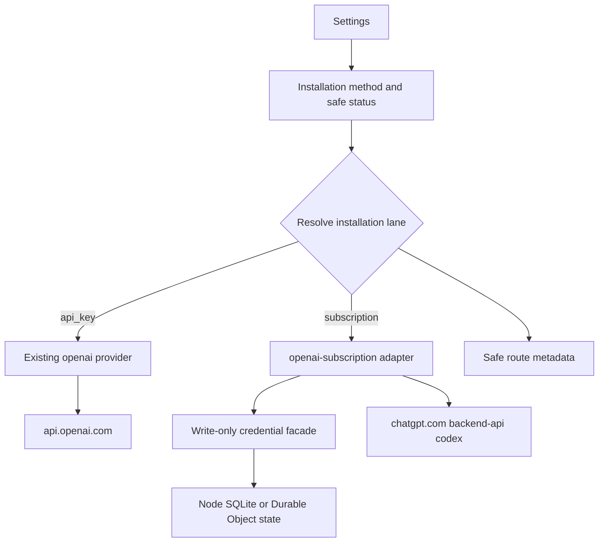
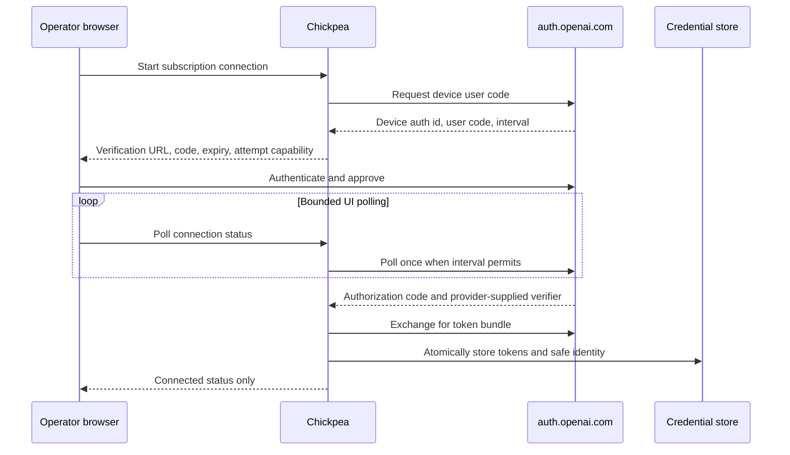
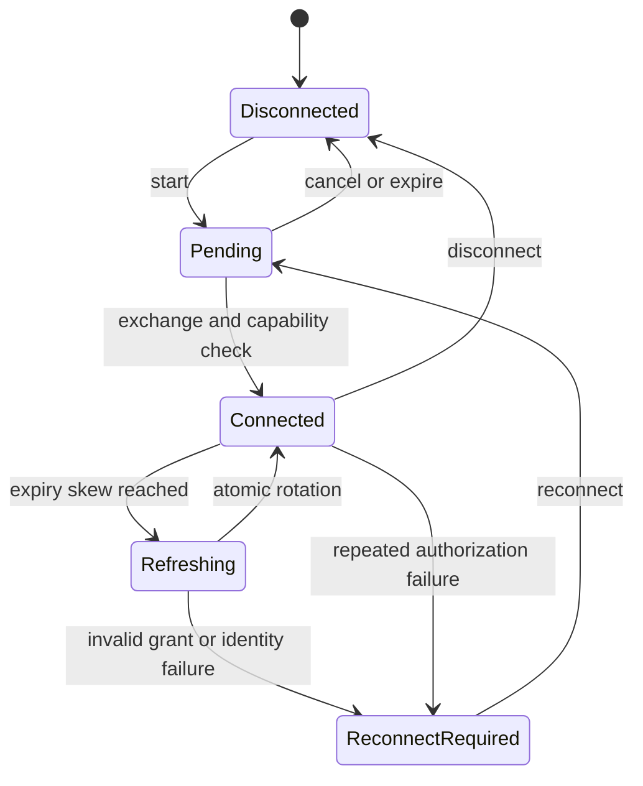
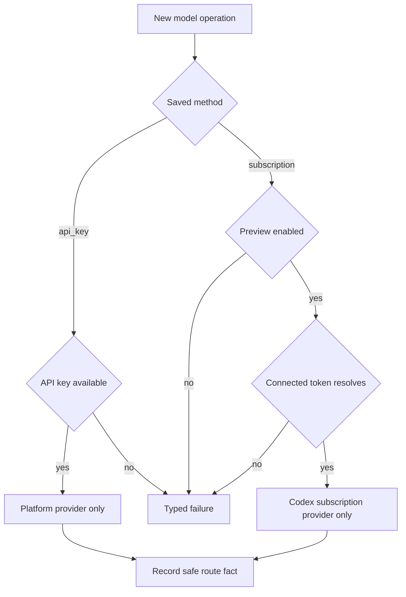
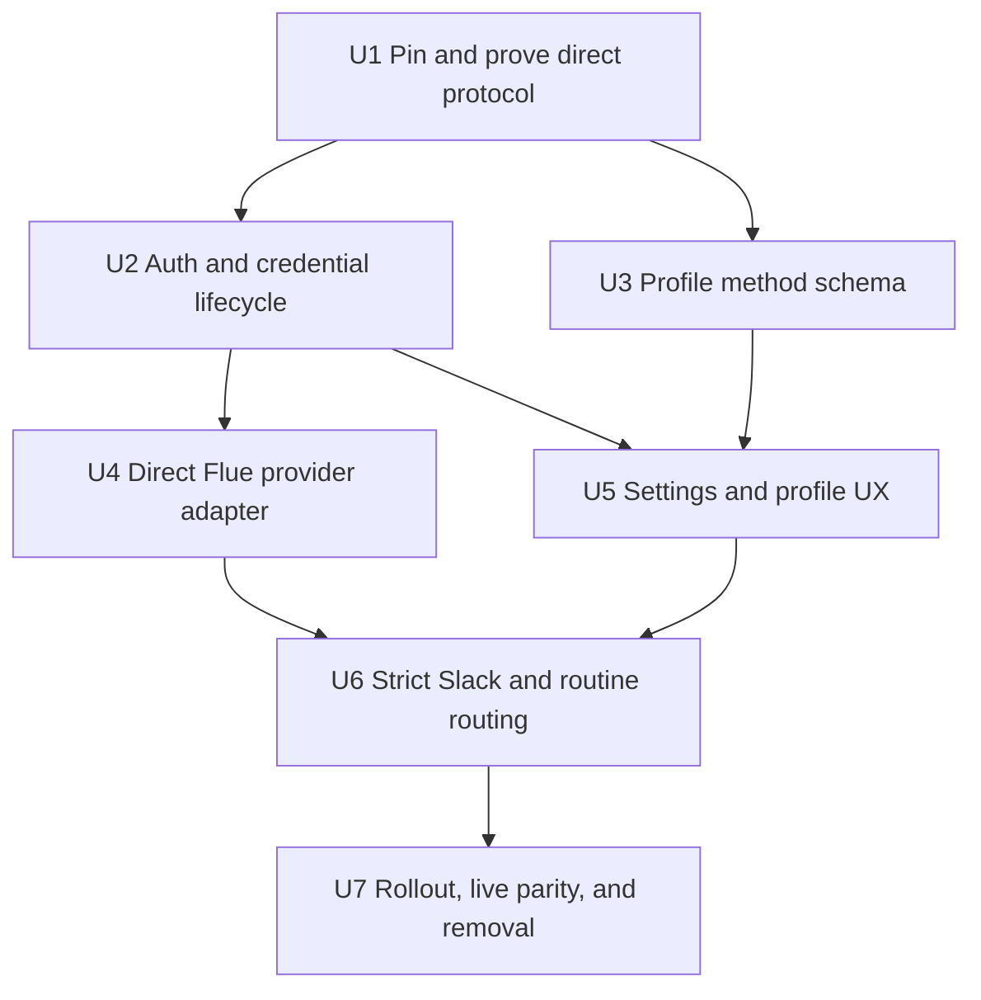
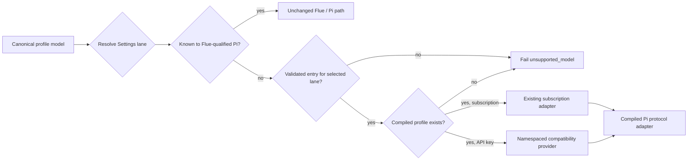

# OpenAI Subscription Authentication - Plan

## Goal Capsule

- **Objective:** Let an operator connect a ChatGPT Plus/Pro subscription or retain an OpenAI Platform API key, then choose one installation-wide OpenAI billing lane with no implicit fallback.
- **Chosen architecture:** Implement the small direct OAuth and ChatGPT Codex HTTP path demonstrated by OpenCode. Keep Flue as Chickpea's only agent runtime and support the same integration in Cloudflare Workers and Node.
- **Explicit boundary:** Chickpea does not bundle, install, launch, or call Codex app-server. Reconsidering app-server requires a separate discussion and approval.
- **Risk posture:** Public implementations demonstrate current technical viability and are evidence of present tolerance, not formal approval. The direct endpoint is undocumented, so the feature launches as a default-off experimental capability with isolated protocol code, pinned fixtures, monitoring, and a kill switch.
- **Credential boundary:** Tokens remain in Chickpea's write-only credential layer. They never enter profiles, snapshots, prompts, tools, exported plaintext configuration, logs, audit metadata, or browser responses.
- **Catalog strategy:** Preserve Flue/Pi as the native runtime/catalog path. Chickpea adds only a bounded bundled/hosted compatibility overlay mapped to compiled transport profiles, so reviewed models can arrive by Chickpea release or hosted publication without a Pi override.
- **Stop conditions:** Stop or disable the experiment if OpenAI expressly objects; rejects Chickpea's originator, use of the published Codex client id, or account posture; restricts or suspends the connected account for this use; removes the OAuth/transport capability; or the adapter cannot preserve strict no-fallback and credential boundaries. Undocumented status alone is not a stop condition.
- **Tail ownership:** Implementation owns direct auth, token rotation, transport isolation, Settings UX, the thin model-compatibility overlay, Cloudflare and Node parity, tests, attribution, rollout, removal, and documentation.

---

## Product Contract

### Summary and research verdict

Chickpea can implement subscription-backed OpenAI requests without Codex app-server. OpenCode publicly implements browser and device authorization against `auth.openai.com`, refreshes the resulting ChatGPT tokens, extracts the account identifier, and routes Responses requests to `https://chatgpt.com/backend-api/codex/responses`. It identifies itself with `originator=opencode`, so the traffic is not disguised as OpenAI's CLI. That is evidence consistent with present technical tolerance of a named third-party client; it does not prove that OpenAI will accept Chickpea's originator or account posture.

No public OpenAI source found in this research expressly forbids this exact integration. No public source promises that the OAuth client, token claims, private endpoint, request schema, or model availability will remain stable either. The product decision is to accept that maintenance and removal risk for a reversible experimental feature rather than introduce a second agent runtime or a Node-only service.

The thin path fits Chickpea better than app-server. It uses ordinary `fetch`, Web Crypto, and the existing target-neutral SettingsStore and Flue provider APIs, so Cloudflare Workers and Node can share one logical implementation. Flue remains responsible for tools, memory, routines, streaming, cancellation, and delivery.

The product benefit is straightforward: operators can use an existing ChatGPT entitlement for all OpenAI-backed work without provisioning a separate Platform key or incurring silent API spend. Without this feature, Chickpea remains functional but requires separate Platform credentials, billing, and account administration for OpenAI models.

| Finding | Verdict | Confidence | Product consequence |
| --- | --- | --- | --- |
| A direct ChatGPT subscription route works in a third-party application | Demonstrated | High | OpenCode is the primary implementation precedent and fixture source. |
| A named third-party originator is publicly shipped | Demonstrated for `originator=opencode`; Chickpea acceptance unproven | Medium-high | Send `originator: chickpea` and make acceptance the first live gate; never impersonate OpenCode or Codex CLI. |
| The direct OAuth and Codex HTTP surfaces are public supported APIs | No | High | Isolate every unstable constant and response shape behind one adapter. |
| The exact pattern is expressly prohibited | No compelling evidence found | Medium-high | Proceed experimentally; disable on an explicit objection or technical rejection. |
| The direct path can run in Cloudflare Workers | Feasible | High | Authorization polling, token exchange, refresh, and inference are HTTP/Web Crypto operations. |
| One connection can remain separate from an API key | Feasible | High | Use distinct provider IDs and one explicit installation-wide method. |
| App-server adds essential Chickpea capability | No for this slice | High | It duplicates much of Flue and cannot run inside a Worker. Keep it out of scope. |
| One subscription account serving a wider Slack workspace is formally guaranteed | No | High | Launch behind an operator-controlled preview flag and disclose the experimental account-use posture. |

### Actors

- A1. **Chickpea operator:** Connects or disconnects either credential, chooses the installation-wide OpenAI method when both are connected, and controls preview access.
- A2. **Slack user:** Invokes an OpenAI-backed profile and expects the installation's selected billing method to be honored.
- A3. **Chickpea runtime:** Resolves credentials at the execution boundary, refreshes tokens, and routes through one explicit provider lane.
- A4. **OpenAI authorization and Codex services:** Authorize the account, rotate tokens, enforce entitlement and quota, and execute subscription requests.

### Requirements

**Authentication methods and installation selection**

- R1. Settings > Model providers presents two OpenAI methods: **Subscription (ChatGPT Plus/Pro)** and **API key**, with independent state and actions.
- R2. Both methods may remain configured, but Settings stores one non-secret installation method: `subscription` or `api_key`. Profiles store only canonical models and never select billing lanes.
- R3. Existing installations default to `api_key` before a credential is connected. With exactly one connected credential, Chickpea selects it automatically. When a second credential is connected for the first time, that newly connected method becomes active and the method selector appears; disconnecting either credential automatically selects the one that remains.
- R4. Model availability follows the selected installation method. Chickpea resolves a route-specific compatibility catalog from a bundled snapshot plus an optional validated hosted snapshot. A pre-existing incompatible OpenAI model fails closed rather than falling back, while new profile saves reject models unsupported by the selected lane.
- R5. A saved method change affects the next OpenAI model operation, including turns, routines, and auxiliary calls. Settings identifies the selected method directly; no extra acknowledgment or profile-level confirmation is required.

**Strict billing-lane behavior**

- R6. A subscription-selected operation uses only the subscription provider and ChatGPT Codex endpoint; it never calls `api.openai.com`, resolves `OPENAI_API_KEY`, selects another account, or changes model to recover.
- R7. An API-key-selected operation keeps the existing OpenAI Platform behavior, including environment-over-stored-key precedence, and never consumes subscription tokens.
- R8. Main turns, compaction, summarization, structured output, retries, and routines inherit the selected lane; an unsupported auxiliary operation fails closed.
- R9. Every model operation records a safe route fact of `openai_subscription` or `openai_api_key` without credential or raw account data.

**Authorization and lifecycle**

- R10. The first slice uses OpenAI's device authorization flow because it works from remote admin browsers and in both Cloudflare and Node without a localhost callback listener.
- R11. Start authorization stores at most one bounded pending record per installation, rate-limits replacement attempts, and returns the provider verification URL, user code, expiry, next-poll time, and a separate high-entropy attempt capability. Chickpea stores only a hash of the attempt capability and requires it, plus normal admin authentication, for poll and cancel.
- R12. Browser polling calls Chickpea; each poll performs at most one provider status request after the allowed interval. A Worker request never holds a long polling loop open.
- R13. Successful authorization atomically stores access, refresh, ID-token data needed for identity projection, expiry, and account id in a dedicated write-only credential record.
- R14. Refresh uses an existing-style compare-and-swap lease so concurrent Worker or Node turns share one rotation. A rotated refresh token replaces the old value atomically; an omitted replacement retains the prior token.
- R15. `invalid_grant`, missing account identity, or repeated authentication failures clear usable access, preserve safe status, and require reconnect without API-key fallback. Entitlement, client, originator, quota, and protocol failures retain distinct safe categories and do not masquerade as expired authentication.
- R16. U1 checks whether the pinned auth surface exposes a supported revocation endpoint. If it does, disconnect attempts best-effort provider revocation before deleting pending and token records plus cached capability; either way the UI links to OpenAI account controls and never claims local deletion revoked every server-side session.
- R17. Reconnect to a different stable account identity requires explicit account-change confirmation before the new identity becomes active installation-wide.

**Direct transport**

- R18. Chickpea uses the public Codex native-client identifier observed in official Codex and OpenCode source and scopes `openid profile email offline_access`; no client secret is stored or implied. The first-slice device flow follows the pinned protocol in which polling returns a provider-supplied authorization code and code verifier for the server-side token exchange; browser-loopback PKCE remains deferred.
- R19. Every subscription request sends the active bearer token, `ChatGPT-Account-Id`, `originator: chickpea`, and a random non-user-derived session identifier to the isolated Codex Responses endpoint.
- R20. The subscription adapter uses a separate internal Flue provider identity from the existing `openai` API-key provider, while profiles and UI retain the canonical `openai/<model>` namespace. It refuses provider construction unless a non-empty live subscription token and account id have resolved.
- R21. The subscription catalog begins with the seven-model bundled allowlist proven by the live compatibility harness and may admit a hosted entry only when it names the compiled subscription transport profile and has passed the same live model gate. Chickpea does not call or cache the private account model-list endpoint; discovery never creates runtime compatibility.
- R22. Provider responses are streamed through the existing Flue runtime. Raw provider errors and token responses are converted to bounded safe categories before leaving the adapter.
- R23. The direct protocol module contains all client ids, fixed HTTPS endpoints, scopes, headers, claim extraction, request adjustments, response-size/time limits, redirect policy, and response compatibility logic. No other module calls a private ChatGPT endpoint or accepts an operator-configurable auth/inference URL.

**Credential, audit, and platform boundaries**

- R24. Access tokens, refresh tokens, ID tokens, raw account ids, device authorization ids, user codes, authorization codes, token-exchange code verifiers, attempt capabilities, and full authorization URLs never enter profiles, snapshots, prompts, tools, exports, logs, audits, telemetry, or returned status DTOs after their one-time UI purpose. Provider registration fields and outgoing auth/account headers are explicitly excluded from Flue and Chickpea instrumentation.
- R25. Credential storage follows Chickpea's existing stored API-key and OAuth trust boundary: Node SQLite with restrictive file ownership and Cloudflare Durable Object storage. Installation configuration contains only the safe selected method, state, account hash, and timestamps.
- R26. The raw opaque account id required by the transport is stored only inside the write-only credential bundle. A high-entropy HMAC key is generated once, persisted through the same credential facade, and never exported or logged; product state, account-change checks, audits, and UI use its derived fingerprint. Losing or deliberately rotating that key invalidates saved fingerprints and forces explicit reconnect confirmation. The first slice does not persist or display email or plan claims.
- R27. Cloudflare and Node expose the same saved configuration, auth states, error classes, and route semantics. Neither target depends on a local binary or remote app-server service.
- R28. Subscription usage is labeled as quota/activity, never Platform API cost. Unknown monetary cost remains unset. Provider quota/rate-limit responses preserve credentials, honor safe retry timing, and surface `subscription_quota_exhausted` without method, model, or account fallback.
- R29. A default-off capability flag and one isolated adapter provide immediate rollback. Disabling the flag blocks subscription admissions without changing the saved installation method or deleting recoverable credentials.
- R30. Settings keeps the normal connection surface concise. Documentation records that the direct method uses OpenAI's published Codex native-client identifier, sends all OpenAI traffic through one connected ChatGPT account, follows consumer ChatGPT data controls, and consumes shared subscription quota. The UI displays only connection state and the safe account fingerprint.
- R31. The adapter emits safe, operator-visible health state for categorized auth expiry, entitlement denial, client/originator rejection, quota exhaustion, response-schema drift, and repeated provider failure. Recurring non-auth failures make the stop conditions actionable without exposing raw responses or credentials.

**Model-catalog evolution**

- R32. Profiles persist only canonical model specifiers such as `openai/<id>` and `anthropic/<id>`. Hosted catalog data may describe lane compatibility but never chooses the installation's OpenAI billing method.
- R33. Runtime compatibility is native-first. A model known to the Flue-qualified Pi catalog uses the unchanged Flue/Pi path; a Pi-unknown model is runnable only when Chickpea has a validated entry for the already selected lane and a compiled transport profile for it. Otherwise built-in OpenAI and Anthropic routes fail with `unsupported_model` rather than using Flue's zero-metadata fallback.
- R34. The hosted payload is a complete, bounded snapshot from one compiled HTTPS origin. It may contain only canonical model ids, optional display names, per-lane compiled profile ids, and optional context/output limits that can only reduce the profile's compiled ceilings. It cannot represent endpoints, headers, credentials, OAuth settings, billing selection, packages, request fragments, compatibility maps, modalities, reasoning behavior, pricing, retry/retention policy, or executable code.
- R35. Every behavioral capability remains compiled and release-controlled. A model fitting a live-proven existing profile may be published without a Chickpea release; a new provider, endpoint, protocol, header/beta requirement, auth form, content block, capability profile, or adapter behavior requires a Chickpea release.
- R36. Node and Cloudflare share one target-neutral last-known-good catalog record, conditional-fetch metadata, and refresh lease through `SettingsStore`. Runtime admission never fetches the network and captures one immutable catalog revision and resolved profile for the complete operation.
- R37. Hosted refresh uses a fixed origin, HTTPS, redirect refusal, a five-second deadline, a 128 KiB response cap, ETag/Last-Modified, strict unknown-field rejection, monotonic revisions, compare-and-swap activation, six-hour jittered freshness, manual refresh, and bundled fallback. Failure retains the current last-known-good snapshot.
- R38. Version 1 intentionally follows OpenClaw's unsigned HTTPS trust posture because the schema cannot redirect prompts or credentials, alter auth/billing, or introduce code. A public served-bytes-versus-source integrity monitor detects publishing/origin drift. A separately controlled signing key becomes required if remote authority expands, third-party publishers appear, or fleet scale makes the detection window unacceptable.
- R39. Models.dev, OpenClaw manifests, provider announcements, and authenticated provider inventories are candidate or availability evidence only. A human-reviewed, live-tested Chickpea catalog change is the authorization to publish.
- R40. Rollback is fail-closed: publish corrected contents at a higher revision, switch an installation to bundled-only mode, disable a compiled compatibility contract, or roll back the application. No rollback path substitutes a model, provider, account, or billing lane.

### Key product decisions

- PD1. **Keep both methods configured and show selection only when it is useful.** One connected credential is used automatically. When both are connected, Settings shows one compact installation-wide selector, with the most recently added connection initially active. This keeps switching reversible without adding a redundant control to one-credential states. Governs R1-R7.
- PD2. **Never fall back across billing methods.** A failed subscription operation remains failed rather than silently creating API spend. Governs R5-R9.
- PD3. **Ship a direct experimental integration.** Public third-party operation is sufficient evidence to try the feature; formal public support is not a prerequisite for the preview. Governs R18-R23, R29-R31.
- PD4. **Preserve Cloudflare as a first-class runtime.** Subscription auth and inference must work in Workers and Node through ordinary HTTP and shared state interfaces. Governs R10-R14, R20-R31.
- PD5. **Keep Flue as the only agent runtime.** Subscription auth changes model transport, not Chickpea's tools, memory, routines, approvals, or delivery architecture. Governs R6-R9, R20-R23.
- PD6. **Use one installation-level subscription connection and one installation-level method in the first slice.** Multiple accounts and per-user/profile/channel assignment are deferred; any workspace member already authorized to invoke an OpenAI-backed profile may consume the selected shared connection and quota. Governs R2-R5, R17, R20-R21, R30.
- PD7. **Own only the thin compatibility overlay.** Flue remains the agent runtime and its qualified Pi dependency remains the native catalog/transport path. Chickpea owns a bounded hosted snapshot and namespaced compatibility adapters only for reviewed models missing from that native catalog. Governs R4, R21, R32-R40.

### Key flows

- F1. **Connect subscription**
  - **Trigger:** A1 selects Connect.
  - **Steps:** Chickpea starts device authorization, displays the provider URL and one-time code, polls through bounded admin requests, exchanges the returned authorization code, stores the credential bundle, validates account identity, then records connected status.
  - **Outcome:** Subscription is available as an installation credential. A first or newly added second credential becomes active; reconnecting an existing credential preserves the current installation method.
  - **Covers:** R10-R15, R18, R21, R24-R26.
- F2. **Run a subscription-backed turn**
  - **Trigger:** A2 invokes an OpenAI-backed profile while the installation method is `subscription`.
  - **Steps:** Chickpea resolves the live installation method, obtains or refreshes the subscription token, maps the model to the internal subscription provider, sends the request to the Codex endpoint, streams it through Flue, and records a safe route fact.
  - **Outcome:** The operation uses subscription quota or fails without Platform traffic.
  - **Covers:** R5-R9, R14-R15, R19-R23, R27-R31.
- F3. **Disconnect or reconnect**
  - **Trigger:** A1 disconnects, or an auth failure requires reconnection.
  - **Steps:** Chickpea clears local credentials and capability cache. An authentication failure preserves the selected method as blocked, while deliberate disconnect selects a remaining API key if one exists. A changed account requires explicit confirmation.
  - **Outcome:** No stale token remains usable and no OpenAI call silently crosses billing lanes.
  - **Covers:** R15-R17, R24-R26, R29.
- F4. **Disable the experiment**
  - **Trigger:** Operator choice, provider objection, or protocol incompatibility.
  - **Steps:** Disable the capability flag, reject new subscription operations, preserve safe status and the installation method, and leave the API-key credential untouched.
  - **Outcome:** The feature is removed from execution without emergency migration or accidental billing.
  - **Covers:** R3, R6-R9, R23, R29.

### Acceptance examples

- AE1. **Subscription wins by explicit choice**
  - **Given:** A valid API key and connected subscription both exist.
  - **When:** An OpenAI-backed profile runs a Slack turn and compaction while Subscription is selected in Settings.
  - **Then:** Only the Codex endpoint receives requests and the route fact is `openai_subscription`.
  - **Covers:** R2, R5-R9, R20.
- AE2. **Cloudflare parity**
  - **Given:** Chickpea runs in a Worker with subscription preview enabled.
  - **When:** The operator connects through device authorization and runs a profile.
  - **Then:** Authorization, refresh, streaming, and inference complete without a local process or remote app-server.
  - **Covers:** R10-R14, R19-R23, R27.
- AE3. **Refresh fails closed**
  - **Given:** A valid API key exists and the subscription refresh token is revoked.
  - **When:** A subscription operation starts.
  - **Then:** It becomes reconnect-required and makes no Platform API request.
  - **Covers:** R6-R9, R14-R15.
- AE4. **Kill switch is reversible**
  - **Given:** Subscription profiles and credentials exist.
  - **When:** The capability flag is disabled and later re-enabled.
  - **Then:** Subscription operations are blocked while disabled, the selected method remains visible in Settings, and no fallback to API key occurs.
  - **Covers:** R3, R7-R9, R29.
- AE5. **Quota exhaustion is not an auth failure**
  - **Given:** A valid API key exists and the connected subscription returns a quota/rate-limit response.
  - **When:** A subscription-selected operation runs.
  - **Then:** The operation reports subscription quota exhaustion, preserves the connection, honors safe retry timing, and makes no Platform request.
  - **Covers:** R6-R9, R15, R28, R31.

### Success criteria

- A dedicated or explicitly authorized Plus/Pro test account accepts a request identified with `originator: chickpea`, then completes device authorization and a representative turn on both Node and a deployed Worker acceptance target before dependent transport work proceeds.
- Concurrent subscription turns spanning token refresh complete with one rotation and no false reconnect-required state on Node and the deployed Worker target.
- With a valid Platform key present, subscription success and forced failure produce zero `api.openai.com` requests.
- Auth expiry, entitlement/client/originator rejection, quota exhaustion, and protocol drift produce distinct safe operator-visible states.
- Existing OpenAI API-key tests and live provider behavior remain unchanged.
- Token-shaped fixtures appear only in the dedicated credential store and outgoing authorization boundary.
- Disabling one flag prevents all new direct subscription traffic without deleting profiles or rewriting the saved OpenAI method.
- No Codex app-server package, binary, process, service, configuration directory, or deployment dependency is introduced.

### Scope boundaries

**Included**

- One subscription connection per installation.
- Device authorization, token exchange, refresh rotation, reconnect, local disconnect, identity projection, and safe error states.
- A bundled seven-model subscription compatibility snapshot plus a thin, route-specific hosted overlay for reviewed model updates.
- Native-first model resolution and namespaced compatibility providers for live-proven OpenAI and Anthropic models that the Flue-qualified Pi catalog does not yet know.
- Installation-wide Subscription versus API key selection in Settings.
- Node and Cloudflare execution through the same logical direct adapter.
- Slack turns, routines, compaction, streaming, cancellation, usage labels, audits, and removal controls.

**Deferred to follow-up work**

- Multiple subscription accounts, per-user/profile/channel account assignment, mixed per-profile billing methods, and subscription-specific user/channel quota allowlists.
- Browser loopback callback authorization.
- WebSocket transport optimization.
- Business/Enterprise access-token administration.
- New model providers or compatibility profiles not compiled into the current Chickpea release.
- Catalog signing until an independent signing authority or wider remote authority makes it a distinct security boundary.

**Excluded**

- Bundling or invoking Codex app-server locally.
- Operating a remote app-server bridge.
- Generic Sign in with ChatGPT identity as inference authorization.
- Cross-method or cross-account fallback.
- Pretending the private Codex endpoint is a supported Platform API.
- A general remote provider registry, runtime package installation, or remotely configurable provider endpoints/auth/request behavior.
- A Pi fork, transitive Pi override, or independent Pi upgrade cadence used as Chickpea's model-freshness mechanism.

### Approval decisions

Pejman approved the implementation direction on 2026-07-29: direct integration, no app-server, Cloudflare first-class, and willingness to remove the feature if the experiment stops working. The recorded launch and catalog decisions are:

1. Approve the first slice's one subscription account per installation, available to any existing workspace member who can invoke an OpenAI-backed profile while Subscription is selected in Settings; finer subscription-only user/channel gates are deferred.
2. Approve device authorization as the only initial connect flow.
3. Final implementation direction: retain Flue's dependency strategy and add the smallest Chickpea-owned hosted compatibility overlay modeled on OpenClaw. A bundled snapshot guarantees release-based updates; reviewed hosted snapshots can activate models that fit compiled transport profiles without waiting for another Chickpea release.
4. Keep the Settings surface concise and put the experimental, shared-account, possible-enforcement, and consumer-data-policy detail in documentation rather than an acknowledgment checkbox.
5. Approve the default-off preview flag and the stop conditions in the Goal Capsule.
6. Approve the v1 hosted-catalog trust posture: unsigned fixed-origin HTTPS, strict bounded schema, public immutable source/publisher history, served-bytes integrity monitoring, monotonic last-known-good state, and an explicit later signing trigger.
7. Approve optional shrink-only `contextWindow` and `maxTokens` values in hosted entries; all capabilities and maximum ceilings remain compiled in profile ids.
8. Approve the staged catalog delivery: first the bundled compatibility/profile seam, then hosted refresh and publishing before calling automatic model updates complete.

---

## Planning Contract

**Product Contract preservation:** changed R10-R31 and PD3-PD6 to implement the user-settled direct, Cloudflare-compatible architecture; app-server requirements and gates were removed rather than layered beneath the new decision.

### Current-state map

| Area | Current Chickpea behavior | Planned change |
| --- | --- | --- |
| Provider catalog | `src/config/providers.ts` treats OpenAI as one API-key-backed provider. | Report two methods without presenting subscription as a second user-facing provider. |
| Model compatibility | Flue/Pi supplies built-in model metadata; an unknown registered model falls back to reasoning-off, text-only, zero/unknown metadata. Provider inventories can list models that runtime metadata cannot safely support. | Preserve native Pi resolution, then use a Chickpea compatibility entry and namespaced adapter only for a live-proven Pi-unknown model; reject unsupported built-in models. |
| API-key boundary | `src/config/provider-keys.ts` resolves environment before stored keys and re-registers Flue's `openai` provider. | Preserve unchanged; add an isolated `openai-subscription` internal provider. |
| Flue provider API | `@flue/runtime@1.0.0-beta.8` accepts custom provider ids, `openai-responses`, base URL, API key, and headers. | Register the direct Codex route with its own provider id, token, account header, and originator. |
| Installation settings | `src/config/settings-store.ts` persists target-neutral operator settings. | Add one non-secret OpenAI method setting that defaults to `api_key`. |
| Effective config | `src/config/effective-config.ts` derives provider from the model prefix. | Resolve a secret-free billing route and internal runtime model specifier. |
| Runtime assembly | `src/agents/slack-thread.ts` applies provider keys globally before creating Flue config. | Resolve and register the selected lane before each new model operation; different provider ids prevent cross-lane replacement. |
| Routines | `src/workflows/routine.ts` constructs the same Flue agent shape and records cost units. | Reuse the same route resolver and mark subscription cost unavailable. |
| OAuth | `src/config/api-oauth.ts` and `src/config/mcp-oauth.ts` already implement bounded pending state, refresh leases, CAS invalidation, and reconnect-required. | Reuse those concurrency and lifecycle patterns for device auth and token rotation. |
| Secret storage | `src/config/settings-store.ts` provides target-neutral Node SQLite and Durable Object-backed writes. | Add typed write-only subscription credential keys and safe status projections. |
| Admin | `src/admin/routes.ts` and `src/admin/page.ts` expose API-key status, save/delete, and model selection. | Add subscription connect/poll/disconnect/status plus one installation-wide method selector in Settings. |
| Audit | `src/audit/types.ts` lacks provider-auth events. | Add bounded provider-auth lifecycle and route metadata. |
| Verification | Provider, admin, Slack, routine, durability, and Worker smoke scripts already separate validation lanes. | Add direct-protocol fixtures, live subscription gates, destination assertions, and kill-switch proof. |
| Catalog state | No target-neutral hosted model-catalog state exists. | Store one bounded last-known-good snapshot and refresh metadata through `SettingsStore`; no KV, Queue, cron, app-server, or runtime package loader. |

### Key technical decisions

- KTD1. **Use a direct target-neutral adapter, not Codex app-server.** `(session-settled: user-directed — chosen over bundling or remotely operating app-server: Chickpea must remain thin and run directly on Cloudflare Workers.)` The adapter implements the OpenCode-observed device OAuth and Codex Responses flow behind Chickpea interfaces. Governs R10-R23, R27.
- KTD2. **Keep separate internal provider identities.** `openai` remains the Platform lane and `openai-subscription` is the direct subscription lane. Profiles store only canonical `openai/<model>` values; the installation setting chooses the lane. Subscription resolution must produce a token before Flue provider construction so the underlying OpenAI protocol cannot consult `OPENAI_API_KEY`. Governs R2-R9, R20.
- KTD3. **Use device authorization first.** Admin UI polling drives one provider poll per request, which survives remote browsers, Worker duration limits, restarts, and multi-instance execution. A per-attempt capability prevents one authenticated admin browser from reading or completing another browser's pending flow when installations share one admin credential. Governs R10-R13, R24.
- KTD4. **Store tokens and the identity-fingerprint key through a typed credential facade over SettingsStore.** Reuse the existing secret-at-boundary and refresh-lease patterns rather than adding another database or encryption service. This consciously gives a personal-account refresh token the existing credential store's at-rest protection and requires the runbook to treat suspected store compromise as an immediate remote-revocation event. The personal-account blast radius differs from a separately managed Platform credential and is explicit preview risk. Governs R13-R17, R24-R27.
- KTD5. **Pin protocol behavior to public source and local fixtures.** One module owns endpoints, client id, scopes, claim parsing, headers, request adjustments, error mapping, redaction, and operator-safe drift signals. Meaningful OpenCode-derived code retains MIT attribution. Governs R18-R24, R29-R31.
- KTD6. **Use a bundled snapshot plus a thin hosted compatibility overlay.** `(session-settled: user-directed — chosen after comparing OpenClaw, OpenCode, models.dev, Flue, and Pi with Fable and Oracle.)` The hosted document can select only compiled lane-specific profiles and shrink their numeric limits. Subscription, OpenAI Platform, and Anthropic transports remain isolated compiled modules; provider inventories never authorize runtime support. Governs R4, R21, R24-R26, R32-R40.
- KTD7. **Use one installation account in the first slice.** A global provider registration is safe within an isolate because every subscription operation resolves the same credential; multi-account work requires a different per-request credential design. Governs R13-R17, R20-R21.
- KTD8. **Treat the feature as removable infrastructure.** A default-off flag gates authorization and inference, the API-key lane has no dependency on the adapter, and disabling the adapter leaves the saved installation method blocked rather than re-billed. Governs R3, R6-R9, R23, R29.
- KTD9. **Keep Flue's Pi strategy intact.** Remove the experimental `@earendil-works/pi-ai@0.82.1` transitive override. Because Chickpea imports Pi's public adapter subpaths directly, it may declare the exact version already resolved and qualified with Flue (expected `0.80.2`) so npm dedupes to one instance; it does not advance Pi for catalog freshness. Any within-Flue-range change is a separately live-verified runtime change. Governs R22, R27, R32-R35.

### High-level technical design

#### Runtime topology



#### Device authorization sequence



#### Token lifecycle



#### Strict request routing



### Security and token lifecycle

| Stage | Design | Failure behavior |
| --- | --- | --- |
| Start | Admin-authenticated route creates a bounded device record, hashes a separate attempt capability, and returns the one-time code and capability only to the initiating browser. | Cross-attempt reads, replay, premature polling, and overlapping starts are rejected. |
| Poll | Each browser request performs at most one provider poll and persists the next allowed time. | Pending remains pending on expected 403/404 responses; unexpected statuses become safe failure classes. |
| Exchange | Token exchange occurs server-side over HTTPS with the public native client id and provider-supplied verifier. | Raw bodies are never logged; incomplete bundles fail without partial persistence. |
| Persist | A typed facade stores token material and the stable identity-HMAC key separately from profile and status data in Node SQLite or Durable Object state. | API and export serializers cannot enumerate or return credential keys; losing the HMAC key forces explicit identity revalidation. |
| Identity | Account id is extracted from issuer-returned token claims and proved usable by a Codex capability request; only an HMAC-derived short fingerprint leaves the boundary. | Missing or changed identity blocks activation pending confirmation. |
| Refresh | A compare-and-swap lease deduplicates rotations; readers retry with bounded jitter and then use the committed bundle. | `invalid_grant` atomically marks reconnect-required; no stale or API-key fallback follows. |
| Request | Transport strips any caller-supplied authorization/account headers, then applies the resolved token and account id last. Fixed-host fetches reject redirects and enforce bounded time and response metadata before streaming. | Destination, method, model, and response shape are validated before streaming. |
| Disconnect | Local tokens, pending state, leases, and capability cache are deleted. | Profiles remain explicitly subscription-selected and blocked. |
| Revoke | Operator uses OpenAI account controls for remote revocation. | Chickpea never claims local deletion revoked all provider sessions. |
| Audit | Allowlisted metadata records action, result, safe account hash, method, and error class. | Unknown or token-shaped metadata is rejected or redacted. |
| Health | Safe counters and current state distinguish auth expiry, account entitlement, client/originator rejection, quota, and protocol drift. | Recurring non-auth failure becomes operator-visible and can trigger the kill switch without exposing raw provider data. |

### Official, observed, and accepted-risk boundaries

- **Official:** ChatGPT subscription and Platform API-key billing are distinct. OpenAI's Codex client source publishes the native client id and originator mechanism.
- **Observed and adopted:** OpenCode's browser PKCE and device flows, refresh, account extraction, bearer/account headers, originator, and Codex Responses routing.
- **Observed but deferred:** Browser loopback callback, WebSockets, and multi-account rotation.
- **Explicitly rejected:** Bundled or remote app-server, a second agent loop, and Node-only subscription execution.
- **Accepted risk:** The direct endpoints and claims are undocumented and may change. Current acceptance by public clients is sufficient for a removable preview, not a promise of future support. A ChatGPT refresh token also has broader personal-account blast radius than a separately scoped Platform key; the preview accepts the existing at-rest credential boundary and requires immediate operator-side revocation after suspected compromise.
- **Strong stop evidence:** A direct notice from OpenAI; rejection of `originator: chickpea`, the published client id, or the shared-account posture; restriction or suspension of the connected account for this use; or a changed flow that requires credential deception, restriction bypass, or impersonation.

### Sequencing



### Risks and mitigations

| Risk | Severity | Mitigation |
| --- | --- | --- |
| OpenAI changes or disables the private protocol | P0 | One adapter, pinned fixtures, live canary, default-off flag, typed protocol-drift failure, and removal runbook. |
| Subscription turn reaches Platform API | P0 | Separate provider ids, destination assertions, a valid-key-present adversarial test, and no fallback logic. |
| Tokens leak into model-visible or exported state | P0 | Typed credential facade, write-only routes, allowlisted DTOs, token-shaped fixture scans, and last-mile header injection. |
| Concurrent Worker refresh corrupts rotation | P0 | Existing-style CAS lease, atomic bundle replacement, and concurrency tests across store proxies. |
| Global provider registration crosses accounts | P1 | One subscription account per installation in this slice; multiple accounts require a new per-request design. |
| Device polling exceeds Worker limits | P1 | One provider poll per admin request; persist interval and pending state between requests. |
| Model or request schema drifts | P1 | Compiled transport profiles, bundled fallback, recorded fixtures, per-model live qualification, contract kill switches, and explicit unsupported-model failures. |
| Hosted catalog is stale, corrupted, or compromised | P1 | Fixed HTTPS origin, strict field allowlist, size/time/redirect bounds, monotonic last-known-good activation, public artifact history, served-bytes integrity monitor, bundled-only mode, and no remotely expressible transport/auth/code fields. |
| Hosted entry is visible but not runnable | P0 | Picker and runtime share the route-specific compatibility resolver; provider inventory cannot authorize support; publication requires Node and Worker live evidence through the exact compiled profile. |
| Catalog refresh changes an in-flight operation | P1 | Admission captures an immutable snapshot revision and revisioned internal alias; new activation affects only later operations and retains bounded prior aliases until isolate restart. |
| Pi override creates an unsupported Flue runtime pair | P0 | Remove the 0.82.1 override, assert one Flue-qualified deduped Pi instance, and treat Pi/Flue changes as runtime upgrades rather than model updates. |
| OpenAI objects to Chickpea's use | P0 | Identify as `chickpea`, avoid impersonation or bypass, disable immediately on direct objection, and retain API-key behavior. |
| A shared personal account is throttled, restricted, or suspended | P0 | Distinct quota/enforcement state, explicit installation selection, kill switch, and remote-revocation runbook. |
| Workspace content moves to consumer ChatGPT data controls | P0 | Method-change impact confirmation and explicit operator disclosure before first assignment. |
| Operator mistakes subscription activity for API spend | P1 | Method-aware usage schema and copy; monetary cost remains unset. |

### Alternative considered and rejected

**Codex app-server** offers a documented host-product protocol and managed credentials, but it is not selected. It requires a native process unavailable inside Cloudflare Workers, would force a separate hosted bridge for Worker deployments, and introduces a second agent runtime overlapping Flue's tools, memory, routines, and approvals. Any future reconsideration requires a new plan and Pejman's approval.

---

## Implementation Units

### U1. Pin and characterize the direct protocol

- **Goal:** Establish the smallest direct contract Chickpea relies on before changing product behavior.
- **Requirements:** R18-R23, R27-R31; KTD1, KTD5-KTD6.
- **Files:** `src/openai-subscription/protocol.ts` (new), `src/openai-subscription/types.ts` (new), `tests/openai-subscription-protocol.test.ts` (new), `tests/fixtures/openai-subscription/` (new), `scripts/verify-openai-subscription-protocol.mjs` (new), `docs/runbooks/openai-subscription.md` (new), `package.json`.
- **Approach:** Pin the OpenCode source commit and independently encode only the device endpoints, OAuth exchange/refresh contract, account-claim extraction, Codex Responses endpoint, required headers, request adjustments, safe error categories, and compiled subscription transport profile. Check the pinned surface for supported token revocation rather than inventing an endpoint. Retain MIT attribution for any substantially adapted code. Build sanitized response fixtures and a fetch-driven harness that runs on Node and workerd without app-server.
- **Execution note:** With a dedicated or explicitly authorized live test account, first prove that the endpoint accepts `originator: chickpea`, the published client id, and the intended account posture. A rejection stops U2-U7; acceptance then gates Cloudflare compatibility before Settings UX work.
- **Test scenarios:**
  - A successful device-code, authorization-code, token-exchange, account-extraction, and Responses sequence matches sanitized fixtures.
  - Pending, expired, denied, malformed, rate-limited, usage-limited, unauthorized, and server-error responses map to stable safe categories.
  - An unexpected endpoint, redirect, oversized metadata/body, content type, token shape, claim issuer/audience/expiry/identity shape, timeout, or response event fails closed.
  - Node and workerd produce the same normalized protocol results.
  - The direct harness starts no process and imports no Codex package.
- **Verification:** The harness proves every bundled or publish-candidate subscription model, streaming, cancellation, representative tool calls through Flue-compatible Responses semantics, and zero `api.openai.com` traffic.
- **Dependencies:** Pejman approves the remaining launch details.

### U2. Add device authorization and credential lifecycle

- **Goal:** Connect, refresh, reconnect, and disconnect one subscription account through a target-neutral secret boundary.
- **Requirements:** R10-R18, R24-R27; KTD3-KTD4, KTD7.
- **Files:** `src/openai-subscription/credentials.ts` (new), `src/openai-subscription/device-auth.ts` (new), `src/openai-subscription/identity.ts` (new), `src/openai-subscription/errors.ts` (new), `src/config/settings-store.ts`, `src/config/state-backend.ts`, `src/config/cf-state-proxies.ts`, `src/config/state-rpc.ts`, `tests/openai-subscription-auth.test.ts` (new), `tests/openai-subscription-credentials.test.ts` (new).
- **Approach:** Wrap SettingsStore with fixed credential/status keys and safe DTOs. Reuse API/MCP OAuth pending TTL, refresh skew, lease, CAS invalidation, and reconnect-required patterns. Persist polling intervals so each admin request does one provider poll. Apply credential headers only after stripping caller values.
- **Test scenarios:**
  - Start, poll-before-ready, approve, expire, cancel, and restart across process/isolate boundaries.
  - Missing, wrong, replayed, or cross-browser attempt capabilities cannot poll, cancel, or complete a pending authorization.
  - Authorization start rate limits replacement, and a lost browser capability cannot inspect an existing attempt.
  - Two concurrent refreshes produce one provider call and one coherent rotated bundle.
  - Rotation with and without a replacement refresh token preserves the correct token.
  - The account fingerprint remains stable across process restart, isolate eviction, and Durable Object proxy round-trip; HMAC-key loss forces explicit revalidation.
  - `invalid_grant`, changed account id, missing claim, and repeated 401 enter reconnect-required.
  - Disconnect deletes token, pending, lease, and capability records while preserving safe status.
  - Token, code, and authorization fixtures never appear in returned DTOs, logs, exports, audits, prompts, or tool payloads.
- **Verification:** Node and Durable Object proxy tests prove identical lifecycle behavior and negative secret serialization.
- **Dependencies:** U1.

### U3. Add the installation method setting

- **Goal:** Represent explicit API-key versus subscription billing authority once per installation without changing profile configuration.
- **Requirements:** R1-R9, R20-R21, R29-R30; PD1-PD2, KTD2.
- **Files:** `src/config/openai-auth.ts`, `src/config/settings-store.ts`, `src/config/runtime-model.ts`, `tests/openai-subscription-routing.test.ts`, `tests/slack-thread-snapshot.test.ts`.
- **Approach:** Add a non-secret setting that defaults to `api_key`. Resolve it live immediately before every OpenAI provider construction while retaining current snapshot behavior for model and instructions. Profiles and snapshots never carry billing authority.
- **Test scenarios:**
  - Fresh and existing installations default to API key until Settings explicitly changes the method.
  - A method change affects the next operation without rewriting historical route facts.
  - Missing, disabled, or disconnected subscription state fails without changing the saved method.
  - Serialized profiles and snapshots contain neither credentials nor an auth-method override.
- **Verification:** Existing API-key fixtures preserve semantics and all target-neutral state parity tests pass.
- **Dependencies:** U1.

### U4. Register the isolated subscription provider

- **Goal:** Route subscription models through Flue's existing agent runtime and direct Codex HTTP transport.
- **Requirements:** R6-R9, R14-R23, R27-R31; KTD1-KTD2, KTD5-KTD8.
- **Files:** `src/openai-subscription/provider.ts` (new), `src/openai-subscription/transport.ts` (new), `src/config/providers.ts`, `src/config/provider-keys.ts`, `src/app.ts`, `tests/openai-subscription-provider.test.ts` (new), `tests/flue-agent-model.test.ts`.
- **Approach:** Register an internal `openai-subscription` provider using the OpenAI Responses wire protocol, Codex base URL, resolved access token, account id, and Chickpea originator. Keep the existing `openai` registration untouched. Resolve or refresh the one installation credential before registration and map only models admitted for the subscription lane by the captured bundled/hosted snapshot to the internal provider id. Put all private endpoint access in the isolated subscription modules.
- **Test scenarios:**
  - Correct bearer, account, originator, content type, random session id, model, and endpoint are emitted.
  - Caller-supplied authorization/account headers cannot override resolved values.
  - Provider registration, Flue instrumentation, and transport observers expose neither tokens nor raw account ids.
  - Registration refreshes after token rotation without affecting `openai` API-key registration.
  - Missing subscription tokens, unknown models, unsupported request fields, redirects, non-HTTPS destinations, timeouts, and malformed streams fail closed without consulting environment API keys.
  - Parallel API-key and subscription operations retain separate provider identities and credentials.
- **Verification:** A fake destination observer proves subscription traffic reaches only the Codex endpoint and API-key traffic reaches only Platform.
- **Dependencies:** U1-U2.

### U5. Add method-specific Settings UX

- **Goal:** Give operators an explicit and honest control surface for both OpenAI methods.
- **Requirements:** R1-R5, R10-R17, R21, R29-R31.
- **Files:** `src/admin/routes.ts`, `src/admin/page.ts`, `tests/provider-settings.test.ts`, `tests/admin-page.test.ts`, `scripts/verify-admin-ui.mjs`, `scripts/verify-admin-browser.mjs` (new).
- **Approach:** Extend provider summaries with API-key and Subscription cards. Show one compact `Use for OpenAI calls` selector only while both credentials are connected; select a sole credential automatically, make the newly added second credential active, and switch automatically to the remaining credential after disconnect. Add start, poll, cancel, reconnect, disconnect, selection, and status routes that expose only safe DTOs. Keep the attempt capability only in the initiating page's memory, never in a URL, cookie, or persistent browser storage. Keep profile editing unchanged apart from method-aware model compatibility.
- **Test scenarios:**
  - API-key only, subscription only, both, neither, preview disabled, pending, connected, expired, reconnect-required, and changed-account states render correctly.
  - User code is shown only to the initiating admin session and disappears after completion or expiry.
  - Reloading, copying the Settings URL, or opening a second browser does not transfer the attempt capability.
  - Neither and one-credential states omit the selector; the second connection reveals it with the newly connected method active.
  - Disconnecting one of two credentials hides the selector and automatically leaves the remaining credential active.
  - Pre-existing incompatible OpenAI models fail closed after Subscription becomes active; profile saves reject new incompatible OpenAI models while Subscription is selected. A hosted API-key-only entry never appears as subscription-compatible.
  - No profile-level auth selector or acknowledgment checkbox is present.
  - Browser accessibility covers keyboard flow, focus, status announcements, and code-copy feedback.
- **Verification:** Offline browser tests prove every state and confirm no token or raw account id reaches HTML or JSON.
- **Dependencies:** U2-U3.

### U6. Route Slack turns, routines, usage, and audits strictly

- **Goal:** Apply the selected billing lane to every model operation without changing Chickpea's agent behavior.
- **Requirements:** R5-R9, R14-R17, R20-R31; PD2, PD5, KTD2, KTD7-KTD8.
- **Files:** `src/agents/slack-thread.ts`, `src/slack/run-turn.ts`, `src/slack/agent-dispatch.ts`, `src/workflows/routine.ts`, `src/routines/runtime.ts`, `src/routines/types.ts`, `src/audit/types.ts`, `src/audit/store.ts`, `src/slack/web-client-presenter.ts`, `tests/openai-subscription-routing.test.ts` (new), `tests/routine-workflow.test.ts`, `tests/provider-failure-presentation.test.ts` (new).
- **Approach:** Resolve a secret-free route before agent construction and map subscription models to the internal provider. Reuse the same Flue agent, tools, sandbox, memory, streaming, cancellation, delivery, and routine paths. Record method-aware usage and safe provider-auth events; monetary subscription cost is unset. Convert provider failures to actionable, sanitized messages.
- **Test scenarios:**
  - Covers AE1, AE3, and AE5 with a valid API key present and destination capture enabled.
  - Interactive, replay, compaction, summarization, structured output, retry, cancellation, tool, memory, and routine paths retain the saved lane.
  - Subscription revocation, usage limit, unsupported model, flag disablement, timeout, and protocol drift never cross billing lanes.
  - Parallel mixed-lane operations do not observe each other's provider id, token, catalog, usage, or error state.
  - Audit, Slack failure copy, routine records, and exported state contain only allowlisted safe fields.
- **Verification:** Existing Slack/routine/API-key suites pass, and adversarial tests record zero cross-lane requests.
- **Dependencies:** U3-U5.

### U7. Roll out and preserve one-step removal

- **Goal:** Prove Cloudflare and Node behavior separately, then enable a reversible preview.
- **Requirements:** R6-R9, R21-R31; KTD5-KTD8.
- **Files:** `src/config/runtime-target.ts`, `src/admin/routes.ts`, `src/admin/page.ts`, `scripts/verify-openai-subscription-live.mjs` (new), `scripts/verify-providers.mjs`, `scripts/verify-providers-live.mjs`, `scripts/verify-cf-smoke.mjs`, `README.md`, `docs/runbooks/openai-subscription.md`, `docs/runbooks/model-catalog.md` (new).
- **Approach:** Add a default-off capability flag shared by Node and Worker builds. Run fake protocol, live Node, deployed Worker, fresh Slack, routine, refresh/reconnect, destination, redaction, health-state, and kill-switch gates separately. Document how to disable the feature, remove the adapter, clear credentials, preserve the blocked installation method, respond to suspected credential compromise, and monitor upstream drift. Record OpenCode attribution and the accepted unsupported-interface posture.
- **Test scenarios:**
  - Covers AE2 and AE4 on independent Node and Worker targets.
  - A fresh live Slack turn and routine complete with subscription while a valid Platform key is present and unused.
  - Forced endpoint, model, token, and response-shape failures surface safe errors and trigger no fallback.
  - Flag disablement stops new authorization and inference admissions immediately; existing streams use normal cancellation semantics, and re-enablement reconnects or resumes according to stored status.
  - Removing the adapter leaves API-key builds, tests, and deployments healthy.
- **Verification:** Each validation lane produces secret-free evidence naming target, adapter version, account class without PII, model, route, destinations, and timestamp.
- **Dependencies:** U1-U6.

### U8. Add the bundled compatibility seam without changing Flue ownership

- **Goal:** Make a Chickpea release sufficient to add a reviewed model even when the Flue-qualified Pi catalog does not yet contain it.
- **Requirements:** R4, R21, R27, R32-R35, R39-R40; PD7, KTD6, KTD9.
- **Files:** `src/model-catalog/schema.ts` (new), `src/model-catalog/profiles.ts` (new), `src/model-catalog/catalog.ts` (new), `src/model-catalog/bundled-catalog.json` (new, generated), `src/model-compat/openai-platform.ts` (new), `src/model-compat/anthropic.ts` (new), `src/model-compat/provider.ts` (new), `src/config/runtime-model.ts`, `src/config/provider-keys.ts`, `src/config/provider-models.ts`, `src/openai-subscription/model-catalog.ts`, `src/openai-subscription/provider.ts`, `src/app.ts`, `package.json`, `package-lock.json`, `tests/model-catalog.test.ts` (new), `tests/model-compat-provider.test.ts` (new), `tests/runtime-model.test.ts`, `tests/openai-subscription-model-catalog.test.ts`.
- **Approach:** Remove the experimental `pi-ai@0.82.1` override and align Chickpea's required direct Pi import with the version already qualified/resolved by Flue. Define a small compiled profile registry for the existing Codex Responses, OpenAI Platform Responses, and Anthropic Messages adapters. Native Pi models bypass Chickpea compatibility code. A Pi-unknown bundled entry maps to a namespaced internal provider, which reconstructs the complete semantic Pi model and calls the exported protocol adapter directly; it never calls Pi's generic dispatcher with Chickpea's custom API slug.
- **Routing contract:** Resolve Settings lane first, then native Pi support, then the captured route-specific Chickpea entry. `openai/<id>` with Subscription can reach only the isolated subscription adapter. `openai/<id>` with API key can reach only native OpenAI or `chickpea-openai-platform-overlay`. `anthropic/<id>` can reach only native Anthropic or `chickpea-anthropic-api-overlay`. Built-in models absent from both native and Chickpea catalogs fail explicitly. Custom/operator-authored provider behavior remains outside this stricter built-in policy.
- **Identity contract:** Internal provider ids and revisioned aliases never persist in profiles, prompts, exports, or UI. The compatibility handler maps history to the semantic vendor provider/model before delegation, rewrites output to the internal identity for Flue persistence, and `canonicalRuntimeModel()` restores the canonical profile value.
- **Test scenarios:**
  - A synthetic Pi-unknown OpenAI model and Anthropic model complete text, tool, reasoning, streaming, cancellation, and multi-turn history paths through Flue on Node.
  - A Pi-known control model bypasses every Chickpea compatibility handler.
  - Subscription-selected OpenAI never reads/binds the Platform key or considers an API-key-only entry; API-key selection never reads subscription credentials.
  - A provider-wide registration is never replaced with a custom API slug; namespaced registry writes are complete and last-write-wins races cannot drop credentials or the admitted model map.
  - Unsupported built-in ids fail before Flue can synthesize a zero-metadata model.
  - Outer Flue metadata has nonzero conservative context/output limits; compiled handlers own modalities, tools, reasoning maps, compatibility flags, retention, and retry behavior.
  - Node 24 typecheck/tests, the Cloudflare build/smoke lane, native provider live tests, and the full subscription matrix pass on the Flue-aligned dependency tree.
- **Verification:** The bundled snapshot can add a model through a normal Chickpea release with source provenance and a secret-free live receipt; no Flue/Pi override, package fork, or app-server is present.
- **Dependencies:** U4, U6-U7.

### U9. Add the hosted compatibility snapshot and publisher

- **Goal:** Publish a live-verified model mapped to an existing compiled profile without waiting for a new Chickpea binary.
- **Requirements:** R4, R21, R32-R40; PD7, KTD6, KTD8-KTD9.
- **Files:** `src/model-catalog/store.ts` (new), `src/model-catalog/refresh.ts` (new), `src/model-catalog/catalog.ts`, `src/config/settings-store.ts`, `src/config/state-rpc.ts`, `src/config/cf-state-proxies.ts`, `src/admin/routes.ts`, `src/admin/page.ts`, `scripts/check-model-catalog-freshness.mjs` (new), `scripts/verify-model-catalog.mjs` (new), `scripts/verify-model-compatibility-live.mjs` (new), `tests/model-catalog-refresh.test.ts` (new), `tests/model-catalog-routing.test.ts` (new), `tests/model-catalog-concurrency.test.ts` (new), `docs/runbooks/model-catalog.md` (new), plus a reviewed catalog source and protected publishing workflow.
- **State changes:** Reuse the existing key/value store; no SQL schema migration is required. Add fixed settings for catalog mode, one active last-known-good document containing revision/hash/conditional-fetch metadata, and a short refresh lease. Use `applySettingsPatch()` for compare-and-swap acceptance. Tokens and provider keys never enter these values.
- **Refresh approach:** Register compiled API handlers at module bootstrap without network work. On the model Settings surface, first catalog use, or explicit Refresh action, a lease winner performs at most one conditional request when the six-hour jittered freshness window has elapsed. It fetches one fixed production HTTPS URL with redirect refusal, five-second timeout, 128 KiB cap, and ETag/Last-Modified. Runtime model admission reads only a validated activated snapshot.
- **Activation approach:** Validate the complete candidate before persistence. The hosted document is a complete compatibility snapshot rather than an additive patch, so omission in a higher revision can withdraw a bad bundled model or lane; the bundle remains the no-LKG/bundled-mode fallback. Accept only a greater revision; equal revision with different bytes is an equivocation error and a lower revision is ignored. Persist through CAS, construct the complete namespaced provider registrations, then atomically replace the isolate's immutable active pointer. Each admitted operation captures the snapshot revision and a revisioned internal alias; bounded prior aliases remain until isolate restart so a refresh cannot mutate an in-flight request.
- **Trust approach:** V1 is unsigned. Remote behavior is structurally bounded by the schema and compiled profile allowlist, while fixed HTTPS, immutable public artifacts, source/publisher history, served-bytes integrity monitoring, and operator rollback provide detection and recovery. The runbook requires Ed25519 or equivalent signing before adding any transport-affecting remote field, accepting third-party publishers/mirrors, or operating a fleet whose tamper-detection window is unacceptable.
- **Publisher approach:** Official/provider sources, authenticated inventory, models.dev, and OpenClaw can create a candidate report only. A maintainer PR supplies provenance and the intended compiled lane profile. Static validation and the exact released Node/Worker live harness must pass before approval. Protected CI increments the revision, publishes immutable `revision-N` bytes, verifies them from the serving origin, and atomically updates `current`. Rollback republishes prior contents under a higher revision.
- **Test scenarios:**
  - Malformed, oversized, redirected, timed-out, stale, equal-revision/different-hash, unknown-profile, provider/profile-mismatched, out-of-bounds, and extra-field payloads retain last-known-good.
  - Cold start and source outage use the bundled snapshot; bundled-only mode ignores hosted state immediately.
  - An entry can only reduce compiled context/output ceilings and cannot express transport, auth, billing, code, or arbitrary capability data.
  - Operation N completes against its captured revision while N+1 activates; concurrent refreshes retain the highest accepted revision.
  - OpenAI subscription entries are available in the first hosted slice and traverse the existing no-Platform-traffic harness. OpenAI and Anthropic API-key entries traverse only their selected credentials and fixed public endpoints.
  - Provider-inventory failure yields availability `unknown`, not runtime incompatibility; inventory-only models never become selectable without native or Chickpea compatibility.
  - A higher-revision removal, bundled-only switch, contract kill switch, and application rollback are exercised on Node and deployed Worker.
- **Verification:** One real hosted entry per shipped route profile passes source review, live Node, deployed Worker, picker, profile-save, runtime, history, audit, and rollback gates without a Chickpea application release.
- **Dependencies:** U8.

---

## Model Catalog Evolution Contract

### Consensus verdict

Fable and Oracle converged after three focused review rounds on the selected design:

- Keep Flue as the agent runtime and preserve its Pi dependency boundary; remove the experimental Pi override.
- Use Pi's catalog and normal Flue provider path whenever Pi knows the model.
- Own a small additive Chickpea catalog plus namespaced compatibility adapters only for reviewed Pi-unknown models.
- Ship both a bundled snapshot and a fixed-origin hosted snapshot. The bundled snapshot guarantees that Pejman can add a model in a Chickpea release; the hosted snapshot permits a faster reviewed publication when the model fits a compiled profile.
- Include OpenAI subscription, OpenAI API key, and Anthropic API key in the first useful hosted slice. Settings still chooses the OpenAI lane before catalog lookup, and no error can change that choice.
- Copy OpenClaw's conditional refresh, last-known-good, validation, and bundled-fallback shape. Do not copy OpenCode's remotely configurable provider URL/package/header/body behavior.

### Catalog authority boundary



The catalog answers only **which canonical id is allowed on which already-selected lane and which compiled profile describes it**. Compiled code owns destination, authorization, billing boundary, provider identity, request/response semantics, tools, modalities, reasoning, retention, retries, and maximum safety limits. Account discovery answers only availability and may filter or annotate a compatible entry; it cannot authorize one.

### V1 hosted schema

```json
{
  "schemaVersion": 1,
  "revision": 37,
  "generatedAt": "2026-07-29T20:00:00Z",
  "entries": [
    {
      "canonical": "openai/gpt-example",
      "displayName": "GPT Example",
      "lanes": {
        "subscription": "openai-codex-responses-standard@1",
        "apiKey": "openai-platform-responses-standard@1"
      },
      "contextWindow": 200000,
      "maxTokens": 32000
    }
  ]
}
```

Constraints:

- At most 64 entries and one canonical id per entry.
- Only compiled provider/id formats and lane/profile combinations are accepted.
- `displayName` is bounded and display-only.
- `contextWindow` and `maxTokens` are optional shrink-only values; effective limits are the minimum of the remote value and compiled profile ceilings.
- Omission from the next complete hosted snapshot removes the hosted entry. Emergency rollback uses previous contents at a higher revision.
- Unknown or additional fields reject the candidate; they are not silently retained or interpreted.
- `generatedAt` is operational display data, not an authenticity signal. Monotonic revision and stored content hash govern acceptance.

### Social proof and deliberate differences

OpenClaw current main owns its AI/provider runtime and uses a hosted catalog with six-hour conditional refresh, SQLite last-known-good state, schema and size checks, minimum-version/build-time gates, bundled fallback, provider/plugin ownership gating, and a public four-hour publisher. It strips remote `baseUrl` and `headers` and does not sign its catalog. Chickpea adopts the refresh/fallback/publisher pattern but exposes a much smaller schema: transport-affecting fields cannot be represented, provider ownership is replaced by compiled profile ids, the origin is fixed, the body is capped at 128 KiB, and Settings lane resolution precedes catalog admission.

OpenCode embeds a models.dev snapshot and refreshes it at runtime, which is useful precedent for snapshot/cache/fallback behavior. It also permits remote provider URLs, package ids, headers/body options, and dynamic provider package installation. Chickpea explicitly rejects that authority. Models.dev remains a candidate/provenance input, not a runtime source.

### Release, rollout, and rollback gates

1. **Dependency gate:** remove the `0.82.1` override; prove one deduped Pi instance aligned with Flue; rerun typecheck, full Node 24 tests, Cloudflare build/smoke, native provider live tests, and all seven subscription models. A within-Flue-range Pi refresh is allowed only for a demonstrated adapter defect and requires separate approval/evidence.
2. **Bundled seam gate:** land compiled profiles, strict schema, native-first resolver, explicit unsupported behavior, revisioned aliases, and bundled entries. This is the minimum release-based update path.
3. **Compatibility gate:** live-prove each compiled transport/profile independently, including text, tools, reasoning range, declared modalities, multi-turn replay, cancellation, error categories, Node, Worker, and credential/billing isolation.
4. **Hosted read gate:** land bounded refresh/LKG/CAS/manual refresh/bundled-only mode and prove every failure retains a runnable prior snapshot.
5. **Publisher gate:** require source provenance, deterministic candidate diff, protected human approval, live receipts, immutable revision artifacts, served-byte verification, and a higher-revision rollback drill.
6. **Automatic-update acceptance:** publish a new OpenAI subscription entry and one API-key compatibility entry, observe them in the correct picker after refresh without an application release, run real LLM operations, and prove every other lane remains untouched.
7. **Signing trigger gate:** do not widen remote authority before approving a separately controlled signing and rotation design.

### Explicit non-goals

- No general provider plugin system, app-server, Pi/Flue fork, transitive dependency override, or independent Pi release cadence.
- No remote URL, header, auth, OAuth, package, request body, compatibility map, pricing, retry, retention, or code fields.
- No private ChatGPT model-list endpoint or provider inventory as a compatibility authority.
- No automatic merge/publish based only on a vendor announcement, models.dev, OpenClaw, or an account-visible model id.
- No per-profile billing lane, account routing, model substitution, or cross-lane fallback.
- No new provider through catalog data alone; each provider requires a compiled Chickpea release and live contract qualification.

---

## Verification Contract

Use the repository's Node 24 lane for static and Node verification; keep Worker acceptance separate.

| Gate | Evidence | Pass condition |
| --- | --- | --- |
| Static/unit | `npm test`, `npm run typecheck`, `npm run flue:build`, `npm run build` | Existing and new suites pass with no Codex dependency added. |
| Direct protocol | `scripts/verify-openai-subscription-protocol.mjs` | Pinned direct fixtures and one approved live account first prove acceptance of `originator: chickpea` and the published client id, then auth, refresh, Responses streaming, tools, and safe failures. |
| Provider regression | `npm run verify:providers` and `npm run verify:providers:live` | Existing API-key behavior and environment precedence are unchanged. |
| Admin/config | `npm run verify:admin-ui` plus browser verification | Both methods, device flow, installation-wide selection, and categorized health states work without secret reflection. |
| Node subscription | `scripts/verify-openai-subscription-live.mjs --target node` | Connect, refresh, turn, routine, reconnect, and kill switch pass through the direct adapter. |
| Cloudflare subscription | Deployed Worker run plus `npm run verify:cf-smoke` | The same flow passes without a process, binary, or app-server network dependency. |
| No fallback | Valid Platform key present during subscription success, forced 401, `invalid_grant`, 429, 5xx, and protocol drift | Destination capture shows no `api.openai.com` request and no model/account substitution. |
| Redaction | Token-shaped fixtures scanned across state projections, exports, logs, audits, prompts, tools, HTML, and errors | Matches exist only in the credential store fixture and outgoing authorization boundary. |
| Concurrency | Mixed API-key/subscription turns and simultaneous refreshes on Node and Worker targets | One refresh rotation occurs and no operation observes another lane's credential or provider identity. |
| Dependency boundary | `npm ls @earendil-works/pi-ai @earendil-works/pi-agent-core` plus package/lock inspection | One deduped Flue-qualified Pi instance is installed; no 0.82.1 override or catalog-driven Pi bump remains. |
| Bundled compatibility | `scripts/verify-model-catalog.mjs`, unit tests, and one Pi-unknown fixture per compiled profile | Native models bypass Chickpea adapters; bundled Pi-unknown models resolve with complete conservative metadata and unsupported built-ins never reach zero-metadata fallback. |
| Hosted refresh | Node SQLite and Durable Object proxy refresh/concurrency tests | Bounds, conditional fetch, lease, strict validation, monotonic CAS, immutable admission, last-known-good, and bundled fallback behave identically. |
| Hosted live routes | `scripts/verify-model-compatibility-live.mjs` plus deployed Worker evidence | A hosted OpenAI subscription entry and API-key entry appear only in compatible lanes, complete real turns/tools/history, and generate no cross-lane traffic. |
| Publisher/rollback | Protected catalog workflow, served-byte monitor, and higher-revision rollback drill | Only reviewed live-proven bytes become `current`; serving drift alerts; rollback removes the bad entry without an app release or model substitution. |
| Removal | Disable the flag, then exercise a temporary build with the subscription adapter entrypoint excluded, and run the API-key suite/build/deploy smoke | Subscription admissions stop; the removable build and API-key paths remain healthy; profiles are not silently migrated. |

Live evidence must not record tokens, user codes, device auth ids, token-exchange verifiers, attempt capabilities, full authorization URLs, raw provider responses, emails, opaque account ids, or the identity-HMAC key.

---

## Definition of Done

### Stop path

- [ ] Any explicit OpenAI objection; rejection of the Chickpea originator, published client id, or account posture; or restriction/suspension of the connected account for this use is recorded and the feature flag is disabled.
- [ ] Any requirement to impersonate another client, conceal the originator, bypass a provider restriction, or weaken no-fallback/credential boundaries stops implementation.
- [ ] A direct protocol incompatibility that cannot preserve Flue tools, streaming, routines, or Worker execution is documented for discussion; app-server is not introduced automatically.
- [ ] Existing API-key behavior remains green after abandoned subscription code is removed.

### Ship path

- [x] Pejman approved the launch and catalog direction recorded in the Product Contract on 2026-07-29.
- [ ] The implementation imports no Codex package and launches or calls no app-server process/service.
- [ ] Device authorization, refresh rotation, reconnect, disconnect, identity projection, and revocation guidance work on Node and Cloudflare.
- [ ] Existing installations default to `api_key` before connection; one credential is automatic, and when both coexist Settings selects exactly one for all OpenAI calls.
- [ ] The direct provider is physically isolated from the API-key provider and all private endpoint access lives in one adapter.
- [ ] Subscription success and every forced failure prove zero Platform API traffic with a valid API key present.
- [ ] The first live gate accepts `originator: chickpea`; auth, entitlement, originator/client, quota, and protocol-drift states remain distinct and operator-visible.
- [ ] Interactive Slack, routines, compaction, tools, streaming, cancellation, retries, usage, and delivery preserve their existing Chickpea behavior.
- [ ] Credentials and temporary authorization values remain outside model-visible, browser-readable, logged, audited, and exported state.
- [ ] Concurrent refresh and mixed-lane tests pass through both Node and Durable Object storage paths.
- [ ] Subscription usage is not presented as Platform spend.
- [ ] Settings shows connection state at all times and shows the method selector only when both credentials are connected, without adding an acknowledgment checkbox.
- [ ] The preview flag, compatibility canary, runbook, and one-step removal path are complete.
- [ ] The Pi override experiment is removed and the Flue-qualified dependency tree passes the full live matrix.
- [ ] Native-first, lane-first compatibility resolution, explicit unsupported behavior, canonical identity rewriting, and immutable catalog admission pass on Node and Worker.
- [ ] The bundled snapshot provides a release-based model-update path; the hosted snapshot and publisher pass their refresh, integrity, live-publication, and higher-revision rollback gates.
- [ ] Hosted catalog bytes contain only the v1 schema fields and no secret, endpoint, auth, billing, request, package, or executable data.
- [ ] OpenCode-derived implementation carries required MIT attribution.
- [ ] All Verification Contract gates pass and are reported by target and validation lane.
- [ ] Dead-end experiments are removed before merge.

---

## Appendix

### Primary sources

**Official OpenAI**

- [Authentication](https://learn.chatgpt.com/docs/auth?surface=app) — subscription and API-key modes are distinct billing and data-policy lanes.
- [Official Codex client id and auth manager at `9f4c20a`](https://github.com/openai/codex/blob/9f4c20aadc062dbc6a14843802a25eb0fbb8c004/codex-rs/login/src/auth/manager.rs#L191-L195) — public native-client identifier.
- [Official Codex authorization parameters at `9f4c20a`](https://github.com/openai/codex/blob/9f4c20aadc062dbc6a14843802a25eb0fbb8c004/codex-rs/login/src/server.rs#L553-L579) — PKCE, scopes, and originator evidence.
- [Terms of Use](https://openai.com/policies/terms-of-use/), [Account Sharing Policy](https://help.openai.com/en/articles/10471989-openai-account-sharing-policy), and [Services Agreement](https://openai.com/policies/services-agreement/) — general account, credential, extraction, and restriction boundaries; none names the exact direct native-client integration pattern.

**Primary implementation precedent**

- [OpenCode provider documentation](https://opencode.ai/docs/providers/#openai) — explicit ChatGPT Plus/Pro and API-key choices.
- [OpenCode direct Codex plugin at `a45c2b9`](https://github.com/anomalyco/opencode/blob/a45c2b917e657e50881117e8c3f85f4bff06e47d/packages/opencode/src/plugin/openai/codex.ts) — browser/device auth, exchange, refresh, account extraction, model filtering, headers, originator, and direct Responses routing.
- [OpenCode pull request #7537](https://github.com/anomalyco/opencode/pull/7537) — public merge history for the subscription-auth integration.
- [OpenCode MIT license at `a45c2b9`](https://github.com/anomalyco/opencode/blob/a45c2b917e657e50881117e8c3f85f4bff06e47d/LICENSE) — attribution terms for adapted implementation.
- [OpenClaw remote refresh at `51241c4`](https://github.com/openclaw/openclaw/blob/51241c4e00ff3056dfae87aa45b69744c2ce3e8a/src/model-catalog/remote-refresh.ts) and [remote overlay](https://github.com/openclaw/openclaw/blob/51241c4e00ff3056dfae87aa45b69744c2ce3e8a/src/model-catalog/remote-overlay.ts) — six-hour conditional refresh, validation, last-known-good state, and bundled fallback.
- [OpenClaw remote catalog schema/transport stripping at `51241c4`](https://github.com/openclaw/openclaw/blob/51241c4e00ff3056dfae87aa45b69744c2ce3e8a/packages/model-catalog-core/src/remote-catalog-bundle.ts) and [provider ownership planner](https://github.com/openclaw/openclaw/blob/51241c4e00ff3056dfae87aa45b69744c2ce3e8a/src/model-catalog/manifest-planner.ts) — social proof for limiting remote authority to providers/contracts the binary already owns.
- [OpenClaw catalog publisher at `609e6a9`](https://github.com/openclaw/catalog/blob/609e6a98d032b5ad87f92d6a80d2274e8c4b499a/.github/workflows/publish.yml) — public scheduled commit/publish precedent.
- [OpenCode models.dev loader at `1e17856`](https://github.com/anomalyco/opencode/blob/1e17856ba4b5b052650c8115060852f3f023844e/packages/core/src/models-dev.ts) — bundled snapshot, persisted cache, and background refresh precedent.
- [OpenCode provider assembly at `1e17856`](https://github.com/anomalyco/opencode/blob/1e17856ba4b5b052650c8115060852f3f023844e/packages/opencode/src/provider/provider.ts) — evidence for the broader remote provider/package authority Chickpea rejects.
- [models.dev schema at `bebd608`](https://github.com/anomalyco/models.dev/blob/bebd60815502ea3c90c324518ece7352bd68a035/packages/core/src/schema.ts) — corroborating catalog input whose operational/provider fields are not accepted by Chickpea.
- [Flue beta.8 provider API](https://github.com/withastro/flue/blob/v1.0.0-beta.8/packages/runtime/src/runtime/providers.ts) and [beta.9 comparison](https://github.com/withastro/flue/blob/v1.0.0-beta.9/packages/runtime/src/runtime/providers.ts) — public custom provider/API seams and the generic unknown-model metadata limitation.

**Corroborating evidence**

- [Amp subscription announcement](https://ampcode.com/news/subscriptions), [manual](https://ampcode.com/manual), and [security architecture](https://ampcode.com/security) — a commercial product publicly connects personal ChatGPT subscriptions, including remote execution; its implementation and any private agreement are undisclosed.
- [Microsoft Amplifier ChatGPT provider](https://github.com/microsoft/amplifier-module-provider-openai-chatgpt) — independent direct-transport implementation that describes the backend as undocumented.
- [OpenClaw direct implementation at `ee81498`](https://github.com/openclaw/openclaw/tree/ee814984875300466ebf10be9e384552be695b08/extensions/openai) — additional OAuth, refresh, identity, model, and error-handling precedent.

### Research caveats

- Subscription-auth inspection remains pinned to OpenCode `a45c2b917e657e50881117e8c3f85f4bff06e47d` and OpenAI Codex `9f4c20aadc062dbc6a14843802a25eb0fbb8c004` on 2026-07-28. Catalog research is pinned to OpenClaw `51241c4e00ff3056dfae87aa45b69744c2ce3e8a`, OpenCode `1e17856ba4b5b052650c8115060852f3f023844e`, and models.dev `bebd60815502ea3c90c324518ece7352bd68a035` on 2026-07-29.
- The compatibility harness governs runtime acceptance. A new model id requires either a Chickpea release that adds a compiled profile/contract or a reviewed hosted publication mapping it to an already compiled profile; an upstream directory or account listing is never sufficient.
- Public successful use is evidence of present technical tolerance for those clients, not an SLA, a guarantee that Chickpea will be accepted, or an irrevocable permission grant.
- Amp demonstrates market behavior but does not disclose its transport or authorization agreement.
- This plan is product and technical risk analysis, not legal advice.
