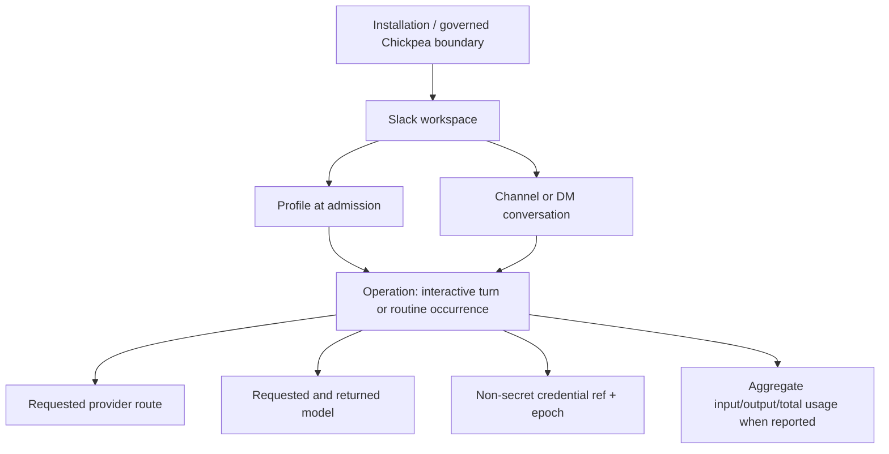
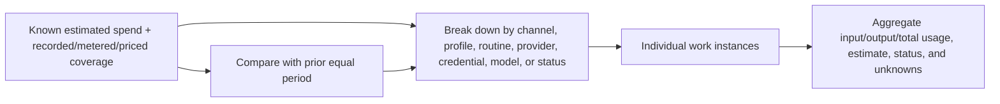

# Workspace-wide Usage and Cost Observability

## Goal Capsule

Give Chickpea operators one provider-neutral Usage interface for understanding how much Chickpea work costs and what drives that cost across interactive turns and routines. Every figure must say what produced it, what scope it covers, how complete it is, and whether it is response-reported usage or a Chickpea price estimate. Unsupported usage or spend stays visibly unknown.

The primary operator job for the first release is **spend diagnosis**: see Chickpea's known estimated spend for a period, notice changes, and drill from installation-wide totals through channel, profile, routine, provider, credential, and model to the individual work instance. The first interface relies only on a narrow core that current provider routes can prove consistently: Chickpea-owned attribution/status plus response-reported input, output, and total usage when available. It does not promote provider-specific extras into universal metrics or claim to know whether the work was valuable to the business.

Chickpea reports; providers enforce. Monetary caps, credits, rate limits, and account-wide safeguards stay at the model provider. Chickpea gives operators simple setup guidance to use a dedicated, appropriately scoped provider project/workspace/key for each Chickpea accounting boundary and configure the provider's native limits there. Chickpea does not add spend alerts, admission gates, provider-limit reads, or provider-limit writes in this plan.

This is a planning artifact. It does not authorize implementation, deployment, provider configuration changes, billing-limit changes, external mutations, or live-provider writes. Implementation begins only after Pejman approves the contract and open decisions.

## Product Contract

### Summary

Chickpea already receives useful usage data from Flue, but only routine successes preserve a subset of it. Interactive Slack turns discard it, failed or interrupted routines often lose it, cost provenance is not recorded, model credentials have no durable non-secret identity, and Admin has no workspace-wide usage view. The current routine field called `costEstimate` is labeled with the opaque unit `model_registry_unit`; it is not provider-reported spend and cannot be reconciled to an invoice.

The recommended product separates three concepts, but only the first is active implementation in this plan:

1. **Universal Chickpea reporting.** Capture one work instance for every routed operation with Chickpea-owned attribution and status. Attach response-reported input/output/total usage and a versioned estimate only when the provider/Flue route proves those fields. Use one consistent interface and explicit coverage across all current providers without requiring privileged provider billing credentials.
2. **Provider account billing.** Provider consoles remain the authority for account charges, credits, invoices, quotas, and caps. A future read-only reconciliation project may import delayed account-level data, but it is not required for the universal Chickpea view and is not executable from this plan.
3. **Spend controls.** Providers own monetary caps and usage limits. Chickpea retains operational reliability limits such as routine cadence, deadlines, and sandbox capacity, but does not implement monetary budgets or gates here.

The implementation milestone ends after a durable operation-level ledger, reproducible basic estimates, provider-neutral drill-downs, provider setup guidance, and a focused Admin Usage surface operate in both Node and Cloudflare validation lanes. Cache analytics, leaf-call/retry-purpose analysis, provider-reported charged-cost comparisons, multimodal/tool-unit dashboards, provider billing reconciliation, alerts, gates, and provider-control integrations are deferred.

### Problem Frame

The baseline at `d9ce1b70cfff36877b22cc7c1bae56d40e328999` has several useful ingredients but no coherent accounting system:

- `src/slack/run-turn.ts` calls `src/slack/agent-dispatch.ts`, which requests Flue with `?wait=result` but returns only result text. The response's `usage`, `model`, submission ID, and stream coordinates are dropped.
- `src/workflows/routine.ts` persists normalized `PromptUsage` on successful routine runs, including cache and estimated cost fields. Failures after model admission do not reliably preserve usage, and the persistence boundary cannot distinguish provider-reported money from a model-registry calculation.
- `src/routines/types.ts` and `src/routines/store.ts` make the routine run the only product-owned usage record. Interactive work and internal model purposes such as compaction, result validation, and retries have no product ledger.
- Flue `1.0.0-beta.8` aggregates input, output, cache-read, cache-write, and total tokens plus cost buckets across Agent work. Its canonical conversation retains result usage, while its process-level observer is best-effort and not a durable cross-isolate accounting stream.
- `src/config/provider-keys.ts` manages one installation-level key per Anthropic, OpenAI, and OpenRouter provider, resolving environment over stored state. It has no durable credential reference or rotation epoch suitable for attribution.
- `src/cloudflare-provider.ts` adds a keyless Workers AI binding route. `src/app.ts` also supports Workers AI through an OpenAI-compatible REST endpoint, plus built-in Anthropic, OpenAI, OpenRouter, and local/custom-compatible routes.
- `src/config/provider-models.ts` fetches live provider model lists and sees OpenRouter price strings, but Chickpea has no immutable historical price catalog.
- `src/config/types.ts` can attribute a turn to workspace, channel, profile, provider, and model. Its Agent snapshot has no credential identity and no operation/task identity suitable for accounting.
- `src/audit/types.ts` limits generic audit domains to memory, scheduled work, and network events. Generic audit storage is deliberately bounded and is not a high-volume usage ledger.
- `src/sandbox/session-cap.ts` enforces a monthly count of sandbox sessions. It does not measure vCPU time, memory, disk, egress, Workers requests, Durable Object duration, or invoice cost.
- `src/routines/limits.ts` enforces operational capacity and safety ceilings, not money. Its `spend_limited` outcome is a future-facing failure label rather than an implemented spend policy.
- Node uses the SQLite sidecar in `src/state/node-state-db.ts`; Cloudflare uses the singleton `TagStateStore` Durable Object SQL path in `src/cloudflare.ts` with the target-neutral RPC/proxy pattern in `src/config/state-backend.ts`, `src/config/state-rpc.ts`, and `src/config/cf-state-proxies.ts`.
- Admin exposes Channels, Profiles, Settings, routine run usage, and generic audit detail. There is no top-level Usage information architecture, credential-scoped accounting, spend-driver drill-down, or unknown-cost state.

The central product risk is false precision. A token count can be accurate while a dollar estimate is wrong because of cache semantics, batch or priority tier, long-context rules, image/audio/tool units, provider markup, negotiated pricing, price changes, free allocations, or a shared account. A delayed provider cost bucket can be accurate for an organization while being impossible to assign to a channel. A paid chat subscription can expose no supported inference billing API at all. Chickpea must preserve these distinctions rather than collapse them into one “cost” number.

### Current-state Code and Data Map

| Surface | Current path and captured state | Gap this plan closes |
| --- | --- | --- |
| Interactive Slack admission | `src/channels/slack.ts` claims/enqueues a turn; `TagStateStore.alarm()` in `src/cloudflare.ts` or the Node runtime reaches `src/slack/run-turn.ts`. The durable turn-job already provides an idempotency parent. | No usage operation begins at admission; runtime usage disappears after text extraction. |
| Shared Agent construction | `src/agents/slack-thread.ts` resolves live profile, channel assignment, model, skills, tools, MCP connections, repo grants, credentials, sandbox, and memory. Interactive threads may use a frozen Agent snapshot; routines resolve live authority. | The resolved accounting dimensions and credential route are not frozen as a non-secret usage attribution snapshot. |
| Flue dispatch | `src/slack/agent-dispatch.ts` posts to the Flue Agent route with `?wait=result`; `extractResultText` reads only `result`. The direct result also carries usage/model and execution coordinates. | Return structured, content-bounded telemetry and persist it before Slack delivery. |
| Interactive completion | `src/slack/run-turn.ts` renders/delivers returned text and updates turn-job state. Errors use safe public responses. | Delivery status and model consumption are not separately accounted; failed/incomplete usage has no durable state. |
| Routine execution | `src/workflows/routine.ts` executes the same channel Agent in a Flue Workflow, observes tool starts, and stores `response.model`/`response.usage` on success. | Routine-only fields are not a common ledger; failed/interrupted paths lose available usage; model-registry estimate provenance is ambiguous. |
| Routine storage/Admin | `src/routines/types.ts`, `src/routines/store.ts`, and routine Admin APIs expose tokens/cache/`costEstimate`/`costUnit` on each successful run. | Preserve compatibility while moving canonical truth to an operation/measurement ledger and linking the run. |
| Provider inventory | `src/config/providers.ts`, `src/app.ts`, and `src/cloudflare-provider.ts` register Anthropic, OpenAI, OpenRouter, Workers AI REST/binding, and local/custom-compatible routes. | Provider-specific usage/cost semantics are flattened or absent; provider pricing and cap-guidance metadata is not modeled. |
| Inference credentials | `src/config/provider-keys.ts` chooses environment over stored installation-level keys and rebinds providers. Stored keys are written as raw settings values with no application-layer encryption; Workers binding is keyless and REST uses account/token configuration. | No stable, non-secret credential ref/epoch or displayed provider accounting scope. |
| Model discovery | `src/config/provider-models.ts` fetches model lists; OpenRouter results expose current price strings. | No immutable effective-dated price source or historical reproducibility. |
| Attribution configuration | `src/config/types.ts` and `src/config/effective-config.ts` carry workspace/channel/profile/provider/model and Agent snapshot state. | No operation, credential, price, or completeness dimensions. |
| Sandbox/tools | `src/sandbox/session-cap.ts` reserves monthly session counts; Agent and routine paths can observe tool starts. Egress and credential policies govern execution. | Counts are operational facts, not model-provider usage or invoices; the initial ledger does not ingest them. |
| Audit | `src/audit/types.ts` and the audit store retain bounded memory/scheduled-work/network events. | High-volume measurements do not belong in generic audit; only usage configuration, catalog, credential lifecycle, and retention events should be audited there. |
| Operational limits | `src/routines/limits.ts` and the sandbox cap enforce cadence, capacity, deadline, and session ceilings. | These are operational safeguards, not monetary budgets; provider-native caps remain external. |
| State backends | `src/state/node-state-db.ts` owns Node SQLite; `src/cloudflare.ts`, `src/config/state-backend.ts`, `src/config/state-rpc.ts`, and `src/config/cf-state-proxies.ts` provide the Cloudflare SQL/RPC mirror. | Add an additive, parity-tested target-neutral usage store without a new production datastore. |
| Admin information architecture | `src/admin/page.ts` prioritizes Channels and Profiles, with Settings and lower-prominence audit/routine detail. | Add a first-class Usage destination with source/freshness/coverage rather than burying accounting under audit. |

### Evidence Labels

- **repo-observed**: verified in baseline commit `d9ce1b70cfff36877b22cc7c1bae56d40e328999` on 2026-07-28.
- **dependency-observed**: verified in the exact installed Flue `1.0.0-beta.8` package source on 2026-07-28.
- **official-doc**: verified in a first-party provider or framework document on 2026-07-28.
- **openclaw-observed**: verified at OpenClaw commit [`dd6a1434e7da8334fed8e0639c7db0248ae70628`](https://github.com/openclaw/openclaw/tree/dd6a1434e7da8334fed8e0639c7db0248ae70628) on 2026-07-28.
- **inference**: a design conclusion from those observations; it is not asserted as provider behavior.
- **implementation-spike**: a narrow runtime fact that must be proven before its dependent implementation proceeds.
- **product-decision**: an unresolved choice for Pejman in the Open Questions section.

### Current Provider and Authentication Capability Matrix

The matrix describes current Chickpea inference routes and the external provider boundary, not functionality the initial interface will implement. Its enforcement column explains where controls live; this plan adds no Chickpea monetary gate or provider-limit integration. Model-provider OAuth is not implemented. Existing OAuth code under `src/config/mcp-oauth.ts` authorizes MCP connectors, not model inference or billing access.

| Chickpea route and auth mode | Runtime fields Chickpea can receive | Additional billing or quota surface | Accuracy and latency | What can be enforced | Confidence |
| --- | --- | --- | --- | --- | --- |
| Anthropic with installation API key from env or stored settings | Flue-normalized input, output, cache-read, cache-write, total tokens, model, and registry-derived cost buckets when pricing is known. Anthropic Messages also returns cache creation/read and output-detail usage. A final response is synchronous evidence, but a client interruption can consume billable work without a locally complete response. | Official organization Usage and Cost Admin APIs require a distinct organization Admin API key, not an inference key. Usage normally appears within minutes; cost is bucketed and delayed. It can group by API key, workspace, model, service tier, and context. Priority Tier cost is not included in the documented cost endpoint. Rate-limit inspection also requires an Admin key and is read-only. | Runtime tokens are high-confidence for completed responses. Estimates depend on price/tier classification. Admin data is provider-reported but not an invoice and may be incomplete for specific tiers/products. | Chickpea can gate only its own calls. Anthropic organization/workspace spend and rate limits remain provider controls configured through Anthropic surfaces; the documented Rate Limits API does not mutate them. | High for public APIs; medium for exact cost attribution when shared keys or unsupported cost categories exist. |
| OpenAI with installation project API key from env or stored config | Flue-normalized input/output/cache/total usage for successful responses. OpenAI response events expose input, output, cached, reasoning, audio/image details depending on endpoint. Failed, in-progress, or incomplete response events may have null usage. | Official organization Usage APIs expose endpoint-specific token/unit buckets and dimensions such as project, API key, user, model, service tier, and batch. The Costs API exposes organization cost buckets. Both require an Admin API key. Current Admin APIs also expose organization and project hard spend limits and alerts; project keys do not themselves grant organization billing access. | Completed response usage is prompt. Organization usage/cost is delayed aggregate data with no universal attribution to a Chickpea operation. A prepaid account can cross a balance before delayed cutoff. | Chickpea can gate its calls. A separately authorized control-plane integration could inspect or mutate OpenAI organization/project hard spend limits, but that is not an API-key-level per-call guarantee and is outside the observability release. | High for current public APIs; medium for reconciliation latency and account-specific pricing. |
| OpenRouter with installation inference API key from env or stored config | Current responses include tokens, caching/reasoning details, `usage.cost` charged to the account, and cost detail. The current Flue/Chickpea boundary does not preserve whether a money field came from OpenRouter or a local registry, so the adapter must capture provenance. | An ordinary inference key can inspect its own daily/weekly/monthly usage, BYOK usage, configured limit, reset, and remaining balance. A distinct management key is required to create/list/update/disable keys and set USD key limits. Generation lookup can return upstream cost for BYOK. | Per-response charged cost is the strongest synchronous monetary signal among current Chickpea providers, but it is provider-reported account charge, not an invoice. Credit purchase fees, BYOK fees, markups, and upstream cost are distinct concepts. Management aggregates have undocumented reporting-lag bounds. | Chickpea can gate its calls. With a separately authorized management key, OpenRouter can enforce per-key limits; management credentials must never be reused for inference. | High. |
| Workers AI REST route using Cloudflare account ID and API token | OpenAI-compatible responses and current Flue adapters expose input/output and cached token details for supported models. Some model schemas expose `usage`. Workers AI bills in neurons, with per-model token-to-neuron pricing; token counts alone do not universally equal billed neurons. | Official dashboard analytics and account billing exist. No supported, documented Workers AI billing reconciliation API was found in the reviewed official Workers AI documentation. An optional future AI Gateway route can expose analytics and estimate-based spend limits, but Chickpea does not currently route model calls through AI Gateway. | Runtime tokens are prompt when returned. A Chickpea neuron/dollar estimate is model- and date-dependent. Free daily neuron allocation and account-wide use make invoice attribution incomplete. | Chickpea can gate its calls. Cloudflare account allocation/provider rejections remain external. AI Gateway spend limits are eventually consistent estimates and require an explicit architecture choice. | Medium-high for runtime; medium for estimates; low for automated billing reconciliation until an official API is selected. |
| Workers AI binding route (`env.AI`), no model API key | Binding adapter returns supported input/output/cached usage through Flue; current registry cost is zero/unknown because the adapter lacks price metadata. The binding still incurs Cloudflare account usage. | Same Cloudflare account/dashboard boundary as REST. No per-binding invoice API was identified. | Same model-unit limitations as REST. Binding identity and deployment must be captured because there is no key ID. | Chickpea can gate its calls. It cannot turn a binding into an account-wide spend boundary. | Medium-high for runtime; medium-low for cost. |
| Local or custom OpenAI-compatible provider with operator-supplied credentials | Whatever the compatible server returns. Token totals may be complete, partial, or absent. Model names and units are not trustworthy price identifiers without configuration. | No generic billing API. A future provider plugin may add one explicitly. | Provider-specific. Missing usage or price must stay unknown, not zero. | Chickpea can enforce only its own operation limits. | Low by default; raised only by provider-specific fixtures and configuration. |
| ChatGPT, Claude Pro/Max/Team, or other consumer subscription | Not a current Chickpea inference auth mode. A subscription login is not a supported substitute for an API key in Chickpea. | OpenAI and Anthropic publicly separate chat subscriptions from API billing. OpenClaw uses private or unstable quota endpoints for some subscription OAuth flows; Chickpea must not copy those assumptions into a governed product contract. | No supported Chickpea telemetry or billing contract. | None. | High that current Chickpea does not support it; deliberately no promise about private quota endpoints. |

### Minimum Reporting Contract

The initial interface has a hard two-tier contract rather than a union of every provider's fields:

“Universal” describes one interface, vocabulary, attribution model, and unknown-state contract across providers; it does **not** promise universal token coverage or universal dollar coverage.

1. **Operations core — always Chickpea-owned.** Every admitted interactive turn or routine occurrence has ID, kind, timestamps, terminal/incomplete status, captured workspace/channel/profile/routine attribution, requested provider/model, and non-secret credential ref. These facts drive work counts, status counts, filters, and drill-downs even when the provider reports no usage.
2. **Metered core — only after route proof.** A completed provider/model route is `metered` only when fixed U0 fixtures prove stable returned model plus input, output, and total usage semantics through the exact Flue/Chickpea boundary. A route/model is separately `priceable` only when those fields are sufficient for a reviewed effective catalog rule. Missing fields produce `usage_unknown` or `price_unknown`; they never become zero.

No top-level metric, diagnostic principle, or Definition of Done depends on cache fields, reasoning units, audio/image details, server-tool units, leaf attempts, internal purposes, provider request IDs, direct charged-cost fields, quotas, or billing aggregates. U0 may record which extras exist for future research, but U1-U6 do not build product behavior around them. If a named provider route fails the metered-core contract, the interface still reports its Chickpea-owned work and status while usage/spend remain visibly unknown.

### What Chickpea Can and Cannot Know

#### Layer 1 — runtime usage telemetry

For work actually routed through Chickpea, it can usually know the following without organization billing access:

- The installation, Slack workspace, profile, channel/conversation, interactive turn or routine run, provider route, requested and returned model, and non-secret credential route used at admission.
- Response-reported aggregate input, output, and total usage when the provider returns a final usage object and U0 proves its semantics.
- Flue's aggregate across the Agent operation, including internal model work only to the extent the exact runtime contract includes it; no leaf-attempt or purpose promise ships initially.
- Chickpea-observed operation status and duration.
- A Chickpea estimate based on the immutable price snapshot and normalized billable units known at call time.

It cannot assume a missing response means zero usage, a registry cost means invoiced cost, or a successful tool call's downstream vendor charge appears in model usage. Streaming interruption, network loss, provider error, an unknown model, and local/custom endpoints require explicit incomplete or unknown states.

#### Layer 2 — provider billing reconciliation (deferred)

This plan does not request provider billing credentials or import provider account data. Provider consoles remain the source of truth for account spend. The universal Chickpea interface is built entirely from runtime facts and immutable Chickpea price estimates; provider-specific direct charges do not enter V1 totals or UI.

A future, separately approved reconciliation project may use a least-privileged organization/admin or management credential to import provider cost/usage buckets. Those imports would describe the provider's supported scope and time bucket; they would not automatically describe a Chickpea channel or work instance.

If that follow-up is approved, “read-only” would describe Chickpea's adapter surface, not necessarily the provider credential. Anthropic and OpenAI Admin credentials can carry organization-wide capabilities that providers do not currently scope down to only these reads. The follow-up must disclose that blast radius and keep Admin/management credentials separate from inference credentials.

- If the provider bucket contains a stable request/generation ID also captured by Chickpea, it can be matched directly.
- If it contains only API key/project/model/time dimensions, Chickpea can reconcile at that exact shared scope and compute coverage, but must keep the unmatched remainder as `external_or_unattributed`.
- If the account includes work outside Chickpea, Chickpea must never prorate that remainder across profiles, channels, or tasks and call it actual cost.
- Provider cost reports are provider-reported spend. Only an invoice or explicit finance import may be labeled invoiced or reconciled-to-invoice spend.

#### Layer 3 — provider-owned monetary controls

Chickpea does not enforce monetary budgets, alerts, or admission gates in this product contract. Operators configure caps, credits, quotas, and rate limits with their providers and should scope provider projects/workspaces/API keys so those controls cover the intended Chickpea installation or accounting boundary.

Provider-native controls remain provider-scoped:

- OpenAI currently exposes organization/project hard spend-limit APIs to Admin credentials.
- OpenRouter management credentials can set per-key USD limits.
- Anthropic's documented rate-limit reporting API is read-only; organization/workspace settings remain provider-managed.
- Workers AI allocation and any optional AI Gateway spend limit operate at Cloudflare-defined scopes and may be estimate-based/eventually consistent.

Chickpea may link to provider instructions and explain the observed scope of the active inference credential. It does not read or mutate provider limits in this plan. Existing routine, deadline, and sandbox ceilings remain operational safeguards rather than monetary controls.

### Terminology and Display Contract

| Term | Product definition | Required display metadata | Forbidden implication |
| --- | --- | --- | --- |
| **Reported usage** | Aggregate input, output, and total usage returned by the model provider/runtime for a completed or partially observed work instance. | Provider, returned model, operation status, metered coverage. | Not “billed tokens” unless provider documentation defines the field that way. |
| **Observed execution facts** | Chickpea-owned facts such as work identity, timestamps, status, and duration at the operation boundary. | Observer and measurement boundary. | Not provider-reported usage or a billing claim; generic tool/sandbox meters are outside the initial ledger. |
| **Work instance** | The Admin-facing name for one user-meaningful `usage_operation`: an interactive turn or one routine occurrence/run. | Work kind, captured channel/profile/routine attribution, status, start/finish time. | Not a whole channel, routine definition, or provider request. |
| **Chickpea estimated spend** | The provider-neutral headline series: an immutable price-snapshot calculation over reported units for work routed through Chickpea. | Currency, price source/version/effective date, priced-work coverage, excluded unknowns, and any required pricing assumptions. | Never “actual,” “charged,” or “invoice.” Unknown components cannot be coerced to zero. |
| **Provider-reported cost** | A deferred monetary value returned by a provider per response or in a provider cost report. | Provider, exact account/key/project scope, source endpoint, bucket, fetched time, freshness. | Not part of the initial universal UI; not an invoice and not necessarily attributable to one task. |
| **Reconciled spend** | A deferred provider-account reporting concept: provider-reported cost buckets matched to Chickpea calls at a provider-supported scope, with coverage and unmatched remainder. | Match method, source bucket, coverage percentage, unmatched amount, freshness. | Not part of the initial universal interface; no allocation below the provider's evidence dimensions. |
| **Invoice-reconciled spend** | A future invoice/finance import matched to provider buckets. | Invoice/import identity, period, adjustments, currency/tax treatment, coverage. | Out of scope until a finance source exists. |
| **Provider limit** | A provider-native quota, rate, credit, project, key, or organization control configured outside Chickpea. | Provider scope, setup guidance, and link to the provider's authoritative control surface. | Chickpea does not read, set, or guarantee it. |
| **Operational limit** | A Chickpea reliability or safety ceiling such as routine cadence, deadline, or sandbox capacity. | Scope and operational behavior. | Not a monetary budget or provider-account cap. |

Every monetary UI component in the initial release carries a visible `Chickpea estimate` badge. The overall number is summed only within one currency and always paired with metered and priced coverage plus excluded unknowns. Provider-reported amounts, reconciliation, and invoices remain deferred rather than creating provider-specific UI. Every card includes period and scope. Tooltips state whether tax, credit purchase fees, free tiers, negotiated rates, and work outside Chickpea are included, excluded, or unknown.

### Unknown, Partial, and Freshness States

Usage and money fields are nullable with an explicit status; zero is a valid measured value, not a fallback. Initial normalized reasons are:

- `usage_not_reported`
- `usage_partial`
- `stream_interrupted`
- `provider_request_unknown`
- `price_unknown`
- `price_stale`
- `pricing_dimension_unknown`
- `subscription_quota_unsupported`
- `unsupported_auth`

Freshness is represented by `observed_at` plus the price catalog's source/effective/fetched dates. The UI derives `current`, `stale`, or `unavailable` from catalog policy. “Real time” is reserved for synchronous response facts.

### Attribution Hierarchy and Rules

The hierarchy is an immutable attribution snapshot, not a mutable join through current display configuration:



Rules:

1. **Installation is the accounting root.** It is the Chickpea deployment/configuration boundary. `workspace_id` remains a separate Slack dimension; the UI may initially label installation as “Organization” only if Pejman settles that terminology.
2. **An operation is the user-meaningful parent.** Interactive operations use the durable Slack turn-job ID. Routine operations use the routine-run ID. New work kinds require a later explicit contract rather than a speculative generic task type.
3. **V1 is operation-level.** One aggregate measurement is attached to the work instance when Flue returns it. Retry, failover, validation, compaction, and other leaf purposes are not claimed as separately visible until a later provider/runtime contract supports them consistently.
4. **Requested route and returned model are captured when available.** Provider redirects, fallback, aliases, or returned model differences are not inferred when the response does not expose them.
5. **Profile and channel are peer attribution dimensions.** A profile can serve many channels, and a channel can change profiles. The captured IDs and bounded display labels do not change retroactively after rename, reassignment, or deletion.
6. **Routine definition and routine run are distinct.** Spend belongs to the occurrence/run and rolls up to the routine definition. An edit never rewrites historical runs.
7. **Credential attribution is non-secret and versioned.** A stable `credential_ref` identifies provider, source kind, configured scope, and rotation epoch. Secrets, secret prefixes, reversible hashes, and raw headers never enter the ledger.
8. **Shared-account spend stops at its evidence scope.** A provider organization bucket that cannot identify a Chickpea credential remains installation/provider-level. It is not distributed to profiles, channels, or tasks.
9. **Actors and DMs are privacy-sensitive dimensions.** No per-user dashboard or persisted Slack actor rollup ships until Pejman settles retention and purpose. A DM is actor-equivalent: preserve only its opaque conversation ID, label it generically as `Direct message`, and exclude DM rows from named channel breakdowns. Operational actor IDs already needed for a turn may stay on the parent record under existing policy.
10. **Provider-specific extras do not define the product.** Cache, reasoning, neuron, image, audio, server-tool, request-ID, and direct charged-cost fields may inform future research. A proven provider-specific input may be used internally only when an official price rule requires it, but it does not become a dashboard metric, filter, or cross-provider promise.
11. **Every aggregate drills to work instances.** An Admin can move from installation-wide estimated spend to a channel, profile, routine, provider, credential, or model grouping and then to the individual interactive turn or routine occurrence with its aggregate usage, estimate, status, and unknown reasons. Filters narrow the same ledger rather than producing separate totals that cannot be reconciled.

### Credential Identity Contract

`ModelCredentialRef` is metadata, never a credential:

- `credential_ref_id`: random opaque ID generated when a stored inference credential is created or an environment/binding route is registered.
- `provider_id`, `source_kind` (`stored`, `environment`, `cloudflare_binding`, `custom`), optional provider account/project/workspace/key IDs returned through supported metadata, and operator-supplied non-secret label.
- `version`: monotonically increasing rotation epoch.
- `active_from`, `retired_at`, and configuration/deployment reference.

Stored key replacement increments the epoch transactionally with provider rebind. Environment secrets cannot be safely fingerprinted into a stable public identity; deployments therefore need an explicit non-secret alias plus deployment epoch, or they remain labeled `environment_unknown_rotation`. A Cloudflare AI binding uses account/binding/deployment identity. Existing API OAuth/MCP credentials are not model credential refs.

### Key Product Decisions

1. **KTD1 — Chickpea reports; providers enforce.** *(session-settled: user-directed — chosen over Chickpea monetary gates: provider controls are authoritative and keep the first product simpler.)* Governs R1-R18 and R30-R39. Chickpea ships provider-neutral runtime accounting, estimates, and diagnostics. Operators configure monetary caps and rate/usage limits at the provider using appropriately scoped projects, workspaces, and API keys.
2. **KTD2 — the durable ledger is product-owned.** Governs R2-R12. Flue remains the execution and normalized usage source; process observers, transcripts, and generic audit logs are not the canonical accounting store.
3. **KTD3 — the initial monetary product is Chickpea estimates only.** Governs R13-R18 and R30-R32. Provider-specific direct charges, provider aggregates, reconciliation, and invoices are deferred and must remain separate if later approved.
4. **KTD4 — unknown is not zero.** Governs R4, R14-R18, R30. Missing usage, prices, or pricing dimensions produce explicit incomplete state.
5. **KTD5 — immutable at-call price snapshots.** Governs R13-R18. Historical estimates do not change when catalogs change; V1 has no re-pricing scenario view.
6. **KTD6 — reconciliation never invents attribution.** Governs R19-R25. Match only on provider-supported identifiers/dimensions and keep external/unattributed remainder visible.
7. **KTD7 — provider billing reconciliation is deferred.** Governs the deferred R19-R25 contract. The universal interface requires no Admin/management billing credential. Any later provider-account import must be separately approved and keep privileged billing credentials distinct from inference credentials.
8. **KTD8 — no subscription scraping.** Governs the scope boundary and deferred R22-R24 contract. Private OpenAI/Anthropic consumer quota endpoints seen in OpenClaw are prior art, not a supported Chickpea integration.
9. **KTD9 — credentials get opaque identity and epochs.** Governs R7-R10 and R35. Durable attribution never derives an identifier from secret bytes.
10. **KTD10 — only the metered core is a V1 product contract.** Governs R3-R6 and R13-R18. Aggregate input/output/total usage drives the interface after route proof. Provider-specific cache, reasoning, image/audio/tool/neuron, request-ID, charged-cost, and leaf-attempt fields do not drive V1 UI or acceptance.
11. **KTD11 — generic audit records lifecycle actions, not every usage row.** Governs R31-R35. High-volume facts stay in the ledger; audit captures catalog changes, retention, and credential rotation.
12. **KTD12 — current shared provider keys are modeled honestly.** Governs R7-R10 and R33. The architecture supports future profile/user keys without pretending they exist today.
13. **KTD13 — provider-native controls stay outside Chickpea.** *(session-settled: user-directed — chosen over a common Chickpea control plane: vendors differ and already own account enforcement.)* Governs R33 and the scope boundary. Chickpea provides concise setup guidance and authoritative provider links but neither reads nor mutates provider limits in this plan.
14. **KTD14 — rollout proves each runtime surface separately.** Governs R36-R39. Node, deployed Worker, provider inference fixtures, interactive Slack, and routines are distinct acceptance gates.
15. **KTD15 — raw prompts, outputs, tool payloads, and headers are excluded.** Governs R2-R6, R31-R35. Usage telemetry carries only bounded accounting metadata.
16. **KTD16 — a future reconciliation design must use deployment-managed secrets.** Governs the deferred R19-R25 contract. If later approved, additional provider Admin/management credentials come from environment or platform secret bindings; Admin may test/show non-secret status but does not persist the secret in the current raw settings store.
17. **KTD17 — one consistent estimated-spend series anchors the interface.** *(session-settled: user-directed — chosen over provider-specific headline totals: one calculation and coverage contract enables honest comparison across vendors.)* Governs R13-R18 and R30-R32. The headline sums only priceable Chickpea work within compatible currency and shows metered/priced coverage plus exclusions; provider-specific charged-cost series are deferred.
18. **KTD18 — the dashboard diagnoses only dependable drivers.** *(session-settled: user-directed — chosen over a full-featured provider-union dashboard: the same unknown/coverage contract must work across every current route.)* Governs R30-R33. It exposes trend, volume, status, cost per completed priced work, provider/model mix, channel/profile/routine shares, and high-cost priced work instances. Cache changes, retry-purpose overhead, and other non-universal signals are not product principles.

### Product Requirements

#### Durable runtime telemetry

- **R1** Create a target-neutral usage domain shared by Node SQLite and Cloudflare `TagStateStore`; it must not depend on routine tables or generic audit envelopes.
- **R2** Persist one idempotent `usage_operation` for every admitted interactive turn and routine run before model execution, then terminally classify it even when execution or Slack delivery fails.
- **R3** Persist at most one V1 aggregate usage measurement per operation with requested provider/model, returned model when reported, credential ref/epoch, timestamps, status, response-reported input/output/total usage, estimate, and completeness. Do not require leaf-call, purpose, retry, tier, or provider-request identifiers.
- **R4** Represent absent or partial response usage with nullable values plus a normalized unknown reason. Never synthesize zeros for missing usage or cost.
- **R5** Treat cache fields as optional estimator inputs only. When a proven route returns them, normalize provider semantics without double counting; do not add cache cards, trends, filters, or acceptance requirements in V1.
- **R6** Treat reasoning, audio/image, server-tool, request, neuron, and other provider-specific units as out of the V1 reporting contract. If a missing billable dimension could materially change an estimate, mark the estimate partial/unknown rather than building a provider-specific dashboard.
- **R7** Add durable non-secret `ModelCredentialRef` identity to each current inference route and increment rotation epochs without exposing or hashing credential bytes into the ledger.
- **R8** Freeze workspace, profile, channel/conversation, interactive turn or routine/run, provider, model, credential, and bounded display labels at admission. Deletion/rename does not rewrite financial history. DM labels remain generic and are excluded from named channel breakdowns until the actor-privacy decision is settled.
- **R9** Store operation-level Flue aggregation with `coverage=aggregate_only`. Do not expose retries, failover, compaction, result validation, intent parsing, or overflow recovery as separate spend drivers until one later contract proves them consistently across routes.
- **R10** A replay that actually invokes model work again creates a distinct work execution/measurement rather than overwriting prior recorded usage; V1 does not promise provider-attempt decomposition within one execution.
- **R11** Return a structured Slack-agent result containing text plus only the metered core and persist that operation-level usage before delivery. The public Slack message remains result text only.
- **R12** Replace routine-only success accounting with the shared ledger while dual-writing the existing `RoutineRun` usage fields during migration. Persist usage available on failed/interrupted routine paths and link the routine record to the usage operation.

#### Pricing and estimates

- **R13** Maintain immutable price-catalog versions with provider, model, billable unit, required official pricing dimensions, source URL, currency, effective/fetched times, and content hash. A measurement references the exact version/rates used.
- **R14** Treat provider model-list pricing as discovery input, not timeless truth. The first release uses reviewed, release-pinned official catalog snapshots for the narrow set of current provider/models that pass both the metered-core and priceability fixtures. Dynamic imports, negotiated/custom rates, and cross-source precedence are deferred.
- **R15** Calculate estimates only when the reported core plus any proven optional pricing inputs are sufficient for that provider/model's official rule. If cache, tier, long-context, image/audio/tool, request, neuron, or another billable dimension is required but missing, mark the estimate partial/unknown instead of adding a vendor-specific estimator feature.
- **R16** Do not add storage, totals, filters, diagnostics, or UI for provider-reported per-response money in V1. OpenRouter `usage.cost` and similar provider-specific fields remain research evidence, not a shortcut around the common estimate contract.
- **R17** Freeze historical estimates. Catalog refresh never rewrites them. Current-price scenario recomputation is deferred.
- **R18** Publish catalog coverage and staleness metrics. Unknown model or price never means free.

#### Deferred provider reconciliation contract — not active implementation requirements

R19-R25 are retained as research-backed constraints for a possible follow-up. They do not authorize schemas, credentials, APIs, sync jobs, UI, or provider calls in U0-U6.

- **R19** Define a read-only provider reconciliation plugin boundary with capability metadata for usage buckets, cost buckets, quota/limit reads, supported dimensions, reporting delay, cursors, and credential requirements.
- **R20** Keep additional reconciliation Admin/management credentials separate from inference credentials. A future implementation reads them only from environment/platform secret bindings, never the current raw settings store; Admin can test/show scope, health, blast-radius disclosure, and rotation guidance but cannot save or return the secret. “Read-only” describes the adapter methods, not a guarantee about provider-issued Admin-key scope. A documented current-key self-usage endpoint may reuse the active inference credential at that exact key scope.
- **R21** Import immutable provider buckets with source endpoint/version, provider scope dimensions, bucket start/end, fetched time, amounts/units/currency, status, and a hash of bounded canonical facts. Never retain complete provider raw responses.
- **R22** A future adapter contract may cover official Anthropic organization Usage/Cost, OpenAI organization Usage/Costs, OpenRouter ordinary-key self-usage, and optional OpenRouter management-key account/key visibility. Workers AI billing reconciliation remains unsupported until a supported official API or explicitly approved AI Gateway architecture exists.
- **R23** Match by stable request/generation ID first, then exact supported credential/project/model/time dimensions. Record match method and confidence. Never infer a channel/task match from time and amount alone.
- **R24** Keep unmatched provider spend as `external_or_unattributed`, including work outside Chickpea, provider console/workbench activity, shared keys, and dimensions the provider omits.
- **R25** Calculate reconciliation coverage by provider scope and period. Do not surface a provider bucket as channel/profile actual cost if that attribution is unsupported.

#### Provider control guidance

Requirement IDs R26-R29 and the earlier FC1-FC4 control placeholders are intentionally retired rather than reused. Monetary controls are not a future-ready subsystem hidden in this plan; provider-owned limits are the current product boundary.

The operator documentation and provider guidance cards must recommend:

- Create a dedicated provider project, workspace, or API key for each Chickpea installation/accounting boundary whenever the provider supports it.
- Configure spend caps, credit limits, usage tiers, and rate limits in the provider's console at the narrowest useful supported scope.
- Avoid reusing broad personal or organization-wide keys when a narrower key/project/workspace is available.
- Treat a shared credential as an attribution caveat: Chickpea can report its own routed work, while provider account totals may also include work performed outside Chickpea.
- Rotate provider credentials at their source and update the non-secret Chickpea credential alias/epoch so historical reports preserve the route used.
- Expect the provider to reject calls when its limit is reached; Chickpea records the failed work instance and provider error but does not pre-approve spend or override the provider.

#### Admin, API, audit, and privacy

- **R30** Add top-level Admin Usage anchored by one `Chickpea estimated spend` headline, aggregate input/output/total usage, and work counts/status. The estimate sums only compatible currency and shows recorded, metered, and priced-operation coverage plus excluded unknowns. No provider-specific charged-cost or account-reconciliation card ships.
- **R31** Provide time filters and one-at-a-time breakdowns by profile, named channel, work kind, routine definition, provider, credential, model, and status. Every grouped row drills into its individual interactive turns or routine occurrences. DM conversations roll up only to a generic `Direct message` group and do not expose labels. Purpose, leaf attempt, cache, tier, and provider-specific unit filters are out of scope.
- **R32** Provide current-versus-prior-period estimated-spend and work-volume trends, share of known estimated spend, cost per completed priced work instance, completed/failed/incomplete counts, provider/model mix, high-cost priced work instances, unknown-usage volume, and unknown-price volume. These are basic diagnostic signals, not claims that a channel or task is valuable or wasteful. Detail views link to the existing Channel, Profile, routine, and provider/model configuration surfaces that can change the identified driver; Usage itself does not mutate configuration.
- **R33** Add provider guidance cards showing the active inference credential's non-secret source/ref and known provider project/workspace scope, an explanation that provider caps and quotas are configured outside Chickpea, recommended scoping guidance, and links to the provider's authoritative control surface. Do not request billing Admin credentials or read/write provider limits.
- **R34** Keep operation-level usage facts in the usage ledger. Write generic audit events only for usage configuration, price catalog changes, credential create/rotate/delete, and retention/redaction.
- **R35** Exclude prompts, model outputs, Slack text, tool arguments/results, fetched content, secret values/prefixes, and request/response headers. Apply bounded lengths, secret-pattern rejection on operator labels, Admin authentication, pagination, retention, and redaction/pseudonymization. Provider raw responses are never retained in V1.

#### Reliability and rollout

- **R36** Make every persistence write idempotent by operation/execution identity. Persistence retries reuse the same Chickpea-minted execution ID. A recovery that actually invokes the model again creates a distinct execution measurement under the same user work source; it is real additional usage and must not be overwritten or hidden.
- **R37** Keep runtime execution independent of telemetry availability and slowness. Runtime-recording coverage uses the durable Slack turn-job and routine-run stores as its denominator, not the usage ledger itself. Initial rollout is fail-open: if pre-delivery persistence exceeds a budget measured in U0 and capped at 250 ms, Slack delivery proceeds, the existing admission record exposes a coverage gap, and one post-delivery repair attempt may run without re-invoking the model.
- **R38** Roll out behind independent flags for runtime recording, estimates, and Admin UI. Disabling estimates or UI must not disable the underlying ledger.
- **R39** Prove Node SQLite, Cloudflare `TagStateStore`, fixed fixtures for every current Anthropic/OpenAI/OpenRouter/Workers AI route, deployed Worker state boundary, fresh Slack interactive work, and routine executions separately. The provider fixture matrix must identify each route as `metered` or `operations_only` and each tested provider/model as `priceable` or `price_unknown` before U5-U6 scope is finalized.

### Key Flows

#### F1. Interactive operation

1. The claimed Slack turn-job ID becomes the usage operation ID before Flue is called.
2. Chickpea freezes the workspace/profile/channel/model/provider/credential attribution snapshot without prompt or message content.
3. Flue runs the Agent and returns result text plus returned model and aggregate input/output/total usage when the route supplies them.
4. Chickpea attempts the idempotent operation/measurement write before Slack delivery. If the U0-measured budget (never more than 250 ms) expires, delivery proceeds and the durable turn-job denominator exposes the coverage gap; one post-delivery repair attempt may persist the same execution ID without re-invoking the model.
5. Slack delivery status remains separate. A delivery failure does not erase already consumed model usage.
6. If Flue/provider fails without a final usage object, the operation records failure plus the correct unknown/completeness reason.

#### F2. Routine operation

1. The routine run ID is the operation ID and links to routine definition/version.
2. Current runtime authority and credential route are frozen at admission, following existing routine semantics.
3. One operation-level aggregate measurement is written when available; unavailable usage remains explicit.
4. Available usage is finalized on success, no-op, delivery failure, policy failure, interruption, or timeout.
5. Existing `RoutineRun` usage fields are dual-written from the ledger during compatibility migration; Admin detail reads the ledger when present and labels legacy-only data.

#### F3. Pricing

1. An operation supplies provider/model plus the proven aggregate usage core and any optional pricing input U0 established for that route.
2. The estimator selects the effective immutable catalog version and rates under explicit precedence.
3. It calculates each component and records rate IDs, amount, currency, and completeness.
4. Missing model, required pricing dimension, or unit price records `price_unknown` or `pricing_dimension_unknown`; known components remain visible but the total is partial.
5. A later catalog update creates a new version and does not rewrite the measurement.

#### F5. Dashboard query

1. The authenticated Admin API receives a bounded time range, grouping, and the core filters.
2. It queries typed runtime rollups without exposing prompt/output content and returns one currency-compatible Chickpea estimated-spend total with priced coverage and excluded unknowns.
3. Grouping by channel, profile, routine, provider, credential, model, work kind, or status returns mutually reconcilable shares of the same filtered population.
4. Selecting a group opens its individual work instances; selecting an instance opens its aggregate usage, estimate inputs/rates, status, and unknown reasons.
5. Comparison views calculate change from the prior equal period, share of known estimated spend, work volume/status, cost per completed priced work instance, and provider/model mix.
6. The UI never silently fills gaps, converts currencies, exposes a provider-specific metric as universal, or characterizes spend as valuable/wasteful without outcome evidence.

### Acceptance Examples

- **AE1 — interactive success:** An OpenAI Slack turn returns input, output, and total usage. Chickpea persists the operation-level measurement before Slack delivery and shows a versioned estimate; delivery failure does not remove it.
- **AE2 — routine success:** An Anthropic routine stores aggregate input, output, and total usage plus routine/profile/channel/provider/model attribution and a versioned estimate.
- **AE3 — interrupted stream:** The connection ends before a final usage object. The operation is `failed` or `incomplete` with `stream_interrupted`; tokens and cost remain null/partial rather than zero.
- **AE4 — retry/failover without leaf proof:** Anthropic fails and OpenRouter succeeds inside one Agent execution. V1 records only the aggregate Flue usage that U0 proves; it does not invent per-attempt costs. If the aggregate is incomplete, coverage says so.
- **AE5 — OpenRouter extra field:** OpenRouter returns `usage.cost`. V1 does not add a charged-cost card, filter, or special total; the common estimate and coverage contract remain unchanged.
- **AE6 — Workers AI binding:** A binding call returns the metered core but no sufficient price metadata. Usage appears and estimated spend says unknown until a reviewed rate is available. If the route omits the metered core, the work instance still appears as operations-only.
- **AE7 — local model:** A custom endpoint returns token counts for an unpriced model. Usage is reported; dollars remain unknown in V1. Operator-supplied rates require a later approved catalog-source design.
- **AE8 — price change:** A provider changes a rate tomorrow. Yesterday's stored estimate retains yesterday's catalog version; V1 does not silently re-price it or add a hypothetical comparison series.
- **AE9 — shared OpenAI project:** Two applications use the same provider project/key. Chickpea reports only its own routed operations and warns that the provider's account total can include external work; it does not import or distribute that account total.
- **AE10 — scoped provider setup:** An operator opens an OpenAI, Anthropic, OpenRouter, or Workers AI guidance card. Chickpea recommends the narrowest supported project/workspace/key, links to provider-native limits, and never requests authority to change them.
- **AE11 — subscription:** An operator has ChatGPT Plus or Claude Max but no API/Admin credential. Admin states subscription quota unsupported and offers no private scraping workflow.
- **AE12 — credential rotation:** A stored OpenRouter key rotates. New calls use a new credential epoch; old rows remain linked to the retired non-secret ref, and neither secret nor prefix is exposed.
- **AE13 — optional cache input:** A route reports cached input needed for its price rule. The estimator may use the proven normalized field, but V1 exposes no cache analysis; another route without the field remains within the same core contract.
- **AE14 — provider-specific billable unit:** A response includes audio, image, server-tool, or neuron units outside the metered core. If those units materially affect price, the estimate becomes partial/unknown; V1 does not add a provider-specific unit dashboard.
- **AE15 — sandbox boundary:** A routine opens a sandbox. Model usage remains attributed to the routine, but the existing sandbox-session count does not enter model spend or appear as a priced unit without duration/invoice evidence.
- **AE16 — provider cap reached:** A provider rejects a call because its native limit is reached. Chickpea records the failed work instance and any partial usage the response actually reports; otherwise usage/cost stays unknown rather than zero. It explains that the cap is provider-managed and does not retry in a way that bypasses the provider control.
- **AE17 — telemetry outage:** A usage write fails while user work can still run under the initial fail-open policy. Health and Admin show a coverage gap, and a retry cannot double count successfully persisted calls.
- **AE18 — privacy:** An Admin Usage response contains IDs, bounded labels, aggregate usage, estimate provenance, and timestamps, but no Slack message, prompt, output, tool payload, authorization header, key prefix, or OAuth token.
- **AE19 — overall-to-channel diagnosis:** An Admin sees that weekly known estimated spend rose 35%, groups by channel, and identifies one channel responsible for most of the increase. Drilling in shows the relevant routine occurrences with the same known total and visible metered/priced coverage.
- **AE20 — basic efficiency diagnosis:** A routine's cost per completed priced occurrence doubled while price coverage stayed comparable. The view shows whether work volume, completion status, aggregate input/output usage, provider, or model mix changed; it does not claim the spend is bad or invent cache/retry explanations that the core contract cannot prove.

### Success Criteria

- Every newly admitted interactive turn and routine run has exactly one usage operation with a terminal or explicitly incomplete state unless fail-open telemetry drops the write.
- When fail-open telemetry cannot create that row, the independent Slack turn-job/routine-run denominator records a visible coverage gap rather than letting the dashboard report full coverage.
- Every model execution measurement is recorded once; V1 is explicitly operation-level and makes no leaf-attempt claim.
- Reported aggregate usage and Chickpea estimates are separate fields; provider-specific charged-cost series and provider account reconciliation are absent from the initial interface.
- Unknown usage or pricing is never displayed or aggregated as zero.
- Historical estimates are reproducible from immutable catalog/rate IDs.
- Shared provider credentials carry a visible attribution warning; Chickpea reports its own routed work and does not imply that its estimate equals the provider account total.
- Secrets and model/tool content do not enter ledger, Admin usage responses, generic audit, or logs.
- Node and Cloudflare stores pass parity, idempotency, pagination, retention, and migration tests.
- Interactive and routine live acceptance prove the real runtime surfaces; Admin/config proof alone is insufficient.
- From the Usage overview alone, an operator can identify the top drivers of a week-over-week change in reported units and Chickpea estimated spend, see priced/recorded coverage, and name the excluded unknowns.
- From any channel, profile, routine, provider, credential, or model grouping, an operator can drill to individual work instances and explain known cost changes using work volume, completion status, aggregate input/output growth, and model/provider mix.
- Provider setup guidance tells operators to scope provider credentials and configure caps at the provider without requesting provider-control authority.
- No provider billing Admin credential, reconciliation sync, monetary alert, admission gate, provider limit read/write, deployment, or external configuration change ships as part of this approval.

### Scope Boundaries

#### In scope for the approved architecture

- Runtime usage ledger for interactive turns and routines.
- Provider-neutral aggregate input/output/total usage, attribution, credential refs/epochs, and unknown/partial states.
- Immutable price catalog and one consistent Chickpea estimated-spend series with honest coverage.
- Admin Usage APIs/UI with period comparison, channel/profile/routine/provider/credential/model breakdowns, work-instance drill-downs, basic diagnostic signals, retention, and audit controls.
- Provider guidance explaining credential scoping and where provider-native caps and limits are configured.

#### Explicit non-goals for the first observability release

- Hard monetary gates, Chickpea spend alerts, provider limit reads/writes, or account-wide spend guarantees.
- Provider organization/admin billing credentials, provider account reconciliation, or background billing sync.
- Private subscription quota endpoints, browser-cookie collection, or OAuth impersonation for ChatGPT/Claude consumer plans.
- An invoice/ERP/accounting integration or tax/credit reconciliation.
- Allocating shared provider-account spend to a Chickpea profile/channel/task without provider evidence.
- Retrofitting exact historical interactive usage that Chickpea never captured.
- Treating sandbox session count, tool calls, or Workers AI tokens as exact infrastructure invoices.
- Storing or displaying raw prompts, responses, tool arguments/results, fetched content, or billing credential values.
- Routing current inference through Cloudflare AI Gateway solely for analytics without a separately approved privacy/architecture decision.
- Provider-specific cache/retry/tier/unit dashboards, leaf model-call inspection, and data export.

### Deferred to Follow-Up Work

- Optional read-only provider account reconciliation under R19-R25, after the universal runtime view is useful in production and a concrete reconciliation need justifies privileged credentials.
- Invoice/finance imports, currency conversion, negotiated/custom rate sources, and dynamic price ingestion.
- Any reconsideration of Chickpea monetary controls. The current product contract intentionally relies on provider-owned limits rather than reserving a hidden budget subsystem.

## Dashboard and Audit Proposal

### Information architecture

Add **Usage** as a top-level Admin destination beside Channels, Profiles, and Settings. Audit stays a lower-prominence operational trail; usage is an operator-facing product surface.



#### Overview

- Primary card: known Chickpea estimated spend for the selected period, with change versus the prior equal period, currency, recorded/metered/priced-operation coverage, and excluded unknowns. If nothing is priced, show `Unknown`, never `$0`.
- Companion cards: aggregate reported input/output/total usage, completed work instances, failed/incomplete work instances, and cost per completed priced work instance.
- Coverage banner: recording coverage, metered-operation coverage, priced-operation coverage, stale catalog count, and unknown operation count.
- Time series for known estimated spend and work volume with comparison-period overlay and currency control.
- Breakdown toggles: channel, profile, work kind, routine definition, provider, credential ref, model, and status. Each row shows known amount, share of known total, period change, work count, cost per completed priced work instance, and coverage.
- A persistent drill-down path: overall → selected grouping → individual work instances → aggregate usage/estimate evidence.
- “Unknowns needing attention”: operations with missing usage, unpriced models, incomplete responses, stale catalogs, and unknown credential rotation.
- Explicit loading, no-data, query-error, partial-data, unsupported-provider/model, stale-catalog, and retention-gap states; no empty chart masquerades as zero.

#### Filter and drill-down behavior

- Default to the last 30 days through now in the Admin browser's IANA timezone, falling back to UTC; encode the timezone in the URL because Chickpea has no installation-wide timezone setting. Offer 7/30/90-day presets plus a bounded custom range. “Previous period” is the immediately preceding equal-duration range in that same timezone.
- Allow multiple filters but one group-by dimension at a time so rows are mutually exclusive and reconcile to the filtered total. Encode time, filters, grouping, comparison, and currency in the URL for refresh/back/share behavior.
- Default breakdown order is estimated spend descending; allow usage, work count, cost per completed priced work, and period change as alternate sorts. Unknown estimates sort after known amounts unless the operator explicitly filters for unknowns.
- Selecting a chart interval narrows the time filter. Selecting a grouped row opens the paginated work-instance table with a breadcrumb back to the preserved aggregate query. Selecting an instance opens aggregate usage/estimate detail without losing the query state.
- Define `cost per completed priced work` as all compatible known Chickpea estimated spend in the priceable population, including known failed/incomplete spend, divided by completed work instances in that same priceable population. Display the numerator, priced-completed denominator, total completed work, failed/incomplete counts, metered/priced coverage, and `Not available` when the priced-completed denominator is zero. Do not compare periods when price coverage differs materially without a visible warning.
- Define “share of total” as share of the priced, currency-compatible Chickpea estimate, never share of an implied complete provider invoice. Show excluded calls beside the percentage.

#### Basic spend drivers

- Cost per completed priced interactive turn/routine occurrence, with priced-completed, total completed, failed, and incomplete denominators visible.
- Aggregate input/output/total usage change.
- Work-volume and completion-status change.
- Model/provider mix change and its known estimated-spend share.
- Recent high-cost priced and high-usage metered work instances with stable operation/run links.
- Incomplete/unknown usage count and telemetry gaps.
- No cache, retry/failover-purpose, internal-call, latency, tier, reasoning, multimodal, server-tool, neuron, direct-charge, or quota analysis in V1.
- No “good,” “bad,” “waste,” or savings verdict without an explicit outcome signal. The UI shows dependable evidence and lets the operator decide whether to change prompts, profiles, channel assignments, routines, models, or provider configuration.
- Contextual `Inspect configuration` links take the operator from a selected driver to the existing Channel assignment, Profile/model, routine definition, or provider Settings page. They never apply an optimization automatically and preserve a return link to the Usage query.

#### Provider setup and limits

- One concise statement across the interface: “Chickpea reports usage and estimated spend for work it runs. Configure caps, credits, quotas, and rate limits with your model provider.”
- Provider cards show the active inference route, non-secret credential alias/epoch, known project/workspace scope, whether the credential appears shared, and links to official cap/limit setup documentation.
- Guidance recommends a dedicated provider project/workspace/key per Chickpea installation or desired accounting boundary, using the narrowest supported provider scope.
- A shared-key warning explains that provider account activity outside Chickpea is not included in Chickpea's work-instance reports and may make the provider console total differ.
- A provider-cap rejection links back to the relevant provider guidance and is included in work-status analytics. Chickpea does not attempt to bypass, raise, or mirror the cap.
- No billing Admin/management credential input, provider usage sync, provider limit status, or `Sync now` action appears in the initial interface.

#### Work-instance detail

- Work-instance detail: captured channel/profile/routine/provider/credential/model attribution, aggregate input/output/total usage, estimate amount/currency/catalog rate, status, coverage, and unknown reasons.
- Routine detail links to the same operation rather than duplicating accounting truth.

### Privacy and retention proposal

Proposed default, pending Pejman decision:

- Per-operation/measurement metadata: 90 days.
- Daily aggregate usage and monetary provenance: 13 months.
- Generic audit events: existing policy unless a longer security/compliance requirement is approved.
- Deleting a profile/channel/routine pseudonymizes or removes captured display labels under the chosen deletion policy but preserves opaque accounting IDs and required aggregate history.
- No per-user rollup in V1. Existing turn actor linkage remains governed by its current operational retention.

The retention worker must record coverage changes caused by deletion so old totals do not appear complete without qualification.

## Technical Architecture

### Data model

All tables are additive and mirrored through the target-neutral state service.

#### `usage_operations`

- `operation_id` primary key, `operation_kind` (`interactive_turn`, `routine_run`), source ID, status, start/finish times.
- Installation/workspace/profile/channel/conversation/routine/run IDs and bounded captured labels.
- Requested provider/model/credential ref at admission, aggregate coverage, unknown reasons, telemetry schema version.
- No prompt, output, or tool content.

#### `usage_measurements`

- `execution_id`, `operation_id`, provider route, requested/returned model, credential ref/version, timestamps, and status.
- Response-reported aggregate input/output/total usage, metered completeness, estimate amount/currency/completeness, price-version/rate IDs, and unknown reasons.
- Optional proven pricing inputs such as cache units may be stored in bounded typed columns only when U0 shows they are needed for an estimate; they are not query dimensions or V1 UI metrics.
- The Chickpea-minted `execution_id` is created before dispatch and reused only for persistence retries. A recovery that invokes model work again mints a new execution measurement. Terminal usage is immutable with narrowly defined repair/versioning.

#### `usage_credentials`

- Non-secret inference credential refs, provider, source kind, secret-scanned operator label, supported account/project/workspace metadata, version/epoch, and lifecycle times.
- This table stores no secret derivatives and grants no billing or provider-control capability.

#### `usage_price_versions` and `usage_price_rates`

- Immutable source, content hash, effective/fetched/retired times, currency, provider/model/billable unit, required official pricing dimensions, unit scale, and rate.
- A reviewed release-pinned catalog snapshot is transactional and validated before activation. Dynamic/negotiated source precedence is deferred.

No reconciliation, budget, reservation, alert, or provider-limit tables are created by this plan.

### Runtime seam

The required first spike determines the narrowest supported Flue seam:

1. Prove the exact `?wait=result` aggregate payload for success, provider error, timeout, interrupted response, and replay across every current Anthropic/OpenAI/OpenRouter/Workers AI route plus a local/custom stub.
2. Return only result text, requested/returned model when available, aggregate input/output/total usage, and completeness through a structured `AgentDispatchResult`.
3. Classify each tested route as `metered` or `operations_only`, and each tested provider/model as `priceable` or `price_unknown`; document exact missing-field reasons. U5 pricing and U6 spend UI consume only proven priceable measurements and display coverage.
4. Do not add a leaf callback, process-level observer, transcript scanner, provider payload logger, or provider-specific UI in V1. A later plan may revisit richer telemetry only with a new cross-provider contract.

### Provider guidance catalog

The initial product needs a plain release-pinned metadata catalog, not a plugin/registry abstraction or billing adapter: provider display name, authoritative pricing source, cap/limit documentation URL, supported scope language (organization/project/workspace/key/account), and concise credential-scoping guidance. It contains no provider-control endpoints or privileged credentials.

### Price-catalog strategy

- Seed reviewed official price snapshots for the Anthropic, OpenAI, OpenRouter, and Workers AI models that are both used by supported presets/configuration and proven metered by U0.
- Do not use OpenRouter direct charged cost as a V1 shortcut. A dynamic public-price import and charged-cost reporting remain deferred.
- Defer operator-supplied custom/negotiated rates and source precedence. A future design must never override official rates retroactively.
- Validate currencies and unit scales. V1 display currency is source currency; cross-currency totals wait for an approved FX source.
- Catalog changes arrive as reviewed release-pinned snapshots in V1; a failed/omitted refresh preserves the last version and marks it stale.
- Tests use fixed catalogs and fixtures, never live prices.

### Query and aggregation strategy

- Begin with indexed raw operation/measurement tables and bounded SQL rollups for the Admin time horizons.
- Add daily materialized aggregates only after measured Node/DO query cost or retention volume warrants them.
- Rollups always return a numerator plus coverage/unknown counts and source enum.
- Cursor pagination uses stable time-and-ID ordering.
- API limits cap range and group cardinality. Data export is deferred.

## System-wide Impact

### Interfaces and callers

- `src/slack/agent-dispatch.ts` changes from a text-only internal return to a structured internal result. `src/slack/run-turn.ts` remains responsible for rendering only the text, while usage persistence becomes a pre-delivery side effect. Tests and any other dispatch callers must adopt the structured result explicitly.
- `src/agents/slack-thread.ts` gains a content-free attribution/telemetry context. It must not change what instructions, tools, credentials, or memory the model receives.
- `src/workflows/routine.ts` stops owning a separate accounting interpretation. It maps the shared ledger into compatibility fields during migration and keeps routine lifecycle/delivery semantics unchanged.
- Provider registration and key settings gain non-secret identity metadata. Existing key precedence, provider health checks, and runtime rebind behavior remain the source of truth.
- State backend/RPC interfaces grow bounded usage writes and queries. Node and Cloudflare implementations must land together so one target never silently drops a dimension.
- Admin routing gains bounded query endpoints and navigation, but continues using the current `TAG_ADMIN_TOKEN` boundary for the observability release. No public or Slack-accessible raw usage API is introduced.

### State lifecycle and data integrity

- Admission creates an operation before provider work; terminalization and aggregate measurement writes are idempotent. A crash can leave an explicit incomplete operation, not an absent or falsely zero record.
- Attribution labels are captured snapshots. Configuration deletion or rename does not cascade-delete financial facts; the retention/pseudonymization policy edits only allowed labels and records resulting coverage.
- Price versions and stored estimates are immutable facts. Corrections append a superseding version rather than destructively rewriting historical estimates.
- Routine legacy fields remain until the ledger-primary read path survives the rollback horizon. Historical legacy data receives limited provenance rather than speculative backfill.

### Failure propagation

- A model/provider failure terminalizes the usage operation with whatever facts are available. Missing final usage stays incomplete; Chickpea does not guess or repair it from provider account totals.
- A telemetry-store failure initially fails open for user work, emits a bounded health signal, and creates a visible coverage gap. It must not trigger an unbounded retry or double provider execution.
- A pricing failure affects only estimates; reported usage and user work continue. The last known catalog remains readable and is marked stale.
- An Admin query failure is isolated from runtime writes. Bounded queries and separate flags prevent the dashboard from becoming an execution dependency.

### Security and privacy boundaries

- The new ledger is metadata-only and Admin-authenticated. It cannot become a second transcript, tool trace, request logger, or credential store.
- No billing Admin/management credentials are introduced. Existing inference secrets remain at the runtime boundary; the ledger stores only opaque credential refs and epochs.
- Provider request/generation IDs and provider-specific raw fields are not stored in V1. Any provider field that can contain content or secret-derived material is rejected.
- Channel/profile labels may reveal organizational structure even without messages; retention and Admin access therefore receive deliberate privacy treatment.

### Performance and capacity

- Runtime writes add bounded rows per operation execution, not per streamed token or internal attempt. They occur inside the existing durable operation boundary and are indexed by operation/time/primary rollup dimensions.
- The singleton Cloudflare Durable Object makes write amplification and unbounded group queries a launch risk. Load tests must cover realistic operation volume and Admin cardinality before enabling UI broadly.
- Daily aggregates are deferred until measurement proves raw indexed rollups insufficient; premature duplication would complicate corrections and retention.

### Agent-native parity

- The feature observes Agent execution but does not give the Agent new spending powers, secret access, or usage-query tools.
- Operators can inspect usage in Admin; a future agent-accessible query must use a deliberately scoped, aggregate-only tool and the same provenance/coverage contract. It is not implied by the dashboard.
- Human-only boundaries remain explicit: configuring provider credentials/limits outside Chickpea and changing retention are never inferred from Slack conversation.

## OpenClaw Prior Art

OpenClaw is useful for normalization and product-language precedent, but not a drop-in accounting architecture.

- [`src/agents/usage.ts` lines 1-167](https://github.com/openclaw/openclaw/blob/dd6a1434e7da8334fed8e0639c7db0248ae70628/src/agents/usage.ts#L1-L167) defines provider-neutral input/output/cache/reasoning/total usage and explicitly adjusts inclusive cached-input semantics.
- [`src/infra/session-cost-usage-pricing.ts` lines 149-264](https://github.com/openclaw/openclaw/blob/dd6a1434e7da8334fed8e0639c7db0248ae70628/src/infra/session-cost-usage-pricing.ts#L149-L264) distinguishes provider-billed zero from missing pricing and preserves unknown cost.
- [`src/infra/provider-usage.types.ts` lines 1-92](https://github.com/openclaw/openclaw/blob/dd6a1434e7da8334fed8e0639c7db0248ae70628/src/infra/provider-usage.types.ts#L1-L92) separates quota/billing provider reports from session estimates.
- [`src/model-catalog/pricing.ts` lines 68-251](https://github.com/openclaw/openclaw/blob/dd6a1434e7da8334fed8e0639c7db0248ae70628/src/model-catalog/pricing.ts#L68-L251) builds an effective, fingerprinted price catalog with hosted/private-route policy.
- [`src/infra/session-cost-usage-collection.ts` lines 52-519](https://github.com/openclaw/openclaw/blob/dd6a1434e7da8334fed8e0639c7db0248ae70628/src/infra/session-cost-usage-collection.ts#L52-L519) reconstructs much usage by scanning JSONL, archived, and SQLite transcript stores. Chickpea should instead capture a durable event at its runtime seam.
- [`extensions/openrouter/usage.ts` lines 86-217](https://github.com/openclaw/openclaw/blob/dd6a1434e7da8334fed8e0639c7db0248ae70628/extensions/openrouter/usage.ts#L86-L217), [`extensions/openai/usage.ts` lines 167-262](https://github.com/openclaw/openclaw/blob/dd6a1434e7da8334fed8e0639c7db0248ae70628/extensions/openai/usage.ts#L167-L262), and [`extensions/anthropic/usage.ts` lines 188-346](https://github.com/openclaw/openclaw/blob/dd6a1434e7da8334fed8e0639c7db0248ae70628/extensions/anthropic/usage.ts#L188-L346) demonstrate separate provider plugins and dedicated Admin credentials.
- [`src/infra/provider-usage.fetch.codex.ts` lines 58-150](https://github.com/openclaw/openclaw/blob/dd6a1434e7da8334fed8e0639c7db0248ae70628/src/infra/provider-usage.fetch.codex.ts#L58-L150) and [`src/infra/provider-usage.fetch.claude.ts` lines 145-290](https://github.com/openclaw/openclaw/blob/dd6a1434e7da8334fed8e0639c7db0248ae70628/src/infra/provider-usage.fetch.claude.ts#L145-L290) also use private subscription/OAuth quota surfaces. Chickpea explicitly rejects those unstable paths.
- [`ui/src/pages/usage`](https://github.com/openclaw/openclaw/tree/dd6a1434e7da8334fed8e0639c7db0248ae70628/ui/src/pages/usage) demonstrates time series, provider/model/agent/channel breakdowns, and session details. Chickpea should borrow only those basic views while adding work-instance drill-downs, estimate coverage, credential epochs, and stronger unknown-cost semantics; cache/latency/quota extras are not V1 precedent.

The main takeaway is to adopt OpenClaw's provider-neutral normalization, useful spend-driver views, and honest missing-price behavior, while replacing transcript reconstruction and private subscription endpoints with durable product events. Its provider-quota plugins are research evidence, not initial Chickpea scope.

## Planning Contract

### Assumptions

- A Chickpea installation is currently the highest product-owned configuration/accounting boundary; whether Admin labels it “Organization” is unresolved.
- Flue beta.8's aggregate usage is stable enough to seed U1 only after U0 fixtures prove the metered core for each current route. V1 does not require a leaf-purpose extension.
- Existing provider keys remain installation-global in the first implementation; credential refs make this explicit and future-ready rather than adding per-profile keys now.
- Node and Cloudflare usage storage should follow the existing target-neutral state/RPC pattern rather than introduce an external analytics database.
- V1 does not require currency conversion or invoice imports.
- Initial telemetry failure is fail-open for user work, because retrofitting usage must not reduce runtime availability before coverage is proven.

### Dependencies

- Current `@flue/runtime` and `@flue/cli` `1.0.0-beta.8` result/usage contract.
- Existing Node SQLite sidecar and Cloudflare `TagStateStore` Durable Object SQL/RPC infrastructure.
- Current Admin authentication boundary via `TAG_ADMIN_TOKEN`.
- A reviewed, versioned pricing-source process; live provider pricing is not a test dependency.

### Principal risks and mitigations

| Risk | Consequence | Mitigation / stop condition |
| --- | --- | --- |
| Flue exposes only aggregate usage | Internal retries/compaction cannot be attributed exactly | Accept `aggregate_only` as the V1 boundary and do not claim or build leaf detail. |
| Telemetry write is lost after provider charge | Runtime total undercounts | Write parent before call, make terminal writes idempotent, and expose coverage gaps. Do not block user work initially or invent missing usage. |
| Shared credentials mix external use | Provider console spend differs from Chickpea reports | Recommend dedicated scoped keys, show the credential boundary and warning, and report only Chickpea-routed work. |
| Price semantics drift | Historical estimates become misleading | Immutable catalog versions, source/effective dates, unit fixtures, stale/unknown states, no retroactive rewrite. |
| High-volume ledger harms singleton DO | Runtime/query latency or storage growth | Bounded rows, indexes, retention, pagination, query budgets, load tests; materialize aggregates only when measured. |
| Usage UI leaks sensitive workflow identity | Channel/routine privacy breach | Admin-only, bounded labels, no content, actor exclusion, and retention/pseudonymization. |
| Operators interpret diagnostic signals as business value | Spend is mislabeled as good or bad | Show comparisons and causal inputs, not ROI verdicts; link every aggregate to work-instance evidence. |
| A provider requires billable dimensions outside the metered core | False monetary precision | Mark its estimate partial/unknown; do not add a one-provider metric just to force a dollar value. |
| Provider docs/prices change | Estimates silently drift | Release-pinned source metadata, contract fixtures, staleness indicators, and an official-source review gate. |

### Delivery phases

1. **Phase 0 — contract and telemetry spike.** U0 only; no schema or UI commitment until exact Flue/provider fixture behavior is recorded.
2. **Phase 1A — maintainer vertical slice.** U1-U4 land the narrow runtime ledger plus one read-only diagnostic Admin table for the maintainer's installation. It shows reported units by channel/routine/model, coverage, and unknowns only—no estimates. Pejman reviews which dimensions answer the operator job before the broader UI proceeds.
3. **Phase 1B — runtime foundation.** Finish U1-U4 parity, credential identity, routine dual-write, and singleton-DO capacity proof on both targets.
4. **Phase 2 — basic estimates.** U5 adds release-pinned catalogs only for fixture-proven priceable provider/models plus priced/partial/unknown states.
5. **Phase 3 — focused Admin Usage.** U6 expands the validated table into known overall estimated spend, period comparison, core grouped drivers, work-instance detail, provider guidance, retention/audit, and recording/metering/pricing coverage.

Provider reconciliation, monetary alerts/gates, and provider-native control reads/writes are not phases of this executable plan.

## Implementation Units

### U0 — Prove and specify the Flue/provider telemetry seam

**Requirements:** R2-R6, R9-R12, R36-R39; F1-F2; AE1-AE7, AE13-AE18.  
**Depends on:** none.  
**Files to inspect or change:** `src/slack/agent-dispatch.ts`, `src/slack/run-turn.ts`, `src/agents/slack-thread.ts`, `src/workflows/routine.ts`, a small upstream Flue change only if the public beta.8 contract is insufficient, `tests/agent-dispatch.test.ts`, new `tests/usage/flue-telemetry-contract.test.ts`, provider fixtures under `tests/fixtures/usage/`, and an implementation note under `docs/`.

Work:

- Capture exact successful, provider-error, timeout, interrupted-response, and replay aggregate result shapes for Anthropic, OpenAI, OpenRouter, Workers AI REST, Workers AI binding, and a local/custom stub.
- Define a content-free `AgentDispatchResult` with result text, requested/returned model, aggregate input/output/total usage, and completeness only.
- Produce a provider-route matrix classifying each route as `metered` or `operations_only` and each tested provider/model as `priceable` or `price_unknown`, with exact missing-field reasons and no provider-specific UI promises.
- Record optional cache or other price inputs only when needed to decide whether an estimate can be complete; do not design analytics for them.
- Measure the current Node and Cloudflare persistence path and set the pre-delivery write budget no higher than 250 ms; capture the chosen value in the contract fixture/note.
- Stop and return to plan review if the metered core cannot be extracted without raw prompt/response logging, provider payload retention, process-global observers, or a provider-specific product branch.

Tests:

- Fixed fixture contract tests for the core fields on every current route, operations-only behavior for missing usage, and price-unknown behavior when metering is insufficient for a reviewed price rule.
- Assert telemetry contains no prompts, result text, tool payloads, headers, or secrets.
- Assert interrupted/missing usage remains null plus reason.

Acceptance gate: Pejman reviews the route matrix before U1-U6 proceed. No provider-specific diagnostic dimension is added for only a subset of providers; aggregate usage and estimated spend remain capability-gated outputs with explicit unknowns because they are the core operator job.

### U1 — Add the target-neutral usage domain and additive schema

**Requirements:** R1-R10, R30-R32, R34-R37; F1-F3, F5; AE1-AE4, AE6-AE9, AE12-AE20.  
**Depends on:** U0.  
**Files to add:** `src/usage/types.ts`, `src/usage/store.ts`, `src/usage/validation.ts`, `src/usage/rollups.ts`, `src/admin/usage-api.ts`, `tests/usage/store-contract.test.ts`, `tests/usage/validation.test.ts`, and `tests/admin-usage-routes.test.ts`.  
**Files to change:** `src/config/state-backend.ts`, `src/config/state-rpc.ts`, `src/config/cf-state-proxies.ts`, `src/state/node-state-db.ts`, `src/cloudflare.ts`, `src/admin/routes.ts`, `src/admin/page.ts`, and store/Admin migration tests.

Work:

- Add operation, aggregate-measurement, and credential-ref types with bounded enums. Pricing tables land in U5; no leaf-call/purpose extension map, generic resource-event, reconciliation, budget, alert, reservation, or provider-limit tables are introduced.
- Add additive Node/Cloudflare schema, indexes, uniqueness constraints, transactions, CRUD/query/RPC methods, and pagination.
- Make operation/measurement writes idempotent and monotonic; terminal repair requires an explicit reason/version.
- Add bounded rollups that return coverage and unknown counts beside values.
- Add the minimal maintainer-only diagnostic table/query used by the Phase 1A vertical slice; do not add price or control tables in this unit.

Tests:

- Run the same store contract against Node SQLite and `TagStateStore`.
- Duplicate write/replay, partial-to-terminal transition, conflicting terminal write, pagination stability, deletion/pseudonymization, and retention tests.
- DO transaction/race tests for operation and execution-measurement uniqueness.
- Schema migration test from the current baseline with existing routines/config intact.
- Measure `TagStateStore` write and 30-day rollup query cost at twice the observed current peak operation rate with the U0 call-amplification fixture. If p95 writes violate the U0 pre-delivery budget or the bounded query violates the existing Admin request budget, stop U3-U6 and return to architecture review before choosing batching, sharding, or an external store.

### U2 — Introduce non-secret model credential refs and epochs

**Requirements:** R7-R10, R33, R35; F1-F2; AE9-AE12, AE18.  
**Depends on:** U1.  
**Files to add:** `src/config/model-credential-refs.ts`, `tests/model-credential-refs.test.ts`.  
**Files to change:** `src/config/provider-keys.ts`, `src/config/providers.ts`, `src/cloudflare-provider.ts`, `src/app.ts`, `src/config/types.ts`, `src/config/effective-config.ts`, provider Settings routes/UI, relevant config/state tests.

Work:

- Create opaque refs/epochs for stored, environment, Workers binding, and custom routes.
- Advance stored-key epoch on replace/delete; add non-secret env alias/deployment-epoch support with an `unknown_rotation` fallback.
- Freeze credential ref on the runtime attribution snapshot without changing current installation-global key semantics.
- Do not add billing Admin/management credential types or secret inputs.

Tests:

- Rotation changes epoch without changing historical rows.
- Environment/binding fallback states are deterministic.
- Serialized Admin/API/log/ledger data contains no secret bytes, prefixes, or hashes derived from the secret.
- Existing key precedence and provider rebind tests continue to pass.

### U3 — Capture interactive Slack usage before delivery

**Requirements:** R2-R11, R36-R39; F1; AE1, AE3-AE5, AE17-AE18.  
**Depends on:** U0-U2.  
**Files to change:** `src/slack/agent-dispatch.ts`, `src/slack/run-turn.ts`, `src/agents/slack-thread.ts`, `tests/agent-dispatch.test.ts`, and Slack turn/recovery/Cloudflare alarm tests.  
**Files to add:** `tests/usage/interactive-capture.test.ts`.

Work:

- Return structured result metadata from Agent dispatch.
- Start/idempotently recover the usage operation from the durable turn-job ID.
- Mint an execution ID before provider dispatch. Reuse it for persistence retries only; if turn-job recovery invokes model work again, add a distinct execution measurement under the same source turn.
- Attempt to persist the aggregate measurement and terminal operation before Slack delivery under the U0 budget. On timeout, deliver, expose the gap through the turn-job denominator, and make at most one post-delivery repair write with the same execution ID.
- Preserve delivery status separately and mark unknown usage on failures.
- Emit bounded health when telemetry persistence fails under the initial fail-open policy.

Tests:

- Metered success, operations-only success, model failure, interrupted response, Slack delivery failure, job replay, Worker restart, and telemetry-store failure.
- Assert a persistence replay of one execution does not duplicate it, while a recovery that re-invokes model work adds a distinct execution measurement without claiming leaf-attempt detail.
- Assert a slow usage store cannot delay Slack delivery past the U0 budget and produces a visible denominator gap/repair outcome.
- Assert Slack output and current behavior are unchanged.

### U4 — Move routines onto the shared ledger with compatibility dual-write

**Requirements:** R2-R12, R36-R39; F2; AE2-AE4, AE15, AE17-AE18.  
**Depends on:** U0-U2.  
**Files to change:** `src/workflows/routine.ts`, `src/routines/types.ts`, `src/routines/store.ts`, `src/admin/routines-api.ts`, `tests/admin-scheduled-work-routes.test.ts`, and routine run/detail tests.  
**Files to add:** `tests/usage/routine-capture.test.ts`, a bounded legacy backfill/migration helper only if required.

Work:

- Use routine-run ID as operation ID and freeze routine/profile/channel/model/credential attribution.
- Persist available usage on success, no-op, delivery failure, model failure, timeout, and interruption.
- Dual-write existing routine usage fields from the ledger and add a ledger link/provenance marker.
- Label historical rows `legacy_routine` with their original coverage and `model_registry_unit` limitations; do not invent missing provider provenance.
- Switch Admin routine detail to ledger facts when present.

Tests:

- Every routine terminal state and Workflow replay/recovery path.
- Legacy-only, dual-written, and ledger-primary Admin responses.
- No regression to routine lifecycle, authority, side-effect, or delivery behavior.

### U5 — Build immutable price catalogs and estimate provenance

**Requirements:** R13-R18, R36-R38; F3; AE1-AE8, AE13-AE15.  
**Depends on:** U1, U3-U4.  
**Files to add:** `src/usage/pricing/types.ts`, `src/usage/pricing/catalog.ts`, `src/usage/pricing/estimate.ts`, `src/usage/pricing/catalogs/`, `tests/usage/pricing-catalog.test.ts`, and `tests/usage/pricing-estimate.test.ts`.  
**Files to change:** `src/config/provider-models.ts`, usage store/rollups, Admin provider Settings as needed.

Work:

- Add `usage_price_versions`/`usage_price_rates`, immutable snapshot/rate validation, and release-pinned selection.
- Seed reviewed official snapshots only for current provider/models that U0 classifies as priceable. Defer dynamic imports, negotiated/custom rates, and cross-source precedence.
- Calculate basic input/output estimates. Use an optional proven price input only when required for correctness; otherwise mark the estimate partial/unknown rather than expanding V1.
- Do not expose or aggregate provider-reported direct charges.
- Expose metered/priced-operation coverage, catalog staleness, and unknown reasons.

Tests:

- Golden fixtures for each U0-priceable provider/model using only sufficient proven pricing inputs.
- Price change/effective-date, operations-only route, unknown model, missing required billable dimension, partial total, and currency mismatch.
- Historical estimate reproducibility after catalog refresh.

### U6 — Add the focused Admin Usage interface, retention, and audit controls

**Requirements:** R30-R39; F5; AE1-AE20.  
**Depends on:** U1-U5.  
**Files to add:** `src/usage/retention.ts`, `src/usage/provider-guidance.ts`, `tests/usage/retention.test.ts`, and `tests/usage/provider-guidance.test.ts`.  
**Files to change:** `src/admin/usage-api.ts`, `tests/admin-usage-routes.test.ts`, `src/admin/page.ts`, `src/admin/routes.ts`, `tests/admin-page.test.ts`, `src/audit/types.ts`, `src/audit/store.ts`, navigation/styles, routine detail links, and state RPC query methods.

Work:

- Add top-level Usage overview, basic spend-driver, provider-guidance, and work-instance detail surfaces under existing Admin auth.
- Implement bounded summary/time-series/breakdown/detail endpoints with the known estimated-spend headline, period comparison, mutually reconcilable group totals, work-instance drill-downs, and recorded/metered/priced coverage.
- Specify and render loading, no-data, query-error, partial-data, unsupported-provider/model, stale-catalog, and retention-gap states.
- Add privacy-safe core filters, generic DM treatment, and captured-label/deletion behavior.
- Add cost-per-completed-priced-work, completion/failure counts, work-volume and aggregate input/output changes, model/provider mix, and high-cost priced work instances without cache/retry/purpose/provider-specific analytics or “good/bad” verdicts; add contextual links to existing configuration surfaces with a return to the preserved Usage query.
- Add a release-pinned static provider-guidance catalog and cards explaining provider-owned caps, narrow credential scoping, shared-key caveats, and authoritative provider links; introduce no extension point or limit read/write API.
- Add retention and aggregate-preservation behavior; audit usage configuration, catalog, credential lifecycle, and retention events only.
- Add telemetry health/coverage indicators and feature flags.

Tests:

- Admin authentication, input bounds, timezone/date boundaries, URL query-state restoration, pagination, one-group-by cardinality, period comparison, chart/group/work-instance navigation, configuration-link round trips, group-to-operation reconciliation, zero and mixed-status cost-per-completed-priced-work denominators, unequal-coverage warnings, every interaction/unknown/freshness state, XSS-safe labels, DM privacy, retention, and audit events.
- Provider guidance tests prove no billing credential field or provider-limit read/write action exists and every current provider has reviewed scope/cap documentation.
- Browser acceptance at desktop and narrow widths using fixture data with metered/priced, metered/unpriced, operations-only, shared-credential, failed/incomplete-work, and model-mix-change scenarios.
- Accessibility: keyboard, semantic table/chart alternatives, color-independent source badges, readable timestamps/tooltips.

## Verification Contract

### Static and unit gates

Use the repository's Node 24 lane:

```bash
PATH=/opt/homebrew/opt/node@24/bin:$PATH FLUE_NODE_BIN=/opt/homebrew/opt/node@24/bin/node npm run typecheck
PATH=/opt/homebrew/opt/node@24/bin:$PATH FLUE_NODE_BIN=/opt/homebrew/opt/node@24/bin/node npm test
```

Add focused commands if the repository exposes them during implementation, but the full suite remains required before landing.

Required assertions:

- Store contract parity on Node SQLite and Cloudflare `TagStateStore`.
- Schema migration from baseline with no routine/config/audit data loss.
- Idempotency and replay under turn jobs, Workflow runs, and DO retries.
- No secret/content fields in types, serialized rows, Admin APIs, audit, or logs.
- Fixed metered-core and operations-only fixtures for every current route plus basic pricing and immutable-history tests.
- Source/coverage/freshness visible in every monetary response and UI component.

### Runtime acceptance lanes

1. **Local deterministic lane:** fixture providers plus Node storage; interactive and routine metered success, operations-only success, failure, interruption, and execution replay.
2. **Cloudflare storage lane:** a miniflare-equivalent run is the fast pre-check, followed by required deployed-Worker `TagStateStore` schema/RPC/idempotency/query/retention proof. Miniflare alone does not satisfy R39 or the Definition of Done.
3. **Provider adapter lane:** non-mutating live inference fixtures for each enabled runtime provider using test credentials; verify only the metered core classification and operation fallback without retaining content.
4. **Fresh Slack interactive lane:** real mention/DM produces a ledger operation before delivery and Admin links it.
5. **Fresh routine lane:** real scheduled/run-now operation preserves success/failure usage and links the routine run.
6. **Admin/browser lane:** overall-to-group-to-work-instance drill-down, period comparison, cost-per-completed-work, provider guidance, core filter/unknown/stale/unsupported/mobile/accessibility checks with realistic cardinality.
7. **Operational lane:** telemetry-store fault, catalog-refresh failure, high cardinality, retention, and rollback flags.

Configuration/Admin proof alone does not satisfy Slack or provider acceptance. Each gate reports exactly which surface passed.

### Rollout

- Land additive schema and code with all features disabled.
- Enable runtime recording in shadow mode for a test installation; compare routine legacy fields and Flue aggregate without exposing UI.
- Enable Admin Usage for operators after coverage/idempotency/privacy thresholds pass.
- Enable estimates only after catalog coverage thresholds and unknown-state display pass.
- Do not include billing reconciliation, alert, gate, or provider-control code or flags.
- Publish operator docs describing source labels, gaps, provider credential scoping, provider-owned caps, retention, and incident/rollback procedures.

Suggested initial feature flags:

- `usage_runtime_recording`
- `usage_estimates`
- `usage_admin_ui`

### Rollback

- Disable Admin/estimates independently without disabling runtime recording.
- If runtime recording degrades the product, disable its flag under the fail-open policy; do not remove additive tables during incident rollback.
- Continue dual-writing legacy routine fields until ledger read migration is proven and rollback horizon ends.
- Never roll back by rewriting/deleting historical measurements or estimates. Schema removal is a later, separately reviewed migration.

## Definition of Done

### Observability foundation (U0-U6)

- [ ] Every current provider route has a fixture-proven `metered` or `operations_only` classification, and every cataloged provider/model has a fixture-proven `priceable` or `price_unknown` classification, using the exact Flue/Chickpea boundary.
- [ ] Interactive turns and routine runs write idempotent product-owned operations in Node and Cloudflare stores.
- [ ] Current provider routes carry non-secret credential refs/epochs.
- [ ] Execution replay and incomplete responses have honest idempotent/unknown behavior without leaf-attempt claims.
- [ ] Immutable price catalogs produce reproducible estimates with provenance and partial/unknown states.
- [ ] Admin Usage presents known Chickpea estimated spend with currency, recorded/metered/priced-operation coverage, and excluded unknowns; no provider-specific monetary series appears.
- [ ] An Admin can drill from overall spend through channel/profile/routine/provider/credential/model/status to individual work instances and aggregate measurement evidence without totals changing unexpectedly.
- [ ] Period comparison, work volume/status, aggregate input/output/total usage, cost per completed priced work, model/provider mix, and high-cost priced work instances make basic spend changes diagnosable without unsupported cache/retry/tier/unit analytics.
- [ ] Every current provider has concise provider-owned cap/limit and credential-scoping guidance with authoritative links; Chickpea has no billing Admin credential field or provider-limit read/write action.
- [ ] Privacy, retention, audit, access, pagination, and query limits pass.
- [ ] Current routine usage remains compatible through the migration window.
- [ ] Local, deployed Worker, fresh Slack interactive, and fresh routine gates pass separately.

### Not done by this plan's initial approval

- [ ] No provider billing Admin/management credential or reconciliation sync is added.
- [ ] No monetary alert or admission gate is enabled.
- [ ] No provider-native limit is read or mutated.
- [ ] No consumer subscription private endpoint is used.
- [ ] No invoice/finance source is implied.
- [ ] Any reconciliation, invoice, monetary-control, or provider-control work requires a new approved plan.

## Open Questions and Product Decisions for Pejman

1. **Accounting root terminology:** Should Admin say “Installation,” “Organization,” or “Chickpea workspace” for the product-owned root? Slack workspace must remain a separate dimension.
2. **Retention:** Accept 90 days of per-operation/measurement metadata and 13 months of daily aggregates, or choose different horizons? What deletion/pseudonymization promise should apply to channel/profile labels?
3. **Actor privacy:** Keep V1's generic DM rollup, or approve a future per-user/DM usage breakdown with a specific purpose and retention policy?
4. **Environment credential identity:** Require operators to configure a non-secret credential alias/rotation epoch, use deployment ID, or accept `environment_unknown_rotation`?
5. **Price ownership:** Who reviews release-pinned official price snapshots and how often? Should a later design add dynamic OpenRouter imports or negotiated/provider-account-specific rates, and who would approve them?
6. **Currencies:** Keep source currency only, or add an approved FX source later? No cross-currency total should ship without this decision.
7. **Unknown-price presentation:** The settled default is to keep the headline visible with prominent priced coverage and exclusions, using `Unknown` rather than `$0` when no compatible calls are priced. Should Admin additionally warn at a specific coverage threshold?
8. **Admin placement:** The recommended default is top-level Usage beside Channels, Profiles, and Settings rather than under Audit or provider Settings. Does Pejman want a different placement?
9. **Future reconciliation:** After the basic runtime reporting product proves useful, is provider account/invoice reconciliation desired future scope at all, or should Chickpea permanently direct operators to provider billing consoles?
10. **Storage falsification:** If U1 exceeds the 250 ms pre-delivery cap or current Admin request budget at twice observed peak load, which alternative should be planned first: deferred/batched writes, Durable Object sharding, or an external analytics store?

## Primary Sources

### Anthropic

- [Usage and Cost Admin API](https://platform.claude.com/docs/en/manage-claude/usage-cost-api)
- [Cost report API](https://platform.claude.com/docs/en/api/admin/cost_report)
- [Rate limits](https://platform.claude.com/docs/en/api/rate-limits)
- [Rate Limits API](https://platform.claude.com/docs/en/manage-claude/rate-limits-api)
- [Messages API usage fields](https://platform.claude.com/docs/en/api/messages/create)
- [Token counting](https://platform.claude.com/docs/en/build-with-claude/token-counting)
- [Prompt caching](https://platform.claude.com/docs/en/build-with-claude/prompt-caching)
- [Claude subscription and API billing are separate](https://support.claude.com/en/articles/9876003-i-have-a-paid-claude-subscription-pro-max-team-or-enterprise-plans-why-do-i-have-to-pay-separately-to-use-the-claude-api-and-console)
- [API billing behavior](https://support.claude.com/en/articles/8114526-how-will-i-be-billed-for-claude-api-use)

### OpenAI

- [Organization Usage API](https://developers.openai.com/api/reference/resources/admin/subresources/organization/subresources/usage)
- [Organization Costs API](https://developers.openai.com/api/reference/resources/admin/subresources/organization/subresources/costs)
- [Admin API keys](https://developers.openai.com/api/reference/resources/admin/subresources/organization/subresources/admin_api_keys)
- [Organization hard spend limit](https://developers.openai.com/api/reference/resources/admin/subresources/organization/subresources/spend_limit/methods/retrieve)
- [Project hard spend limit](https://developers.openai.com/api/reference/resources/admin/subresources/organization/subresources/projects/subresources/spend_limit/methods/retrieve)
- [Responses streaming events and usage](https://developers.openai.com/api/reference/resources/responses/streaming-events)
- [ChatGPT and API billing are separate](https://help.openai.com/en/articles/8156019)
- [Prepaid billing and delayed cutoff](https://help.openai.com/en/articles/8264644-manage-your-chatgpt-subscription)

### OpenRouter

- [Usage accounting](https://openrouter.ai/docs/cookbook/administration/usage-accounting)
- [Get current key usage and limits](https://openrouter.ai/docs/api/api-reference/api-keys/get-current-key)
- [Create keys and limits](https://openrouter.ai/docs/api/api-reference/api-keys/create-keys)
- [Management API keys](https://openrouter.ai/docs/guides/overview/auth/management-api-keys)
- [Pricing and BYOK FAQ](https://openrouter.ai/docs/faq)

### Cloudflare

- [Workers AI pricing](https://developers.cloudflare.com/workers-ai/platform/pricing/)
- [Workers AI prompt caching](https://developers.cloudflare.com/workers-ai/features/prompt-caching/)
- [Workers AI OpenAI compatibility](https://developers.cloudflare.com/workers-ai/configuration/open-ai-compatibility/)
- [Sandbox pricing](https://developers.cloudflare.com/sandbox/platform/pricing/)
- [Workers pricing](https://developers.cloudflare.com/workers/platform/pricing/)
- [AI Gateway analytics](https://developers.cloudflare.com/ai-gateway/observability/analytics/)
- [AI Gateway spend limits](https://developers.cloudflare.com/ai-gateway/features/spend-limits/)
- [AI Gateway logging and privacy](https://developers.cloudflare.com/ai-gateway/observability/logging/)
- [AI Gateway unified billing](https://developers.cloudflare.com/ai-gateway/features/unified-billing/)
