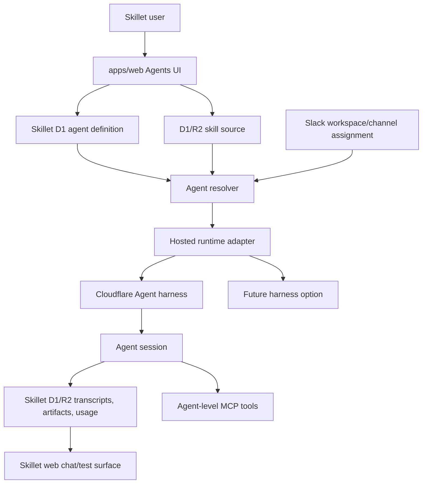
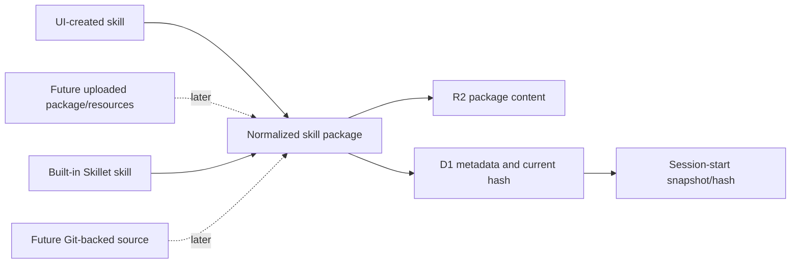

# feat: Skillet Custom Agents and Slack Workspaces via Cloudflare Agents

## Summary

Build Skillet's next agent layer in two steps:

1. **Custom Agents first:** a signed-in Skillet user can create a reusable
   agent with instructions, model policy, one primary skill source, optional
   tool/MCP bindings, and a normal Skillet web chat/test surface.
2. **Slack Workspaces second:** a connected Slack workspace assigns those
   existing agents to channels, so `@Skillet` in Slack routes to the right
   agent without inventing a separate Slack-only skill/tool system.

This replaces the earlier Slack-first framing. The Slack product is still
valuable, but custom skills, custom instructions, MCP connections, memory
policy, model policy, and governance belong to the **agent**. Slack is a
deployment surface for those agents.

The core product promise becomes:

> Build agents in Skillet. Then deploy them wherever they should work.

For the first custom-agent release, keep the product intentionally simple:

- One custom agent has one primary skill source.
- Skill sources start as instructions plus pasted `SKILL.md` text. Multi-file
  uploads and resources wait until the source-retention and purge model is
  proven.
- No visible skill version history, rollback UI, release channels, Git sync,
  or multi-skill routing in the first build.
- The UI can hide version history, but storage still uses immutable internal
  source/snapshot records and a current pointer so in-flight sessions remain
  stable.
- MCP is designed at the agent level, not the Slack level, but credentialed
  MCP execution is a follow-up after the chat-only core works.
- Slack workspaces assign existing agents to channels after the agent core
  works in the Skillet web UI.

Cloudflare remains the preferred runtime substrate: Workers, D1, R2, Durable
Objects, and likely Cloudflare Agents. Still, Skillet should own the product
contract and keep a narrow runtime adapter so the product model is not tightly
wound around one agent harness.

---

## Source Base

Product and competitor baseline:

- `docs/research/2026-06-26-claude-tag-research.md`
- Earlier version of this plan, now reframed from Slack-first to custom-agent
  first.

Cloudflare documentation checked on 2026-06-26:

- Cloudflare Slack Agent example:
  https://developers.cloudflare.com/agents/examples/slack-agent/
- Cloudflare Agents API:
  https://developers.cloudflare.com/agents/runtime/agents-api/
- Cloudflare Agent Skills:
  https://developers.cloudflare.com/agents/runtime/execution/agent-skills/
- Cloudflare MCP tool overview:
  https://developers.cloudflare.com/agents/tools/mcp/
- Cloudflare MCP client API:
  https://developers.cloudflare.com/agents/model-context-protocol/apis/client-api/
- Cloudflare Sandbox:
  https://developers.cloudflare.com/agents/tools/sandbox/
- Cloudflare Think:
  https://developers.cloudflare.com/agents/harnesses/think/

Relevant Skillet architecture:

- `docs/decisions/2026-06-23-office-hours-cloudflare-vertical-slice.md`
- `docs/decisions/2026-06-23-cloudflare-agent-runtime-threat-model.md`
- `docs/plans/2026-06-23-001-feat-hosted-agent-runtime-routing-plan.md`
- `docs/plans/2026-06-25-001-feat-provider-agnostic-agent-observability-plan.md`
- `packages/core/src/runtime/hosted-runtime.ts`
- `packages/core/src/runtime/cloudflare-agent.ts`
- `packages/core/src/runtime/route.ts`
- `packages/core/src/registry/types.ts`
- `packages/skills/office-hours/manifest.yaml`
- `packages/skills/ce-plan/manifest.yaml`
- `packages/skills/teach/manifest.yaml`

---

## Problem Frame

The Slack workspace idea exposed a more general product layer: Skillet needs a
way for users to create and operate their own agents. Those agents should be
usable in the web UI first and deployable to Slack later.

If Skillet builds custom skills, MCP connections, and instructions only inside
the Slack feature, the result is a narrow control plane that must be rebuilt
for web sessions, API sessions, routines, or future surfaces. If Skillet builds
the custom-agent layer first, Slack becomes a routing and policy surface over
the same reusable agent definitions.

Claude Tag validates the direction but also shows the complexity trap:

- It supports skills, repositories, connections, plugins, credentials,
  instructions, access bundles, and channel scope.
- Power users benefit from Git-backed skill workflows and version history.
- Non-technical users should not need GitHub or repository structure to create
  a useful agent.

The Skillet approach should keep the first experience lightweight while leaving
the source model open to Git-backed skills later.

---

## Vocabulary

- **Agent:** A named reusable worker in Skillet. It has purpose,
  instructions, model policy, one primary skill source in V1, optional MCP/tool
  bindings, memory policy, and governance.
- **Skill source:** The content an agent uses as its primary capability:
  built-in Skillet skill, UI-created instructions, pasted `SKILL.md`, later
  uploaded packages, and later Git-backed skill sources.
- **Skill package:** A normalized internal shape containing `SKILL.md`,
  optional resources, metadata, immutable content pointer, and content hash.
  Every source type should normalize into this shape.
- **Agent session:** A web or Slack conversation with one resolved agent. The
  session records the agent/skill snapshot it started with.
- **Surface:** A place an agent can run. V1 surfaces are Skillet web chat and,
  later, Slack workspace/channel assignments.
- **Slack workspace:** A connected Slack team that can assign existing Skillet
  agents to channels.
- **Channel assignment:** A binding from a Slack channel to one default agent.

---

## Product Vision

The long-term product should feel like this:

```text
Agents
  Exec Research
    Skill: CE Work or custom research skill
    Tools: GitHub MCP, SQL Dash MCP
    Surfaces: Web, #exec

  Founder Coach
    Skill: Office Hours
    Tools: none
    Surfaces: Web, #founders

  Product Critic
    Skill: Custom product review skill
    Tools: Linear MCP
    Surfaces: Web, #product
```

The first flow should not mention Slack:

1. User opens `Agents` in Skillet.
2. User clicks `Create agent`.
3. User names the agent and writes instructions.
4. User chooses a starting point:
   - start blank;
   - start from a supported Skillet skill;
   - paste a custom `SKILL.md`.
5. User picks a model policy.
6. User tests the agent in Skillet web chat.
7. Later, user optionally connects approved MCP tools.

Only after that layer exists should Slack appear:

1. User opens `Slack`.
2. User connects a Slack workspace.
3. User assigns an existing agent to one or more channels.
4. In Slack, `@Skillet` resolves the channel assignment and runs that agent.

The skill-card shortcut still makes sense, but it should be a shortcut into
the agent model:

```text
Office Hours -> Create agent from this skill -> Test in web -> Deploy to Slack
```

---

## Scope Boundaries

### In Scope For The Overarching Roadmap

- Custom agent definitions owned by a user or Clerk org.
- Agent instructions and model policy.
- One primary skill source per agent.
- UI-created instructions and pasted no-script `SKILL.md` sources.
- Session-start snapshot/content-hash capture, without a visible version
  history system.
- Immutable internal source/snapshot records with a current pointer.
- Agent-level MCP connections after the chat-only core is proven.
- Provider/runtime adapter boundaries that keep Skillet product state outside
  Cloudflare Agent SQLite.
- Web chat/test surface for custom agents before Slack.
- Slack workspace/channel assignment of existing agents.

### Deferred To Follow-Up Work

- Git-backed skill sources.
- Multi-file skill packages and uploaded resource directories.
- Visible skill version history, compare, rollback, release channels, and
  branch tracking.
- Multi-skill agents and model-selected skill routing.
- Script execution through Agent Skills.
- Sandbox, Browser, Code Mode, and arbitrary HTTP credential proxying.
- Claude Tag-style reusable access bundles and inheritance summaries.
- Public marketplace or directory for user-created agents.

### Out Of Scope For The First Custom-Agent Core

- Slack OAuth/event ingress.
- Slack channel assignment UI.
- GitHub repository sync.
- Full credential vault product.
- Running untrusted user code.
- Rebuilding existing Office Hours, CE Plan, or Teach as custom agents.

---

## High-Level Technical Design





---

## Key Technical Decisions

- KTD1. Build **Custom Agents** before Slack Workspaces. Slack should assign
  existing agents to channels rather than owning a separate skill/tool model.
- KTD2. Keep V1 skill handling deliberately simple. No visible version
  history, rollback, Git sync, or release channels. Store immutable internal
  source/snapshot records and expose only the current pointer in the UI.
- KTD3. Normalize all source types into the same skill package shape. UI,
  pasted `SKILL.md`, later upload, built-in, and future Git-backed sources
  should feed the same runtime loader.
- KTD4. Keep script execution out of V1. Cloudflare Agent Skills can run
  scripts, but that widens the trust boundary. The first custom-agent core is
  instructions plus pasted `SKILL.md`; uploaded resources wait for a separate
  retention and trust-boundary plan.
- KTD5. Attach MCP at the agent level after Phase 0. Slack and other surfaces
  inherit the agent's tool policy after resolving the agent; they do not attach
  tools independently.
- KTD6. Keep Skillet D1/R2 authoritative. Cloudflare Agent SQLite can hold
  runtime state, but agent definitions, skill metadata, transcripts, usage,
  artifacts, and audit state stay in Skillet-owned stores.
- KTD7. Use Cloudflare Agents as the likely first runtime harness, but keep a
  hosted-runtime adapter between Skillet product state and the harness. This is
  not a strict portability mandate; it is a boundary that avoids schema and UI
  coupling to one agent SDK.
- KTD8. Treat Git-backed skills as a future source adapter, not a V1 product
  requirement. Power users should eventually connect a repository/path/branch,
  but non-technical users should never need Git to create an agent.
- KTD9. Slack Workspaces should launch after the agent core can be created,
  tested, and observed from the web UI.
- KTD10. New custom-agent sessions should fail closed when the custom-agent
  Cloudflare runtime is unavailable. Legacy CMA fallback remains a historical
  session concern, not a path for user-created agents.

---

## Requirements

- R1. A signed-in user can create, edit, disable, and run a custom agent from
  the Skillet web UI.
- R2. A custom agent has a name, description/purpose, instructions, model
  policy, and owner/org metadata.
- R3. A custom agent can start blank, from a supported built-in Skillet skill,
  or from UI-created instructions/pasted `SKILL.md` text. Uploaded packages are
  deferred until the source-retention and purge model is proven.
- R4. V1 skill sources are no-script. Scripts, executable assets, and unsafe
  binaries are rejected.
- R5. V1 does not expose visible version history or rollback, but source and
  snapshot storage is internally immutable and each started session records the
  resolved agent/skill snapshot or content hash.
- R6. Agent-level MCP connections can be attached only after explicit
  authorization and are available in every surface where that agent runs.
- R7. Secrets, bearer tokens, OAuth tokens, provider keys, and Slack bot tokens
  are never written to product D1 logs, transcripts, or public artifacts.
- R8. Agent sessions write usage, runtime route metadata, transcript, artifact,
  and observability state through Skillet-owned product ledgers.
- R9. The runtime adapter can run the same agent definition through Cloudflare
  Agents first and leaves room for another harness later.
- R10. Slack workspaces assign existing agents to channels; Slack does not own
  a separate custom skill or MCP model.
- R11. A channel assignment resolves to one default agent in V1.
- R12. Unauthorized or disabled agents fail closed before any model or tool
  call.
- R13. New custom-agent sessions do not fall back to Claude Managed Agents when
  the custom-agent Cloudflare runtime is unavailable.

---

## Proposed Data Model

Names are directional. The detailed custom-agent core plan should refine them.

| Table / Store | Purpose |
| --- | --- |
| `custom_agent` | Agent metadata: owner/org, name, purpose, instructions, model policy, primary skill source id, enabled state. |
| `agent_skill_source` | Current skill source pointer: source type, built-in skill id or immutable content pointer, manifest subset, current content hash, validation status. |
| `agent_skill_source_revision` | Immutable normalized source body or R2 pointer keyed by content hash. This stays internal in V1 and does not imply visible version history. |
| `agent_session_snapshot` | Resolved agent/skill hash or immutable snapshot pointer captured when a session starts. This is stability without a user-facing version system. |
| `agent_mcp_connection` | MCP server metadata, auth mode, status, and secret reference or OAuth state summary. |
| `agent_tool_binding` | Many-to-many binding between agents and approved MCP connections. |
| `runtime_route` | Existing or extended runtime binding from Skillet session to selected harness/runtime instance. |
| `slack_workspace_install` | Future Slack team install metadata and token reference. |
| `slack_channel_assignment` | Future binding from Slack channel to one default `custom_agent`. |

Future skill package content should live in R2 when it contains files or
resources. Simple instruction-only and pasted-`SKILL.md` agents can store text
directly in product tables or immutable text bodies and still synthesize a
package at runtime.

---

## Implementation Roadmap

### U1. Custom Agent Product Model

**Goal:** Add the general product model for custom agents before any Slack
workspace tables.

**Requirements:** R1, R2, R3, R5, R7, R8, R9

**Dependencies:** None

**Files:**

- `infra/d1/migrations/0015_custom_agents.sql`
- `packages/core/src/db/schema.ts`
- `packages/core/src/agents/types.ts`
- `packages/core/src/agents/policy.ts`
- `packages/core/src/agents/policy.test.ts`
- `packages/core/src/agents/schema.test.ts`

**Approach:** Model agent definitions as product state owned by a user or
Clerk org. Keep the initial model small: name, purpose, instructions, model
policy, primary skill source reference, enabled state, and metadata needed for
safe execution. Avoid visible version history in the first pass, but keep
source bodies and session snapshots internally immutable so a running session
is stable after an agent is edited.

**Patterns to follow:** Existing D1 conventions in `packages/core/src/db/schema.ts`,
runtime-route authority from `packages/core/src/runtime/route.ts`, and secret
hygiene patterns from session audit data.

**Test scenarios:**

- Owner can create an enabled custom agent with instructions and a model
  policy.
- Non-owner cannot read, edit, or run another owner's agent.
- Disabled agent fails closed before runtime/session creation.
- Persisted fields reject obvious secret/token field names.
- Session-start resolution records the agent id and content hash/snapshot
  reference.

**Verification:** The schema and policy resolver can produce an executable
agent policy without any Slack-specific input.

### U2. Web Agent Builder And Test Surface

**Goal:** Let users create and test custom agents in Skillet web before any
Slack integration exists.

**Requirements:** R1, R2, R3, R8, R9, R12

**Dependencies:** U1

**Files:**

- `apps/web/app/account/agents/page.tsx`
- `apps/web/app/account/agents/[agentId]/page.tsx`
- `apps/web/app/api/agents/route.ts`
- `apps/web/app/api/agents/[agentId]/route.ts`
- `apps/web/app/api/agents/[agentId]/sessions/route.ts`
- `apps/web/app/account/agents/__tests__/AgentsPage.test.tsx`
- `apps/web/app/api/agents/__tests__/route.test.ts`

**Approach:** Build a restrained agent admin surface: list agents, create/edit
agent, write instructions, choose a model policy, select a starting point, and
start a test session in the existing Skillet chat UI. This is the first
user-visible milestone and should not expose Slack concepts.

**Patterns to follow:** Existing account/admin fail-closed routing, current
skill start flows, and `ChatSurface` session behavior.

**Test scenarios:**

- User creates an instruction-only custom agent and starts a web test session.
- Updating agent instructions affects new sessions but not an in-flight
  session snapshot.
- Disabled agent cannot start a test session.
- Agent test session writes usage/runtime metadata through existing ledgers.

**Verification:** A user can create a custom agent and chat with it in Skillet
web with no Slack install and no database edits.

### U3. Text-Only Skill Source Support

**Goal:** Support instructions and pasted no-script `SKILL.md` sources for
custom agents while keeping uploads, Git, and visible versioning deferred.

**Requirements:** R3, R4, R5, R7, R8

**Dependencies:** U1, U2

**Files:**

- `apps/web/app/account/agents/[agentId]/skill/page.tsx`
- `apps/web/app/api/agents/[agentId]/skill/route.ts`
- `packages/core/src/agents/skill-source.ts`
- `packages/core/src/agents/skill-source.test.ts`
- `apps/agent-runtime/src/skills/source.ts`
- `apps/agent-runtime/src/skills/source.test.ts`

**Approach:** Normalize built-in, UI-created instructions, and pasted
`SKILL.md` content into one package-like runtime shape. Store immutable source
bodies or pointers behind a current source row. Do not build file upload,
visible version history, or Git integration now. Do preserve a content hash and
session snapshot so edits do not mutate an active conversation.

**Patterns to follow:** `packages/core/src/registry/types.ts` for manifest
validation, existing immutable content-hash posture, and Cloudflare Agent
Skills source concepts without adopting file upload or script execution.

**Test scenarios:**

- User saves a simple `SKILL.md` body from the UI and uses it in a new agent
  session.
- A source declaring scripts, executable assets, unsupported resources, network
  tool declarations, or oversized text is rejected.
- Runtime prompt assembly includes the selected skill source and excludes
  unrelated skill sources.
- Editing the current skill source does not alter a session that already
  captured a snapshot/hash.

**Verification:** A custom no-script skill can drive a web session and records
the skill content hash used by that session.

### U4. Harness-Neutral Runtime Adapter For Custom Agents

**Goal:** Run custom agents through Cloudflare Agents while keeping the Skillet
product model behind a narrow runtime adapter.

**Requirements:** R8, R9, R12

**Dependencies:** U1, U2, U3

**Files:**

- `packages/core/src/runtime/custom-agent.ts`
- `packages/core/src/runtime/custom-agent.test.ts`
- `apps/agent-runtime/src/custom-agent.ts`
- `apps/agent-runtime/src/custom-agent.test.ts`
- `apps/cf-agents-custom/src/index.ts`
- `apps/cf-agents-custom/src/index.test.ts`

**Approach:** Extend the existing hosted-runtime abstraction rather than
letting web routes call Cloudflare Agent APIs directly. The adapter receives a
resolved agent policy, starts or resumes a runtime session, streams events, and
writes product state back through Skillet stores. Cloudflare Agents are the
first implementation; the interface should be narrow enough that another
harness could be added later without changing the custom-agent product model.

**Patterns to follow:** `packages/core/src/runtime/hosted-runtime.ts`,
`packages/core/src/runtime/cloudflare-agent.ts`,
`apps/agent-runtime/src/index.ts`, and the Office Hours Cloudflare Agent
prototype.

**Test scenarios:**

- Resolved custom agent starts a Cloudflare-backed session through the adapter.
- Runtime route metadata records the selected harness and runtime instance.
- Runtime errors are classified and redacted before entering product logs.
- Unsupported or disabled runtime route fails closed.

**Verification:** Web custom-agent sessions run through the adapter and do not
require web routes to know Cloudflare Agent instance details.

### U5. Agent-Level MCP Connections

**Goal:** Add the first tool extension path by attaching approved MCP
connections to agents, not to Slack channels.

**Requirements:** R6, R7, R8, R9, R12

**Dependencies:** U1, U4

**Files:**

- `apps/web/app/account/agents/[agentId]/mcp/page.tsx`
- `apps/web/app/api/agents/[agentId]/mcp/route.ts`
- `apps/web/app/api/agents/[agentId]/mcp/callback/route.ts`
- `packages/core/src/agents/mcp-policy.ts`
- `packages/core/src/agents/mcp-policy.test.ts`
- `apps/agent-runtime/src/mcp/connections.ts`
- `apps/agent-runtime/src/mcp/connections.test.ts`

**Approach:** Start with a narrow MCP connection model: remote server URL,
stable server id, auth mode, status, and secret/OAuth reference. Expose MCP
tools to the model only after the agent policy resolver says the connection is
enabled for the current agent/session. Avoid arbitrary HTTP credential proxying
in this unit.

**Patterns to follow:** Cloudflare MCP client API for stable IDs, OAuth/custom
headers, and SSRF protections; Skillet telemetry redaction posture.

**Test scenarios:**

- Ready MCP connection exposes only that server's tools to the configured
  agent.
- Disabled MCP binding removes those tools from the next turn.
- OAuth-required connection surfaces action-required state before any model
  tool call.
- Failed MCP server does not block non-MCP turns.
- Bearer tokens and custom headers never appear in D1, logs, transcript, or
  model-visible text.

**Verification:** A test MCP server tool can be called from a web custom-agent
session and cannot be called after the binding is removed.

### U6. Slack Workspaces As Agent Deployment Surface

**Goal:** Assign existing custom agents to Slack channels after the custom
agent core works in web.

**Requirements:** R10, R11, R12

**Dependencies:** U1, U2, U4, U5

**Files:**

- `apps/slack-agent/package.json`
- `apps/slack-agent/wrangler.toml`
- `apps/slack-agent/src/index.ts`
- `apps/slack-agent/src/slack-oauth.ts`
- `apps/slack-agent/src/slack-signature.ts`
- `apps/slack-agent/src/event-router.ts`
- `apps/slack-agent/src/agents/SlackWorkspaceAgent.ts`
- `apps/slack-agent/src/agents/SlackSessionAgent.ts`
- `apps/web/app/account/slack/page.tsx`
- `apps/web/app/account/slack/workspaces/[workspaceId]/page.tsx`
- `apps/web/app/api/slack/workspaces/route.ts`
- `apps/web/app/api/slack/workspaces/[workspaceId]/assignments/route.ts`

**Approach:** Build Slack as a deployment surface over existing agents. The
workspace UI connects Slack, lists channels, and assigns one default agent to a
channel. Slack event handling resolves the channel assignment, then starts or
continues the same custom-agent session path used by web.

**Patterns to follow:** Cloudflare Slack Agent example for OAuth/events and
signature verification; custom-agent runtime adapter from U4; Skillet product
ledgers from U1/U2.

**Test scenarios:**

- Owner connects Slack workspace and assigns an existing agent to `#product`.
- Mentioning `@Skillet` in `#product` resolves that agent and creates one
  session.
- Replying in the same thread continues the same session.
- Mentioning `@Skillet` in an unassigned channel produces no model call.
- The same agent assigned to two channels preserves separate thread sessions.

**Verification:** Slack can run an existing custom agent without duplicating
skill source, MCP binding, or instruction models inside Slack-specific tables.

### U7. Future Source Adapters And Advanced Tool Tiers

**Goal:** Preserve a path to Git-backed skills and advanced Cloudflare tools
without building them now.

**Requirements:** R3, R4, R5, R9

**Dependencies:** U3, U4, U5

**Files:**

- `docs/custom-agent-sources.md`
- `docs/slack-agent-runbook.md`
- `docs/decisions/2026-06-26-custom-agent-v1-scope.md`

**Approach:** Document the extension points rather than implementing them:
Git-backed skill source as another adapter into normalized skill packages;
visible versioning as a later product layer; Sandbox/Browser/Code Mode as
separate tool tiers with explicit approval, retention, and observability
requirements.

**Patterns to follow:** Cloudflare Agent Skills for skill package layout,
Cloudflare Sandbox for future filesystem/code execution, and Claude Tag
research for power-user Git/repository expectations.

**Test expectation:** none -- documentation and scope control only.

**Verification:** The current plan makes clear what is intentionally not in
V1 and where future work should attach.

---

## Phased Delivery

### Phase 0: Custom Agent Core

- Agent definitions.
- Web create/edit/test flow.
- Instruction-only and pasted no-script `SKILL.md` source.
- First-class `chat_only` runtime/UI capability.
- Session snapshot/hash capture.
- Cloudflare-backed runtime through the hosted-runtime adapter.

This is the next detailed plan to write.

### Phase 0.5: Agent-Level MCP

- Approved MCP connections.
- Agent tool bindings.
- Secret hygiene and audit.
- Tool availability in web custom-agent sessions.

This should land before Slack unless the first Slack beta deliberately launches
without MCP.

### Phase 1: Slack Workspace Beta

- Slack OAuth/event ingress.
- Workspace page.
- Channel assignment to existing agents.
- Thread sessions with web mirrors.
- No Slack-specific skill or MCP authoring system.

### Phase 2: Certified Built-In Skills

- Certify CE Plan or Office Hours as selectable custom-agent starting points.
- Add surface-specific summaries and artifact handoff rules.
- Evaluate Teach later; its workspace UI makes it less natural for early Slack.

### Phase 3: Power-User Skill Sources

- GitHub repo/path/branch import.
- Commit hash tracking.
- Visible version history, compare, rollback, and release labels.
- Optional branch/latest tracking for advanced teams.

### Phase 4: Advanced Tool Tiers

- AI Search for knowledge-base agents.
- Browser with live-view approvals and recordings.
- Sandbox and Code Mode after explicit execution and network policy.
- Routines/scheduled tasks after safe posting rules.

---

## Risk Analysis

| Risk | Mitigation |
| --- | --- |
| Custom agents become too complex before proving demand | Phase 0 stays web-only and no-script; defer Git, visible versions, multi-skill routing, and Slack. |
| Non-technical users are forced into Git/repo concepts | UI-created and pasted text skills are first-class; Git is only a future source adapter. |
| Lack of visible versioning mutates active sessions | V1 avoids visible version history but stores immutable internal source/snapshot records. |
| Cloudflare Agent coupling leaks into product state | Use `hosted-runtime`-style adapter boundaries and keep canonical state in Skillet D1/R2. |
| MCP tools overreach | Attach tools per agent, expose only after policy resolution, redact all secrets, and log tool lifecycle without raw tokens. |
| Custom skills become arbitrary code execution | Reject scripts/executables in V1; keep file/resource uploads out of Phase 0 and require a separate Sandbox/script plan later. |
| Slack duplicates the custom-agent model | Slack assignments reference existing agents; no Slack-only skill source or MCP tables. |
| Power users eventually need Git-backed workflows | Reserve source-type extension points and normalize every source into the same package shape. |
| Missing custom-agent runtime silently creates legacy sessions | Treat custom agents as Cloudflare-only and fail closed instead of falling back to CMA. |

---

## Open Questions

- When should bounded file/resource upload graduate from follow-up into the
  product, and what purge evidence is required first?
- Should Phase 0.5 MCP land before any Slack beta, or can the first Slack beta
  launch with instruction/skill-only agents?
- Should custom agents be individual-user owned first or require Clerk orgs
  before MCP and Slack sharing?
- What is the minimum paid plan or usage policy for shared custom agents?
- Should the web test surface allow continuing sessions after an agent is
  edited, or should it clearly pin/edit-split sessions?
- Which built-in skill should be the first supported starting point for custom
  agents: CE Plan or Office Hours?

---

## Acceptance Examples

- Given a signed-in user creates `Product Critic` with custom instructions,
  when they start a web test session, Skillet runs that agent and records
  usage/runtime metadata.
- Given the user edits `Product Critic`, when an existing session continues,
  the session keeps the snapshot/hash it started with.
- Given the user pastes a no-script `SKILL.md`, when validation passes, they
  can select it as the agent's primary skill source.
- Given the pasted source declares scripts, executable assets, or network tool
  access, Skillet rejects it before runtime.
- Given an agent has an enabled MCP connection, when the model asks for a
  matching tool, only that agent's approved MCP tools are available.
- Given the agent is assigned to `#product` later, when a Slack user mentions
  `@Skillet`, the Slack surface resolves the existing agent rather than using a
  Slack-specific skill/tool configuration.

---

## Sources And Research

Claude Tag baseline:

- `docs/research/2026-06-26-claude-tag-research.md`
- Anthropic Claude Tag overview:
  https://claude.com/docs/claude-tag/overview
- Anthropic Claude Tag how it works:
  https://claude.com/docs/claude-tag/concepts/how-it-works
- Anthropic Claude Tag setup overview:
  https://claude.com/docs/claude-tag/admins/setup-overview
- Anthropic custom connections:
  https://claude.com/docs/claude-tag/admins/connections/custom

Cloudflare docs:

- Slack Agent example:
  https://developers.cloudflare.com/agents/examples/slack-agent/
- Agents API:
  https://developers.cloudflare.com/agents/runtime/agents-api/
- Agent Skills:
  https://developers.cloudflare.com/agents/runtime/execution/agent-skills/
- MCP:
  https://developers.cloudflare.com/agents/tools/mcp/
- MCP client API:
  https://developers.cloudflare.com/agents/model-context-protocol/apis/client-api/
- Sandbox:
  https://developers.cloudflare.com/agents/tools/sandbox/
- Think:
  https://developers.cloudflare.com/agents/harnesses/think/

Local Skillet context:

- `docs/decisions/2026-06-23-office-hours-cloudflare-vertical-slice.md`
- `docs/decisions/2026-06-23-cloudflare-agent-runtime-threat-model.md`
- `docs/plans/2026-06-23-001-feat-hosted-agent-runtime-routing-plan.md`
- `docs/plans/2026-06-25-001-feat-provider-agnostic-agent-observability-plan.md`
- `packages/core/src/runtime/hosted-runtime.ts`
- `packages/core/src/runtime/cloudflare-agent.ts`
- `packages/core/src/runtime/route.ts`
- `packages/core/src/registry/types.ts`
