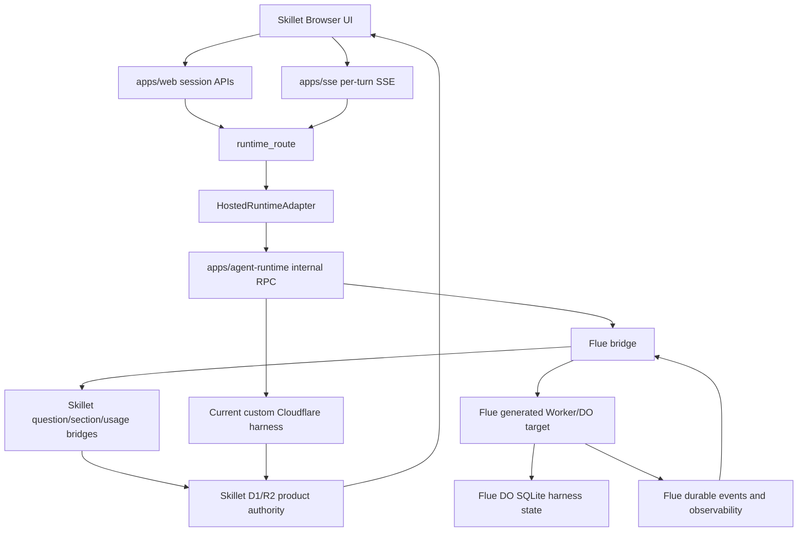
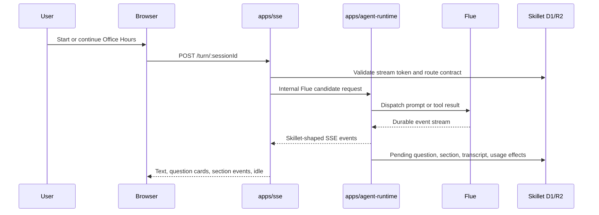
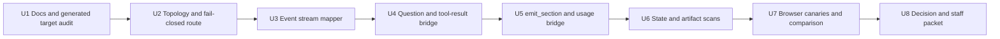

# Flue Office Hours Migration Spike - Plan

## Goal Capsule

| Field | Plan |
|---|---|
| Objective | Determine whether Flue can replace Skillet's custom Office Hours harness direction, or the Project Think direction, while preserving the current Skillet product contract. |
| First slice | Office Hours only, behind `cloudflare-flue-office-hours-v0`, in a separate worktree/branch, with the current custom Cloudflare harness as the control. |
| Core clarification | Flue is a framework lane built on Pi and targeting Cloudflare Agents SDK. It should be evaluated as `Cloudflare Agents + Flue`, not as `Cloudflare Agents + Project Think + Flue`. |
| Authority hierarchy | Skillet browser/session contract > D1/R2 product authority > spend/auth/rollback invariants > Flue generated topology > code deletion. |
| Confidence model | Faster than the Think run: generated-target audit first, then bridge unit tests, side-port product canaries, state scans, comparison packets, and only then staff canary. |
| Stop conditions | Stop if Flue forces a public client contract rewrite, makes Flue DO SQLite product authority, cannot expose safe usage/cost data, cannot map delayed tool results and `emit_section`, or needs more Skillet glue than Think. |
| Tail ownership | If Flue passes Office Hours, turn the process into a reusable playbook for CE Plan and Teach. If it does not, record whether Project Think or the current custom harness remains the better path. |

---

## Product Contract

### Summary

This spike evaluates Flue as a higher-order standard framework for Office Hours.
The prior Project Think work proved a useful process: do deep repo research, preserve Skillet's contract first, use real browser/product evidence, compare against the current harness, scan durable state, and avoid judging model behavior until protocol and tool-call bridges are correct.

The most important difference is architectural.
Project Think is a Cloudflare harness/base class with an opinionated chat agent surface.
Flue is a framework that targets Cloudflare Agents and is built on Pi, with generated Durable Object classes, generated Wrangler bindings, Durable Streams, optional React hooks, and framework-owned agent/workflow lifecycle.
That makes Flue potentially more powerful and thinner for Skillet over time, but it also raises deployment, state-authority, and generated-topology risks that Think did not fully share.

The spike should answer one concrete question:

Can Flue sit behind the existing Skillet Office Hours runtime contract, preserve D1/R2 authority, and reduce Skillet-owned harness code enough to justify choosing Flue over Project Think or the current custom harness?

### Problem Frame

Skillet already has a working Cloudflare Agents runtime path for Office Hours, but the harness is custom.
Project Think now has local product-path proof and staff-canary readiness, but it still requires Skillet-specific bridge code for structured questions, section side effects, usage evidence, and product routing.

Flue could be a better long-term destination if it absorbs more of the harness/framework burden and gives Skillet a thinner app-specific layer.
The danger is assuming "standard framework" automatically means less maintenance.
Flue's Cloudflare target generates Durable Object classes, stores canonical conversation/session state in DO SQLite, owns important lifecycle methods, and can bring a different client/runtime composition model.
Those pieces must be inspected before integration, not discovered after product code is wired to them.

### Requirements

**Product Contract Preservation**

- R1. Preserve the real Skillet browser contract: `apps/web` creates sessions, `apps/sse` handles per-turn SSE, `apps/agent-runtime` remains internal, and stream tokens stay in `sessionStorage` plus hashed durable storage only.
- R2. Preserve the Office Hours product flow: create session, stream a turn, ask structured questions, accept delayed answers, draft sections, publish a complete seven-section artifact, and resume saved sessions.
- R3. Preserve D1/R2 as product authority for artifacts, pending questions, transcripts, usage, audit state, and runtime routing. Flue DO SQLite may be harness state only.
- R4. Preserve spend, auth, entitlement, rate-limit, kill-switch, and rollback behavior across create, resume, and turn paths.
- R5. Preserve the Skillet SSE event contract. Flue event streams, Durable Streams, message parts, and `message_end` events must be adapted to Skillet-shaped SSE rather than forcing a browser rewrite in this spike.

**Flue Adoption**

- R6. Evaluate Flue as an alternative candidate lane, not a layer on top of Project Think.
- R7. Use the explicit runtime contract `cloudflare-flue-office-hours-v0`, default-off and staff/local only.
- R8. Start with generated-target and dependency proof. Do not add Flue to the product runtime or publish a candidate route until generated Durable Object classes, bindings, migrations, and deploy behavior are understood.
- R9. Keep generated Flue routes, React hooks, and default clients out of the public product path unless a later product decision intentionally adopts them.
- R10. If Flue requires generated Wrangler config or generated deploy artifacts, document the deploy pipeline integration before any canary.
- R11. Reconcile Flue's resolved `agents` package version with Skillet's current `agents` version before product-path work.

**Bridge Behavior**

- R12. Map Flue text, tool, reasoning, status, replay, and completed-message events into the current Skillet SSE stream.
- R13. Prove delayed question handling end to end: Flue asks a question, Skillet persists a pending question, the browser submits `custom_tool_result`, and the same Flue session continues.
- R14. Prove `emit_section` side effects through existing Skillet validation and D1/R2 write paths, including idempotency under retry/replay/recovery.
- R15. Prove usage/cost telemetry through Flue observability or Skillet provider/gateway instrumentation, and keep degraded accounting fail-closed.
- R16. Scan Flue durable state, generated artifacts, eval files, R2 markdown, and logs for operational secrets using seeded canary values.

**Evidence and Comparison**

- R17. Reuse the Think comparison spine: side-port stack, SC1/SC5/SC6 browser canaries, product evidence collector, product comparison packet, D1/R2 evidence, redaction scans, and rollback drill.
- R18. Compare Flue against the current custom Cloudflare harness on the same model before treating quality differences as framework conclusions.
- R19. Treat Project Think as a benchmark lane, not a dependency. It can inform what "good enough" looks like, but Flue does not need to pass by matching Think internals.
- R20. Separate harness/framework findings from model/provider findings. GLM/Workers AI pacing, question count, and cost are separate from Flue viability unless the framework causes them.

**Decision Output**

- R21. Produce a final decision document that chooses one of four outcomes: advance Flue to staff canary, keep Project Think as the standard harness path, stay custom for now, or defer Flue until upstream/dependency blockers clear.
- R22. If Flue advances, produce a staff-canary packet with route isolation, browser evidence, D1/R2 evidence, state scans, comparison results, known caveats, and rollback steps.
- R23. If Flue does not advance, update the standard harness comparison with exact blockers and whether those blockers are temporary, upstream, or architectural.

### Acceptance Examples

- AE1. A Flue fit dossier lists exact Flue package versions, generated Durable Object classes, generated bindings, required migrations, generated Wrangler behavior, resolved `agents` version, install footprint, and deploy implications.
- AE2. A disabled Flue candidate route returns safe fail-closed responses, never echoes stream tokens or request bodies, and does not affect current or Think routes.
- AE3. A local Flue candidate can create an Office Hours session through the Skillet product path, stream a normal user turn, emit Skillet-shaped SSE, and settle without falling back to the current custom harness.
- AE4. A structured Flue question appears in the existing browser question UI, the browser submits `kind: "custom_tool_result"`, the bridge maps that answer back into Flue, and the same Flue session continues without duplicate pending questions.
- AE5. A Flue `emit_section` action persists through existing Skillet artifact code, emits the same public section event shape, writes R2 markdown, and remains idempotent under replay.
- AE6. A seeded-secret scan finds no raw stream tokens, internal RPC secrets, provider keys, AI Gateway auth tokens, bearer tokens, cookies, or auth headers in Flue-owned state, generated eval artifacts, logs, or R2 markdown.
- AE7. SC1, SC5, SC6, and full-publish product packets can show whether Flue is non-inferior to the current custom harness for functional behavior, product side effects, usage/cost, latency, and browser outcome.
- AE8. The final decision can explain, in one page, whether Flue is a better standardization path than Project Think for Skillet and why.

### Scope Boundaries

In scope:

- Office Hours Flue migration spike behind `cloudflare-flue-office-hours-v0`.
- Flue source/docs research and generated-target audit.
- Candidate routing, event stream mapping, delayed-question bridge, `emit_section` bridge, usage/cost bridge, and state scans.
- Runtime comparison harness updates needed for Flue browser/product evidence.
- Staff/local canary packet if, and only if, local gates pass.
- Updating the standard harness comparison and decision docs.

Deferred to follow-up work:

- CE Plan and Teach Flue migrations.
- Any public default switch.
- Adopting Flue React hooks or Flue client protocol in the Skillet browser.
- Replacing Project Think work already completed.
- Production deploy of Flue-generated Durable Objects.
- Model/provider optimization such as GLM effort tuning or alternate Workers AI models.

Out of scope:

- Replacing Skillet D1/R2 product stores with Flue DO SQLite.
- Query-param runtime selection or a public runtime picker.
- Deleting the current custom Cloudflare harness.
- Accepting operational secrets in durable framework state because Flue or Pi stores broad session state by default.
- Reworking billing, Clerk, or anonymous free-tier policy.

---

## Planning Contract

### Key Technical Decisions

- KTD1. Treat Flue as a framework candidate, not a harness stacked on Project Think. The comparison is `Cloudflare Agents + current custom harness` versus `Cloudflare Agents + Flue`, with Think as a learned benchmark.
- KTD2. Keep Skillet's public product contract stable. The browser, `/api/sessions`, per-turn `/turn`, SSE event shapes, stream-token rules, and D1/R2 side effects are the contract to preserve.
- KTD3. Generate and audit before integrating. Flue's generated Cloudflare target is a deploy topology change, not a normal library import.
- KTD4. Keep Flue DO SQLite as harness state. It may support replay, durable streams, and framework recovery, but product truth remains in Skillet D1/R2.
- KTD5. Use side-port local development from the start. The Think run lost time to port ownership and mixed-stack ambiguity; this spike must begin with `pnpm dev:ports` and `pnpm dev:stack`.
- KTD6. Reuse the proven product evidence tools. Do not build a new proof strategy until the current comparison packet, browser verifier, D1/R2 collector, and redaction scans are exhausted.
- KTD7. Fix bridge correctness before judging model behavior. The Think run showed that protocol bugs can look like model slowness or bad UX.
- KTD8. Make telemetry part of the migration, not an afterthought. Time to first output, model request spans, cost rows, and usage rows must identify whether any issue is Flue, Pi, Workers AI, or the model.
- KTD9. Advance Flue only if it makes Skillet's owned layer meaningfully thinner than Think. If Flue requires the same bridges plus generated deploy complexity, Project Think remains the lower-risk standardization path.

### Current vs Target Shape

| Layer | Current Office Hours | Project Think lane | Flue spike target |
|---|---|---|---|
| Runtime/platform | Cloudflare Agents SDK | Cloudflare Agents SDK | Cloudflare Agents SDK |
| Harness/framework | Skillet custom `base-agent-manual-sse` | Project Think | Flue framework built on Pi |
| Browser transport | Skillet per-turn SSE | Skillet per-turn SSE via Think bridge | Skillet per-turn SSE via Flue bridge |
| Product authority | Skillet D1/R2 | Skillet D1/R2 | Skillet D1/R2 |
| Framework durable state | Custom DO/session state | Think DO harness state | Flue generated DO SQLite harness state |
| Deploy topology | Existing `apps/agent-runtime` Worker | Existing Worker plus Think DO | Generated Flue DO classes/bindings and deploy integration to prove |
| Candidate route | Production control | `cloudflare-think-office-hours-v0` | `cloudflare-flue-office-hours-v0` |
| Readiness today | Production control | Staff-canary candidate | Preflight only |

### High-Level Technical Design







### Think Process Learnings to Bake In

| Learning from Think | Flue spike application |
|---|---|
| Deep source research found upstream primitives that were invisible from docs alone. | Inspect Flue generated output, runtime APIs, Pi integration, issues, and deploy topology before product integration. |
| Mixed local ports caused false evidence risk. | Begin every browser/product proof with per-worktree `.dev.ports.local` and side-port stack ownership checks. |
| Route isolation was essential. | Keep `cloudflare-flue-office-hours-v0` explicit, default-off, and independently blocked from current/Think routes. |
| Protocol bugs looked like model behavior. | Prove event, question, and section bridges before evaluating GLM quality, latency, or question count. |
| Synthetic question IDs and browser verifier logic needed hardening. | Build qid/idempotency and ready-state verifier behavior into Flue tests before full-publish runs. |
| State redaction was useful as an operational-secret scan, not a philosophical ban on framework state. | Seed operational secrets and scan Flue DO SQLite/generated artifacts while accepting expected conversation/product content where documented. |
| Browser video plus D1/R2 evidence settled ambiguity. | Require recording, screenshots, product evidence JSON, and comparison packet for any canary recommendation. |
| Time-to-first instrumentation helped separate model/provider/harness issues. | Capture first output, model request start/end, provider, usage, and cost for Flue from the first runnable path. |

### Risks and Mitigations

| Risk | Mitigation |
|---|---|
| Flue generated topology cannot be cleanly mounted inside `apps/agent-runtime` | U1 and U2 prove generated classes, bindings, migrations, Wrangler config, and deploy path before product code depends on them. |
| Flue's preferred client/API surface conflicts with Skillet browser/SSE | U3 adapts Flue events to Skillet SSE; adopting Flue React/client hooks is explicitly out of scope. |
| Flue DO SQLite becomes tempting as product authority | U5 requires all product side effects to go through existing D1/R2 paths and tests that product evidence does not depend on Flue state. |
| Pi/Flue tool semantics do not support delayed answers cleanly | U4 proves one pending question plus browser answer round-trip before section or full-publish work. |
| Generated deploy artifacts introduce production risk | U2 records deploy implications and U8 blocks staff canary unless rollback and migration plan are explicit. |
| Flue dependency surface is too large or version-conflicted | U1 records footprint and `agents` version reconciliation; the candidate remains disabled until resolved. |
| Usage/cost evidence is missing or late | U5 requires model span/usage rows and fail-closed degraded accounting before product canary. |
| Flue requires as much custom bridge code as Think plus more deploy complexity | U8 explicitly compares maintenance delta and can choose Think or custom instead. |

### Sources and Research Inputs

- `docs/plans/2026-06-27-001-feat-standard-agent-harness-migration-plan.md` for the original Think/Pi/Flue migration frame.
- `docs/plans/2026-06-27-002-feat-project-think-harness-migration-plan.md` for the Project Think migration process to reuse.
- `docs/evals/office-hours-standard-harness-comparison.md` for current candidate readiness and Flue blockers.
- `docs/decisions/2026-06-27-agent-harness-api-fit.md` for Flue generated-target findings.
- `docs/decisions/2026-06-29-project-think-staff-canary-packet.md` for the latest Think evidence and process lessons.
- `docs/runtime-routing-runbook.md` for runtime routing and rollback posture.
- `apps/agent-runtime/src/harness-candidates/flue-office-hours-preflight.ts` for current Flue preflight metadata and blockers.
- `packages/core/src/evals/office-hours-runtime/descriptors.ts` for the `cloudflare-flue` descriptor.
- Cloudflare blog, "Agents platform and Flue SDK": `https://blog.cloudflare.com/agents-platform-flue-sdk/`
- Flue quickstart docs: `https://flueframework.com/docs/getting-started/quickstart/`
- Flue Cloudflare target docs: `https://flueframework.com/docs/guide/targets/cloudflare/`
- Flue observability docs: `https://flueframework.com/docs/guide/observability/`
- Project Think docs: `https://github.com/cloudflare/agents/blob/main/docs/think/index.md`

---

## Implementation Units

### U1. Refresh Flue Fit Dossier and Package Topology

- **Goal:** Turn Flue from an attractive idea into a source-backed, version-pinned candidate map.
- **Requirements:** R6, R8, R10, R11, R21, AE1
- **Dependencies:** Current Flue docs, Cloudflare Agents repo state, existing Flue preflight file.
- **Files likely touched:**
  - `docs/decisions/2026-06-29-flue-office-hours-fit.md`
  - `apps/agent-runtime/src/harness-candidates/flue-office-hours-preflight.ts`
  - `apps/agent-runtime/src/harness-candidates/flue-office-hours-preflight.test.ts`
  - `packages/core/src/evals/office-hours-runtime/descriptors.ts`
  - `packages/core/src/evals/office-hours-runtime/descriptors.test.ts`

Implementation approach:

1. Refresh Flue docs and package metadata at execution time.
2. Record exact `@flue/runtime`, `@flue/cli`, Pi, and `agents` versions.
3. Reproduce or refresh the generated Cloudflare target audit in a scratch area outside product routing.
4. Document generated Durable Object classes, generated bindings, required migrations, generated Wrangler config, generated module count, upload size, dependency footprint, and any generated source-root restrictions.
5. Update the preflight gate to represent current facts rather than stale beta findings.

Patterns to follow:

- Treat generated target output as evidence, not as code to hand-edit.
- Keep Flue dependencies out of product `package.json` until U2 says the topology can be mounted safely.
- If generated output changes materially from the old beta.7 audit, prefer recording the delta before coding around it.

Test scenarios:

- Preflight reports blockers when dependencies are absent.
- Preflight reports blockers when generated DO migrations or deploy integration are missing.
- Descriptor still marks `cloudflare-flue` as `preflight_only` and product-path disabled.
- Existing Think and current Cloudflare descriptors remain unchanged.

Verification commands:

```bash
pnpm -C apps/agent-runtime exec vitest run src/harness-candidates/flue-office-hours-preflight.test.ts
pnpm -C packages/core exec vitest run src/evals/office-hours-runtime/descriptors.test.ts
```

### U2. Generated Topology and Fail-Closed Candidate Route

- **Goal:** Prove Flue can be represented as a disabled internal candidate without disturbing current or Think runtime routes.
- **Requirements:** R1, R4, R7, R8, R10, R11, AE2
- **Dependencies:** U1 generated-target dossier.
- **Files likely touched:**
  - `apps/agent-runtime/src/index.ts`
  - `apps/agent-runtime/src/harness-candidates/registry.ts`
  - `apps/agent-runtime/src/harness-candidates/flue-office-hours.ts`
  - `apps/agent-runtime/src/harness-candidates/flue-office-hours.test.ts`
  - `packages/core/src/runtime/cloudflare-agent.ts`
  - `packages/core/src/runtime/cloudflare-agent.test.ts`

Implementation approach:

1. Add or confirm a Flue candidate route under `/internal/office-hours/flue`.
2. Keep it default-off behind explicit env/config such as `FLUE_OFFICE_HOURS_CANDIDATE_ENABLED`.
3. Return safe disabled responses before any Flue dispatch when the candidate is not enabled.
4. Decide whether Flue is mounted as a generated Worker sub-target, imported handler, service binding, or separate Worker. Document why.
5. Keep current and Think routes green during every step.

Patterns to follow:

- Copy the Think route-isolation posture, not the implementation details.
- No query-param runtime selection.
- No public route or browser picker.
- No request body/token echo in disabled or error responses.

Test scenarios:

- Disabled Flue route returns a safe non-2xx response and does not inspect/echo sensitive request data.
- Current route still reaches the custom Cloudflare harness.
- Think route behavior remains unchanged.
- Runtime contract registry recognizes `cloudflare-flue-office-hours-v0` only where explicitly configured.
- Kill switch and staff/local gates cannot accidentally route public users to Flue.

Verification commands:

```bash
pnpm -C apps/agent-runtime exec vitest run src/harness-candidates/flue-office-hours.test.ts
pnpm -C packages/core exec vitest run src/runtime/cloudflare-agent.test.ts
```

### U3. Flue Event Stream to Skillet SSE Mapper

- **Goal:** Adapt Flue durable event streams to Skillet's per-turn SSE protocol without changing the browser.
- **Requirements:** R1, R5, R12, R17, AE3
- **Dependencies:** U2 route topology.
- **Files likely touched:**
  - `apps/agent-runtime/src/harness-candidates/flue-office-hours.ts`
  - `apps/agent-runtime/src/harness-candidates/flue-office-hours-agent.ts`
  - `apps/agent-runtime/src/harness-candidates/flue-office-hours-agent.test.ts`
  - `apps/sse/src/handlers/stream-runtime.test.ts`
  - `scripts/evals/office-hours-runtime/browser-verify-cma.ts`
  - `scripts/evals/office-hours-runtime/browser-verify-cma.test.ts`

Implementation approach:

1. Identify Flue event types for text deltas, completed assistant messages, tool calls, tool results, reasoning/status events, errors, and replay snapshots.
2. Map those events into existing Skillet SSE frames.
3. Treat Flue's completed-message event as authoritative when available; streaming deltas are best-effort browser UX.
4. Preserve reconnect/replay ordering and avoid duplicate final assistant messages.
5. Capture first-output and model-span timing from the first working mapper.

Patterns to follow:

- Do not parse human text to infer tool calls unless Flue provides no structured alternative, and document that as a blocker if needed.
- Do not send reasoning traces or internal framework JSON to the browser transcript.
- Keep browser verifier fixes from Think: question-looking text after `Ready` should not fail a completed artifact.

Test scenarios:

- Text delta maps to visible assistant text.
- Completed message maps to one durable assistant message.
- Tool events do not leak raw JSON into the user transcript.
- Error events become safe Skillet error frames.
- Replay plus live stream does not duplicate text or final messages.
- Time-to-first-output metadata is captured.

Verification commands:

```bash
pnpm -C apps/agent-runtime exec vitest run src/harness-candidates/flue-office-hours-agent.test.ts
pnpm -C apps/sse exec vitest run src/handlers/stream-runtime.test.ts
pnpm exec vitest run scripts/evals/office-hours-runtime/browser-verify-cma.test.ts
```

### U4. Delayed Question and Tool-Result Bridge

- **Goal:** Prove Flue can pause for a Skillet question and resume from the browser's later answer.
- **Requirements:** R2, R13, R17, AE4
- **Dependencies:** U3 event mapper.
- **Files likely touched:**
  - `apps/agent-runtime/src/harness-candidates/flue-office-hours-agent.ts`
  - `apps/agent-runtime/src/harness-candidates/flue-office-hours-agent.test.ts`
  - `apps/sse/src/handlers/stream-runtime.test.ts`
  - `scripts/evals/office-hours-runtime/question-answering.ts`
  - `scripts/evals/office-hours-runtime/question-answering.test.ts`

Implementation approach:

1. Map Flue/Pi question or human-input primitives to Skillet's pending-question ledger.
2. Emit the same browser-facing question card event shape used by the current harness and Think.
3. Convert browser `custom_tool_result` submissions back into the Flue continuation/submission protocol.
4. Generate stable, collision-resistant question IDs from Flue event/tool IDs.
5. Reject or dedupe stale, duplicate, cross-session, and wrong-tool answers.

Patterns to follow:

- Carry forward the Think lesson: product pending-question creation should follow the normal product path, not a parallel synthetic-only event that the gateway ignores.
- Test repeated questions before browser canary.
- Keep answer acceptance in Skillet D1 so product evidence can audit it independently of Flue state.

Test scenarios:

- Structured question persists to `pending_question`.
- Browser answer resumes the same Flue session.
- Duplicate answer does not create duplicate tool results.
- Stale qid is rejected safely.
- Two sequential questions do not collide.
- Product evidence shows accepted question count and transcript continuity.

Verification commands:

```bash
pnpm -C apps/agent-runtime exec vitest run src/harness-candidates/flue-office-hours-agent.test.ts
pnpm -C apps/sse exec vitest run src/handlers/stream-runtime.test.ts
pnpm exec vitest run scripts/evals/office-hours-runtime/question-answering.test.ts
```

### U5. `emit_section`, Artifact Authority, and Usage Bridge

- **Goal:** Route Flue tool/action effects through Skillet product authority and usage accounting.
- **Requirements:** R3, R14, R15, R20, AE5
- **Dependencies:** U3 event mapper and U4 question bridge.
- **Files likely touched:**
  - `apps/agent-runtime/src/harness-candidates/flue-office-hours-agent.ts`
  - `apps/agent-runtime/src/harness-candidates/flue-office-hours-agent.test.ts`
  - `apps/sse/src/handlers/stream-runtime.test.ts`
  - `packages/core/src/runtime/cloudflare-agent.test.ts`
  - `scripts/evals/office-hours-runtime/model-usage.ts`
  - `scripts/evals/office-hours-runtime/model-usage.test.ts`
  - `scripts/evals/office-hours-runtime/collect-product-canary-evidence.ts`
  - `scripts/evals/office-hours-runtime/collect-product-canary-evidence.test.ts`

Implementation approach:

1. Map Flue tool/action calls for `emit_section` into the same product-side validation and persistence path used by the current harness.
2. Return tool results to Flue only after product side effects are committed or safely rejected.
3. Use `tool_effect` and existing artifact revision semantics for idempotency.
4. Map Flue observability/model events into Skillet `session_usage_event` rows, including provider, model, tokens, cost nanos, latency, and span IDs where available.
5. Fail closed if a turn needs billable model usage but usage evidence is unavailable.

Patterns to follow:

- Do not let Flue-generated state become the only evidence that a section was drafted.
- Prefer shared product helpers over Flue-specific persistence forks.
- If Flue observability events can contain prompts or tool values, sanitize before durable Skillet telemetry.

Test scenarios:

- Valid `emit_section` writes one section revision, one tool effect, and R2 markdown when appropriate.
- Replayed or recovered Flue event does not duplicate the section effect.
- Invalid section payload produces a safe tool error and no partial product write.
- Usage rows are present for model turns.
- Missing usage data blocks promotion.
- Time-to-first-output and model latency attribution are captured in product/eval artifacts.

Verification commands:

```bash
pnpm -C apps/agent-runtime exec vitest run src/harness-candidates/flue-office-hours-agent.test.ts
pnpm -C apps/sse exec vitest run src/handlers/stream-runtime.test.ts
pnpm exec vitest run scripts/evals/office-hours-runtime/model-usage.test.ts scripts/evals/office-hours-runtime/collect-product-canary-evidence.test.ts
```

### U6. Flue State, Generated Artifact, and Product Redaction Scans

- **Goal:** Prove Flue does not durably store operational secrets in places Skillet cannot accept.
- **Requirements:** R3, R16, R17, AE6
- **Dependencies:** U2 generated topology and U5 product bridge.
- **Files likely touched:**
  - `scripts/evals/office-hours-runtime/scan-flue-sqlite-state.ts`
  - `scripts/evals/office-hours-runtime/scan-flue-sqlite-state.test.ts`
  - `scripts/evals/office-hours-runtime/scan-redaction.ts`
  - `scripts/evals/office-hours-runtime/scan-redaction.test.ts`
  - `docs/decisions/2026-06-29-flue-office-hours-fit.md`

Implementation approach:

1. Generalize the Think SQLite scan or add a Flue-specific scan for Flue generated DO SQLite files under local `.wrangler/state`.
2. Include FlueRegistry and generated agent/workflow DO state.
3. Seed fake operational secrets into local env/request paths and assert scans catch them when deliberately placed.
4. Scan generated target output, eval artifacts, R2 markdown dumps, and logs.
5. Distinguish expected customer conversation/product artifact content from unacceptable operational secrets.

Patterns to follow:

- This is a hard canary gate for operational secrets, not a demand that framework state contain no conversation text.
- Keep allowlists narrow and documented.
- Include binary/blob columns where SQLite stores data as blobs.

Test scenarios:

- Seeded bearer token in generated state fails the scan.
- Seeded stream token hash is allowed only where hashed and expected.
- Safe Flue metadata passes.
- Generated artifact files are scanned for API key, auth header, cookie, bearer, and stream-token patterns.
- R2 markdown scan remains clean for operational secrets.

Verification commands:

```bash
pnpm exec vitest run scripts/evals/office-hours-runtime/scan-flue-sqlite-state.test.ts scripts/evals/office-hours-runtime/scan-redaction.test.ts
```

### U7. Product-Path Browser Canaries and Comparison Packet

- **Goal:** Run Flue through the same real-product evidence gates that made the Think assessment credible.
- **Requirements:** R17, R18, R19, R20, AE3, AE4, AE5, AE7
- **Dependencies:** U3 through U6.
- **Files likely touched:**
  - `scripts/evals/office-hours-runtime/browser-verify-cma.ts`
  - `scripts/evals/office-hours-runtime/build-product-comparison-packet.ts`
  - `scripts/evals/office-hours-runtime/build-product-comparison-packet.test.ts`
  - `docs/evals/office-hours-standard-harness-comparison.md`
  - `docs/runtime-routing-runbook.md`

Implementation approach:

1. Start the separate-worktree stack with `pnpm dev:ports` and `pnpm dev:stack`.
2. Confirm side-port ownership before canaries and do not touch other worktrees' stacks.
3. Run SC1, SC5, SC6, and full-publish through the real browser/product path.
4. Collect product evidence with expected contract `cloudflare-flue-office-hours-v0`.
5. Build current-custom versus Flue product comparison packets.
6. Optionally include Think as a third lane for benchmark context, but never make Think an execution dependency.
7. Record video and timing evidence for the end-user behavior.

Patterns to follow:

- No browser parity claim without D1/R2 evidence.
- No product comparison packet if runtime route fell back to the control.
- Track first response timing and model request spans so slow behavior can be attributed to model/provider/framework rather than guessed.
- Keep GLM/Workers AI conclusions separate from Flue bridge conclusions.

Test scenarios:

- SC1 reaches useful synthesis with no browser errors.
- SC5 asks and accepts a structured question.
- SC6 drafts and mutates sections through product side effects.
- Full publish reaches `Ready` with seven canonical sections.
- Product evidence includes runtime route, question rows, tool effects, section revisions, usage events, transcript rows, R2 key, and artifact markdown.
- Comparison packet has no automatic blockers or clearly identifies blockers.
- Video shows no raw tool JSON, no stuck pending state, and no fallback-route confusion.

Verification commands:

```bash
pnpm dev:ports
pnpm dev:stack -- --print
pnpm dev:stack
pnpm exec tsx scripts/evals/office-hours-runtime/check-local-port-owners.ts
pnpm exec tsx scripts/evals/office-hours-runtime/collect-product-canary-evidence.ts --expected-runtime-contract cloudflare-flue-office-hours-v0
pnpm exec tsx scripts/evals/office-hours-runtime/build-product-comparison-packet.ts
```

Exact canary command flags should be filled in by U7 based on the current browser verifier CLI and generated `.dev.ports.local` values.

### U8. Decision Record, Staff Canary Packet, and Handoff

- **Goal:** Turn evidence into a clear go/no-go decision and make the branch portable for the next worktree.
- **Requirements:** R21, R22, R23, AE8
- **Dependencies:** U1 through U7.
- **Files likely touched:**
  - `docs/decisions/2026-06-29-flue-office-hours-decision.md`
  - `docs/decisions/2026-06-29-flue-office-hours-staff-canary-packet.md`
  - `docs/evals/office-hours-standard-harness-comparison.md`
  - `docs/runtime-routing-runbook.md`
  - `packages/core/src/evals/office-hours-runtime/descriptors.ts`
  - `packages/core/src/evals/office-hours-runtime/descriptors.test.ts`
  - `packages/core/src/evals/office-hours-runtime/report.test.ts`

Implementation approach:

1. Update the standard harness comparison with Flue evidence, blockers, and maintenance delta.
2. Decide whether Flue advances, Think remains the preferred standard path, the current custom harness stays, or Flue is deferred.
3. If Flue advances, create a staff-canary packet modeled on the Think packet: route isolation, evidence table, fixed blockers, staff shape, rollback, acceptance criteria, pause criteria, and known caveats.
4. If Flue does not advance, record exact blockers and whether each is upstream, deploy-topology, product-contract, or Skillet-owned bridge work.
5. Leave the branch with enough docs and tests that a new worktree can resume without conversational context.

Patterns to follow:

- A staff-canary packet is not allowed unless U7 product evidence and U6 scans pass.
- Do not claim Flue is "cleaner" without naming what Skillet-owned code it removes or avoids compared with Think.
- Keep production default unchanged in every outcome.

Test scenarios:

- Descriptor readiness and blockers match the decision.
- Report tests render Flue status and blockers.
- Runtime runbook names exact env flags and rollback path if canary is recommended.
- Comparison doc includes evidence paths and confidence level.

Verification commands:

```bash
pnpm -C packages/core exec vitest run src/evals/office-hours-runtime/descriptors.test.ts src/evals/office-hours-runtime/report.test.ts
pnpm lint
pnpm typecheck
```

---

## Verification Contract

### Local Preflight

Run before any browser canary:

```bash
pnpm exec node --test scripts/dev/worktree-ports.test.mjs
pnpm dev:ports
pnpm dev:stack -- --print
pnpm exec tsx scripts/evals/office-hours-runtime/check-local-port-owners.ts
```

Expected result:

- The worktree has unique web, SSE, and agent-runtime ports.
- The stack commands use generated `.dev.ports.local` values.
- The spike does not bind `3000`, `8787`, or `8792` when another worktree owns them.

### Unit and Integration Tests

Core expected commands, adjusted as files are added:

```bash
pnpm -C apps/agent-runtime exec vitest run src/harness-candidates/flue-office-hours-preflight.test.ts src/harness-candidates/flue-office-hours.test.ts src/harness-candidates/flue-office-hours-agent.test.ts
pnpm -C apps/sse exec vitest run src/handlers/stream-runtime.test.ts
pnpm -C packages/core exec vitest run src/runtime/cloudflare-agent.test.ts src/evals/office-hours-runtime/descriptors.test.ts src/evals/office-hours-runtime/report.test.ts
pnpm exec vitest run scripts/evals/office-hours-runtime/browser-verify-cma.test.ts scripts/evals/office-hours-runtime/build-product-comparison-packet.test.ts scripts/evals/office-hours-runtime/collect-product-canary-evidence.test.ts scripts/evals/office-hours-runtime/model-usage.test.ts scripts/evals/office-hours-runtime/question-answering.test.ts scripts/evals/office-hours-runtime/scan-redaction.test.ts
```

If U6 adds a new scanner:

```bash
pnpm exec vitest run scripts/evals/office-hours-runtime/scan-flue-sqlite-state.test.ts
```

### Product Canaries

Required scenarios:

- SC1: fast synthesis and normal response.
- SC5: delayed structured question and browser answer.
- SC6: mutable section drafting.
- Full publish: complete seven-section Office Hours artifact.

For each scenario:

- Browser run uses side-port `base-url` and `sse-base-url`.
- Product evidence expects `cloudflare-flue-office-hours-v0`.
- Runtime route must not fall back to `cloudflare-agent-office-hours-v1`.
- Product evidence includes D1 `runtime_route`, `pending_question`, `tool_effect`, `session_usage_event`, transcript, design doc, section revisions, and R2 markdown key.
- Redaction scans pass on eval artifacts, Flue state, generated artifacts, and R2 markdown.

### Comparison Packet

The final comparison packet must include:

- Baseline current custom Cloudflare harness.
- Flue candidate.
- Same model/provider when possible.
- Optional Think benchmark lane for context only.
- Approved deltas limited to expected runtime contract, harness/framework id, provider endpoint, usage source, timing, and generated topology metadata.
- Automatic blockers for missing route proof, missing usage, missing artifact, missing R2 key, failed redaction scan, browser error, or fallback route.

### Rollback Proof

Before staff-canary recommendation:

- Disabling Flue candidate routing prevents new Flue assignments.
- Existing Flue-disabled sessions fail closed with safe errors.
- Current custom Cloudflare sessions still create and turn.
- Think candidate, if present, is unaffected.
- No generated Flue deploy artifacts are required for public/default traffic.

### Definition of Done

This spike is complete when one of these outcomes is documented:

1. **Advance Flue to staff canary:** U1 through U7 pass, U8 creates a staff-canary packet, and public/default routing remains unchanged.
2. **Prefer Project Think:** Flue works partially but adds deploy/state/bridge complexity that is not worth it compared with Think's now-proven staff-canary path.
3. **Stay custom for now:** Both standardization lanes still require too much bridge code or create too much operational risk.
4. **Defer Flue:** Blockers are specific to upstream beta maturity, package version conflict, generated topology, or missing API surface, and the comparison doc explains what would make Flue worth revisiting.

The branch is not complete if it only proves a Flue hello-world, a generated Worker dry run, or a Flue React/client demo. The proof must pass through Skillet's real Office Hours product contract.
